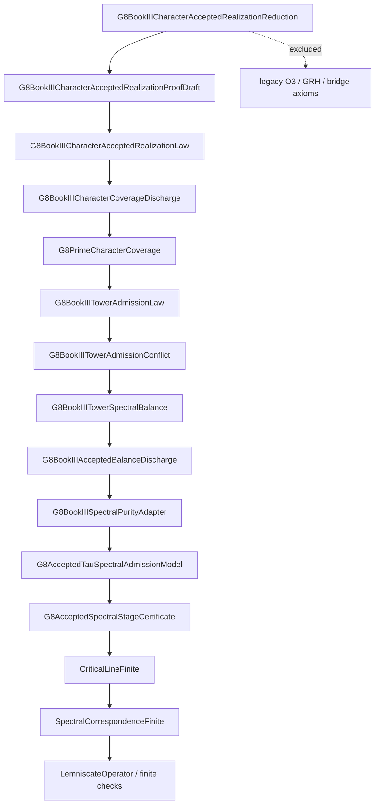

# Final RH Spine Dependency Audit

Generated: `2026-05-19T20:02:29+02:00`

Root module: `TauLib.BookIII.Bridge.G8BookIIICharacterAcceptedRealizationReduction`

This dossier audits the source import closure for the final RH spine slice.
It is deliberately narrower than the full TauLib aggregate: the goal is
to verify that the final proof-spine target can be built without importing
the three legacy Book III bridge axiom modules.

## Commands

```sh
make final-rh-spine-axiomfree
lake build
python3 scripts/check_no_sorry.py --root TauLib --expected-axioms 3 --expected-sorry 0
```

## Trust Boundary

| Audit | Result |
| --- | --- |
| Final-spine closure axioms | `0` |
| Final-spine closure sorries | `0` |
| Legacy `bridge_functor_exists` module reachable | `no` |
| Legacy `spectral_correspondence_O3` module reachable | `no` |
| Legacy `grand_grh_adelic` module reachable | `no` |

## High-Level Dependency Shape



The split between `SpectralCorrespondenceFinite` and the legacy
`SpectralCorrespondence` wrapper is load-bearing: finite stage certificates
can use finite correspondence checks without importing the universal O3 axiom.

## LOC Summary By Bucket

| Bucket | Modules | Raw LOC | Nonblank LOC | Code-ish LOC |
| --- | ---: | ---: | ---: | ---: |
| Lean core | 66 | 7 | 6 | 4 |
| Lean package: Qq | 12 | 1847 | 1557 | 1326 |
| Lean package: aesop | 86 | 10124 | 8373 | 6958 |
| Lean package: batteries | 72 | 11919 | 10024 | 7013 |
| Lean package: importGraph | 2 | 48 | 39 | 17 |
| Lean package: plausible | 11 | 2489 | 1998 | 1179 |
| Lean package: proofwidgets | 6 | 713 | 602 | 400 |
| Lean stdlib | 5 | 0 | 0 | 0 |
| Mathlib | 2621 | 882549 | 695151 | 575082 |
| TauLib | 228 | 71489 | 61074 | 39247 |

Definitions:

- `Raw LOC`: physical source lines.
- `Nonblank LOC`: physical source lines with non-whitespace content.
- `Code-ish LOC`: nonblank lines after stripping Lean comments and string literals.

## LOC Summary By Module Family

| Family | Modules | Raw LOC | Nonblank LOC | Code-ish LOC |
| --- | ---: | ---: | ---: | ---: |
| Aesop | 86 | 10124 | 8373 | 6958 |
| Batteries | 72 | 11919 | 10024 | 7013 |
| ImportGraph | 2 | 48 | 39 | 17 |
| Init | 8 | 0 | 0 | 0 |
| Lean | 57 | 0 | 0 | 0 |
| Lean stdlib | 5 | 0 | 0 | 0 |
| LeanSearchClient | 1 | 7 | 6 | 4 |
| Mathlib.Algebra | 585 | 162183 | 123264 | 103761 |
| Mathlib.Analysis | 319 | 131704 | 105998 | 88770 |
| Mathlib.Combinatorics | 3 | 1447 | 1185 | 921 |
| Mathlib.Control | 9 | 1434 | 1071 | 797 |
| Mathlib.Data | 386 | 108083 | 82141 | 69796 |
| Mathlib.Dynamics | 5 | 1348 | 1037 | 882 |
| Mathlib.FieldTheory | 10 | 3502 | 2691 | 2302 |
| Mathlib.Geometry | 25 | 13533 | 11143 | 8879 |
| Mathlib.GroupTheory | 60 | 24563 | 19801 | 16795 |
| Mathlib.Init | 1 | 137 | 122 | 79 |
| Mathlib.Lean | 11 | 2683 | 2319 | 1469 |
| Mathlib.LinearAlgebra | 123 | 51973 | 41146 | 34558 |
| Mathlib.Logic | 45 | 13445 | 10180 | 8262 |
| Mathlib.MeasureTheory | 159 | 76440 | 63330 | 53520 |
| Mathlib.NumberTheory | 11 | 4477 | 3773 | 3026 |
| Mathlib.Order | 183 | 75987 | 57246 | 49031 |
| Mathlib.Probability | 2 | 521 | 408 | 298 |
| Mathlib.RingTheory | 114 | 37761 | 29694 | 25738 |
| Mathlib.SetTheory | 21 | 11104 | 8690 | 7757 |
| Mathlib.Tactic | 226 | 44251 | 38126 | 23716 |
| Mathlib.Topology | 302 | 112839 | 89079 | 73050 |
| Mathlib.Util | 21 | 3134 | 2707 | 1675 |
| Plausible | 11 | 2489 | 1998 | 1179 |
| ProofWidgets | 6 | 713 | 602 | 400 |
| Qq | 12 | 1847 | 1557 | 1326 |
| TauLib.BookI.Boundary | 36 | 22037 | 19139 | 11431 |
| TauLib.BookI.Coordinates | 7 | 1376 | 1124 | 742 |
| TauLib.BookI.Denotation | 3 | 415 | 322 | 178 |
| TauLib.BookI.Holomorphy | 7 | 1330 | 1056 | 511 |
| TauLib.BookI.Kernel | 3 | 349 | 274 | 111 |
| TauLib.BookI.Orbit | 4 | 476 | 379 | 223 |
| TauLib.BookI.Polarity | 17 | 4712 | 3910 | 2222 |
| TauLib.BookII.CentralTheorem | 3 | 1259 | 1057 | 564 |
| TauLib.BookII.Closure | 4 | 976 | 792 | 454 |
| TauLib.BookII.Domains | 2 | 323 | 268 | 170 |
| TauLib.BookII.Enrichment | 3 | 1028 | 866 | 472 |
| TauLib.BookII.Hartogs | 6 | 2440 | 2041 | 1167 |
| TauLib.BookII.Interior | 4 | 682 | 538 | 275 |
| TauLib.BookII.Mirror | 2 | 649 | 521 | 320 |
| TauLib.BookII.Regularity | 2 | 873 | 732 | 438 |
| TauLib.BookII.Topology | 3 | 416 | 341 | 187 |
| TauLib.BookII.Transcendentals | 6 | 1032 | 841 | 440 |
| TauLib.BookIII.Bridge | 94 | 26212 | 22755 | 16830 |
| TauLib.BookIII.Doors | 7 | 1130 | 940 | 605 |
| TauLib.BookIII.Enrichment | 3 | 959 | 807 | 427 |
| TauLib.BookIII.Prologue | 1 | 160 | 126 | 57 |
| TauLib.BookIII.Sectors | 4 | 894 | 747 | 425 |
| TauLib.BookIII.Spectral | 7 | 1761 | 1498 | 998 |

## Direct External Imports From TauLib Closure

| External module | Imported by TauLib module |
| --- | --- |
| `Mathlib.Algebra.BigOperators.Group.Finset.Basic` | `TauLib.BookI.Boundary.Bridge.TauRealAbsBridge` |
| `Mathlib.Algebra.BigOperators.Ring.Finset` | `TauLib.BookI.Boundary.Bridge.TauRealAbsBridge` |
| `Mathlib.Algebra.Field.Defs` | `TauLib.BookI.Boundary.Bridge.TauRealQuotientField` |
| `Mathlib.Algebra.Order.AbsoluteValue.Basic` | `TauLib.BookI.Boundary.Bridge.TauRealAbsBridge` |
| `Mathlib.Algebra.Order.Archimedean.Basic` | `TauLib.BookI.Boundary.Bridge.TauRealCongruence` |
| `Mathlib.Algebra.Order.Field.Basic` | `TauLib.BookI.Boundary.Bridge.TauRealAbsBridge` |
| `Mathlib.Algebra.Order.Ring.Abs` | `TauLib.BookI.Boundary.Bridge.TauRealAbsBridge` |
| `Mathlib.Algebra.Order.Ring.Abs` | `TauLib.BookI.Boundary.Bridge.TauRealCongruence` |
| `Mathlib.Algebra.Ring.Defs` | `TauLib.BookI.Boundary.Bridge.TauRealQuotient` |
| `Mathlib.Analysis.InnerProductSpace.PiL2` | `TauLib.BookIII.Bridge.LemniscateHilbert` |
| `Mathlib.Data.Nat.Choose.Basic` | `TauLib.BookI.Boundary.Bridge.TauRealAbsBridge` |
| `Mathlib.Data.Nat.Choose.Sum` | `TauLib.BookI.Boundary.Bridge.TauRealAbsBridge` |
| `Mathlib.Data.Nat.Factorial.Basic` | `TauLib.BookI.Boundary.Bridge.TauRealAbsBridge` |
| `Mathlib.NumberTheory.LSeries.RiemannZeta` | `TauLib.BookIII.Bridge.G8ActualXiZetaCore` |
| `Mathlib.Tactic.FieldSimp` | `TauLib.BookI.Boundary.Bridge.TauRealAbsBridge` |
| `Mathlib.Tactic.FieldSimp` | `TauLib.BookI.Boundary.Bridge.TauRealCongruence` |
| `Mathlib.Tactic.FieldSimp` | `TauLib.BookI.Boundary.Bridge.TauRealQuotientField` |
| `Mathlib.Tactic.FieldSimp` | `TauLib.BookI.Boundary.ConstructiveReals` |
| `Mathlib.Tactic.FieldSimp` | `TauLib.BookI.Boundary.TauComplexExp` |
| `Mathlib.Tactic.FieldSimp` | `TauLib.BookI.Boundary.TauRealAnalyticalHelpers` |
| `Mathlib.Tactic.FieldSimp` | `TauLib.BookI.Boundary.TauRealArctan` |
| `Mathlib.Tactic.FieldSimp` | `TauLib.BookI.Boundary.TauRealCos` |
| `Mathlib.Tactic.FieldSimp` | `TauLib.BookI.Boundary.TauRealE` |
| `Mathlib.Tactic.FieldSimp` | `TauLib.BookI.Boundary.TauRealExp` |
| `Mathlib.Tactic.FieldSimp` | `TauLib.BookI.Boundary.TauRealInv` |
| `Mathlib.Tactic.FieldSimp` | `TauLib.BookI.Boundary.TauRealIotaTau` |
| `Mathlib.Tactic.FieldSimp` | `TauLib.BookI.Boundary.TauRealMulCongr` |
| `Mathlib.Tactic.FieldSimp` | `TauLib.BookI.Boundary.TauRealOrder` |
| `Mathlib.Tactic.FieldSimp` | `TauLib.BookI.Boundary.TauRealPi` |
| `Mathlib.Tactic.FieldSimp` | `TauLib.BookI.Boundary.TauRealPiPlusE` |
| `Mathlib.Tactic.FieldSimp` | `TauLib.BookI.Boundary.TauRealSin` |
| `Mathlib.Tactic.FieldSimp` | `TauLib.BookI.Boundary.TauRealSinCos` |
| `Mathlib.Tactic.FieldSimp` | `TauLib.BookI.Boundary.TauRealSum` |
| `Mathlib.Tactic.Linarith` | `TauLib.BookI.Boundary.Bridge.TauRealAbsBridge` |
| `Mathlib.Tactic.Linarith` | `TauLib.BookI.Boundary.Bridge.TauRealCongruence` |
| `Mathlib.Tactic.Linarith` | `TauLib.BookI.Boundary.Bridge.TauRealQuotient` |
| `Mathlib.Tactic.Linarith` | `TauLib.BookI.Boundary.Bridge.TauRealQuotientField` |
| `Mathlib.Tactic.Linarith` | `TauLib.BookI.Boundary.ConstructiveReals` |
| `Mathlib.Tactic.Linarith` | `TauLib.BookI.Boundary.TauComplexExp` |
| `Mathlib.Tactic.Linarith` | `TauLib.BookI.Boundary.TauRatAbs` |
| `Mathlib.Tactic.Linarith` | `TauLib.BookI.Boundary.TauRatInv` |
| `Mathlib.Tactic.Linarith` | `TauLib.BookI.Boundary.TauRealAbs` |
| `Mathlib.Tactic.Linarith` | `TauLib.BookI.Boundary.TauRealAnalyticalHelpers` |
| `Mathlib.Tactic.Linarith` | `TauLib.BookI.Boundary.TauRealArctan` |
| `Mathlib.Tactic.Linarith` | `TauLib.BookI.Boundary.TauRealCos` |
| `Mathlib.Tactic.Linarith` | `TauLib.BookI.Boundary.TauRealE` |
| `Mathlib.Tactic.Linarith` | `TauLib.BookI.Boundary.TauRealExp` |
| `Mathlib.Tactic.Linarith` | `TauLib.BookI.Boundary.TauRealInv` |
| `Mathlib.Tactic.Linarith` | `TauLib.BookI.Boundary.TauRealIotaTau` |
| `Mathlib.Tactic.Linarith` | `TauLib.BookI.Boundary.TauRealMulCongr` |
| `Mathlib.Tactic.Linarith` | `TauLib.BookI.Boundary.TauRealOrder` |
| `Mathlib.Tactic.Linarith` | `TauLib.BookI.Boundary.TauRealPi` |
| `Mathlib.Tactic.Linarith` | `TauLib.BookI.Boundary.TauRealPiPlusE` |
| `Mathlib.Tactic.Linarith` | `TauLib.BookI.Boundary.TauRealSin` |
| `Mathlib.Tactic.Linarith` | `TauLib.BookI.Boundary.TauRealSinCos` |
| `Mathlib.Tactic.Linarith` | `TauLib.BookI.Boundary.TauRealSum` |
| `Mathlib.Tactic.LinearCombination` | `TauLib.BookI.Boundary.NumberTower` |
| `Mathlib.Tactic.LinearCombination` | `TauLib.BookI.Boundary.SplitComplex` |
| `Mathlib.Tactic.LinearCombination` | `TauLib.BookI.Boundary.TauRatAbs` |
| `Mathlib.Tactic.LinearCombination` | `TauLib.BookI.Boundary.TauRatField` |
| `Mathlib.Tactic.LinearCombination` | `TauLib.BookI.Boundary.TauRatInv` |
| `Mathlib.Tactic.LinearCombination` | `TauLib.BookI.Boundary.TauRatOrder` |
| `Mathlib.Tactic.LinearCombination` | `TauLib.BookI.Boundary.TauRealAbs` |
| `Mathlib.Tactic.LinearCombination` | `TauLib.BookI.Boundary.TauRealAnalyticalHelpers` |
| `Mathlib.Tactic.LinearCombination` | `TauLib.BookI.Boundary.TauRealArctan` |
| `Mathlib.Tactic.LinearCombination` | `TauLib.BookI.Boundary.TauRealCos` |
| `Mathlib.Tactic.LinearCombination` | `TauLib.BookI.Boundary.TauRealE` |
| `Mathlib.Tactic.LinearCombination` | `TauLib.BookI.Boundary.TauRealExp` |
| `Mathlib.Tactic.LinearCombination` | `TauLib.BookI.Boundary.TauRealInv` |
| `Mathlib.Tactic.LinearCombination` | `TauLib.BookI.Boundary.TauRealIotaTau` |
| `Mathlib.Tactic.LinearCombination` | `TauLib.BookI.Boundary.TauRealMulCongr` |
| `Mathlib.Tactic.LinearCombination` | `TauLib.BookI.Boundary.TauRealOrder` |
| `Mathlib.Tactic.LinearCombination` | `TauLib.BookI.Boundary.TauRealPi` |
| `Mathlib.Tactic.LinearCombination` | `TauLib.BookI.Boundary.TauRealPiPlusE` |
| `Mathlib.Tactic.LinearCombination` | `TauLib.BookI.Boundary.TauRealSin` |
| `Mathlib.Tactic.LinearCombination` | `TauLib.BookI.Boundary.TauRealSinCos` |
| `Mathlib.Tactic.LinearCombination` | `TauLib.BookI.Boundary.TauRealSum` |
| `Mathlib.Tactic.LinearCombination` | `TauLib.BookI.Polarity.BipolarAlgebra` |
| `Mathlib.Tactic.LinearCombination` | `TauLib.BookI.Polarity.ExtGCD` |
| `Mathlib.Tactic.NormNum` | `TauLib.BookI.Boundary.Bridge.TauRealAbsBridge` |
| `Mathlib.Tactic.NormNum` | `TauLib.BookI.Boundary.Bridge.TauRealCongruence` |
| `Mathlib.Tactic.NormNum` | `TauLib.BookI.Boundary.ConstructiveReals` |
| `Mathlib.Tactic.NormNum` | `TauLib.BookI.Boundary.NumberTower` |
| `Mathlib.Tactic.NormNum` | `TauLib.BookI.Boundary.TauComplexExp` |
| `Mathlib.Tactic.NormNum` | `TauLib.BookI.Boundary.TauRatAbs` |
| `Mathlib.Tactic.NormNum` | `TauLib.BookI.Boundary.TauRatField` |
| `Mathlib.Tactic.NormNum` | `TauLib.BookI.Boundary.TauRatInv` |
| `Mathlib.Tactic.NormNum` | `TauLib.BookI.Boundary.TauRatOrder` |
| `Mathlib.Tactic.NormNum` | `TauLib.BookI.Boundary.TauRealAbs` |
| `Mathlib.Tactic.NormNum` | `TauLib.BookI.Boundary.TauRealAnalyticalHelpers` |
| `Mathlib.Tactic.NormNum` | `TauLib.BookI.Boundary.TauRealArctan` |
| `Mathlib.Tactic.NormNum` | `TauLib.BookI.Boundary.TauRealCos` |
| `Mathlib.Tactic.NormNum` | `TauLib.BookI.Boundary.TauRealE` |
| `Mathlib.Tactic.NormNum` | `TauLib.BookI.Boundary.TauRealExp` |
| `Mathlib.Tactic.NormNum` | `TauLib.BookI.Boundary.TauRealInv` |
| `Mathlib.Tactic.NormNum` | `TauLib.BookI.Boundary.TauRealIotaTau` |
| `Mathlib.Tactic.NormNum` | `TauLib.BookI.Boundary.TauRealMulCongr` |
| `Mathlib.Tactic.NormNum` | `TauLib.BookI.Boundary.TauRealOrder` |
| `Mathlib.Tactic.NormNum` | `TauLib.BookI.Boundary.TauRealPi` |
| `Mathlib.Tactic.NormNum` | `TauLib.BookI.Boundary.TauRealPiPlusE` |
| `Mathlib.Tactic.NormNum` | `TauLib.BookI.Boundary.TauRealSin` |
| `Mathlib.Tactic.NormNum` | `TauLib.BookI.Boundary.TauRealSinCos` |
| `Mathlib.Tactic.NormNum` | `TauLib.BookI.Boundary.TauRealSum` |
| `Mathlib.Tactic.Positivity` | `TauLib.BookI.Boundary.Bridge.TauRealAbsBridge` |
| `Mathlib.Tactic.Positivity` | `TauLib.BookI.Boundary.Bridge.TauRealCongruence` |
| `Mathlib.Tactic.Positivity` | `TauLib.BookI.Boundary.TauRealAnalyticalHelpers` |
| `Mathlib.Tactic.Positivity` | `TauLib.BookI.Boundary.TauRealArctan` |
| `Mathlib.Tactic.Positivity` | `TauLib.BookI.Boundary.TauRealCos` |
| `Mathlib.Tactic.Positivity` | `TauLib.BookI.Boundary.TauRealE` |
| `Mathlib.Tactic.Positivity` | `TauLib.BookI.Boundary.TauRealExp` |
| `Mathlib.Tactic.Positivity` | `TauLib.BookI.Boundary.TauRealIotaTau` |
| `Mathlib.Tactic.Positivity` | `TauLib.BookI.Boundary.TauRealMulCongr` |
| `Mathlib.Tactic.Positivity` | `TauLib.BookI.Boundary.TauRealPi` |
| `Mathlib.Tactic.Positivity` | `TauLib.BookI.Boundary.TauRealPiPlusE` |
| `Mathlib.Tactic.Positivity` | `TauLib.BookI.Boundary.TauRealSin` |
| `Mathlib.Tactic.Positivity` | `TauLib.BookI.Boundary.TauRealSinCos` |
| `Mathlib.Tactic.Positivity` | `TauLib.BookI.Boundary.TauRealSum` |
| `Mathlib.Tactic.Push` | `TauLib.BookI.Boundary.Bridge.TauRealCongruence` |
| `Mathlib.Tactic.Push` | `TauLib.BookI.Boundary.ConstructiveReals` |
| `Mathlib.Tactic.Push` | `TauLib.BookI.Boundary.TauComplexExp` |
| `Mathlib.Tactic.Push` | `TauLib.BookI.Boundary.TauRatAbs` |
| `Mathlib.Tactic.Push` | `TauLib.BookI.Boundary.TauRatInv` |
| `Mathlib.Tactic.Push` | `TauLib.BookI.Boundary.TauRealAbs` |
| `Mathlib.Tactic.Push` | `TauLib.BookI.Boundary.TauRealAnalyticalHelpers` |
| `Mathlib.Tactic.Push` | `TauLib.BookI.Boundary.TauRealArctan` |
| `Mathlib.Tactic.Push` | `TauLib.BookI.Boundary.TauRealCos` |
| `Mathlib.Tactic.Push` | `TauLib.BookI.Boundary.TauRealE` |
| `Mathlib.Tactic.Push` | `TauLib.BookI.Boundary.TauRealExp` |
| `Mathlib.Tactic.Push` | `TauLib.BookI.Boundary.TauRealInv` |
| `Mathlib.Tactic.Push` | `TauLib.BookI.Boundary.TauRealIotaTau` |
| `Mathlib.Tactic.Push` | `TauLib.BookI.Boundary.TauRealMulCongr` |
| `Mathlib.Tactic.Push` | `TauLib.BookI.Boundary.TauRealOrder` |
| `Mathlib.Tactic.Push` | `TauLib.BookI.Boundary.TauRealPi` |
| `Mathlib.Tactic.Push` | `TauLib.BookI.Boundary.TauRealPiPlusE` |
| `Mathlib.Tactic.Push` | `TauLib.BookI.Boundary.TauRealSin` |
| `Mathlib.Tactic.Push` | `TauLib.BookI.Boundary.TauRealSinCos` |
| `Mathlib.Tactic.Push` | `TauLib.BookI.Boundary.TauRealSum` |
| `Mathlib.Tactic.Ring` | `TauLib.BookI.Boundary.Bridge.TauRealAbsBridge` |
| `Mathlib.Tactic.Ring` | `TauLib.BookI.Boundary.Bridge.TauRealCongruence` |
| `Mathlib.Tactic.Ring` | `TauLib.BookI.Boundary.Bridge.TauRealQuotient` |
| `Mathlib.Tactic.Ring` | `TauLib.BookI.Boundary.Characters` |
| `Mathlib.Tactic.Ring` | `TauLib.BookI.Boundary.ComplexField` |
| `Mathlib.Tactic.Ring` | `TauLib.BookI.Boundary.ConstructiveReals` |
| `Mathlib.Tactic.Ring` | `TauLib.BookI.Boundary.NumberTower` |
| `Mathlib.Tactic.Ring` | `TauLib.BookI.Boundary.SplitComplex` |
| `Mathlib.Tactic.Ring` | `TauLib.BookI.Boundary.TauComplexExp` |
| `Mathlib.Tactic.Ring` | `TauLib.BookI.Boundary.TauRatAbs` |
| `Mathlib.Tactic.Ring` | `TauLib.BookI.Boundary.TauRatField` |
| `Mathlib.Tactic.Ring` | `TauLib.BookI.Boundary.TauRatInv` |
| `Mathlib.Tactic.Ring` | `TauLib.BookI.Boundary.TauRatOrder` |
| `Mathlib.Tactic.Ring` | `TauLib.BookI.Boundary.TauRealAbs` |
| `Mathlib.Tactic.Ring` | `TauLib.BookI.Boundary.TauRealAnalyticalHelpers` |
| `Mathlib.Tactic.Ring` | `TauLib.BookI.Boundary.TauRealArctan` |
| `Mathlib.Tactic.Ring` | `TauLib.BookI.Boundary.TauRealCos` |
| `Mathlib.Tactic.Ring` | `TauLib.BookI.Boundary.TauRealE` |
| `Mathlib.Tactic.Ring` | `TauLib.BookI.Boundary.TauRealExp` |
| `Mathlib.Tactic.Ring` | `TauLib.BookI.Boundary.TauRealInv` |
| `Mathlib.Tactic.Ring` | `TauLib.BookI.Boundary.TauRealIotaTau` |
| `Mathlib.Tactic.Ring` | `TauLib.BookI.Boundary.TauRealMulCongr` |
| `Mathlib.Tactic.Ring` | `TauLib.BookI.Boundary.TauRealOrder` |
| `Mathlib.Tactic.Ring` | `TauLib.BookI.Boundary.TauRealPi` |
| `Mathlib.Tactic.Ring` | `TauLib.BookI.Boundary.TauRealPiPlusE` |
| `Mathlib.Tactic.Ring` | `TauLib.BookI.Boundary.TauRealSin` |
| `Mathlib.Tactic.Ring` | `TauLib.BookI.Boundary.TauRealSinCos` |
| `Mathlib.Tactic.Ring` | `TauLib.BookI.Boundary.TauRealSum` |
| `Mathlib.Tactic.Ring` | `TauLib.BookI.Holomorphy.DHolomorphic` |
| `Mathlib.Tactic.Ring` | `TauLib.BookI.Holomorphy.DiagonalProtection` |
| `Mathlib.Tactic.Ring` | `TauLib.BookI.Holomorphy.IdentityTheorem` |
| `Mathlib.Tactic.Ring` | `TauLib.BookI.Holomorphy.TauHolomorphic` |
| `Mathlib.Tactic.Ring` | `TauLib.BookI.Polarity.BipolarAlgebra` |
| `Mathlib.Tactic.Ring` | `TauLib.BookI.Polarity.ExtGCD` |
| `Mathlib.Topology.Compactness.Compact` | `TauLib.BookIII.Bridge.LemniscateGraph` |
| `Mathlib.Topology.MetricSpace.Basic` | `TauLib.BookIII.Bridge.LemniscateGraph` |

## Full Module Lists

<details>
<summary>Lean core (66 modules)</summary>

| Module | Path | Raw LOC | Nonblank | Code-ish |
| --- | --- | ---: | ---: | ---: |
| `Init.Control.EState` |  | 0 | 0 | 0 |
| `Init.Control.Option` |  | 0 | 0 | 0 |
| `Init.Control.Reader` |  | 0 | 0 | 0 |
| `Init.Control.State` |  | 0 | 0 | 0 |
| `Init.Control.StateRef` |  | 0 | 0 | 0 |
| `Init.Core` |  | 0 | 0 | 0 |
| `Init.Data.List.Sort.Basic` |  | 0 | 0 | 0 |
| `Init.Data.Repr` |  | 0 | 0 | 0 |
| `Lean` |  | 0 | 0 | 0 |
| `Lean.Attributes` |  | 0 | 0 | 0 |
| `Lean.Compiler.IR.CompilerM` |  | 0 | 0 | 0 |
| `Lean.CoreM` |  | 0 | 0 | 0 |
| `Lean.Data.Json.FromToJson.Basic` |  | 0 | 0 | 0 |
| `Lean.Data.Options` |  | 0 | 0 | 0 |
| `Lean.Data.PersistentHashMap` |  | 0 | 0 | 0 |
| `Lean.Data.PersistentHashSet` |  | 0 | 0 | 0 |
| `Lean.Elab` |  | 0 | 0 | 0 |
| `Lean.Elab.AuxDef` |  | 0 | 0 | 0 |
| `Lean.Elab.Binders` |  | 0 | 0 | 0 |
| `Lean.Elab.Command` |  | 0 | 0 | 0 |
| `Lean.Elab.DeclModifiers` |  | 0 | 0 | 0 |
| `Lean.Elab.Deriving.Basic` |  | 0 | 0 | 0 |
| `Lean.Elab.Deriving.Util` |  | 0 | 0 | 0 |
| `Lean.Elab.Tactic.Doc` |  | 0 | 0 | 0 |
| `Lean.Elab.Tactic.Location` |  | 0 | 0 | 0 |
| `Lean.Elab.Tactic.Simp` |  | 0 | 0 | 0 |
| `Lean.Elab.Term` |  | 0 | 0 | 0 |
| `Lean.Environment` |  | 0 | 0 | 0 |
| `Lean.Exception` |  | 0 | 0 | 0 |
| `Lean.Expr` |  | 0 | 0 | 0 |
| `Lean.LabelAttribute` |  | 0 | 0 | 0 |
| `Lean.LibrarySuggestions.Default` |  | 0 | 0 | 0 |
| `Lean.Linter.Deprecated` |  | 0 | 0 | 0 |
| `Lean.Linter.Sets` |  | 0 | 0 | 0 |
| `Lean.LocalContext` |  | 0 | 0 | 0 |
| `Lean.Message` |  | 0 | 0 | 0 |
| `Lean.Meta` |  | 0 | 0 | 0 |
| `Lean.Meta.AppBuilder` |  | 0 | 0 | 0 |
| `Lean.Meta.Basic` |  | 0 | 0 | 0 |
| `Lean.Meta.CoeAttr` |  | 0 | 0 | 0 |
| `Lean.Meta.CompletionName` |  | 0 | 0 | 0 |
| `Lean.Meta.DiscrTree` |  | 0 | 0 | 0 |
| `Lean.Meta.LazyDiscrTree` |  | 0 | 0 | 0 |
| `Lean.Meta.Match.MatcherInfo` |  | 0 | 0 | 0 |
| `Lean.Meta.Sorry` |  | 0 | 0 | 0 |
| `Lean.Meta.SynthInstance` |  | 0 | 0 | 0 |
| `Lean.Meta.Tactic.Apply` |  | 0 | 0 | 0 |
| `Lean.Meta.Tactic.Cleanup` |  | 0 | 0 | 0 |
| `Lean.Meta.Tactic.Intro` |  | 0 | 0 | 0 |
| `Lean.Meta.Tactic.Refl` |  | 0 | 0 | 0 |
| `Lean.Meta.Tactic.Simp` |  | 0 | 0 | 0 |
| `Lean.Meta.Tactic.Simp.Rewrite` |  | 0 | 0 | 0 |
| `Lean.Meta.Tactic.Simp.SimpTheorems` |  | 0 | 0 | 0 |
| `Lean.Meta.Transform` |  | 0 | 0 | 0 |
| `Lean.MetavarContext` |  | 0 | 0 | 0 |
| `Lean.Parser.Command` |  | 0 | 0 | 0 |
| `Lean.Parser.Module` |  | 0 | 0 | 0 |
| `Lean.Parser.Syntax` |  | 0 | 0 | 0 |
| `Lean.Parser.Term` |  | 0 | 0 | 0 |
| `Lean.Server.CodeActions.Basic` |  | 0 | 0 | 0 |
| `Lean.Server.Rpc.RequestHandling` |  | 0 | 0 | 0 |
| `Lean.Structure` |  | 0 | 0 | 0 |
| `Lean.Util.MonadBacktrack` |  | 0 | 0 | 0 |
| `Lean.Util.Trace` |  | 0 | 0 | 0 |
| `Lean.Widget.InteractiveGoal` |  | 0 | 0 | 0 |
| `LeanSearchClient` | `.lake/packages/LeanSearchClient/LeanSearchClient.lean` | 7 | 6 | 4 |

</details>

<details>
<summary>Lean package: Qq (12 modules)</summary>

| Module | Path | Raw LOC | Nonblank | Code-ish |
| --- | --- | ---: | ---: | ---: |
| `Qq` | `.lake/packages/Qq/Qq.lean` | 9 | 8 | 8 |
| `Qq.AssertInstancesCommute` | `.lake/packages/Qq/Qq/AssertInstancesCommute.lean` | 86 | 71 | 71 |
| `Qq.Commands` | `.lake/packages/Qq/Qq/Commands.lean` | 124 | 115 | 73 |
| `Qq.Delab` | `.lake/packages/Qq/Qq/Delab.lean` | 107 | 90 | 85 |
| `Qq.ForLean.Do` | `.lake/packages/Qq/Qq/ForLean/Do.lean` | 44 | 37 | 34 |
| `Qq.Macro` | `.lake/packages/Qq/Qq/Macro.lean` | 673 | 585 | 556 |
| `Qq.Match` | `.lake/packages/Qq/Qq/Match.lean` | 440 | 374 | 296 |
| `Qq.MatchImpl` | `.lake/packages/Qq/Qq/MatchImpl.lean` | 56 | 41 | 41 |
| `Qq.MetaM` | `.lake/packages/Qq/Qq/MetaM.lean` | 115 | 90 | 64 |
| `Qq.Simp` | `.lake/packages/Qq/Qq/Simp.lean` | 62 | 45 | 24 |
| `Qq.SortLocalDecls` | `.lake/packages/Qq/Qq/SortLocalDecls.lean` | 54 | 42 | 37 |
| `Qq.Typ` | `.lake/packages/Qq/Qq/Typ.lean` | 77 | 59 | 37 |

</details>

<details>
<summary>Lean package: aesop (86 modules)</summary>

| Module | Path | Raw LOC | Nonblank | Code-ish |
| --- | --- | ---: | ---: | ---: |
| `Aesop` | `.lake/packages/aesop/Aesop.lean` | 5 | 4 | 4 |
| `Aesop.BaseM` | `.lake/packages/aesop/Aesop/BaseM.lean` | 57 | 43 | 32 |
| `Aesop.Builder.Apply` | `.lake/packages/aesop/Aesop/Builder/Apply.lean` | 61 | 47 | 42 |
| `Aesop.Builder.Basic` | `.lake/packages/aesop/Aesop/Builder/Basic.lean` | 121 | 95 | 84 |
| `Aesop.Builder.Cases` | `.lake/packages/aesop/Aesop/Builder/Cases.lean` | 86 | 66 | 55 |
| `Aesop.Builder.Constructors` | `.lake/packages/aesop/Aesop/Builder/Constructors.lean` | 53 | 41 | 36 |
| `Aesop.Builder.Default` | `.lake/packages/aesop/Aesop/Builder/Default.lean` | 50 | 43 | 31 |
| `Aesop.Builder.Forward` | `.lake/packages/aesop/Aesop/Builder/Forward.lean` | 157 | 141 | 123 |
| `Aesop.Builder.NormSimp` | `.lake/packages/aesop/Aesop/Builder/NormSimp.lean` | 60 | 49 | 44 |
| `Aesop.Builder.Tactic` | `.lake/packages/aesop/Aesop/Builder/Tactic.lean` | 61 | 51 | 46 |
| `Aesop.Builder.Unfold` | `.lake/packages/aesop/Aesop/Builder/Unfold.lean` | 48 | 39 | 32 |
| `Aesop.BuiltinRules` | `.lake/packages/aesop/Aesop/BuiltinRules.lean` | 65 | 49 | 32 |
| `Aesop.BuiltinRules.ApplyHyps` | `.lake/packages/aesop/Aesop/BuiltinRules/ApplyHyps.lean` | 51 | 44 | 39 |
| `Aesop.BuiltinRules.Assumption` | `.lake/packages/aesop/Aesop/BuiltinRules/Assumption.lean` | 58 | 52 | 47 |
| `Aesop.BuiltinRules.DestructProducts` | `.lake/packages/aesop/Aesop/BuiltinRules/DestructProducts.lean` | 130 | 121 | 103 |
| `Aesop.BuiltinRules.Ext` | `.lake/packages/aesop/Aesop/BuiltinRules/Ext.lean` | 31 | 24 | 19 |
| `Aesop.BuiltinRules.Intros` | `.lake/packages/aesop/Aesop/BuiltinRules/Intros.lean` | 37 | 31 | 26 |
| `Aesop.BuiltinRules.Rfl` | `.lake/packages/aesop/Aesop/BuiltinRules/Rfl.lean` | 20 | 14 | 9 |
| `Aesop.BuiltinRules.Split` | `.lake/packages/aesop/Aesop/BuiltinRules/Split.lean` | 47 | 39 | 33 |
| `Aesop.BuiltinRules.Subst` | `.lake/packages/aesop/Aesop/BuiltinRules/Subst.lean` | 99 | 88 | 81 |
| `Aesop.Check` | `.lake/packages/aesop/Aesop/Check.lean` | 63 | 44 | 33 |
| `Aesop.ElabM` | `.lake/packages/aesop/Aesop/ElabM.lean` | 61 | 43 | 32 |
| `Aesop.Forward.LevelIndex` | `.lake/packages/aesop/Aesop/Forward/LevelIndex.lean` | 31 | 22 | 17 |
| `Aesop.Forward.Match` | `.lake/packages/aesop/Aesop/Forward/Match.lean` | 242 | 212 | 174 |
| `Aesop.Forward.Match.Types` | `.lake/packages/aesop/Aesop/Forward/Match/Types.lean` | 120 | 97 | 59 |
| `Aesop.Forward.PremiseIndex` | `.lake/packages/aesop/Aesop/Forward/PremiseIndex.lean` | 31 | 22 | 17 |
| `Aesop.Forward.RuleInfo` | `.lake/packages/aesop/Aesop/Forward/RuleInfo.lean` | 192 | 178 | 123 |
| `Aesop.Forward.SlotIndex` | `.lake/packages/aesop/Aesop/Forward/SlotIndex.lean` | 37 | 26 | 21 |
| `Aesop.Forward.Substitution` | `.lake/packages/aesop/Aesop/Forward/Substitution.lean` | 176 | 152 | 109 |
| `Aesop.Frontend` | `.lake/packages/aesop/Aesop/Frontend.lean` | 7 | 6 | 6 |
| `Aesop.Frontend.Attribute` | `.lake/packages/aesop/Aesop/Frontend/Attribute.lean` | 71 | 55 | 48 |
| `Aesop.Frontend.Command` | `.lake/packages/aesop/Aesop/Frontend/Command.lean` | 101 | 86 | 80 |
| `Aesop.Frontend.Extension` | `.lake/packages/aesop/Aesop/Frontend/Extension.lean` | 151 | 129 | 123 |
| `Aesop.Frontend.Extension.Init` | `.lake/packages/aesop/Aesop/Frontend/Extension/Init.lean` | 51 | 40 | 20 |
| `Aesop.Frontend.RuleExpr` | `.lake/packages/aesop/Aesop/Frontend/RuleExpr.lean` | 618 | 498 | 469 |
| `Aesop.Frontend.Saturate` | `.lake/packages/aesop/Aesop/Frontend/Saturate.lean` | 146 | 120 | 114 |
| `Aesop.Frontend.Tactic` | `.lake/packages/aesop/Aesop/Frontend/Tactic.lean` | 192 | 166 | 133 |
| `Aesop.Index` | `.lake/packages/aesop/Aesop/Index.lean` | 183 | 164 | 154 |
| `Aesop.Index.Basic` | `.lake/packages/aesop/Aesop/Index/Basic.lean` | 124 | 98 | 80 |
| `Aesop.Index.DiscrTreeConfig` | `.lake/packages/aesop/Aesop/Index/DiscrTreeConfig.lean` | 31 | 22 | 14 |
| `Aesop.Index.Forward` | `.lake/packages/aesop/Aesop/Index/Forward.lean` | 91 | 76 | 54 |
| `Aesop.Index.RulePattern` | `.lake/packages/aesop/Aesop/Index/RulePattern.lean` | 168 | 140 | 103 |
| `Aesop.Main` | `.lake/packages/aesop/Aesop/Main.lean` | 48 | 42 | 37 |
| `Aesop.Nanos` | `.lake/packages/aesop/Aesop/Nanos.lean` | 53 | 37 | 32 |
| `Aesop.Options` | `.lake/packages/aesop/Aesop/Options.lean` | 9 | 8 | 3 |
| `Aesop.Options.Internal` | `.lake/packages/aesop/Aesop/Options/Internal.lean` | 32 | 25 | 20 |
| `Aesop.Options.Public` | `.lake/packages/aesop/Aesop/Options/Public.lean` | 211 | 194 | 63 |
| `Aesop.Percent` | `.lake/packages/aesop/Aesop/Percent.lean` | 77 | 58 | 45 |
| `Aesop.Rule` | `.lake/packages/aesop/Aesop/Rule.lean` | 210 | 141 | 121 |
| `Aesop.Rule.Basic` | `.lake/packages/aesop/Aesop/Rule/Basic.lean` | 55 | 40 | 35 |
| `Aesop.Rule.Forward` | `.lake/packages/aesop/Aesop/Rule/Forward.lean` | 89 | 68 | 49 |
| `Aesop.Rule.Name` | `.lake/packages/aesop/Aesop/Rule/Name.lean` | 175 | 133 | 119 |
| `Aesop.RulePattern` | `.lake/packages/aesop/Aesop/RulePattern.lean` | 153 | 139 | 102 |
| `Aesop.RulePattern.Cache` | `.lake/packages/aesop/Aesop/RulePattern/Cache.lean` | 31 | 22 | 15 |
| `Aesop.RuleSet` | `.lake/packages/aesop/Aesop/RuleSet.lean` | 616 | 538 | 446 |
| `Aesop.RuleSet.Filter` | `.lake/packages/aesop/Aesop/RuleSet/Filter.lean` | 77 | 57 | 43 |
| `Aesop.RuleSet.Member` | `.lake/packages/aesop/Aesop/RuleSet/Member.lean` | 57 | 46 | 41 |
| `Aesop.RuleSet.Name` | `.lake/packages/aesop/Aesop/RuleSet/Name.lean` | 30 | 19 | 14 |
| `Aesop.RuleTac.Basic` | `.lake/packages/aesop/Aesop/RuleTac/Basic.lean` | 174 | 145 | 86 |
| `Aesop.RuleTac.Cases` | `.lake/packages/aesop/Aesop/RuleTac/Cases.lean` | 89 | 78 | 69 |
| `Aesop.RuleTac.Descr` | `.lake/packages/aesop/Aesop/RuleTac/Descr.lean` | 36 | 27 | 27 |
| `Aesop.RuleTac.ElabRuleTerm` | `.lake/packages/aesop/Aesop/RuleTac/ElabRuleTerm.lean` | 117 | 98 | 81 |
| `Aesop.RuleTac.FVarIdSubst` | `.lake/packages/aesop/Aesop/RuleTac/FVarIdSubst.lean` | 84 | 62 | 57 |
| `Aesop.RuleTac.Forward.Basic` | `.lake/packages/aesop/Aesop/RuleTac/Forward/Basic.lean` | 123 | 103 | 58 |
| `Aesop.RuleTac.GoalDiff` | `.lake/packages/aesop/Aesop/RuleTac/GoalDiff.lean` | 213 | 185 | 130 |
| `Aesop.RuleTac.RuleTerm` | `.lake/packages/aesop/Aesop/RuleTac/RuleTerm.lean` | 55 | 40 | 40 |
| `Aesop.Script.CtorNames` | `.lake/packages/aesop/Aesop/Script/CtorNames.lean` | 81 | 64 | 63 |
| `Aesop.Script.GoalWithMVars` | `.lake/packages/aesop/Aesop/Script/GoalWithMVars.lean` | 28 | 18 | 18 |
| `Aesop.Script.ScriptM` | `.lake/packages/aesop/Aesop/Script/ScriptM.lean` | 66 | 51 | 46 |
| `Aesop.Script.SpecificTactics` | `.lake/packages/aesop/Aesop/Script/SpecificTactics.lean` | 415 | 365 | 360 |
| `Aesop.Script.Step` | `.lake/packages/aesop/Aesop/Script/Step.lean` | 171 | 146 | 134 |
| `Aesop.Script.Tactic` | `.lake/packages/aesop/Aesop/Script/Tactic.lean` | 43 | 29 | 24 |
| `Aesop.Script.TacticState` | `.lake/packages/aesop/Aesop/Script/TacticState.lean` | 112 | 92 | 85 |
| `Aesop.Script.Util` | `.lake/packages/aesop/Aesop/Script/Util.lean` | 53 | 46 | 40 |
| `Aesop.Stats.Basic` | `.lake/packages/aesop/Aesop/Stats/Basic.lean` | 282 | 224 | 204 |
| `Aesop.Tracing` | `.lake/packages/aesop/Aesop/Tracing.lean` | 187 | 148 | 132 |
| `Aesop.Tree.Data.ForwardRuleMatches` | `.lake/packages/aesop/Aesop/Tree/Data/ForwardRuleMatches.lean` | 124 | 100 | 73 |
| `Aesop.Util.Basic` | `.lake/packages/aesop/Aesop/Util/Basic.lean` | 540 | 450 | 388 |
| `Aesop.Util.EqualUpToIds` | `.lake/packages/aesop/Aesop/Util/EqualUpToIds.lean` | 426 | 375 | 351 |
| `Aesop.Util.OrderedHashSet` | `.lake/packages/aesop/Aesop/Util/OrderedHashSet.lean` | 74 | 53 | 52 |
| `Aesop.Util.Tactic` | `.lake/packages/aesop/Aesop/Util/Tactic.lean` | 50 | 42 | 27 |
| `Aesop.Util.Tactic.Ext` | `.lake/packages/aesop/Aesop/Util/Tactic/Ext.lean` | 52 | 44 | 39 |
| `Aesop.Util.Tactic.Unfold` | `.lake/packages/aesop/Aesop/Util/Tactic/Unfold.lean` | 42 | 34 | 29 |
| `Aesop.Util.Unfold` | `.lake/packages/aesop/Aesop/Util/Unfold.lean` | 114 | 102 | 84 |
| `Aesop.Util.UnionFind` | `.lake/packages/aesop/Aesop/Util/UnionFind.lean` | 120 | 100 | 92 |
| `Aesop.Util.UnorderedArraySet` | `.lake/packages/aesop/Aesop/Util/UnorderedArraySet.lean` | 146 | 108 | 83 |

</details>

<details>
<summary>Lean package: batteries (72 modules)</summary>

| Module | Path | Raw LOC | Nonblank | Code-ish |
| --- | --- | ---: | ---: | ---: |
| `Batteries.Classes.Order` | `.lake/packages/batteries/Batteries/Classes/Order.lean` | 286 | 227 | 201 |
| `Batteries.Classes.RatCast` | `.lake/packages/batteries/Batteries/Classes/RatCast.lean` | 26 | 20 | 9 |
| `Batteries.Classes.SatisfiesM` | `.lake/packages/batteries/Batteries/Classes/SatisfiesM.lean` | 297 | 248 | 177 |
| `Batteries.CodeAction` | `.lake/packages/batteries/Batteries/CodeAction.lean` | 6 | 5 | 5 |
| `Batteries.CodeAction.Attr` | `.lake/packages/batteries/Batteries/CodeAction/Attr.lean` | 136 | 115 | 79 |
| `Batteries.CodeAction.Basic` | `.lake/packages/batteries/Batteries/CodeAction/Basic.lean` | 73 | 66 | 52 |
| `Batteries.CodeAction.Match` | `.lake/packages/batteries/Batteries/CodeAction/Match.lean` | 200 | 177 | 117 |
| `Batteries.CodeAction.Misc` | `.lake/packages/batteries/Batteries/CodeAction/Misc.lean` | 444 | 418 | 293 |
| `Batteries.Control.AlternativeMonad` | `.lake/packages/batteries/Batteries/Control/AlternativeMonad.lean` | 205 | 154 | 114 |
| `Batteries.Control.ForInStep.Basic` | `.lake/packages/batteries/Batteries/Control/ForInStep/Basic.lean` | 37 | 31 | 16 |
| `Batteries.Control.ForInStep.Lemmas` | `.lake/packages/batteries/Batteries/Control/ForInStep/Lemmas.lean` | 51 | 38 | 32 |
| `Batteries.Control.LawfulMonadState` | `.lake/packages/batteries/Batteries/Control/LawfulMonadState.lean` | 225 | 175 | 144 |
| `Batteries.Control.Lemmas` | `.lake/packages/batteries/Batteries/Control/Lemmas.lean` | 63 | 44 | 39 |
| `Batteries.Control.OptionT` | `.lake/packages/batteries/Batteries/Control/OptionT.lean` | 36 | 27 | 18 |
| `Batteries.Data.Array.Basic` | `.lake/packages/batteries/Batteries/Data/Array/Basic.lean` | 174 | 152 | 74 |
| `Batteries.Data.Array.Match` | `.lake/packages/batteries/Batteries/Data/Array/Match.lean` | 171 | 146 | 110 |
| `Batteries.Data.Array.Merge` | `.lake/packages/batteries/Batteries/Data/Array/Merge.lean` | 111 | 101 | 60 |
| `Batteries.Data.Fin.Basic` | `.lake/packages/batteries/Batteries/Data/Fin/Basic.lean` | 145 | 124 | 47 |
| `Batteries.Data.Fin.Lemmas` | `.lake/packages/batteries/Batteries/Data/Fin/Lemmas.lean` | 438 | 314 | 297 |
| `Batteries.Data.List` | `.lake/packages/batteries/Batteries/Data/List.lean` | 12 | 11 | 11 |
| `Batteries.Data.List.ArrayMap` | `.lake/packages/batteries/Batteries/Data/List/ArrayMap.lean` | 43 | 34 | 21 |
| `Batteries.Data.List.Basic` | `.lake/packages/batteries/Batteries/Data/List/Basic.lean` | 1131 | 985 | 486 |
| `Batteries.Data.List.Count` | `.lake/packages/batteries/Batteries/Data/List/Count.lean` | 32 | 20 | 8 |
| `Batteries.Data.List.Init.Lemmas` | `.lake/packages/batteries/Batteries/Data/List/Init/Lemmas.lean` | 14 | 11 | 2 |
| `Batteries.Data.List.Lemmas` | `.lake/packages/batteries/Batteries/Data/List/Lemmas.lean` | 1047 | 789 | 747 |
| `Batteries.Data.List.Matcher` | `.lake/packages/batteries/Batteries/Data/List/Matcher.lean` | 88 | 73 | 30 |
| `Batteries.Data.List.Monadic` | `.lake/packages/batteries/Batteries/Data/List/Monadic.lean` | 43 | 35 | 27 |
| `Batteries.Data.List.Pairwise` | `.lake/packages/batteries/Batteries/Data/List/Pairwise.lean` | 118 | 96 | 76 |
| `Batteries.Data.List.Perm` | `.lake/packages/batteries/Batteries/Data/List/Perm.lean` | 321 | 262 | 247 |
| `Batteries.Data.List.Scan` | `.lake/packages/batteries/Batteries/Data/List/Scan.lean` | 511 | 418 | 387 |
| `Batteries.Data.Nat.Basic` | `.lake/packages/batteries/Batteries/Data/Nat/Basic.lean` | 116 | 104 | 67 |
| `Batteries.Data.Nat.Lemmas` | `.lake/packages/batteries/Batteries/Data/Nat/Lemmas.lean` | 226 | 177 | 156 |
| `Batteries.Data.String.Basic` | `.lake/packages/batteries/Batteries/Data/String/Basic.lean` | 39 | 33 | 17 |
| `Batteries.Lean.EStateM` | `.lake/packages/batteries/Batteries/Lean/EStateM.lean` | 203 | 161 | 155 |
| `Batteries.Lean.Except` | `.lake/packages/batteries/Batteries/Lean/Except.lean` | 65 | 47 | 39 |
| `Batteries.Lean.Expr` | `.lake/packages/batteries/Batteries/Lean/Expr.lean` | 115 | 96 | 68 |
| `Batteries.Lean.Meta.Basic` | `.lake/packages/batteries/Batteries/Lean/Meta/Basic.lean` | 169 | 142 | 74 |
| `Batteries.Lean.Meta.DiscrTree` | `.lake/packages/batteries/Batteries/Lean/Meta/DiscrTree.lean` | 60 | 48 | 32 |
| `Batteries.Lean.Meta.Expr` | `.lake/packages/batteries/Batteries/Lean/Meta/Expr.lean` | 19 | 15 | 10 |
| `Batteries.Lean.Meta.Inaccessible` | `.lake/packages/batteries/Batteries/Lean/Meta/Inaccessible.lean` | 65 | 59 | 38 |
| `Batteries.Lean.Meta.InstantiateMVars` | `.lake/packages/batteries/Batteries/Lean/Meta/InstantiateMVars.lean` | 69 | 60 | 36 |
| `Batteries.Lean.Meta.SavedState` | `.lake/packages/batteries/Batteries/Lean/Meta/SavedState.lean` | 53 | 43 | 22 |
| `Batteries.Lean.Meta.UnusedNames` | `.lake/packages/batteries/Batteries/Lean/Meta/UnusedNames.lean` | 142 | 123 | 80 |
| `Batteries.Lean.MonadBacktrack` | `.lake/packages/batteries/Batteries/Lean/MonadBacktrack.lean` | 25 | 20 | 11 |
| `Batteries.Lean.NameMapAttribute` | `.lake/packages/batteries/Batteries/Lean/NameMapAttribute.lean` | 68 | 58 | 41 |
| `Batteries.Lean.PersistentHashMap` | `.lake/packages/batteries/Batteries/Lean/PersistentHashMap.lean` | 76 | 66 | 35 |
| `Batteries.Lean.PersistentHashSet` | `.lake/packages/batteries/Batteries/Lean/PersistentHashSet.lean` | 91 | 77 | 48 |
| `Batteries.Linter.UnreachableTactic` | `.lake/packages/batteries/Batteries/Linter/UnreachableTactic.lean` | 124 | 108 | 80 |
| `Batteries.Logic` | `.lake/packages/batteries/Batteries/Logic.lean` | 119 | 83 | 67 |
| `Batteries.Tactic.Alias` | `.lake/packages/batteries/Batteries/Tactic/Alias.lean` | 190 | 170 | 135 |
| `Batteries.Tactic.Basic` | `.lake/packages/batteries/Batteries/Tactic/Basic.lean` | 9 | 7 | 6 |
| `Batteries.Tactic.Case` | `.lake/packages/batteries/Batteries/Tactic/Case.lean` | 199 | 174 | 107 |
| `Batteries.Tactic.Congr` | `.lake/packages/batteries/Batteries/Tactic/Congr.lean` | 113 | 98 | 46 |
| `Batteries.Tactic.Exact` | `.lake/packages/batteries/Batteries/Tactic/Exact.lean` | 26 | 20 | 10 |
| `Batteries.Tactic.GeneralizeProofs` | `.lake/packages/batteries/Batteries/Tactic/GeneralizeProofs.lean` | 529 | 486 | 303 |
| `Batteries.Tactic.HelpCmd` | `.lake/packages/batteries/Batteries/Tactic/HelpCmd.lean` | 366 | 331 | 221 |
| `Batteries.Tactic.Init` | `.lake/packages/batteries/Batteries/Tactic/Init.lean` | 122 | 106 | 42 |
| `Batteries.Tactic.Lint` | `.lake/packages/batteries/Batteries/Tactic/Lint.lean` | 7 | 6 | 6 |
| `Batteries.Tactic.Lint.Basic` | `.lake/packages/batteries/Batteries/Tactic/Lint/Basic.lean` | 155 | 134 | 81 |
| `Batteries.Tactic.Lint.Frontend` | `.lake/packages/batteries/Batteries/Tactic/Lint/Frontend.lean` | 329 | 290 | 205 |
| `Batteries.Tactic.Lint.Misc` | `.lake/packages/batteries/Batteries/Tactic/Lint/Misc.lean` | 296 | 277 | 177 |
| `Batteries.Tactic.Lint.Simp` | `.lake/packages/batteries/Batteries/Tactic/Lint/Simp.lean` | 283 | 250 | 148 |
| `Batteries.Tactic.Lint.TypeClass` | `.lake/packages/batteries/Batteries/Tactic/Lint/TypeClass.lean` | 50 | 45 | 29 |
| `Batteries.Tactic.OpenPrivate` | `.lake/packages/batteries/Batteries/Tactic/OpenPrivate.lean` | 167 | 150 | 114 |
| `Batteries.Tactic.PermuteGoals` | `.lake/packages/batteries/Batteries/Tactic/PermuteGoals.lean` | 74 | 57 | 23 |
| `Batteries.Tactic.SeqFocus` | `.lake/packages/batteries/Batteries/Tactic/SeqFocus.lean` | 45 | 39 | 29 |
| `Batteries.Tactic.Trans` | `.lake/packages/batteries/Batteries/Tactic/Trans.lean` | 215 | 195 | 159 |
| `Batteries.Tactic.Unreachable` | `.lake/packages/batteries/Batteries/Tactic/Unreachable.lean` | 33 | 26 | 9 |
| `Batteries.Util.Cache` | `.lake/packages/batteries/Batteries/Util/Cache.lean` | 174 | 151 | 67 |
| `Batteries.Util.ExtendedBinder` | `.lake/packages/batteries/Batteries/Util/ExtendedBinder.lean` | 55 | 47 | 28 |
| `Batteries.Util.LibraryNote` | `.lake/packages/batteries/Batteries/Util/LibraryNote.lean` | 108 | 91 | 48 |
| `Batteries.Util.ProofWanted` | `.lake/packages/batteries/Batteries/Util/ProofWanted.lean` | 46 | 38 | 18 |

</details>

<details>
<summary>Lean package: importGraph (2 modules)</summary>

| Module | Path | Raw LOC | Nonblank | Code-ish |
| --- | --- | ---: | ---: | ---: |
| `ImportGraph.Lean.Environment` | `.lake/packages/importGraph/ImportGraph/Lean/Environment.lean` | 22 | 18 | 12 |
| `ImportGraph.Tools` | `.lake/packages/importGraph/ImportGraph/Tools.lean` | 26 | 21 | 5 |

</details>

<details>
<summary>Lean package: plausible (11 modules)</summary>

| Module | Path | Raw LOC | Nonblank | Code-ish |
| --- | --- | ---: | ---: | ---: |
| `Plausible` | `.lake/packages/plausible/Plausible.lean` | 16 | 15 | 10 |
| `Plausible.Arbitrary` | `.lake/packages/plausible/Plausible/Arbitrary.lean` | 167 | 123 | 88 |
| `Plausible.ArbitraryFueled` | `.lake/packages/plausible/Plausible/ArbitraryFueled.lean` | 32 | 25 | 11 |
| `Plausible.Attr` | `.lake/packages/plausible/Plausible/Attr.lean` | 20 | 16 | 11 |
| `Plausible.DeriveArbitrary` | `.lake/packages/plausible/Plausible/DeriveArbitrary.lean` | 321 | 264 | 151 |
| `Plausible.Functions` | `.lake/packages/plausible/Plausible/Functions.lean` | 168 | 129 | 73 |
| `Plausible.Gen` | `.lake/packages/plausible/Plausible/Gen.lean` | 290 | 226 | 156 |
| `Plausible.Random` | `.lake/packages/plausible/Plausible/Random.lean` | 205 | 161 | 100 |
| `Plausible.Sampleable` | `.lake/packages/plausible/Plausible/Sampleable.lean` | 405 | 320 | 197 |
| `Plausible.Tactic` | `.lake/packages/plausible/Plausible/Tactic.lean` | 240 | 199 | 28 |
| `Plausible.Testable` | `.lake/packages/plausible/Plausible/Testable.lean` | 625 | 520 | 354 |

</details>

<details>
<summary>Lean package: proofwidgets (6 modules)</summary>

| Module | Path | Raw LOC | Nonblank | Code-ish |
| --- | --- | ---: | ---: | ---: |
| `ProofWidgets.Cancellable` | `.lake/packages/proofwidgets/ProofWidgets/Cancellable.lean` | 115 | 100 | 68 |
| `ProofWidgets.Component.Basic` | `.lake/packages/proofwidgets/ProofWidgets/Component/Basic.lean` | 124 | 99 | 43 |
| `ProofWidgets.Component.FilterDetails` | `.lake/packages/proofwidgets/ProofWidgets/Component/FilterDetails.lean` | 29 | 23 | 15 |
| `ProofWidgets.Component.MakeEditLink` | `.lake/packages/proofwidgets/ProofWidgets/Component/MakeEditLink.lean` | 68 | 59 | 39 |
| `ProofWidgets.Component.OfRpcMethod` | `.lake/packages/proofwidgets/ProofWidgets/Component/OfRpcMethod.lean` | 94 | 80 | 36 |
| `ProofWidgets.Data.Html` | `.lake/packages/proofwidgets/ProofWidgets/Data/Html.lean` | 283 | 241 | 199 |

</details>

<details>
<summary>Lean stdlib (5 modules)</summary>

| Module | Path | Raw LOC | Nonblank | Code-ish |
| --- | --- | ---: | ---: | ---: |
| `Std.Data.HashMap` |  | 0 | 0 | 0 |
| `Std.Data.HashMap.Basic` |  | 0 | 0 | 0 |
| `Std.Data.HashSet.Basic` |  | 0 | 0 | 0 |
| `Std.Data.HashSet.Lemmas` |  | 0 | 0 | 0 |
| `Std.Time.Date` |  | 0 | 0 | 0 |

</details>

<details>
<summary>Mathlib (2621 modules)</summary>

| Module | Path | Raw LOC | Nonblank | Code-ish |
| --- | --- | ---: | ---: | ---: |
| `Mathlib.Algebra.AddTorsor.Basic` | `.lake/packages/mathlib/Mathlib/Algebra/AddTorsor/Basic.lean` | 229 | 166 | 138 |
| `Mathlib.Algebra.AddTorsor.Defs` | `.lake/packages/mathlib/Mathlib/Algebra/AddTorsor/Defs.lean` | 252 | 190 | 124 |
| `Mathlib.Algebra.Algebra.Basic` | `.lake/packages/mathlib/Mathlib/Algebra/Algebra/Basic.lean` | 592 | 434 | 381 |
| `Mathlib.Algebra.Algebra.Bilinear` | `.lake/packages/mathlib/Mathlib/Algebra/Algebra/Bilinear.lean` | 206 | 146 | 120 |
| `Mathlib.Algebra.Algebra.Defs` | `.lake/packages/mathlib/Mathlib/Algebra/Algebra/Defs.lean` | 439 | 329 | 214 |
| `Mathlib.Algebra.Algebra.Equiv` | `.lake/packages/mathlib/Mathlib/Algebra/Algebra/Equiv.lean` | 884 | 677 | 601 |
| `Mathlib.Algebra.Algebra.Hom` | `.lake/packages/mathlib/Mathlib/Algebra/Algebra/Hom.lean` | 527 | 388 | 341 |
| `Mathlib.Algebra.Algebra.IsSimpleRing` | `.lake/packages/mathlib/Mathlib/Algebra/Algebra/IsSimpleRing.lean` | 20 | 15 | 7 |
| `Mathlib.Algebra.Algebra.NonUnitalHom` | `.lake/packages/mathlib/Mathlib/Algebra/Algebra/NonUnitalHom.lean` | 486 | 368 | 302 |
| `Mathlib.Algebra.Algebra.NonUnitalSubalgebra` | `.lake/packages/mathlib/Mathlib/Algebra/Algebra/NonUnitalSubalgebra.lean` | 1237 | 949 | 882 |
| `Mathlib.Algebra.Algebra.Operations` | `.lake/packages/mathlib/Mathlib/Algebra/Algebra/Operations.lean` | 900 | 693 | 627 |
| `Mathlib.Algebra.Algebra.Opposite` | `.lake/packages/mathlib/Mathlib/Algebra/Algebra/Opposite.lean` | 204 | 154 | 115 |
| `Mathlib.Algebra.Algebra.Pi` | `.lake/packages/mathlib/Mathlib/Algebra/Algebra/Pi.lean` | 250 | 193 | 138 |
| `Mathlib.Algebra.Algebra.Prod` | `.lake/packages/mathlib/Mathlib/Algebra/Algebra/Prod.lean` | 162 | 119 | 90 |
| `Mathlib.Algebra.Algebra.Rat` | `.lake/packages/mathlib/Mathlib/Algebra/Algebra/Rat.lean` | 82 | 57 | 48 |
| `Mathlib.Algebra.Algebra.RestrictScalars` | `.lake/packages/mathlib/Mathlib/Algebra/Algebra/RestrictScalars.lean` | 216 | 161 | 83 |
| `Mathlib.Algebra.Algebra.Spectrum.Basic` | `.lake/packages/mathlib/Mathlib/Algebra/Algebra/Spectrum/Basic.lean` | 450 | 333 | 287 |
| `Mathlib.Algebra.Algebra.Subalgebra.Basic` | `.lake/packages/mathlib/Mathlib/Algebra/Algebra/Subalgebra/Basic.lean` | 1061 | 781 | 703 |
| `Mathlib.Algebra.Algebra.Subalgebra.Lattice` | `.lake/packages/mathlib/Mathlib/Algebra/Algebra/Subalgebra/Lattice.lean` | 917 | 703 | 667 |
| `Mathlib.Algebra.Algebra.Subalgebra.Operations` | `.lake/packages/mathlib/Mathlib/Algebra/Algebra/Subalgebra/Operations.lean` | 96 | 76 | 59 |
| `Mathlib.Algebra.Algebra.Subalgebra.Prod` | `.lake/packages/mathlib/Mathlib/Algebra/Algebra/Subalgebra/Prod.lean` | 60 | 42 | 30 |
| `Mathlib.Algebra.Algebra.Subalgebra.Tower` | `.lake/packages/mathlib/Mathlib/Algebra/Algebra/Subalgebra/Tower.lean` | 152 | 106 | 81 |
| `Mathlib.Algebra.Algebra.Tower` | `.lake/packages/mathlib/Mathlib/Algebra/Algebra/Tower.lean` | 408 | 295 | 243 |
| `Mathlib.Algebra.Algebra.TransferInstance` | `.lake/packages/mathlib/Mathlib/Algebra/Algebra/TransferInstance.lean` | 73 | 61 | 48 |
| `Mathlib.Algebra.BigOperators.Associated` | `.lake/packages/mathlib/Mathlib/Algebra/BigOperators/Associated.lean` | 233 | 188 | 175 |
| `Mathlib.Algebra.BigOperators.Balance` | `.lake/packages/mathlib/Mathlib/Algebra/BigOperators/Balance.lean` | 60 | 40 | 27 |
| `Mathlib.Algebra.BigOperators.Expect` | `.lake/packages/mathlib/Mathlib/Algebra/BigOperators/Expect.lean` | 448 | 330 | 257 |
| `Mathlib.Algebra.BigOperators.Field` | `.lake/packages/mathlib/Mathlib/Algebra/BigOperators/Field.lean` | 57 | 42 | 32 |
| `Mathlib.Algebra.BigOperators.Fin` | `.lake/packages/mathlib/Mathlib/Algebra/BigOperators/Fin.lean` | 774 | 639 | 570 |
| `Mathlib.Algebra.BigOperators.Finprod` | `.lake/packages/mathlib/Mathlib/Algebra/BigOperators/Finprod.lean` | 1333 | 1130 | 864 |
| `Mathlib.Algebra.BigOperators.Finsupp.Basic` | `.lake/packages/mathlib/Mathlib/Algebra/BigOperators/Finsupp/Basic.lean` | 652 | 533 | 481 |
| `Mathlib.Algebra.BigOperators.Finsupp.Fin` | `.lake/packages/mathlib/Mathlib/Algebra/BigOperators/Finsupp/Fin.lean` | 57 | 43 | 32 |
| `Mathlib.Algebra.BigOperators.Group.Finset.Basic` | `.lake/packages/mathlib/Mathlib/Algebra/BigOperators/Group/Finset/Basic.lean` | 1127 | 939 | 837 |
| `Mathlib.Algebra.BigOperators.Group.Finset.Defs` | `.lake/packages/mathlib/Mathlib/Algebra/BigOperators/Group/Finset/Defs.lean` | 883 | 678 | 514 |
| `Mathlib.Algebra.BigOperators.Group.Finset.Indicator` | `.lake/packages/mathlib/Mathlib/Algebra/BigOperators/Group/Finset/Indicator.lean` | 86 | 72 | 53 |
| `Mathlib.Algebra.BigOperators.Group.Finset.Lemmas` | `.lake/packages/mathlib/Mathlib/Algebra/BigOperators/Group/Finset/Lemmas.lean` | 60 | 48 | 35 |
| `Mathlib.Algebra.BigOperators.Group.Finset.Pi` | `.lake/packages/mathlib/Mathlib/Algebra/BigOperators/Group/Finset/Pi.lean` | 42 | 30 | 15 |
| `Mathlib.Algebra.BigOperators.Group.Finset.Piecewise` | `.lake/packages/mathlib/Mathlib/Algebra/BigOperators/Group/Finset/Piecewise.lean` | 311 | 253 | 231 |
| `Mathlib.Algebra.BigOperators.Group.Finset.Powerset` | `.lake/packages/mathlib/Mathlib/Algebra/BigOperators/Group/Finset/Powerset.lean` | 65 | 51 | 32 |
| `Mathlib.Algebra.BigOperators.Group.Finset.Preimage` | `.lake/packages/mathlib/Mathlib/Algebra/BigOperators/Group/Finset/Preimage.lean` | 47 | 35 | 27 |
| `Mathlib.Algebra.BigOperators.Group.Finset.Sigma` | `.lake/packages/mathlib/Mathlib/Algebra/BigOperators/Group/Finset/Sigma.lean` | 138 | 110 | 83 |
| `Mathlib.Algebra.BigOperators.Group.List.Basic` | `.lake/packages/mathlib/Mathlib/Algebra/BigOperators/Group/List/Basic.lean` | 521 | 421 | 374 |
| `Mathlib.Algebra.BigOperators.Group.List.Defs` | `.lake/packages/mathlib/Mathlib/Algebra/BigOperators/Group/List/Defs.lean` | 107 | 81 | 68 |
| `Mathlib.Algebra.BigOperators.Group.List.Lemmas` | `.lake/packages/mathlib/Mathlib/Algebra/BigOperators/Group/List/Lemmas.lean` | 223 | 177 | 155 |
| `Mathlib.Algebra.BigOperators.Group.Multiset.Basic` | `.lake/packages/mathlib/Mathlib/Algebra/BigOperators/Group/Multiset/Basic.lean` | 238 | 179 | 163 |
| `Mathlib.Algebra.BigOperators.Group.Multiset.Defs` | `.lake/packages/mathlib/Mathlib/Algebra/BigOperators/Group/Multiset/Defs.lean` | 123 | 94 | 77 |
| `Mathlib.Algebra.BigOperators.GroupWithZero.Action` | `.lake/packages/mathlib/Mathlib/Algebra/BigOperators/GroupWithZero/Action.lean` | 141 | 99 | 85 |
| `Mathlib.Algebra.BigOperators.GroupWithZero.Finset` | `.lake/packages/mathlib/Mathlib/Algebra/BigOperators/GroupWithZero/Finset.lean` | 83 | 61 | 51 |
| `Mathlib.Algebra.BigOperators.Intervals` | `.lake/packages/mathlib/Mathlib/Algebra/BigOperators/Intervals.lean` | 238 | 192 | 179 |
| `Mathlib.Algebra.BigOperators.Module` | `.lake/packages/mathlib/Mathlib/Algebra/BigOperators/Module.lean` | 65 | 55 | 44 |
| `Mathlib.Algebra.BigOperators.NatAntidiagonal` | `.lake/packages/mathlib/Mathlib/Algebra/BigOperators/NatAntidiagonal.lean` | 68 | 52 | 40 |
| `Mathlib.Algebra.BigOperators.Option` | `.lake/packages/mathlib/Mathlib/Algebra/BigOperators/Option.lean` | 44 | 33 | 23 |
| `Mathlib.Algebra.BigOperators.Pi` | `.lake/packages/mathlib/Mathlib/Algebra/BigOperators/Pi.lean` | 232 | 184 | 162 |
| `Mathlib.Algebra.BigOperators.Ring.Finset` | `.lake/packages/mathlib/Mathlib/Algebra/BigOperators/Ring/Finset.lean` | 383 | 306 | 274 |
| `Mathlib.Algebra.BigOperators.Ring.List` | `.lake/packages/mathlib/Mathlib/Algebra/BigOperators/Ring/List.lean` | 103 | 77 | 62 |
| `Mathlib.Algebra.BigOperators.Ring.Multiset` | `.lake/packages/mathlib/Mathlib/Algebra/BigOperators/Ring/Multiset.lean` | 100 | 69 | 63 |
| `Mathlib.Algebra.BigOperators.RingEquiv` | `.lake/packages/mathlib/Mathlib/Algebra/BigOperators/RingEquiv.lean` | 50 | 36 | 27 |
| `Mathlib.Algebra.BigOperators.WithTop` | `.lake/packages/mathlib/Mathlib/Algebra/BigOperators/WithTop.lean` | 122 | 89 | 69 |
| `Mathlib.Algebra.Central.Basic` | `.lake/packages/mathlib/Mathlib/Algebra/Central/Basic.lean` | 77 | 60 | 42 |
| `Mathlib.Algebra.Central.Defs` | `.lake/packages/mathlib/Mathlib/Algebra/Central/Defs.lean` | 69 | 53 | 7 |
| `Mathlib.Algebra.CharP.Algebra` | `.lake/packages/mathlib/Mathlib/Algebra/CharP/Algebra.lean` | 214 | 161 | 101 |
| `Mathlib.Algebra.CharP.Basic` | `.lake/packages/mathlib/Mathlib/Algebra/CharP/Basic.lean` | 221 | 164 | 139 |
| `Mathlib.Algebra.CharP.Defs` | `.lake/packages/mathlib/Mathlib/Algebra/CharP/Defs.lean` | 444 | 340 | 286 |
| `Mathlib.Algebra.CharP.Frobenius` | `.lake/packages/mathlib/Mathlib/Algebra/CharP/Frobenius.lean` | 162 | 113 | 95 |
| `Mathlib.Algebra.CharP.Invertible` | `.lake/packages/mathlib/Mathlib/Algebra/CharP/Invertible.lean` | 128 | 98 | 72 |
| `Mathlib.Algebra.CharP.Lemmas` | `.lake/packages/mathlib/Mathlib/Algebra/CharP/Lemmas.lean` | 353 | 255 | 238 |
| `Mathlib.Algebra.CharP.Reduced` | `.lake/packages/mathlib/Mathlib/Algebra/CharP/Reduced.lean` | 49 | 36 | 26 |
| `Mathlib.Algebra.CharP.Two` | `.lake/packages/mathlib/Mathlib/Algebra/CharP/Two.lean` | 166 | 112 | 96 |
| `Mathlib.Algebra.CharZero.Defs` | `.lake/packages/mathlib/Mathlib/Algebra/CharZero/Defs.lean` | 125 | 89 | 61 |
| `Mathlib.Algebra.CharZero.Infinite` | `.lake/packages/mathlib/Mathlib/Algebra/CharZero/Infinite.lean` | 22 | 15 | 8 |
| `Mathlib.Algebra.CharZero.Quotient` | `.lake/packages/mathlib/Mathlib/Algebra/CharZero/Quotient.lean` | 73 | 60 | 50 |
| `Mathlib.Algebra.DirectSum.Basic` | `.lake/packages/mathlib/Mathlib/Algebra/DirectSum/Basic.lean` | 436 | 321 | 254 |
| `Mathlib.Algebra.DirectSum.Decomposition` | `.lake/packages/mathlib/Mathlib/Algebra/DirectSum/Decomposition.lean` | 294 | 227 | 176 |
| `Mathlib.Algebra.DirectSum.Finsupp` | `.lake/packages/mathlib/Mathlib/Algebra/DirectSum/Finsupp.lean` | 64 | 46 | 34 |
| `Mathlib.Algebra.DirectSum.Module` | `.lake/packages/mathlib/Mathlib/Algebra/DirectSum/Module.lean` | 580 | 428 | 362 |
| `Mathlib.Algebra.Divisibility.Basic` | `.lake/packages/mathlib/Mathlib/Algebra/Divisibility/Basic.lean` | 212 | 144 | 115 |
| `Mathlib.Algebra.Divisibility.Hom` | `.lake/packages/mathlib/Mathlib/Algebra/Divisibility/Hom.lean` | 39 | 27 | 14 |
| `Mathlib.Algebra.Divisibility.Units` | `.lake/packages/mathlib/Mathlib/Algebra/Divisibility/Units.lean` | 264 | 183 | 153 |
| `Mathlib.Algebra.EuclideanDomain.Basic` | `.lake/packages/mathlib/Mathlib/Algebra/EuclideanDomain/Basic.lean` | 415 | 336 | 321 |
| `Mathlib.Algebra.EuclideanDomain.Defs` | `.lake/packages/mathlib/Mathlib/Algebra/EuclideanDomain/Defs.lean` | 251 | 193 | 113 |
| `Mathlib.Algebra.EuclideanDomain.Field` | `.lake/packages/mathlib/Mathlib/Algebra/EuclideanDomain/Field.lean` | 53 | 42 | 32 |
| `Mathlib.Algebra.EuclideanDomain.Int` | `.lake/packages/mathlib/Mathlib/Algebra/EuclideanDomain/Int.lean` | 33 | 29 | 20 |
| `Mathlib.Algebra.Exact` | `.lake/packages/mathlib/Mathlib/Algebra/Exact.lean` | 571 | 456 | 394 |
| `Mathlib.Algebra.Field.Basic` | `.lake/packages/mathlib/Mathlib/Algebra/Field/Basic.lean` | 315 | 231 | 205 |
| `Mathlib.Algebra.Field.Defs` | `.lake/packages/mathlib/Mathlib/Algebra/Field/Defs.lean` | 220 | 157 | 57 |
| `Mathlib.Algebra.Field.Equiv` | `.lake/packages/mathlib/Mathlib/Algebra/Field/Equiv.lean` | 32 | 25 | 16 |
| `Mathlib.Algebra.Field.GeomSum` | `.lake/packages/mathlib/Mathlib/Algebra/Field/GeomSum.lean` | 88 | 66 | 50 |
| `Mathlib.Algebra.Field.IsField` | `.lake/packages/mathlib/Mathlib/Algebra/Field/IsField.lean` | 105 | 87 | 58 |
| `Mathlib.Algebra.Field.NegOnePow` | `.lake/packages/mathlib/Mathlib/Algebra/Field/NegOnePow.lean` | 24 | 18 | 12 |
| `Mathlib.Algebra.Field.Opposite` | `.lake/packages/mathlib/Mathlib/Algebra/Field/Opposite.lean` | 91 | 69 | 61 |
| `Mathlib.Algebra.Field.Periodic` | `.lake/packages/mathlib/Mathlib/Algebra/Field/Periodic.lean` | 174 | 131 | 106 |
| `Mathlib.Algebra.Field.Power` | `.lake/packages/mathlib/Mathlib/Algebra/Field/Power.lean` | 36 | 25 | 14 |
| `Mathlib.Algebra.Field.Rat` | `.lake/packages/mathlib/Mathlib/Algebra/Field/Rat.lean` | 100 | 74 | 58 |
| `Mathlib.Algebra.Field.Subfield.Basic` | `.lake/packages/mathlib/Mathlib/Algebra/Field/Subfield/Basic.lean` | 671 | 491 | 393 |
| `Mathlib.Algebra.Field.Subfield.Defs` | `.lake/packages/mathlib/Mathlib/Algebra/Field/Subfield/Defs.lean` | 357 | 260 | 200 |
| `Mathlib.Algebra.FreeAbelianGroup.Finsupp` | `.lake/packages/mathlib/Mathlib/Algebra/FreeAbelianGroup/Finsupp.lean` | 144 | 109 | 88 |
| `Mathlib.Algebra.FreeAlgebra` | `.lake/packages/mathlib/Mathlib/Algebra/FreeAlgebra.lean` | 586 | 493 | 373 |
| `Mathlib.Algebra.FreeMonoid.Basic` | `.lake/packages/mathlib/Mathlib/Algebra/FreeMonoid/Basic.lean` | 498 | 384 | 306 |
| `Mathlib.Algebra.FreeMonoid.UniqueProds` | `.lake/packages/mathlib/Mathlib/Algebra/FreeMonoid/UniqueProds.lean` | 29 | 22 | 12 |
| `Mathlib.Algebra.GCDMonoid.Basic` | `.lake/packages/mathlib/Mathlib/Algebra/GCDMonoid/Basic.lean` | 1323 | 1091 | 1005 |
| `Mathlib.Algebra.GCDMonoid.Finset` | `.lake/packages/mathlib/Mathlib/Algebra/GCDMonoid/Finset.lean` | 287 | 214 | 191 |
| `Mathlib.Algebra.GCDMonoid.Multiset` | `.lake/packages/mathlib/Mathlib/Algebra/GCDMonoid/Multiset.lean` | 226 | 169 | 150 |
| `Mathlib.Algebra.GCDMonoid.Nat` | `.lake/packages/mathlib/Mathlib/Algebra/GCDMonoid/Nat.lean` | 167 | 130 | 112 |
| `Mathlib.Algebra.Group.Action.Basic` | `.lake/packages/mathlib/Mathlib/Algebra/Group/Action/Basic.lean` | 212 | 157 | 133 |
| `Mathlib.Algebra.Group.Action.Defs` | `.lake/packages/mathlib/Mathlib/Algebra/Group/Action/Defs.lean` | 672 | 513 | 334 |
| `Mathlib.Algebra.Group.Action.End` | `.lake/packages/mathlib/Mathlib/Algebra/Group/Action/End.lean` | 256 | 181 | 114 |
| `Mathlib.Algebra.Group.Action.Faithful` | `.lake/packages/mathlib/Mathlib/Algebra/Group/Action/Faithful.lean` | 145 | 113 | 80 |
| `Mathlib.Algebra.Group.Action.Hom` | `.lake/packages/mathlib/Mathlib/Algebra/Group/Action/Hom.lean` | 110 | 87 | 62 |
| `Mathlib.Algebra.Group.Action.Opposite` | `.lake/packages/mathlib/Mathlib/Algebra/Group/Action/Opposite.lean` | 180 | 127 | 85 |
| `Mathlib.Algebra.Group.Action.Pi` | `.lake/packages/mathlib/Mathlib/Algebra/Group/Action/Pi.lean` | 150 | 117 | 94 |
| `Mathlib.Algebra.Group.Action.Pointwise.Set.Basic` | `.lake/packages/mathlib/Mathlib/Algebra/Group/Action/Pointwise/Set/Basic.lean` | 396 | 304 | 278 |
| `Mathlib.Algebra.Group.Action.Pretransitive` | `.lake/packages/mathlib/Mathlib/Algebra/Group/Action/Pretransitive.lean` | 124 | 87 | 51 |
| `Mathlib.Algebra.Group.Action.Prod` | `.lake/packages/mathlib/Mathlib/Algebra/Group/Action/Prod.lean` | 157 | 123 | 93 |
| `Mathlib.Algebra.Group.Action.TransferInstance` | `.lake/packages/mathlib/Mathlib/Algebra/Group/Action/TransferInstance.lean` | 93 | 78 | 61 |
| `Mathlib.Algebra.Group.Action.TypeTags` | `.lake/packages/mathlib/Mathlib/Algebra/Group/Action/TypeTags.lean` | 61 | 40 | 30 |
| `Mathlib.Algebra.Group.Action.Units` | `.lake/packages/mathlib/Mathlib/Algebra/Group/Action/Units.lean` | 161 | 125 | 88 |
| `Mathlib.Algebra.Group.AddChar` | `.lake/packages/mathlib/Mathlib/Algebra/Group/AddChar.lean` | 487 | 354 | 267 |
| `Mathlib.Algebra.Group.Basic` | `.lake/packages/mathlib/Mathlib/Algebra/Group/Basic.lean` | 1082 | 798 | 744 |
| `Mathlib.Algebra.Group.Center` | `.lake/packages/mathlib/Mathlib/Algebra/Group/Center.lean` | 300 | 229 | 188 |
| `Mathlib.Algebra.Group.Commutator` | `.lake/packages/mathlib/Mathlib/Algebra/Group/Commutator.lean` | 25 | 19 | 10 |
| `Mathlib.Algebra.Group.Commute.Basic` | `.lake/packages/mathlib/Mathlib/Algebra/Group/Commute/Basic.lean` | 132 | 90 | 82 |
| `Mathlib.Algebra.Group.Commute.Defs` | `.lake/packages/mathlib/Mathlib/Algebra/Group/Commute/Defs.lean` | 200 | 141 | 112 |
| `Mathlib.Algebra.Group.Commute.Hom` | `.lake/packages/mathlib/Mathlib/Algebra/Group/Commute/Hom.lean` | 52 | 39 | 30 |
| `Mathlib.Algebra.Group.Commute.Units` | `.lake/packages/mathlib/Mathlib/Algebra/Group/Commute/Units.lean` | 165 | 125 | 111 |
| `Mathlib.Algebra.Group.Conj` | `.lake/packages/mathlib/Mathlib/Algebra/Group/Conj.lean` | 259 | 182 | 150 |
| `Mathlib.Algebra.Group.Defs` | `.lake/packages/mathlib/Mathlib/Algebra/Group/Defs.lean` | 1339 | 1021 | 683 |
| `Mathlib.Algebra.Group.Embedding` | `.lake/packages/mathlib/Mathlib/Algebra/Group/Embedding.lean` | 45 | 35 | 23 |
| `Mathlib.Algebra.Group.End` | `.lake/packages/mathlib/Mathlib/Algebra/Group/End.lean` | 907 | 688 | 604 |
| `Mathlib.Algebra.Group.Equiv.Basic` | `.lake/packages/mathlib/Mathlib/Algebra/Group/Equiv/Basic.lean` | 293 | 233 | 177 |
| `Mathlib.Algebra.Group.Equiv.Defs` | `.lake/packages/mathlib/Mathlib/Algebra/Group/Equiv/Defs.lean` | 577 | 439 | 342 |
| `Mathlib.Algebra.Group.Equiv.Opposite` | `.lake/packages/mathlib/Mathlib/Algebra/Group/Equiv/Opposite.lean` | 242 | 203 | 148 |
| `Mathlib.Algebra.Group.Equiv.TypeTags` | `.lake/packages/mathlib/Mathlib/Algebra/Group/Equiv/TypeTags.lean` | 216 | 181 | 151 |
| `Mathlib.Algebra.Group.Even` | `.lake/packages/mathlib/Mathlib/Algebra/Group/Even.lean` | 179 | 124 | 96 |
| `Mathlib.Algebra.Group.EvenFunction` | `.lake/packages/mathlib/Mathlib/Algebra/Group/EvenFunction.lean` | 160 | 115 | 86 |
| `Mathlib.Algebra.Group.Fin.Basic` | `.lake/packages/mathlib/Mathlib/Algebra/Group/Fin/Basic.lean` | 177 | 139 | 111 |
| `Mathlib.Algebra.Group.Fin.Tuple` | `.lake/packages/mathlib/Mathlib/Algebra/Group/Fin/Tuple.lean` | 136 | 91 | 83 |
| `Mathlib.Algebra.Group.Finsupp` | `.lake/packages/mathlib/Mathlib/Algebra/Group/Finsupp.lean` | 490 | 379 | 341 |
| `Mathlib.Algebra.Group.Graph` | `.lake/packages/mathlib/Mathlib/Algebra/Group/Graph.lean` | 235 | 182 | 102 |
| `Mathlib.Algebra.Group.Hom.Basic` | `.lake/packages/mathlib/Mathlib/Algebra/Group/Hom/Basic.lean` | 312 | 245 | 185 |
| `Mathlib.Algebra.Group.Hom.CompTypeclasses` | `.lake/packages/mathlib/Mathlib/Algebra/Group/Hom/CompTypeclasses.lean` | 108 | 81 | 51 |
| `Mathlib.Algebra.Group.Hom.Defs` | `.lake/packages/mathlib/Mathlib/Algebra/Group/Hom/Defs.lean` | 1086 | 839 | 623 |
| `Mathlib.Algebra.Group.Hom.End` | `.lake/packages/mathlib/Mathlib/Algebra/Group/Hom/End.lean` | 58 | 43 | 29 |
| `Mathlib.Algebra.Group.Hom.Instances` | `.lake/packages/mathlib/Mathlib/Algebra/Group/Hom/Instances.lean` | 323 | 254 | 204 |
| `Mathlib.Algebra.Group.Idempotent` | `.lake/packages/mathlib/Mathlib/Algebra/Group/Idempotent.lean` | 121 | 83 | 66 |
| `Mathlib.Algebra.Group.Indicator` | `.lake/packages/mathlib/Mathlib/Algebra/Group/Indicator.lean` | 220 | 171 | 146 |
| `Mathlib.Algebra.Group.InjSurj` | `.lake/packages/mathlib/Mathlib/Algebra/Group/InjSurj.lean` | 437 | 376 | 235 |
| `Mathlib.Algebra.Group.Int.Defs` | `.lake/packages/mathlib/Mathlib/Algebra/Group/Int/Defs.lean` | 95 | 72 | 51 |
| `Mathlib.Algebra.Group.Int.Even` | `.lake/packages/mathlib/Mathlib/Algebra/Group/Int/Even.lean` | 97 | 66 | 54 |
| `Mathlib.Algebra.Group.Int.Units` | `.lake/packages/mathlib/Mathlib/Algebra/Group/Int/Units.lean` | 94 | 67 | 58 |
| `Mathlib.Algebra.Group.Invertible.Basic` | `.lake/packages/mathlib/Mathlib/Algebra/Group/Invertible/Basic.lean` | 166 | 133 | 109 |
| `Mathlib.Algebra.Group.Invertible.Defs` | `.lake/packages/mathlib/Mathlib/Algebra/Group/Invertible/Defs.lean` | 254 | 184 | 117 |
| `Mathlib.Algebra.Group.Irreducible.Defs` | `.lake/packages/mathlib/Mathlib/Algebra/Group/Irreducible/Defs.lean` | 73 | 55 | 33 |
| `Mathlib.Algebra.Group.Irreducible.Lemmas` | `.lake/packages/mathlib/Mathlib/Algebra/Group/Irreducible/Lemmas.lean` | 111 | 90 | 77 |
| `Mathlib.Algebra.Group.ModEq` | `.lake/packages/mathlib/Mathlib/Algebra/Group/ModEq.lean` | 352 | 254 | 225 |
| `Mathlib.Algebra.Group.Nat.Defs` | `.lake/packages/mathlib/Mathlib/Algebra/Group/Nat/Defs.lean` | 87 | 65 | 45 |
| `Mathlib.Algebra.Group.Nat.Even` | `.lake/packages/mathlib/Mathlib/Algebra/Group/Nat/Even.lean` | 89 | 57 | 44 |
| `Mathlib.Algebra.Group.Nat.Hom` | `.lake/packages/mathlib/Mathlib/Algebra/Group/Nat/Hom.lean` | 122 | 88 | 75 |
| `Mathlib.Algebra.Group.Nat.Range` | `.lake/packages/mathlib/Mathlib/Algebra/Group/Nat/Range.lean` | 38 | 29 | 21 |
| `Mathlib.Algebra.Group.Nat.Units` | `.lake/packages/mathlib/Mathlib/Algebra/Group/Nat/Units.lean` | 43 | 30 | 19 |
| `Mathlib.Algebra.Group.Opposite` | `.lake/packages/mathlib/Mathlib/Algebra/Group/Opposite.lean` | 298 | 217 | 199 |
| `Mathlib.Algebra.Group.PUnit` | `.lake/packages/mathlib/Mathlib/Algebra/Group/PUnit.lean` | 51 | 39 | 27 |
| `Mathlib.Algebra.Group.Pi.Basic` | `.lake/packages/mathlib/Mathlib/Algebra/Group/Pi/Basic.lean` | 236 | 179 | 160 |
| `Mathlib.Algebra.Group.Pi.Lemmas` | `.lake/packages/mathlib/Mathlib/Algebra/Group/Pi/Lemmas.lean` | 473 | 364 | 309 |
| `Mathlib.Algebra.Group.Pointwise.Finset.Basic` | `.lake/packages/mathlib/Mathlib/Algebra/Group/Pointwise/Finset/Basic.lean` | 1312 | 970 | 869 |
| `Mathlib.Algebra.Group.Pointwise.Finset.Scalar` | `.lake/packages/mathlib/Mathlib/Algebra/Group/Pointwise/Finset/Scalar.lean` | 401 | 271 | 228 |
| `Mathlib.Algebra.Group.Pointwise.Set.Basic` | `.lake/packages/mathlib/Mathlib/Algebra/Group/Pointwise/Set/Basic.lean` | 1057 | 775 | 695 |
| `Mathlib.Algebra.Group.Pointwise.Set.BigOperators` | `.lake/packages/mathlib/Mathlib/Algebra/Group/Pointwise/Set/BigOperators.lean` | 175 | 142 | 123 |
| `Mathlib.Algebra.Group.Pointwise.Set.Card` | `.lake/packages/mathlib/Mathlib/Algebra/Group/Pointwise/Set/Card.lean` | 97 | 69 | 61 |
| `Mathlib.Algebra.Group.Pointwise.Set.Finite` | `.lake/packages/mathlib/Mathlib/Algebra/Group/Pointwise/Set/Finite.lean` | 190 | 131 | 123 |
| `Mathlib.Algebra.Group.Pointwise.Set.Lattice` | `.lake/packages/mathlib/Mathlib/Algebra/Group/Pointwise/Set/Lattice.lean` | 341 | 239 | 222 |
| `Mathlib.Algebra.Group.Pointwise.Set.ListOfFn` | `.lake/packages/mathlib/Mathlib/Algebra/Group/Pointwise/Set/ListOfFn.lean` | 54 | 43 | 34 |
| `Mathlib.Algebra.Group.Pointwise.Set.Scalar` | `.lake/packages/mathlib/Mathlib/Algebra/Group/Pointwise/Set/Scalar.lean` | 298 | 199 | 160 |
| `Mathlib.Algebra.Group.Prod` | `.lake/packages/mathlib/Mathlib/Algebra/Group/Prod.lean` | 662 | 504 | 426 |
| `Mathlib.Algebra.Group.Semiconj.Basic` | `.lake/packages/mathlib/Mathlib/Algebra/Group/Semiconj/Basic.lean` | 59 | 41 | 33 |
| `Mathlib.Algebra.Group.Semiconj.Defs` | `.lake/packages/mathlib/Mathlib/Algebra/Group/Semiconj/Defs.lean` | 141 | 105 | 68 |
| `Mathlib.Algebra.Group.Semiconj.Units` | `.lake/packages/mathlib/Mathlib/Algebra/Group/Semiconj/Units.lean` | 105 | 77 | 53 |
| `Mathlib.Algebra.Group.Shrink` | `.lake/packages/mathlib/Mathlib/Algebra/Group/Shrink.lean` | 113 | 84 | 75 |
| `Mathlib.Algebra.Group.Subgroup.Actions` | `.lake/packages/mathlib/Mathlib/Algebra/Group/Subgroup/Actions.lean` | 78 | 56 | 39 |
| `Mathlib.Algebra.Group.Subgroup.Basic` | `.lake/packages/mathlib/Mathlib/Algebra/Group/Subgroup/Basic.lean` | 950 | 732 | 628 |
| `Mathlib.Algebra.Group.Subgroup.Defs` | `.lake/packages/mathlib/Mathlib/Algebra/Group/Subgroup/Defs.lean` | 745 | 567 | 471 |
| `Mathlib.Algebra.Group.Subgroup.Finite` | `.lake/packages/mathlib/Mathlib/Algebra/Group/Subgroup/Finite.lean` | 275 | 210 | 175 |
| `Mathlib.Algebra.Group.Subgroup.Ker` | `.lake/packages/mathlib/Mathlib/Algebra/Group/Subgroup/Ker.lean` | 556 | 426 | 380 |
| `Mathlib.Algebra.Group.Subgroup.Lattice` | `.lake/packages/mathlib/Mathlib/Algebra/Group/Subgroup/Lattice.lean` | 675 | 543 | 475 |
| `Mathlib.Algebra.Group.Subgroup.Map` | `.lake/packages/mathlib/Mathlib/Algebra/Group/Subgroup/Map.lean` | 588 | 450 | 382 |
| `Mathlib.Algebra.Group.Subgroup.MulOpposite` | `.lake/packages/mathlib/Mathlib/Algebra/Group/Subgroup/MulOpposite.lean` | 125 | 94 | 78 |
| `Mathlib.Algebra.Group.Subgroup.MulOppositeLemmas` | `.lake/packages/mathlib/Mathlib/Algebra/Group/Subgroup/MulOppositeLemmas.lean` | 150 | 108 | 89 |
| `Mathlib.Algebra.Group.Subgroup.Order` | `.lake/packages/mathlib/Mathlib/Algebra/Group/Subgroup/Order.lean` | 100 | 77 | 67 |
| `Mathlib.Algebra.Group.Subgroup.Pointwise` | `.lake/packages/mathlib/Mathlib/Algebra/Group/Subgroup/Pointwise.lean` | 508 | 414 | 368 |
| `Mathlib.Algebra.Group.Subgroup.ZPowers.Basic` | `.lake/packages/mathlib/Mathlib/Algebra/Group/Subgroup/ZPowers/Basic.lean` | 159 | 118 | 105 |
| `Mathlib.Algebra.Group.Subgroup.ZPowers.Lemmas` | `.lake/packages/mathlib/Mathlib/Algebra/Group/Subgroup/ZPowers/Lemmas.lean` | 61 | 42 | 32 |
| `Mathlib.Algebra.Group.Submonoid.Basic` | `.lake/packages/mathlib/Mathlib/Algebra/Group/Submonoid/Basic.lean` | 418 | 338 | 264 |
| `Mathlib.Algebra.Group.Submonoid.BigOperators` | `.lake/packages/mathlib/Mathlib/Algebra/Group/Submonoid/BigOperators.lean` | 184 | 151 | 122 |
| `Mathlib.Algebra.Group.Submonoid.Defs` | `.lake/packages/mathlib/Mathlib/Algebra/Group/Submonoid/Defs.lean` | 508 | 381 | 307 |
| `Mathlib.Algebra.Group.Submonoid.DistribMulAction` | `.lake/packages/mathlib/Mathlib/Algebra/Group/Submonoid/DistribMulAction.lean` | 43 | 31 | 21 |
| `Mathlib.Algebra.Group.Submonoid.Finite` | `.lake/packages/mathlib/Mathlib/Algebra/Group/Submonoid/Finite.lean` | 82 | 69 | 58 |
| `Mathlib.Algebra.Group.Submonoid.Membership` | `.lake/packages/mathlib/Mathlib/Algebra/Group/Submonoid/Membership.lean` | 560 | 445 | 396 |
| `Mathlib.Algebra.Group.Submonoid.MulAction` | `.lake/packages/mathlib/Mathlib/Algebra/Group/Submonoid/MulAction.lean` | 119 | 83 | 69 |
| `Mathlib.Algebra.Group.Submonoid.MulOpposite` | `.lake/packages/mathlib/Mathlib/Algebra/Group/Submonoid/MulOpposite.lean` | 187 | 137 | 120 |
| `Mathlib.Algebra.Group.Submonoid.Operations` | `.lake/packages/mathlib/Mathlib/Algebra/Group/Submonoid/Operations.lean` | 1140 | 900 | 763 |
| `Mathlib.Algebra.Group.Submonoid.Pointwise` | `.lake/packages/mathlib/Mathlib/Algebra/Group/Submonoid/Pointwise.lean` | 294 | 219 | 189 |
| `Mathlib.Algebra.Group.Submonoid.Units` | `.lake/packages/mathlib/Mathlib/Algebra/Group/Submonoid/Units.lean` | 336 | 255 | 207 |
| `Mathlib.Algebra.Group.Subsemigroup.Basic` | `.lake/packages/mathlib/Mathlib/Algebra/Group/Subsemigroup/Basic.lean` | 298 | 232 | 169 |
| `Mathlib.Algebra.Group.Subsemigroup.Defs` | `.lake/packages/mathlib/Mathlib/Algebra/Group/Subsemigroup/Defs.lean` | 333 | 248 | 188 |
| `Mathlib.Algebra.Group.Subsemigroup.Membership` | `.lake/packages/mathlib/Mathlib/Algebra/Group/Subsemigroup/Membership.lean` | 155 | 126 | 96 |
| `Mathlib.Algebra.Group.Subsemigroup.MulOpposite` | `.lake/packages/mathlib/Mathlib/Algebra/Group/Subsemigroup/MulOpposite.lean` | 178 | 130 | 111 |
| `Mathlib.Algebra.Group.Subsemigroup.Operations` | `.lake/packages/mathlib/Mathlib/Algebra/Group/Subsemigroup/Operations.lean` | 757 | 586 | 491 |
| `Mathlib.Algebra.Group.Support` | `.lake/packages/mathlib/Mathlib/Algebra/Group/Support.lean` | 66 | 47 | 37 |
| `Mathlib.Algebra.Group.Torsion` | `.lake/packages/mathlib/Mathlib/Algebra/Group/Torsion.lean` | 101 | 73 | 57 |
| `Mathlib.Algebra.Group.TransferInstance` | `.lake/packages/mathlib/Mathlib/Algebra/Group/TransferInstance.lean` | 206 | 169 | 132 |
| `Mathlib.Algebra.Group.TypeTags.Basic` | `.lake/packages/mathlib/Mathlib/Algebra/Group/TypeTags/Basic.lean` | 522 | 377 | 341 |
| `Mathlib.Algebra.Group.TypeTags.Finite` | `.lake/packages/mathlib/Mathlib/Algebra/Group/TypeTags/Finite.lean` | 44 | 30 | 22 |
| `Mathlib.Algebra.Group.TypeTags.Hom` | `.lake/packages/mathlib/Mathlib/Algebra/Group/TypeTags/Hom.lean` | 198 | 159 | 135 |
| `Mathlib.Algebra.Group.ULift` | `.lake/packages/mathlib/Mathlib/Algebra/Group/ULift.lean` | 150 | 111 | 96 |
| `Mathlib.Algebra.Group.UniqueProds.Basic` | `.lake/packages/mathlib/Mathlib/Algebra/Group/UniqueProds/Basic.lean` | 628 | 540 | 452 |
| `Mathlib.Algebra.Group.Units.Basic` | `.lake/packages/mathlib/Mathlib/Algebra/Group/Units/Basic.lean` | 480 | 344 | 326 |
| `Mathlib.Algebra.Group.Units.Defs` | `.lake/packages/mathlib/Mathlib/Algebra/Group/Units/Defs.lean` | 656 | 499 | 412 |
| `Mathlib.Algebra.Group.Units.Equiv` | `.lake/packages/mathlib/Mathlib/Algebra/Group/Units/Equiv.lean` | 216 | 166 | 143 |
| `Mathlib.Algebra.Group.Units.Hom` | `.lake/packages/mathlib/Mathlib/Algebra/Group/Units/Hom.lean` | 286 | 212 | 160 |
| `Mathlib.Algebra.Group.Units.Opposite` | `.lake/packages/mathlib/Mathlib/Algebra/Group/Units/Opposite.lean` | 59 | 46 | 36 |
| `Mathlib.Algebra.Group.WithOne.Defs` | `.lake/packages/mathlib/Mathlib/Algebra/Group/WithOne/Defs.lean` | 197 | 152 | 128 |
| `Mathlib.Algebra.Group.WithOne.Map` | `.lake/packages/mathlib/Mathlib/Algebra/Group/WithOne/Map.lean` | 65 | 49 | 33 |
| `Mathlib.Algebra.GroupWithZero.Action.Basic` | `.lake/packages/mathlib/Mathlib/Algebra/GroupWithZero/Action/Basic.lean` | 123 | 87 | 51 |
| `Mathlib.Algebra.GroupWithZero.Action.Defs` | `.lake/packages/mathlib/Mathlib/Algebra/GroupWithZero/Action/Defs.lean` | 445 | 336 | 235 |
| `Mathlib.Algebra.GroupWithZero.Action.End` | `.lake/packages/mathlib/Mathlib/Algebra/GroupWithZero/Action/End.lean` | 85 | 64 | 43 |
| `Mathlib.Algebra.GroupWithZero.Action.Hom` | `.lake/packages/mathlib/Mathlib/Algebra/GroupWithZero/Action/Hom.lean` | 105 | 74 | 68 |
| `Mathlib.Algebra.GroupWithZero.Action.Opposite` | `.lake/packages/mathlib/Mathlib/Algebra/GroupWithZero/Action/Opposite.lean` | 85 | 61 | 34 |
| `Mathlib.Algebra.GroupWithZero.Action.Pi` | `.lake/packages/mathlib/Mathlib/Algebra/GroupWithZero/Action/Pi.lean` | 121 | 94 | 78 |
| `Mathlib.Algebra.GroupWithZero.Action.Pointwise.Set` | `.lake/packages/mathlib/Mathlib/Algebra/GroupWithZero/Action/Pointwise/Set.lean` | 182 | 131 | 106 |
| `Mathlib.Algebra.GroupWithZero.Action.Prod` | `.lake/packages/mathlib/Mathlib/Algebra/GroupWithZero/Action/Prod.lean` | 106 | 79 | 62 |
| `Mathlib.Algebra.GroupWithZero.Action.TransferInstance` | `.lake/packages/mathlib/Mathlib/Algebra/GroupWithZero/Action/TransferInstance.lean` | 75 | 62 | 48 |
| `Mathlib.Algebra.GroupWithZero.Action.Units` | `.lake/packages/mathlib/Mathlib/Algebra/GroupWithZero/Action/Units.lean` | 116 | 83 | 53 |
| `Mathlib.Algebra.GroupWithZero.Associated` | `.lake/packages/mathlib/Mathlib/Algebra/GroupWithZero/Associated.lean` | 764 | 580 | 557 |
| `Mathlib.Algebra.GroupWithZero.Basic` | `.lake/packages/mathlib/Mathlib/Algebra/GroupWithZero/Basic.lean` | 534 | 387 | 331 |
| `Mathlib.Algebra.GroupWithZero.Center` | `.lake/packages/mathlib/Mathlib/Algebra/GroupWithZero/Center.lean` | 60 | 45 | 36 |
| `Mathlib.Algebra.GroupWithZero.Commute` | `.lake/packages/mathlib/Mathlib/Algebra/GroupWithZero/Commute.lean` | 99 | 72 | 64 |
| `Mathlib.Algebra.GroupWithZero.Defs` | `.lake/packages/mathlib/Mathlib/Algebra/GroupWithZero/Defs.lean` | 342 | 244 | 176 |
| `Mathlib.Algebra.GroupWithZero.Divisibility` | `.lake/packages/mathlib/Mathlib/Algebra/GroupWithZero/Divisibility.lean` | 190 | 142 | 123 |
| `Mathlib.Algebra.GroupWithZero.Equiv` | `.lake/packages/mathlib/Mathlib/Algebra/GroupWithZero/Equiv.lean` | 62 | 45 | 35 |
| `Mathlib.Algebra.GroupWithZero.Hom` | `.lake/packages/mathlib/Mathlib/Algebra/GroupWithZero/Hom.lean` | 273 | 192 | 143 |
| `Mathlib.Algebra.GroupWithZero.Idempotent` | `.lake/packages/mathlib/Mathlib/Algebra/GroupWithZero/Idempotent.lean` | 42 | 29 | 21 |
| `Mathlib.Algebra.GroupWithZero.Indicator` | `.lake/packages/mathlib/Mathlib/Algebra/GroupWithZero/Indicator.lean` | 175 | 122 | 112 |
| `Mathlib.Algebra.GroupWithZero.InjSurj` | `.lake/packages/mathlib/Mathlib/Algebra/GroupWithZero/InjSurj.lean` | 212 | 167 | 130 |
| `Mathlib.Algebra.GroupWithZero.Invertible` | `.lake/packages/mathlib/Mathlib/Algebra/GroupWithZero/Invertible.lean` | 89 | 65 | 52 |
| `Mathlib.Algebra.GroupWithZero.Nat` | `.lake/packages/mathlib/Mathlib/Algebra/GroupWithZero/Nat.lean` | 54 | 39 | 29 |
| `Mathlib.Algebra.GroupWithZero.NeZero` | `.lake/packages/mathlib/Mathlib/Algebra/GroupWithZero/NeZero.lean` | 58 | 44 | 32 |
| `Mathlib.Algebra.GroupWithZero.NonZeroDivisors` | `.lake/packages/mathlib/Mathlib/Algebra/GroupWithZero/NonZeroDivisors.lean` | 431 | 320 | 285 |
| `Mathlib.Algebra.GroupWithZero.Opposite` | `.lake/packages/mathlib/Mathlib/Algebra/GroupWithZero/Opposite.lean` | 109 | 82 | 74 |
| `Mathlib.Algebra.GroupWithZero.Pi` | `.lake/packages/mathlib/Mathlib/Algebra/GroupWithZero/Pi.lean` | 77 | 55 | 43 |
| `Mathlib.Algebra.GroupWithZero.Pointwise.Set.Basic` | `.lake/packages/mathlib/Mathlib/Algebra/GroupWithZero/Pointwise/Set/Basic.lean` | 64 | 42 | 29 |
| `Mathlib.Algebra.GroupWithZero.Prod` | `.lake/packages/mathlib/Mathlib/Algebra/GroupWithZero/Prod.lean` | 81 | 60 | 45 |
| `Mathlib.Algebra.GroupWithZero.Regular` | `.lake/packages/mathlib/Mathlib/Algebra/GroupWithZero/Regular.lean` | 111 | 84 | 60 |
| `Mathlib.Algebra.GroupWithZero.Semiconj` | `.lake/packages/mathlib/Mathlib/Algebra/GroupWithZero/Semiconj.lean` | 85 | 60 | 52 |
| `Mathlib.Algebra.GroupWithZero.Subgroup` | `.lake/packages/mathlib/Mathlib/Algebra/GroupWithZero/Subgroup.lean` | 147 | 105 | 88 |
| `Mathlib.Algebra.GroupWithZero.Submonoid.Pointwise` | `.lake/packages/mathlib/Mathlib/Algebra/GroupWithZero/Submonoid/Pointwise.lean` | 151 | 109 | 99 |
| `Mathlib.Algebra.GroupWithZero.Submonoid.Primal` | `.lake/packages/mathlib/Mathlib/Algebra/GroupWithZero/Submonoid/Primal.lean` | 24 | 19 | 10 |
| `Mathlib.Algebra.GroupWithZero.ULift` | `.lake/packages/mathlib/Mathlib/Algebra/GroupWithZero/ULift.lean` | 46 | 31 | 21 |
| `Mathlib.Algebra.GroupWithZero.Units.Basic` | `.lake/packages/mathlib/Mathlib/Algebra/GroupWithZero/Units/Basic.lean` | 476 | 341 | 297 |
| `Mathlib.Algebra.GroupWithZero.Units.Equiv` | `.lake/packages/mathlib/Mathlib/Algebra/GroupWithZero/Units/Equiv.lean` | 73 | 57 | 39 |
| `Mathlib.Algebra.GroupWithZero.Units.Lemmas` | `.lake/packages/mathlib/Mathlib/Algebra/GroupWithZero/Units/Lemmas.lean` | 150 | 112 | 95 |
| `Mathlib.Algebra.GroupWithZero.WithZero` | `.lake/packages/mathlib/Mathlib/Algebra/GroupWithZero/WithZero.lean` | 500 | 371 | 326 |
| `Mathlib.Algebra.IsPrimePow` | `.lake/packages/mathlib/Mathlib/Algebra/IsPrimePow.lean` | 131 | 103 | 90 |
| `Mathlib.Algebra.Module.Basic` | `.lake/packages/mathlib/Mathlib/Algebra/Module/Basic.lean` | 173 | 134 | 116 |
| `Mathlib.Algebra.Module.BigOperators` | `.lake/packages/mathlib/Mathlib/Algebra/Module/BigOperators.lean` | 71 | 51 | 43 |
| `Mathlib.Algebra.Module.Congruence.Defs` | `.lake/packages/mathlib/Mathlib/Algebra/Module/Congruence/Defs.lean` | 160 | 112 | 90 |
| `Mathlib.Algebra.Module.Defs` | `.lake/packages/mathlib/Mathlib/Algebra/Module/Defs.lean` | 174 | 128 | 85 |
| `Mathlib.Algebra.Module.End` | `.lake/packages/mathlib/Mathlib/Algebra/Module/End.lean` | 80 | 54 | 40 |
| `Mathlib.Algebra.Module.Equiv.Basic` | `.lake/packages/mathlib/Mathlib/Algebra/Module/Equiv/Basic.lean` | 866 | 665 | 551 |
| `Mathlib.Algebra.Module.Equiv.Defs` | `.lake/packages/mathlib/Mathlib/Algebra/Module/Equiv/Defs.lean` | 608 | 451 | 385 |
| `Mathlib.Algebra.Module.Equiv.Opposite` | `.lake/packages/mathlib/Mathlib/Algebra/Module/Equiv/Opposite.lean` | 76 | 55 | 44 |
| `Mathlib.Algebra.Module.Hom` | `.lake/packages/mathlib/Mathlib/Algebra/Module/Hom.lean` | 129 | 89 | 64 |
| `Mathlib.Algebra.Module.LinearMap.Basic` | `.lake/packages/mathlib/Mathlib/Algebra/Module/LinearMap/Basic.lean` | 172 | 122 | 111 |
| `Mathlib.Algebra.Module.LinearMap.Defs` | `.lake/packages/mathlib/Mathlib/Algebra/Module/LinearMap/Defs.lean` | 1069 | 792 | 671 |
| `Mathlib.Algebra.Module.LinearMap.DivisionRing` | `.lake/packages/mathlib/Mathlib/Algebra/Module/LinearMap/DivisionRing.lean` | 49 | 37 | 24 |
| `Mathlib.Algebra.Module.LinearMap.End` | `.lake/packages/mathlib/Mathlib/Algebra/Module/LinearMap/End.lean` | 433 | 320 | 268 |
| `Mathlib.Algebra.Module.LinearMap.Prod` | `.lake/packages/mathlib/Mathlib/Algebra/Module/LinearMap/Prod.lean` | 42 | 31 | 20 |
| `Mathlib.Algebra.Module.LinearMap.Star` | `.lake/packages/mathlib/Mathlib/Algebra/Module/LinearMap/Star.lean` | 25 | 19 | 6 |
| `Mathlib.Algebra.Module.LocalizedModule.Basic` | `.lake/packages/mathlib/Mathlib/Algebra/Module/LocalizedModule/Basic.lean` | 1378 | 1156 | 1023 |
| `Mathlib.Algebra.Module.LocalizedModule.IsLocalization` | `.lake/packages/mathlib/Mathlib/Algebra/Module/LocalizedModule/IsLocalization.lean` | 67 | 54 | 42 |
| `Mathlib.Algebra.Module.LocalizedModule.Submodule` | `.lake/packages/mathlib/Mathlib/Algebra/Module/LocalizedModule/Submodule.lean` | 377 | 311 | 266 |
| `Mathlib.Algebra.Module.MinimalAxioms` | `.lake/packages/mathlib/Mathlib/Algebra/Module/MinimalAxioms.lean` | 43 | 34 | 16 |
| `Mathlib.Algebra.Module.NatInt` | `.lake/packages/mathlib/Mathlib/Algebra/Module/NatInt.lean` | 215 | 158 | 123 |
| `Mathlib.Algebra.Module.Opposite` | `.lake/packages/mathlib/Mathlib/Algebra/Module/Opposite.lean` | 47 | 33 | 20 |
| `Mathlib.Algebra.Module.PUnit` | `.lake/packages/mathlib/Mathlib/Algebra/Module/PUnit.lean` | 99 | 74 | 64 |
| `Mathlib.Algebra.Module.Pi` | `.lake/packages/mathlib/Mathlib/Algebra/Module/Pi.lean` | 69 | 53 | 34 |
| `Mathlib.Algebra.Module.Prod` | `.lake/packages/mathlib/Mathlib/Algebra/Module/Prod.lean` | 29 | 20 | 11 |
| `Mathlib.Algebra.Module.Projective` | `.lake/packages/mathlib/Mathlib/Algebra/Module/Projective.lean` | 282 | 225 | 154 |
| `Mathlib.Algebra.Module.Rat` | `.lake/packages/mathlib/Mathlib/Algebra/Module/Rat.lean` | 125 | 98 | 78 |
| `Mathlib.Algebra.Module.RingHom` | `.lake/packages/mathlib/Mathlib/Algebra/Module/RingHom.lean` | 92 | 67 | 36 |
| `Mathlib.Algebra.Module.Shrink` | `.lake/packages/mathlib/Mathlib/Algebra/Module/Shrink.lean` | 29 | 21 | 12 |
| `Mathlib.Algebra.Module.Submodule.Basic` | `.lake/packages/mathlib/Mathlib/Algebra/Module/Submodule/Basic.lean` | 180 | 123 | 100 |
| `Mathlib.Algebra.Module.Submodule.Bilinear` | `.lake/packages/mathlib/Mathlib/Algebra/Module/Submodule/Bilinear.lean` | 187 | 146 | 127 |
| `Mathlib.Algebra.Module.Submodule.Defs` | `.lake/packages/mathlib/Mathlib/Algebra/Module/Submodule/Defs.lean` | 383 | 278 | 247 |
| `Mathlib.Algebra.Module.Submodule.EqLocus` | `.lake/packages/mathlib/Mathlib/Algebra/Module/Submodule/EqLocus.lean` | 100 | 67 | 52 |
| `Mathlib.Algebra.Module.Submodule.Equiv` | `.lake/packages/mathlib/Mathlib/Algebra/Module/Submodule/Equiv.lean` | 289 | 222 | 194 |
| `Mathlib.Algebra.Module.Submodule.Invariant` | `.lake/packages/mathlib/Mathlib/Algebra/Module/Submodule/Invariant.lean` | 191 | 149 | 132 |
| `Mathlib.Algebra.Module.Submodule.IterateMapComap` | `.lake/packages/mathlib/Mathlib/Algebra/Module/Submodule/IterateMapComap.lean` | 98 | 82 | 41 |
| `Mathlib.Algebra.Module.Submodule.Ker` | `.lake/packages/mathlib/Mathlib/Algebra/Module/Submodule/Ker.lean` | 325 | 231 | 208 |
| `Mathlib.Algebra.Module.Submodule.Lattice` | `.lake/packages/mathlib/Mathlib/Algebra/Module/Submodule/Lattice.lean` | 453 | 345 | 304 |
| `Mathlib.Algebra.Module.Submodule.LinearMap` | `.lake/packages/mathlib/Mathlib/Algebra/Module/Submodule/LinearMap.lean` | 356 | 261 | 225 |
| `Mathlib.Algebra.Module.Submodule.Map` | `.lake/packages/mathlib/Mathlib/Algebra/Module/Submodule/Map.lean` | 731 | 546 | 499 |
| `Mathlib.Algebra.Module.Submodule.Pointwise` | `.lake/packages/mathlib/Mathlib/Algebra/Module/Submodule/Pointwise.lean` | 556 | 436 | 343 |
| `Mathlib.Algebra.Module.Submodule.Range` | `.lake/packages/mathlib/Mathlib/Algebra/Module/Submodule/Range.lean` | 449 | 335 | 297 |
| `Mathlib.Algebra.Module.Submodule.RestrictScalars` | `.lake/packages/mathlib/Mathlib/Algebra/Module/Submodule/RestrictScalars.lean` | 171 | 132 | 108 |
| `Mathlib.Algebra.Module.Torsion.Field` | `.lake/packages/mathlib/Mathlib/Algebra/Module/Torsion/Field.lean` | 28 | 20 | 9 |
| `Mathlib.Algebra.Module.Torsion.Free` | `.lake/packages/mathlib/Mathlib/Algebra/Module/Torsion/Free.lean` | 193 | 141 | 116 |
| `Mathlib.Algebra.Module.Torsion.Pi` | `.lake/packages/mathlib/Mathlib/Algebra/Module/Torsion/Pi.lean` | 29 | 20 | 11 |
| `Mathlib.Algebra.Module.TransferInstance` | `.lake/packages/mathlib/Mathlib/Algebra/Module/TransferInstance.lean` | 101 | 86 | 65 |
| `Mathlib.Algebra.Module.ULift` | `.lake/packages/mathlib/Mathlib/Algebra/Module/ULift.lean` | 147 | 112 | 99 |
| `Mathlib.Algebra.MonoidAlgebra.Basic` | `.lake/packages/mathlib/Mathlib/Algebra/MonoidAlgebra/Basic.lean` | 594 | 470 | 397 |
| `Mathlib.Algebra.MonoidAlgebra.Defs` | `.lake/packages/mathlib/Mathlib/Algebra/MonoidAlgebra/Defs.lean` | 694 | 532 | 429 |
| `Mathlib.Algebra.MonoidAlgebra.Degree` | `.lake/packages/mathlib/Mathlib/Algebra/MonoidAlgebra/Degree.lean` | 609 | 480 | 405 |
| `Mathlib.Algebra.MonoidAlgebra.Division` | `.lake/packages/mathlib/Mathlib/Algebra/MonoidAlgebra/Division.lean` | 191 | 146 | 115 |
| `Mathlib.Algebra.MonoidAlgebra.Lift` | `.lake/packages/mathlib/Mathlib/Algebra/MonoidAlgebra/Lift.lean` | 175 | 121 | 90 |
| `Mathlib.Algebra.MonoidAlgebra.MapDomain` | `.lake/packages/mathlib/Mathlib/Algebra/MonoidAlgebra/MapDomain.lean` | 333 | 263 | 219 |
| `Mathlib.Algebra.MonoidAlgebra.Module` | `.lake/packages/mathlib/Mathlib/Algebra/MonoidAlgebra/Module.lean` | 252 | 192 | 147 |
| `Mathlib.Algebra.MonoidAlgebra.NoZeroDivisors` | `.lake/packages/mathlib/Mathlib/Algebra/MonoidAlgebra/NoZeroDivisors.lean` | 128 | 106 | 59 |
| `Mathlib.Algebra.MonoidAlgebra.Opposite` | `.lake/packages/mathlib/Mathlib/Algebra/MonoidAlgebra/Opposite.lean` | 59 | 48 | 34 |
| `Mathlib.Algebra.MonoidAlgebra.Support` | `.lake/packages/mathlib/Mathlib/Algebra/MonoidAlgebra/Support.lean` | 125 | 93 | 83 |
| `Mathlib.Algebra.MvPolynomial.Basic` | `.lake/packages/mathlib/Mathlib/Algebra/MvPolynomial/Basic.lean` | 1094 | 858 | 774 |
| `Mathlib.Algebra.MvPolynomial.CommRing` | `.lake/packages/mathlib/Mathlib/Algebra/MvPolynomial/CommRing.lean` | 208 | 143 | 119 |
| `Mathlib.Algebra.MvPolynomial.Degrees` | `.lake/packages/mathlib/Mathlib/Algebra/MvPolynomial/Degrees.lean` | 572 | 451 | 403 |
| `Mathlib.Algebra.MvPolynomial.Derivation` | `.lake/packages/mathlib/Mathlib/Algebra/MvPolynomial/Derivation.lean` | 146 | 116 | 98 |
| `Mathlib.Algebra.MvPolynomial.Equiv` | `.lake/packages/mathlib/Mathlib/Algebra/MvPolynomial/Equiv.lean` | 831 | 683 | 592 |
| `Mathlib.Algebra.MvPolynomial.Eval` | `.lake/packages/mathlib/Mathlib/Algebra/MvPolynomial/Eval.lean` | 837 | 654 | 604 |
| `Mathlib.Algebra.MvPolynomial.PDeriv` | `.lake/packages/mathlib/Mathlib/Algebra/MvPolynomial/PDeriv.lean` | 162 | 119 | 94 |
| `Mathlib.Algebra.MvPolynomial.Rename` | `.lake/packages/mathlib/Mathlib/Algebra/MvPolynomial/Rename.lean` | 346 | 267 | 233 |
| `Mathlib.Algebra.MvPolynomial.Supported` | `.lake/packages/mathlib/Mathlib/Algebra/MvPolynomial/Supported.lean` | 126 | 91 | 73 |
| `Mathlib.Algebra.MvPolynomial.Variables` | `.lake/packages/mathlib/Mathlib/Algebra/MvPolynomial/Variables.lean` | 340 | 256 | 224 |
| `Mathlib.Algebra.NeZero` | `.lake/packages/mathlib/Mathlib/Algebra/NeZero.lean` | 62 | 36 | 27 |
| `Mathlib.Algebra.NoZeroSMulDivisors.Basic` | `.lake/packages/mathlib/Mathlib/Algebra/NoZeroSMulDivisors/Basic.lean` | 33 | 23 | 11 |
| `Mathlib.Algebra.NoZeroSMulDivisors.Defs` | `.lake/packages/mathlib/Mathlib/Algebra/NoZeroSMulDivisors/Defs.lean` | 76 | 58 | 36 |
| `Mathlib.Algebra.Notation` | `.lake/packages/mathlib/Mathlib/Algebra/Notation.lean` | 54 | 43 | 22 |
| `Mathlib.Algebra.Notation.Defs` | `.lake/packages/mathlib/Mathlib/Algebra/Notation/Defs.lean` | 178 | 127 | 87 |
| `Mathlib.Algebra.Notation.FiniteSupport` | `.lake/packages/mathlib/Mathlib/Algebra/Notation/FiniteSupport.lean` | 27 | 20 | 12 |
| `Mathlib.Algebra.Notation.Indicator` | `.lake/packages/mathlib/Mathlib/Algebra/Notation/Indicator.lean` | 280 | 219 | 189 |
| `Mathlib.Algebra.Notation.Lemmas` | `.lake/packages/mathlib/Mathlib/Algebra/Notation/Lemmas.lean` | 57 | 40 | 34 |
| `Mathlib.Algebra.Notation.Pi.Basic` | `.lake/packages/mathlib/Mathlib/Algebra/Notation/Pi/Basic.lean` | 116 | 88 | 74 |
| `Mathlib.Algebra.Notation.Pi.Defs` | `.lake/packages/mathlib/Mathlib/Algebra/Notation/Pi/Defs.lean` | 165 | 106 | 92 |
| `Mathlib.Algebra.Notation.Prod` | `.lake/packages/mathlib/Mathlib/Algebra/Notation/Prod.lean` | 194 | 123 | 111 |
| `Mathlib.Algebra.Notation.Support` | `.lake/packages/mathlib/Mathlib/Algebra/Notation/Support.lean` | 249 | 190 | 178 |
| `Mathlib.Algebra.Opposites` | `.lake/packages/mathlib/Mathlib/Algebra/Opposites.lean` | 299 | 199 | 158 |
| `Mathlib.Algebra.Order.AbsoluteValue.Basic` | `.lake/packages/mathlib/Mathlib/Algebra/Order/AbsoluteValue/Basic.lean` | 563 | 403 | 349 |
| `Mathlib.Algebra.Order.AddGroupWithTop` | `.lake/packages/mathlib/Mathlib/Algebra/Order/AddGroupWithTop.lean` | 287 | 211 | 183 |
| `Mathlib.Algebra.Order.Algebra` | `.lake/packages/mathlib/Mathlib/Algebra/Order/Algebra.lean` | 134 | 102 | 79 |
| `Mathlib.Algebra.Order.Antidiag.Finsupp` | `.lake/packages/mathlib/Mathlib/Algebra/Order/Antidiag/Finsupp.lean` | 159 | 130 | 110 |
| `Mathlib.Algebra.Order.Antidiag.Pi` | `.lake/packages/mathlib/Mathlib/Algebra/Order/Antidiag/Pi.lean` | 265 | 217 | 171 |
| `Mathlib.Algebra.Order.Antidiag.Prod` | `.lake/packages/mathlib/Mathlib/Algebra/Order/Antidiag/Prod.lean` | 203 | 159 | 106 |
| `Mathlib.Algebra.Order.Archimedean.Basic` | `.lake/packages/mathlib/Mathlib/Algebra/Order/Archimedean/Basic.lean` | 566 | 467 | 414 |
| `Mathlib.Algebra.Order.BigOperators.Expect` | `.lake/packages/mathlib/Mathlib/Algebra/Order/BigOperators/Expect.lean` | 221 | 175 | 151 |
| `Mathlib.Algebra.Order.BigOperators.Group.Finset` | `.lake/packages/mathlib/Mathlib/Algebra/Order/BigOperators/Group/Finset.lean` | 684 | 550 | 489 |
| `Mathlib.Algebra.Order.BigOperators.Group.List` | `.lake/packages/mathlib/Mathlib/Algebra/Order/BigOperators/Group/List.lean` | 276 | 236 | 215 |
| `Mathlib.Algebra.Order.BigOperators.Group.LocallyFinite` | `.lake/packages/mathlib/Mathlib/Algebra/Order/BigOperators/Group/LocallyFinite.lean` | 143 | 106 | 94 |
| `Mathlib.Algebra.Order.BigOperators.Group.Multiset` | `.lake/packages/mathlib/Mathlib/Algebra/Order/BigOperators/Group/Multiset.lean` | 187 | 146 | 136 |
| `Mathlib.Algebra.Order.BigOperators.GroupWithZero.List` | `.lake/packages/mathlib/Mathlib/Algebra/Order/BigOperators/GroupWithZero/List.lean` | 96 | 82 | 72 |
| `Mathlib.Algebra.Order.BigOperators.GroupWithZero.Multiset` | `.lake/packages/mathlib/Mathlib/Algebra/Order/BigOperators/GroupWithZero/Multiset.lean` | 62 | 48 | 38 |
| `Mathlib.Algebra.Order.BigOperators.Ring.Finset` | `.lake/packages/mathlib/Mathlib/Algebra/Order/BigOperators/Ring/Finset.lean` | 319 | 265 | 214 |
| `Mathlib.Algebra.Order.BigOperators.Ring.List` | `.lake/packages/mathlib/Mathlib/Algebra/Order/BigOperators/Ring/List.lean` | 27 | 21 | 11 |
| `Mathlib.Algebra.Order.BigOperators.Ring.Multiset` | `.lake/packages/mathlib/Mathlib/Algebra/Order/BigOperators/Ring/Multiset.lean` | 66 | 54 | 44 |
| `Mathlib.Algebra.Order.CauSeq.Basic` | `.lake/packages/mathlib/Mathlib/Algebra/Order/CauSeq/Basic.lean` | 867 | 676 | 641 |
| `Mathlib.Algebra.Order.CauSeq.BigOperators` | `.lake/packages/mathlib/Mathlib/Algebra/Order/CauSeq/BigOperators.lean` | 229 | 213 | 204 |
| `Mathlib.Algebra.Order.CauSeq.Completion` | `.lake/packages/mathlib/Mathlib/Algebra/Order/CauSeq/Completion.lean` | 415 | 308 | 283 |
| `Mathlib.Algebra.Order.Field.Basic` | `.lake/packages/mathlib/Mathlib/Algebra/Order/Field/Basic.lean` | 782 | 582 | 519 |
| `Mathlib.Algebra.Order.Field.Canonical` | `.lake/packages/mathlib/Mathlib/Algebra/Order/Field/Canonical.lean` | 33 | 26 | 16 |
| `Mathlib.Algebra.Order.Field.Power` | `.lake/packages/mathlib/Mathlib/Algebra/Order/Field/Power.lean` | 185 | 149 | 135 |
| `Mathlib.Algebra.Order.Field.Rat` | `.lake/packages/mathlib/Mathlib/Algebra/Order/Field/Rat.lean` | 28 | 19 | 6 |
| `Mathlib.Algebra.Order.Floor.Defs` | `.lake/packages/mathlib/Mathlib/Algebra/Order/Floor/Defs.lean` | 330 | 244 | 181 |
| `Mathlib.Algebra.Order.Floor.Ring` | `.lake/packages/mathlib/Mathlib/Algebra/Order/Floor/Ring.lean` | 924 | 708 | 681 |
| `Mathlib.Algebra.Order.Floor.Semiring` | `.lake/packages/mathlib/Mathlib/Algebra/Order/Floor/Semiring.lean` | 442 | 329 | 313 |
| `Mathlib.Algebra.Order.Group.Abs` | `.lake/packages/mathlib/Mathlib/Algebra/Order/Group/Abs.lean` | 265 | 209 | 190 |
| `Mathlib.Algebra.Order.Group.Action` | `.lake/packages/mathlib/Mathlib/Algebra/Order/Group/Action.lean` | 64 | 51 | 40 |
| `Mathlib.Algebra.Order.Group.Basic` | `.lake/packages/mathlib/Mathlib/Algebra/Order/Group/Basic.lean` | 118 | 90 | 80 |
| `Mathlib.Algebra.Order.Group.Defs` | `.lake/packages/mathlib/Mathlib/Algebra/Order/Group/Defs.lean` | 153 | 112 | 82 |
| `Mathlib.Algebra.Order.Group.Finset` | `.lake/packages/mathlib/Mathlib/Algebra/Order/Group/Finset.lean` | 119 | 93 | 83 |
| `Mathlib.Algebra.Order.Group.Indicator` | `.lake/packages/mathlib/Mathlib/Algebra/Order/Group/Indicator.lean` | 235 | 181 | 172 |
| `Mathlib.Algebra.Order.Group.Int` | `.lake/packages/mathlib/Mathlib/Algebra/Order/Group/Int.lean` | 26 | 19 | 7 |
| `Mathlib.Algebra.Order.Group.Lattice` | `.lake/packages/mathlib/Mathlib/Algebra/Order/Group/Lattice.lean` | 132 | 102 | 67 |
| `Mathlib.Algebra.Order.Group.MinMax` | `.lake/packages/mathlib/Mathlib/Algebra/Order/Group/MinMax.lean` | 88 | 62 | 53 |
| `Mathlib.Algebra.Order.Group.Multiset` | `.lake/packages/mathlib/Mathlib/Algebra/Order/Group/Multiset.lean` | 202 | 151 | 126 |
| `Mathlib.Algebra.Order.Group.Nat` | `.lake/packages/mathlib/Mathlib/Algebra/Order/Group/Nat.lean` | 55 | 39 | 26 |
| `Mathlib.Algebra.Order.Group.Opposite` | `.lake/packages/mathlib/Mathlib/Algebra/Order/Group/Opposite.lean` | 77 | 53 | 43 |
| `Mathlib.Algebra.Order.Group.OrderIso` | `.lake/packages/mathlib/Mathlib/Algebra/Order/Group/OrderIso.lean` | 117 | 79 | 66 |
| `Mathlib.Algebra.Order.Group.PiLex` | `.lake/packages/mathlib/Mathlib/Algebra/Order/Group/PiLex.lean` | 36 | 29 | 19 |
| `Mathlib.Algebra.Order.Group.Pointwise.Bounds` | `.lake/packages/mathlib/Mathlib/Algebra/Order/Group/Pointwise/Bounds.lean` | 146 | 111 | 101 |
| `Mathlib.Algebra.Order.Group.Pointwise.CompleteLattice` | `.lake/packages/mathlib/Mathlib/Algebra/Order/Group/Pointwise/CompleteLattice.lean` | 121 | 89 | 77 |
| `Mathlib.Algebra.Order.Group.Pointwise.Interval` | `.lake/packages/mathlib/Mathlib/Algebra/Order/Group/Pointwise/Interval.lean` | 907 | 682 | 608 |
| `Mathlib.Algebra.Order.Group.PosPart` | `.lake/packages/mathlib/Mathlib/Algebra/Order/Group/PosPart.lean` | 287 | 198 | 158 |
| `Mathlib.Algebra.Order.Group.Synonym` | `.lake/packages/mathlib/Mathlib/Algebra/Order/Group/Synonym.lean` | 463 | 307 | 295 |
| `Mathlib.Algebra.Order.Group.Unbundled.Abs` | `.lake/packages/mathlib/Mathlib/Algebra/Order/Group/Unbundled/Abs.lean` | 307 | 223 | 196 |
| `Mathlib.Algebra.Order.Group.Unbundled.Basic` | `.lake/packages/mathlib/Mathlib/Algebra/Order/Group/Unbundled/Basic.lean` | 798 | 528 | 491 |
| `Mathlib.Algebra.Order.Group.Unbundled.Int` | `.lake/packages/mathlib/Mathlib/Algebra/Order/Group/Unbundled/Int.lean` | 146 | 103 | 82 |
| `Mathlib.Algebra.Order.Group.Units` | `.lake/packages/mathlib/Mathlib/Algebra/Order/Group/Units.lean` | 26 | 20 | 10 |
| `Mathlib.Algebra.Order.GroupWithZero.Action.Synonym` | `.lake/packages/mathlib/Mathlib/Algebra/Order/GroupWithZero/Action/Synonym.lean` | 82 | 55 | 42 |
| `Mathlib.Algebra.Order.GroupWithZero.Canonical` | `.lake/packages/mathlib/Mathlib/Algebra/Order/GroupWithZero/Canonical.lean` | 595 | 453 | 403 |
| `Mathlib.Algebra.Order.GroupWithZero.Finset` | `.lake/packages/mathlib/Mathlib/Algebra/Order/GroupWithZero/Finset.lean` | 68 | 51 | 43 |
| `Mathlib.Algebra.Order.GroupWithZero.Submonoid` | `.lake/packages/mathlib/Mathlib/Algebra/Order/GroupWithZero/Submonoid.lean` | 34 | 25 | 16 |
| `Mathlib.Algebra.Order.GroupWithZero.Synonym` | `.lake/packages/mathlib/Mathlib/Algebra/Order/GroupWithZero/Synonym.lean` | 71 | 40 | 29 |
| `Mathlib.Algebra.Order.GroupWithZero.Unbundled.Basic` | `.lake/packages/mathlib/Mathlib/Algebra/Order/GroupWithZero/Unbundled/Basic.lean` | 1461 | 1048 | 944 |
| `Mathlib.Algebra.Order.GroupWithZero.Unbundled.Defs` | `.lake/packages/mathlib/Mathlib/Algebra/Order/GroupWithZero/Unbundled/Defs.lean` | 470 | 346 | 243 |
| `Mathlib.Algebra.Order.GroupWithZero.Unbundled.OrderIso` | `.lake/packages/mathlib/Mathlib/Algebra/Order/GroupWithZero/Unbundled/OrderIso.lean` | 91 | 68 | 57 |
| `Mathlib.Algebra.Order.Hom.Basic` | `.lake/packages/mathlib/Mathlib/Algebra/Order/Hom/Basic.lean` | 318 | 240 | 143 |
| `Mathlib.Algebra.Order.Hom.Monoid` | `.lake/packages/mathlib/Mathlib/Algebra/Order/Hom/Monoid.lean` | 728 | 545 | 437 |
| `Mathlib.Algebra.Order.Hom.MonoidWithZero` | `.lake/packages/mathlib/Mathlib/Algebra/Order/Hom/MonoidWithZero.lean` | 291 | 208 | 168 |
| `Mathlib.Algebra.Order.Hom.Ring` | `.lake/packages/mathlib/Mathlib/Algebra/Order/Hom/Ring.lean` | 468 | 336 | 273 |
| `Mathlib.Algebra.Order.Hom.TypeTags` | `.lake/packages/mathlib/Mathlib/Algebra/Order/Hom/TypeTags.lean` | 104 | 83 | 65 |
| `Mathlib.Algebra.Order.Interval.Finset.Basic` | `.lake/packages/mathlib/Mathlib/Algebra/Order/Interval/Finset/Basic.lean` | 94 | 69 | 60 |
| `Mathlib.Algebra.Order.Interval.Finset.SuccPred` | `.lake/packages/mathlib/Mathlib/Algebra/Order/Interval/Finset/SuccPred.lean` | 271 | 179 | 139 |
| `Mathlib.Algebra.Order.Interval.Set.Group` | `.lake/packages/mathlib/Mathlib/Algebra/Order/Interval/Set/Group.lean` | 244 | 173 | 156 |
| `Mathlib.Algebra.Order.Interval.Set.Instances` | `.lake/packages/mathlib/Mathlib/Algebra/Order/Interval/Set/Instances.lean` | 335 | 234 | 199 |
| `Mathlib.Algebra.Order.Interval.Set.Monoid` | `.lake/packages/mathlib/Mathlib/Algebra/Order/Interval/Set/Monoid.lean` | 117 | 87 | 69 |
| `Mathlib.Algebra.Order.Invertible` | `.lake/packages/mathlib/Mathlib/Algebra/Order/Invertible.lean` | 42 | 32 | 24 |
| `Mathlib.Algebra.Order.Kleene` | `.lake/packages/mathlib/Mathlib/Algebra/Order/Kleene.lean` | 376 | 286 | 229 |
| `Mathlib.Algebra.Order.Module.Basic` | `.lake/packages/mathlib/Mathlib/Algebra/Order/Module/Basic.lean` | 61 | 46 | 38 |
| `Mathlib.Algebra.Order.Module.Defs` | `.lake/packages/mathlib/Mathlib/Algebra/Order/Module/Defs.lean` | 1267 | 949 | 774 |
| `Mathlib.Algebra.Order.Module.Field` | `.lake/packages/mathlib/Mathlib/Algebra/Order/Module/Field.lean` | 136 | 103 | 89 |
| `Mathlib.Algebra.Order.Module.Pointwise` | `.lake/packages/mathlib/Mathlib/Algebra/Order/Module/Pointwise.lean` | 103 | 71 | 62 |
| `Mathlib.Algebra.Order.Module.Rat` | `.lake/packages/mathlib/Mathlib/Algebra/Order/Module/Rat.lean` | 60 | 45 | 37 |
| `Mathlib.Algebra.Order.Module.Synonym` | `.lake/packages/mathlib/Mathlib/Algebra/Order/Module/Synonym.lean` | 49 | 33 | 20 |
| `Mathlib.Algebra.Order.Monoid.Basic` | `.lake/packages/mathlib/Mathlib/Algebra/Order/Monoid/Basic.lean` | 78 | 64 | 44 |
| `Mathlib.Algebra.Order.Monoid.Canonical.Basic` | `.lake/packages/mathlib/Mathlib/Algebra/Order/Monoid/Canonical/Basic.lean` | 115 | 89 | 81 |
| `Mathlib.Algebra.Order.Monoid.Canonical.Defs` | `.lake/packages/mathlib/Mathlib/Algebra/Order/Monoid/Canonical/Defs.lean` | 312 | 230 | 198 |
| `Mathlib.Algebra.Order.Monoid.Defs` | `.lake/packages/mathlib/Mathlib/Algebra/Order/Monoid/Defs.lean` | 123 | 94 | 76 |
| `Mathlib.Algebra.Order.Monoid.NatCast` | `.lake/packages/mathlib/Mathlib/Algebra/Order/Monoid/NatCast.lean` | 105 | 76 | 62 |
| `Mathlib.Algebra.Order.Monoid.OrderDual` | `.lake/packages/mathlib/Mathlib/Algebra/Order/Monoid/OrderDual.lean` | 34 | 24 | 18 |
| `Mathlib.Algebra.Order.Monoid.TypeTags` | `.lake/packages/mathlib/Mathlib/Algebra/Order/Monoid/TypeTags.lean` | 45 | 35 | 29 |
| `Mathlib.Algebra.Order.Monoid.Unbundled.Basic` | `.lake/packages/mathlib/Mathlib/Algebra/Order/Monoid/Unbundled/Basic.lean` | 1455 | 1160 | 1020 |
| `Mathlib.Algebra.Order.Monoid.Unbundled.Defs` | `.lake/packages/mathlib/Mathlib/Algebra/Order/Monoid/Unbundled/Defs.lean` | 567 | 424 | 269 |
| `Mathlib.Algebra.Order.Monoid.Unbundled.ExistsOfLE` | `.lake/packages/mathlib/Mathlib/Algebra/Order/Monoid/Unbundled/ExistsOfLE.lean` | 94 | 72 | 51 |
| `Mathlib.Algebra.Order.Monoid.Unbundled.MinMax` | `.lake/packages/mathlib/Mathlib/Algebra/Order/Monoid/Unbundled/MinMax.lean` | 134 | 95 | 85 |
| `Mathlib.Algebra.Order.Monoid.Unbundled.OrderDual` | `.lake/packages/mathlib/Mathlib/Algebra/Order/Monoid/Unbundled/OrderDual.lean` | 55 | 39 | 33 |
| `Mathlib.Algebra.Order.Monoid.Unbundled.Pow` | `.lake/packages/mathlib/Mathlib/Algebra/Order/Monoid/Unbundled/Pow.lean` | 319 | 225 | 214 |
| `Mathlib.Algebra.Order.Monoid.Unbundled.TypeTags` | `.lake/packages/mathlib/Mathlib/Algebra/Order/Monoid/Unbundled/TypeTags.lean` | 174 | 120 | 114 |
| `Mathlib.Algebra.Order.Monoid.Unbundled.WithTop` | `.lake/packages/mathlib/Mathlib/Algebra/Order/Monoid/Unbundled/WithTop.lean` | 679 | 504 | 455 |
| `Mathlib.Algebra.Order.Monoid.Units` | `.lake/packages/mathlib/Mathlib/Algebra/Order/Monoid/Units.lean` | 73 | 54 | 45 |
| `Mathlib.Algebra.Order.Monoid.WithTop` | `.lake/packages/mathlib/Mathlib/Algebra/Order/Monoid/WithTop.lean` | 67 | 52 | 45 |
| `Mathlib.Algebra.Order.Monovary` | `.lake/packages/mathlib/Mathlib/Algebra/Order/Monovary.lean` | 469 | 347 | 325 |
| `Mathlib.Algebra.Order.Nonneg.Basic` | `.lake/packages/mathlib/Mathlib/Algebra/Order/Nonneg/Basic.lean` | 297 | 210 | 187 |
| `Mathlib.Algebra.Order.Nonneg.Field` | `.lake/packages/mathlib/Mathlib/Algebra/Order/Nonneg/Field.lean` | 125 | 91 | 77 |
| `Mathlib.Algebra.Order.Nonneg.Floor` | `.lake/packages/mathlib/Mathlib/Algebra/Order/Nonneg/Floor.lean` | 52 | 38 | 25 |
| `Mathlib.Algebra.Order.Nonneg.Lattice` | `.lake/packages/mathlib/Mathlib/Algebra/Order/Nonneg/Lattice.lean` | 68 | 50 | 34 |
| `Mathlib.Algebra.Order.Nonneg.Module` | `.lake/packages/mathlib/Mathlib/Algebra/Order/Nonneg/Module.lean` | 92 | 60 | 48 |
| `Mathlib.Algebra.Order.Nonneg.Ring` | `.lake/packages/mathlib/Mathlib/Algebra/Order/Nonneg/Ring.lean` | 108 | 82 | 61 |
| `Mathlib.Algebra.Order.Pi` | `.lake/packages/mathlib/Mathlib/Algebra/Order/Pi.lean` | 161 | 121 | 81 |
| `Mathlib.Algebra.Order.Positive.Ring` | `.lake/packages/mathlib/Mathlib/Algebra/Order/Positive/Ring.lean` | 134 | 92 | 79 |
| `Mathlib.Algebra.Order.Ring.Abs` | `.lake/packages/mathlib/Mathlib/Algebra/Order/Ring/Abs.lean` | 280 | 199 | 185 |
| `Mathlib.Algebra.Order.Ring.Basic` | `.lake/packages/mathlib/Mathlib/Algebra/Order/Ring/Basic.lean` | 215 | 169 | 149 |
| `Mathlib.Algebra.Order.Ring.Canonical` | `.lake/packages/mathlib/Mathlib/Algebra/Order/Ring/Canonical.lean` | 154 | 113 | 95 |
| `Mathlib.Algebra.Order.Ring.Cast` | `.lake/packages/mathlib/Mathlib/Algebra/Order/Ring/Cast.lean` | 139 | 95 | 79 |
| `Mathlib.Algebra.Order.Ring.Defs` | `.lake/packages/mathlib/Mathlib/Algebra/Order/Ring/Defs.lean` | 244 | 199 | 97 |
| `Mathlib.Algebra.Order.Ring.GeomSum` | `.lake/packages/mathlib/Mathlib/Algebra/Order/Ring/GeomSum.lean` | 206 | 173 | 159 |
| `Mathlib.Algebra.Order.Ring.InjSurj` | `.lake/packages/mathlib/Mathlib/Algebra/Order/Ring/InjSurj.lean` | 49 | 41 | 31 |
| `Mathlib.Algebra.Order.Ring.Int` | `.lake/packages/mathlib/Mathlib/Algebra/Order/Ring/Int.lean` | 95 | 77 | 50 |
| `Mathlib.Algebra.Order.Ring.Interval` | `.lake/packages/mathlib/Mathlib/Algebra/Order/Ring/Interval.lean` | 37 | 30 | 15 |
| `Mathlib.Algebra.Order.Ring.Nat` | `.lake/packages/mathlib/Mathlib/Algebra/Order/Ring/Nat.lean` | 42 | 30 | 18 |
| `Mathlib.Algebra.Order.Ring.Pow` | `.lake/packages/mathlib/Mathlib/Algebra/Order/Ring/Pow.lean` | 117 | 95 | 68 |
| `Mathlib.Algebra.Order.Ring.Rat` | `.lake/packages/mathlib/Mathlib/Algebra/Order/Ring/Rat.lean` | 38 | 26 | 12 |
| `Mathlib.Algebra.Order.Ring.Synonym` | `.lake/packages/mathlib/Mathlib/Algebra/Order/Ring/Synonym.lean` | 94 | 50 | 39 |
| `Mathlib.Algebra.Order.Ring.Unbundled.Basic` | `.lake/packages/mathlib/Mathlib/Algebra/Order/Ring/Unbundled/Basic.lean` | 846 | 688 | 573 |
| `Mathlib.Algebra.Order.Ring.Unbundled.Rat` | `.lake/packages/mathlib/Mathlib/Algebra/Order/Ring/Unbundled/Rat.lean` | 156 | 117 | 97 |
| `Mathlib.Algebra.Order.Ring.WithTop` | `.lake/packages/mathlib/Mathlib/Algebra/Order/Ring/WithTop.lean` | 499 | 410 | 397 |
| `Mathlib.Algebra.Order.Round` | `.lake/packages/mathlib/Mathlib/Algebra/Order/Round.lean` | 231 | 174 | 152 |
| `Mathlib.Algebra.Order.Star.Basic` | `.lake/packages/mathlib/Mathlib/Algebra/Order/Star/Basic.lean` | 505 | 394 | 339 |
| `Mathlib.Algebra.Order.Sub.Basic` | `.lake/packages/mathlib/Mathlib/Algebra/Order/Sub/Basic.lean` | 234 | 166 | 142 |
| `Mathlib.Algebra.Order.Sub.Defs` | `.lake/packages/mathlib/Mathlib/Algebra/Order/Sub/Defs.lean` | 412 | 278 | 209 |
| `Mathlib.Algebra.Order.Sub.Unbundled.Basic` | `.lake/packages/mathlib/Mathlib/Algebra/Order/Sub/Unbundled/Basic.lean` | 271 | 197 | 177 |
| `Mathlib.Algebra.Order.Sub.WithTop` | `.lake/packages/mathlib/Mathlib/Algebra/Order/Sub/WithTop.lean` | 86 | 65 | 47 |
| `Mathlib.Algebra.Order.SuccPred` | `.lake/packages/mathlib/Mathlib/Algebra/Order/SuccPred.lean` | 325 | 236 | 219 |
| `Mathlib.Algebra.Order.SuccPred.PartialSups` | `.lake/packages/mathlib/Mathlib/Algebra/Order/SuccPred/PartialSups.lean` | 43 | 34 | 22 |
| `Mathlib.Algebra.Order.SuccPred.WithBot` | `.lake/packages/mathlib/Mathlib/Algebra/Order/SuccPred/WithBot.lean` | 37 | 27 | 19 |
| `Mathlib.Algebra.Order.ToIntervalMod` | `.lake/packages/mathlib/Mathlib/Algebra/Order/ToIntervalMod.lean` | 1463 | 1131 | 1081 |
| `Mathlib.Algebra.Order.ZeroLEOne` | `.lake/packages/mathlib/Mathlib/Algebra/Order/ZeroLEOne.lean` | 67 | 48 | 34 |
| `Mathlib.Algebra.Polynomial.AlgebraMap` | `.lake/packages/mathlib/Mathlib/Algebra/Polynomial/AlgebraMap.lean` | 771 | 591 | 531 |
| `Mathlib.Algebra.Polynomial.Basic` | `.lake/packages/mathlib/Mathlib/Algebra/Polynomial/Basic.lean` | 1228 | 927 | 836 |
| `Mathlib.Algebra.Polynomial.BigOperators` | `.lake/packages/mathlib/Mathlib/Algebra/Polynomial/BigOperators.lean` | 377 | 297 | 225 |
| `Mathlib.Algebra.Polynomial.Coeff` | `.lake/packages/mathlib/Mathlib/Algebra/Polynomial/Coeff.lean` | 376 | 294 | 275 |
| `Mathlib.Algebra.Polynomial.Degree.Defs` | `.lake/packages/mathlib/Mathlib/Algebra/Polynomial/Degree/Defs.lean` | 568 | 417 | 394 |
| `Mathlib.Algebra.Polynomial.Degree.Domain` | `.lake/packages/mathlib/Mathlib/Algebra/Polynomial/Degree/Domain.lean` | 98 | 73 | 61 |
| `Mathlib.Algebra.Polynomial.Degree.Lemmas` | `.lake/packages/mathlib/Mathlib/Algebra/Polynomial/Degree/Lemmas.lean` | 506 | 408 | 387 |
| `Mathlib.Algebra.Polynomial.Degree.Monomial` | `.lake/packages/mathlib/Mathlib/Algebra/Polynomial/Degree/Monomial.lean` | 50 | 35 | 27 |
| `Mathlib.Algebra.Polynomial.Degree.Operations` | `.lake/packages/mathlib/Mathlib/Algebra/Polynomial/Degree/Operations.lean` | 790 | 617 | 599 |
| `Mathlib.Algebra.Polynomial.Degree.SmallDegree` | `.lake/packages/mathlib/Mathlib/Algebra/Polynomial/Degree/SmallDegree.lean` | 153 | 110 | 102 |
| `Mathlib.Algebra.Polynomial.Degree.Support` | `.lake/packages/mathlib/Mathlib/Algebra/Polynomial/Degree/Support.lean` | 135 | 98 | 80 |
| `Mathlib.Algebra.Polynomial.Degree.TrailingDegree` | `.lake/packages/mathlib/Mathlib/Algebra/Polynomial/Degree/TrailingDegree.lean` | 456 | 345 | 321 |
| `Mathlib.Algebra.Polynomial.Degree.Units` | `.lake/packages/mathlib/Mathlib/Algebra/Polynomial/Degree/Units.lean` | 99 | 72 | 62 |
| `Mathlib.Algebra.Polynomial.Derivative` | `.lake/packages/mathlib/Mathlib/Algebra/Polynomial/Derivative.lean` | 761 | 628 | 612 |
| `Mathlib.Algebra.Polynomial.Div` | `.lake/packages/mathlib/Mathlib/Algebra/Polynomial/Div.lean` | 844 | 725 | 689 |
| `Mathlib.Algebra.Polynomial.EraseLead` | `.lake/packages/mathlib/Mathlib/Algebra/Polynomial/EraseLead.lean` | 482 | 414 | 383 |
| `Mathlib.Algebra.Polynomial.Eval.Algebra` | `.lake/packages/mathlib/Mathlib/Algebra/Polynomial/Eval/Algebra.lean` | 66 | 44 | 34 |
| `Mathlib.Algebra.Polynomial.Eval.Coeff` | `.lake/packages/mathlib/Mathlib/Algebra/Polynomial/Eval/Coeff.lean` | 233 | 161 | 150 |
| `Mathlib.Algebra.Polynomial.Eval.Defs` | `.lake/packages/mathlib/Mathlib/Algebra/Polynomial/Eval/Defs.lean` | 781 | 579 | 525 |
| `Mathlib.Algebra.Polynomial.Eval.Degree` | `.lake/packages/mathlib/Mathlib/Algebra/Polynomial/Eval/Degree.lean` | 254 | 190 | 176 |
| `Mathlib.Algebra.Polynomial.Eval.SMul` | `.lake/packages/mathlib/Mathlib/Algebra/Polynomial/Eval/SMul.lean` | 93 | 62 | 50 |
| `Mathlib.Algebra.Polynomial.Eval.Subring` | `.lake/packages/mathlib/Mathlib/Algebra/Polynomial/Eval/Subring.lean` | 50 | 37 | 26 |
| `Mathlib.Algebra.Polynomial.Expand` | `.lake/packages/mathlib/Mathlib/Algebra/Polynomial/Expand.lean` | 334 | 260 | 245 |
| `Mathlib.Algebra.Polynomial.FieldDivision` | `.lake/packages/mathlib/Mathlib/Algebra/Polynomial/FieldDivision.lean` | 752 | 608 | 576 |
| `Mathlib.Algebra.Polynomial.HasseDeriv` | `.lake/packages/mathlib/Mathlib/Algebra/Polynomial/HasseDeriv.lean` | 243 | 203 | 174 |
| `Mathlib.Algebra.Polynomial.Identities` | `.lake/packages/mathlib/Mathlib/Algebra/Polynomial/Identities.lean` | 115 | 94 | 70 |
| `Mathlib.Algebra.Polynomial.Inductions` | `.lake/packages/mathlib/Mathlib/Algebra/Polynomial/Inductions.lean` | 218 | 182 | 151 |
| `Mathlib.Algebra.Polynomial.Laurent` | `.lake/packages/mathlib/Mathlib/Algebra/Polynomial/Laurent.lean` | 690 | 538 | 438 |
| `Mathlib.Algebra.Polynomial.Lifts` | `.lake/packages/mathlib/Mathlib/Algebra/Polynomial/Lifts.lean` | 224 | 171 | 128 |
| `Mathlib.Algebra.Polynomial.Monic` | `.lake/packages/mathlib/Mathlib/Algebra/Polynomial/Monic.lean` | 590 | 470 | 449 |
| `Mathlib.Algebra.Polynomial.Monomial` | `.lake/packages/mathlib/Mathlib/Algebra/Polynomial/Monomial.lean` | 79 | 65 | 57 |
| `Mathlib.Algebra.Polynomial.Reverse` | `.lake/packages/mathlib/Mathlib/Algebra/Polynomial/Reverse.lean` | 363 | 283 | 257 |
| `Mathlib.Algebra.Polynomial.RingDivision` | `.lake/packages/mathlib/Mathlib/Algebra/Polynomial/RingDivision.lean` | 330 | 263 | 248 |
| `Mathlib.Algebra.Polynomial.Roots` | `.lake/packages/mathlib/Mathlib/Algebra/Polynomial/Roots.lean` | 971 | 788 | 743 |
| `Mathlib.Algebra.Polynomial.Splits` | `.lake/packages/mathlib/Mathlib/Algebra/Polynomial/Splits.lean` | 907 | 690 | 664 |
| `Mathlib.Algebra.Polynomial.Taylor` | `.lake/packages/mathlib/Mathlib/Algebra/Polynomial/Taylor.lean` | 207 | 150 | 131 |
| `Mathlib.Algebra.Prime.Defs` | `.lake/packages/mathlib/Mathlib/Algebra/Prime/Defs.lean` | 161 | 114 | 93 |
| `Mathlib.Algebra.Prime.Lemmas` | `.lake/packages/mathlib/Mathlib/Algebra/Prime/Lemmas.lean` | 184 | 143 | 122 |
| `Mathlib.Algebra.QuadraticDiscriminant` | `.lake/packages/mathlib/Mathlib/Algebra/QuadraticDiscriminant.lean` | 165 | 129 | 94 |
| `Mathlib.Algebra.Quotient` | `.lake/packages/mathlib/Mathlib/Algebra/Quotient.lean` | 64 | 47 | 11 |
| `Mathlib.Algebra.Regular.Basic` | `.lake/packages/mathlib/Mathlib/Algebra/Regular/Basic.lean` | 239 | 185 | 136 |
| `Mathlib.Algebra.Regular.Defs` | `.lake/packages/mathlib/Mathlib/Algebra/Regular/Defs.lean` | 59 | 46 | 21 |
| `Mathlib.Algebra.Regular.Opposite` | `.lake/packages/mathlib/Mathlib/Algebra/Regular/Opposite.lean` | 49 | 37 | 29 |
| `Mathlib.Algebra.Regular.Pow` | `.lake/packages/mathlib/Mathlib/Algebra/Regular/Pow.lean` | 41 | 28 | 18 |
| `Mathlib.Algebra.Regular.SMul` | `.lake/packages/mathlib/Mathlib/Algebra/Regular/SMul.lean` | 274 | 200 | 155 |
| `Mathlib.Algebra.Ring.Action.Basic` | `.lake/packages/mathlib/Mathlib/Algebra/Ring/Action/Basic.lean` | 115 | 81 | 46 |
| `Mathlib.Algebra.Ring.Action.ConjAct` | `.lake/packages/mathlib/Mathlib/Algebra/Ring/Action/ConjAct.lean` | 27 | 20 | 12 |
| `Mathlib.Algebra.Ring.Action.Group` | `.lake/packages/mathlib/Mathlib/Algebra/Ring/Action/Group.lean` | 31 | 23 | 12 |
| `Mathlib.Algebra.Ring.Action.Pointwise.Set` | `.lake/packages/mathlib/Mathlib/Algebra/Ring/Action/Pointwise/Set.lean` | 85 | 61 | 49 |
| `Mathlib.Algebra.Ring.Action.Rat` | `.lake/packages/mathlib/Mathlib/Algebra/Ring/Action/Rat.lean` | 45 | 31 | 22 |
| `Mathlib.Algebra.Ring.Action.Submonoid` | `.lake/packages/mathlib/Mathlib/Algebra/Ring/Action/Submonoid.lean` | 53 | 39 | 28 |
| `Mathlib.Algebra.Ring.Action.Subobjects` | `.lake/packages/mathlib/Mathlib/Algebra/Ring/Action/Subobjects.lean` | 42 | 31 | 17 |
| `Mathlib.Algebra.Ring.AddAut` | `.lake/packages/mathlib/Mathlib/Algebra/Ring/AddAut.lean` | 47 | 34 | 20 |
| `Mathlib.Algebra.Ring.Associated` | `.lake/packages/mathlib/Mathlib/Algebra/Ring/Associated.lean` | 34 | 25 | 17 |
| `Mathlib.Algebra.Ring.Aut` | `.lake/packages/mathlib/Mathlib/Algebra/Ring/Aut.lean` | 94 | 70 | 48 |
| `Mathlib.Algebra.Ring.Basic` | `.lake/packages/mathlib/Mathlib/Algebra/Ring/Basic.lean` | 292 | 210 | 171 |
| `Mathlib.Algebra.Ring.Center` | `.lake/packages/mathlib/Mathlib/Algebra/Ring/Center.lean` | 75 | 60 | 52 |
| `Mathlib.Algebra.Ring.Centralizer` | `.lake/packages/mathlib/Mathlib/Algebra/Ring/Centralizer.lean` | 33 | 23 | 15 |
| `Mathlib.Algebra.Ring.CharZero` | `.lake/packages/mathlib/Mathlib/Algebra/Ring/CharZero.lean` | 117 | 80 | 70 |
| `Mathlib.Algebra.Ring.Commute` | `.lake/packages/mathlib/Mathlib/Algebra/Ring/Commute.lean` | 265 | 174 | 154 |
| `Mathlib.Algebra.Ring.CompTypeclasses` | `.lake/packages/mathlib/Mathlib/Algebra/Ring/CompTypeclasses.lean` | 172 | 126 | 70 |
| `Mathlib.Algebra.Ring.Defs` | `.lake/packages/mathlib/Mathlib/Algebra/Ring/Defs.lean` | 427 | 295 | 184 |
| `Mathlib.Algebra.Ring.Divisibility.Basic` | `.lake/packages/mathlib/Mathlib/Algebra/Ring/Divisibility/Basic.lean` | 189 | 134 | 103 |
| `Mathlib.Algebra.Ring.Equiv` | `.lake/packages/mathlib/Mathlib/Algebra/Ring/Equiv.lean` | 996 | 736 | 637 |
| `Mathlib.Algebra.Ring.Fin` | `.lake/packages/mathlib/Mathlib/Algebra/Ring/Fin.lean` | 32 | 23 | 11 |
| `Mathlib.Algebra.Ring.GeomSum` | `.lake/packages/mathlib/Mathlib/Algebra/Ring/GeomSum.lean` | 365 | 290 | 272 |
| `Mathlib.Algebra.Ring.GrindInstances` | `.lake/packages/mathlib/Mathlib/Algebra/Ring/GrindInstances.lean` | 111 | 99 | 84 |
| `Mathlib.Algebra.Ring.Hom.Defs` | `.lake/packages/mathlib/Mathlib/Algebra/Ring/Hom/Defs.lean` | 632 | 463 | 370 |
| `Mathlib.Algebra.Ring.Hom.InjSurj` | `.lake/packages/mathlib/Mathlib/Algebra/Ring/Hom/InjSurj.lean` | 26 | 20 | 11 |
| `Mathlib.Algebra.Ring.Idempotent` | `.lake/packages/mathlib/Mathlib/Algebra/Ring/Idempotent.lean` | 149 | 117 | 100 |
| `Mathlib.Algebra.Ring.InjSurj` | `.lake/packages/mathlib/Mathlib/Algebra/Ring/InjSurj.lean` | 486 | 424 | 312 |
| `Mathlib.Algebra.Ring.Int.Defs` | `.lake/packages/mathlib/Mathlib/Algebra/Ring/Int/Defs.lean` | 93 | 72 | 56 |
| `Mathlib.Algebra.Ring.Int.Parity` | `.lake/packages/mathlib/Mathlib/Algebra/Ring/Int/Parity.lean` | 134 | 85 | 74 |
| `Mathlib.Algebra.Ring.Int.Units` | `.lake/packages/mathlib/Mathlib/Algebra/Ring/Int/Units.lean` | 38 | 25 | 12 |
| `Mathlib.Algebra.Ring.Invertible` | `.lake/packages/mathlib/Mathlib/Algebra/Ring/Invertible.lean` | 145 | 116 | 102 |
| `Mathlib.Algebra.Ring.Nat` | `.lake/packages/mathlib/Mathlib/Algebra/Ring/Nat.lean` | 65 | 48 | 38 |
| `Mathlib.Algebra.Ring.NegOnePow` | `.lake/packages/mathlib/Mathlib/Algebra/Ring/NegOnePow.lean` | 117 | 88 | 76 |
| `Mathlib.Algebra.Ring.NonZeroDivisors` | `.lake/packages/mathlib/Mathlib/Algebra/Ring/NonZeroDivisors.lean` | 153 | 110 | 101 |
| `Mathlib.Algebra.Ring.Opposite` | `.lake/packages/mathlib/Mathlib/Algebra/Ring/Opposite.lean` | 275 | 217 | 193 |
| `Mathlib.Algebra.Ring.PUnit` | `.lake/packages/mathlib/Mathlib/Algebra/Ring/PUnit.lean` | 37 | 28 | 18 |
| `Mathlib.Algebra.Ring.Parity` | `.lake/packages/mathlib/Mathlib/Algebra/Ring/Parity.lean` | 450 | 299 | 280 |
| `Mathlib.Algebra.Ring.Periodic` | `.lake/packages/mathlib/Mathlib/Algebra/Ring/Periodic.lean` | 418 | 307 | 276 |
| `Mathlib.Algebra.Ring.Pi` | `.lake/packages/mathlib/Mathlib/Algebra/Ring/Pi.lean` | 177 | 131 | 105 |
| `Mathlib.Algebra.Ring.Prod` | `.lake/packages/mathlib/Mathlib/Algebra/Ring/Prod.lean` | 342 | 253 | 212 |
| `Mathlib.Algebra.Ring.Rat` | `.lake/packages/mathlib/Mathlib/Algebra/Ring/Rat.lean` | 96 | 72 | 55 |
| `Mathlib.Algebra.Ring.Regular` | `.lake/packages/mathlib/Mathlib/Algebra/Ring/Regular.lean` | 80 | 63 | 47 |
| `Mathlib.Algebra.Ring.Semiconj` | `.lake/packages/mathlib/Mathlib/Algebra/Ring/Semiconj.lean` | 90 | 59 | 46 |
| `Mathlib.Algebra.Ring.Submonoid.Basic` | `.lake/packages/mathlib/Mathlib/Algebra/Ring/Submonoid/Basic.lean` | 46 | 37 | 24 |
| `Mathlib.Algebra.Ring.Submonoid.Pointwise` | `.lake/packages/mathlib/Mathlib/Algebra/Ring/Submonoid/Pointwise.lean` | 281 | 204 | 164 |
| `Mathlib.Algebra.Ring.Subring.Basic` | `.lake/packages/mathlib/Mathlib/Algebra/Ring/Subring/Basic.lean` | 1142 | 865 | 741 |
| `Mathlib.Algebra.Ring.Subring.Defs` | `.lake/packages/mathlib/Mathlib/Algebra/Ring/Subring/Defs.lean` | 415 | 300 | 224 |
| `Mathlib.Algebra.Ring.Subring.Units` | `.lake/packages/mathlib/Mathlib/Algebra/Ring/Subring/Units.lean` | 31 | 24 | 15 |
| `Mathlib.Algebra.Ring.Subsemiring.Basic` | `.lake/packages/mathlib/Mathlib/Algebra/Ring/Subsemiring/Basic.lean` | 1019 | 779 | 687 |
| `Mathlib.Algebra.Ring.Subsemiring.Defs` | `.lake/packages/mathlib/Mathlib/Algebra/Ring/Subsemiring/Defs.lean` | 425 | 314 | 269 |
| `Mathlib.Algebra.Ring.Torsion` | `.lake/packages/mathlib/Mathlib/Algebra/Ring/Torsion.lean` | 43 | 31 | 20 |
| `Mathlib.Algebra.Ring.TransferInstance` | `.lake/packages/mathlib/Mathlib/Algebra/Ring/TransferInstance.lean` | 170 | 145 | 117 |
| `Mathlib.Algebra.Ring.ULift` | `.lake/packages/mathlib/Mathlib/Algebra/Ring/ULift.lean` | 113 | 77 | 65 |
| `Mathlib.Algebra.Ring.Units` | `.lake/packages/mathlib/Mathlib/Algebra/Ring/Units.lean` | 140 | 92 | 80 |
| `Mathlib.Algebra.Star.Basic` | `.lake/packages/mathlib/Mathlib/Algebra/Star/Basic.lean` | 560 | 406 | 323 |
| `Mathlib.Algebra.Star.BigOperators` | `.lake/packages/mathlib/Mathlib/Algebra/Star/BigOperators.lean` | 41 | 30 | 22 |
| `Mathlib.Algebra.Star.Center` | `.lake/packages/mathlib/Mathlib/Algebra/Star/Center.lean` | 56 | 46 | 40 |
| `Mathlib.Algebra.Star.Module` | `.lake/packages/mathlib/Mathlib/Algebra/Star/Module.lean` | 235 | 185 | 138 |
| `Mathlib.Algebra.Star.MonoidHom` | `.lake/packages/mathlib/Mathlib/Algebra/Star/MonoidHom.lean` | 352 | 262 | 217 |
| `Mathlib.Algebra.Star.NonUnitalSubalgebra` | `.lake/packages/mathlib/Mathlib/Algebra/Star/NonUnitalSubalgebra.lean` | 1261 | 979 | 900 |
| `Mathlib.Algebra.Star.Pi` | `.lake/packages/mathlib/Mathlib/Algebra/Star/Pi.lean` | 73 | 50 | 38 |
| `Mathlib.Algebra.Star.Pointwise` | `.lake/packages/mathlib/Mathlib/Algebra/Star/Pointwise.lean` | 133 | 96 | 79 |
| `Mathlib.Algebra.Star.Prod` | `.lake/packages/mathlib/Mathlib/Algebra/Star/Prod.lean` | 54 | 37 | 27 |
| `Mathlib.Algebra.Star.Rat` | `.lake/packages/mathlib/Mathlib/Algebra/Star/Rat.lean` | 34 | 26 | 18 |
| `Mathlib.Algebra.Star.SelfAdjoint` | `.lake/packages/mathlib/Mathlib/Algebra/Star/SelfAdjoint.lean` | 648 | 446 | 401 |
| `Mathlib.Algebra.Star.StarAlgHom` | `.lake/packages/mathlib/Mathlib/Algebra/Star/StarAlgHom.lean` | 951 | 712 | 605 |
| `Mathlib.Algebra.Star.StarProjection` | `.lake/packages/mathlib/Mathlib/Algebra/Star/StarProjection.lean` | 137 | 107 | 89 |
| `Mathlib.Algebra.Star.StarRingHom` | `.lake/packages/mathlib/Mathlib/Algebra/Star/StarRingHom.lean` | 461 | 344 | 278 |
| `Mathlib.Algebra.Star.Subalgebra` | `.lake/packages/mathlib/Mathlib/Algebra/Star/Subalgebra.lean` | 893 | 696 | 643 |
| `Mathlib.Algebra.Star.TensorProduct` | `.lake/packages/mathlib/Mathlib/Algebra/Star/TensorProduct.lean` | 49 | 36 | 26 |
| `Mathlib.Algebra.Star.Unitary` | `.lake/packages/mathlib/Mathlib/Algebra/Star/Unitary.lean` | 487 | 366 | 330 |
| `Mathlib.Analysis.Analytic.Basic` | `.lake/packages/mathlib/Mathlib/Analysis/Analytic/Basic.lean` | 1118 | 958 | 803 |
| `Mathlib.Analysis.Analytic.CPolynomial` | `.lake/packages/mathlib/Mathlib/Analysis/Analytic/CPolynomial.lean` | 271 | 203 | 181 |
| `Mathlib.Analysis.Analytic.CPolynomialDef` | `.lake/packages/mathlib/Mathlib/Analysis/Analytic/CPolynomialDef.lean` | 491 | 404 | 318 |
| `Mathlib.Analysis.Analytic.ChangeOrigin` | `.lake/packages/mathlib/Mathlib/Analysis/Analytic/ChangeOrigin.lean` | 397 | 340 | 262 |
| `Mathlib.Analysis.Analytic.Composition` | `.lake/packages/mathlib/Mathlib/Analysis/Analytic/Composition.lean` | 1295 | 1151 | 837 |
| `Mathlib.Analysis.Analytic.Constructions` | `.lake/packages/mathlib/Mathlib/Analysis/Analytic/Constructions.lean` | 1255 | 1048 | 913 |
| `Mathlib.Analysis.Analytic.ConvergenceRadius` | `.lake/packages/mathlib/Mathlib/Analysis/Analytic/ConvergenceRadius.lean` | 449 | 379 | 323 |
| `Mathlib.Analysis.Analytic.Inverse` | `.lake/packages/mathlib/Mathlib/Analysis/Analytic/Inverse.lean` | 694 | 635 | 498 |
| `Mathlib.Analysis.Analytic.IsolatedZeros` | `.lake/packages/mathlib/Mathlib/Analysis/Analytic/IsolatedZeros.lean` | 376 | 320 | 237 |
| `Mathlib.Analysis.Analytic.Linear` | `.lake/packages/mathlib/Mathlib/Analysis/Analytic/Linear.lean` | 231 | 170 | 148 |
| `Mathlib.Analysis.Analytic.OfScalars` | `.lake/packages/mathlib/Mathlib/Analysis/Analytic/OfScalars.lean` | 337 | 281 | 249 |
| `Mathlib.Analysis.Analytic.Order` | `.lake/packages/mathlib/Mathlib/Analysis/Analytic/Order.lean` | 600 | 521 | 422 |
| `Mathlib.Analysis.Analytic.Uniqueness` | `.lake/packages/mathlib/Mathlib/Analysis/Analytic/Uniqueness.lean` | 239 | 213 | 159 |
| `Mathlib.Analysis.Analytic.Within` | `.lake/packages/mathlib/Mathlib/Analysis/Analytic/Within.lean` | 219 | 195 | 162 |
| `Mathlib.Analysis.Asymptotics.AsymptoticEquivalent` | `.lake/packages/mathlib/Mathlib/Analysis/Asymptotics/AsymptoticEquivalent.lean` | 448 | 338 | 304 |
| `Mathlib.Analysis.Asymptotics.Defs` | `.lake/packages/mathlib/Mathlib/Analysis/Asymptotics/Defs.lean` | 1427 | 1041 | 950 |
| `Mathlib.Analysis.Asymptotics.Lemmas` | `.lake/packages/mathlib/Mathlib/Analysis/Asymptotics/Lemmas.lean` | 860 | 692 | 665 |
| `Mathlib.Analysis.Asymptotics.SpecificAsymptotics` | `.lake/packages/mathlib/Mathlib/Analysis/Asymptotics/SpecificAsymptotics.lean` | 191 | 155 | 140 |
| `Mathlib.Analysis.Asymptotics.TVS` | `.lake/packages/mathlib/Mathlib/Analysis/Asymptotics/TVS.lean` | 842 | 679 | 600 |
| `Mathlib.Analysis.Asymptotics.Theta` | `.lake/packages/mathlib/Mathlib/Analysis/Asymptotics/Theta.lean` | 324 | 232 | 222 |
| `Mathlib.Analysis.BoxIntegral.Basic` | `.lake/packages/mathlib/Mathlib/Analysis/BoxIntegral/Basic.lean` | 888 | 750 | 535 |
| `Mathlib.Analysis.BoxIntegral.Box.Basic` | `.lake/packages/mathlib/Mathlib/Analysis/BoxIntegral/Box/Basic.lean` | 488 | 377 | 306 |
| `Mathlib.Analysis.BoxIntegral.Box.SubboxInduction` | `.lake/packages/mathlib/Mathlib/Analysis/BoxIntegral/Box/SubboxInduction.lean` | 165 | 136 | 98 |
| `Mathlib.Analysis.BoxIntegral.DivergenceTheorem` | `.lake/packages/mathlib/Mathlib/Analysis/BoxIntegral/DivergenceTheorem.lean` | 278 | 250 | 182 |
| `Mathlib.Analysis.BoxIntegral.Integrability` | `.lake/packages/mathlib/Mathlib/Analysis/BoxIntegral/Integrability.lean` | 343 | 317 | 257 |
| `Mathlib.Analysis.BoxIntegral.Partition.Additive` | `.lake/packages/mathlib/Mathlib/Analysis/BoxIntegral/Partition/Additive.lean` | 213 | 170 | 129 |
| `Mathlib.Analysis.BoxIntegral.Partition.Basic` | `.lake/packages/mathlib/Mathlib/Analysis/BoxIntegral/Partition/Basic.lean` | 698 | 559 | 504 |
| `Mathlib.Analysis.BoxIntegral.Partition.Filter` | `.lake/packages/mathlib/Mathlib/Analysis/BoxIntegral/Partition/Filter.lean` | 525 | 423 | 239 |
| `Mathlib.Analysis.BoxIntegral.Partition.Measure` | `.lake/packages/mathlib/Mathlib/Analysis/BoxIntegral/Partition/Measure.lean` | 150 | 100 | 78 |
| `Mathlib.Analysis.BoxIntegral.Partition.Split` | `.lake/packages/mathlib/Mathlib/Analysis/BoxIntegral/Partition/Split.lean` | 360 | 292 | 236 |
| `Mathlib.Analysis.BoxIntegral.Partition.SubboxInduction` | `.lake/packages/mathlib/Mathlib/Analysis/BoxIntegral/Partition/SubboxInduction.lean` | 240 | 189 | 127 |
| `Mathlib.Analysis.BoxIntegral.Partition.Tagged` | `.lake/packages/mathlib/Mathlib/Analysis/BoxIntegral/Partition/Tagged.lean` | 402 | 307 | 261 |
| `Mathlib.Analysis.CStarAlgebra.Basic` | `.lake/packages/mathlib/Mathlib/Analysis/CStarAlgebra/Basic.lean` | 317 | 233 | 204 |
| `Mathlib.Analysis.Calculus.BumpFunction.Basic` | `.lake/packages/mathlib/Mathlib/Analysis/Calculus/BumpFunction/Basic.lean` | 215 | 162 | 104 |
| `Mathlib.Analysis.Calculus.BumpFunction.FiniteDimension` | `.lake/packages/mathlib/Mathlib/Analysis/Calculus/BumpFunction/FiniteDimension.lean` | 525 | 466 | 431 |
| `Mathlib.Analysis.Calculus.BumpFunction.InnerProduct` | `.lake/packages/mathlib/Mathlib/Analysis/Calculus/BumpFunction/InnerProduct.lean` | 58 | 48 | 33 |
| `Mathlib.Analysis.Calculus.ContDiff.Basic` | `.lake/packages/mathlib/Mathlib/Analysis/Calculus/ContDiff/Basic.lean` | 627 | 531 | 436 |
| `Mathlib.Analysis.Calculus.ContDiff.Bounds` | `.lake/packages/mathlib/Mathlib/Analysis/Calculus/ContDiff/Bounds.lean` | 587 | 546 | 467 |
| `Mathlib.Analysis.Calculus.ContDiff.CPolynomial` | `.lake/packages/mathlib/Mathlib/Analysis/Calculus/ContDiff/CPolynomial.lean` | 64 | 45 | 34 |
| `Mathlib.Analysis.Calculus.ContDiff.Comp` | `.lake/packages/mathlib/Mathlib/Analysis/Calculus/ContDiff/Comp.lean` | 807 | 675 | 556 |
| `Mathlib.Analysis.Calculus.ContDiff.Convolution` | `.lake/packages/mathlib/Mathlib/Analysis/Calculus/ContDiff/Convolution.lean` | 445 | 406 | 348 |
| `Mathlib.Analysis.Calculus.ContDiff.Defs` | `.lake/packages/mathlib/Mathlib/Analysis/Calculus/ContDiff/Defs.lean` | 1250 | 1060 | 911 |
| `Mathlib.Analysis.Calculus.ContDiff.Deriv` | `.lake/packages/mathlib/Mathlib/Analysis/Calculus/ContDiff/Deriv.lean` | 136 | 107 | 88 |
| `Mathlib.Analysis.Calculus.ContDiff.FTaylorSeries` | `.lake/packages/mathlib/Mathlib/Analysis/Calculus/ContDiff/FTaylorSeries.lean` | 958 | 815 | 637 |
| `Mathlib.Analysis.Calculus.ContDiff.FaaDiBruno` | `.lake/packages/mathlib/Mathlib/Analysis/Calculus/ContDiff/FaaDiBruno.lean` | 1113 | 1018 | 832 |
| `Mathlib.Analysis.Calculus.ContDiff.Operations` | `.lake/packages/mathlib/Mathlib/Analysis/Calculus/ContDiff/Operations.lean` | 1000 | 804 | 659 |
| `Mathlib.Analysis.Calculus.ContDiff.RCLike` | `.lake/packages/mathlib/Mathlib/Analysis/Calculus/ContDiff/RCLike.lean` | 164 | 137 | 99 |
| `Mathlib.Analysis.Calculus.ContDiff.WithLp` | `.lake/packages/mathlib/Mathlib/Analysis/Calculus/ContDiff/WithLp.lean` | 108 | 80 | 72 |
| `Mathlib.Analysis.Calculus.DSlope` | `.lake/packages/mathlib/Mathlib/Analysis/Calculus/DSlope.lean` | 143 | 110 | 95 |
| `Mathlib.Analysis.Calculus.Deriv.Add` | `.lake/packages/mathlib/Mathlib/Analysis/Calculus/Deriv/Add.lean` | 460 | 337 | 318 |
| `Mathlib.Analysis.Calculus.Deriv.AffineMap` | `.lake/packages/mathlib/Mathlib/Analysis/Calculus/Deriv/AffineMap.lean` | 77 | 54 | 33 |
| `Mathlib.Analysis.Calculus.Deriv.Basic` | `.lake/packages/mathlib/Mathlib/Analysis/Calculus/Deriv/Basic.lean` | 918 | 675 | 548 |
| `Mathlib.Analysis.Calculus.Deriv.Comp` | `.lake/packages/mathlib/Mathlib/Analysis/Calculus/Deriv/Comp.lean` | 420 | 328 | 278 |
| `Mathlib.Analysis.Calculus.Deriv.CompMul` | `.lake/packages/mathlib/Mathlib/Analysis/Calculus/Deriv/CompMul.lean` | 44 | 34 | 21 |
| `Mathlib.Analysis.Calculus.Deriv.Inv` | `.lake/packages/mathlib/Mathlib/Analysis/Calculus/Deriv/Inv.lean` | 237 | 181 | 165 |
| `Mathlib.Analysis.Calculus.Deriv.Inverse` | `.lake/packages/mathlib/Mathlib/Analysis/Calculus/Deriv/Inverse.lean` | 134 | 106 | 67 |
| `Mathlib.Analysis.Calculus.Deriv.Linear` | `.lake/packages/mathlib/Mathlib/Analysis/Calculus/Deriv/Linear.lean` | 94 | 62 | 47 |
| `Mathlib.Analysis.Calculus.Deriv.MeanValue` | `.lake/packages/mathlib/Mathlib/Analysis/Calculus/Deriv/MeanValue.lean` | 533 | 473 | 340 |
| `Mathlib.Analysis.Calculus.Deriv.Mul` | `.lake/packages/mathlib/Mathlib/Analysis/Calculus/Deriv/Mul.lean` | 592 | 452 | 419 |
| `Mathlib.Analysis.Calculus.Deriv.Polynomial` | `.lake/packages/mathlib/Mathlib/Analysis/Calculus/Deriv/Polynomial.lean` | 159 | 114 | 94 |
| `Mathlib.Analysis.Calculus.Deriv.Pow` | `.lake/packages/mathlib/Mathlib/Analysis/Calculus/Deriv/Pow.lean` | 175 | 133 | 117 |
| `Mathlib.Analysis.Calculus.Deriv.Prod` | `.lake/packages/mathlib/Mathlib/Analysis/Calculus/Deriv/Prod.lean` | 182 | 135 | 105 |
| `Mathlib.Analysis.Calculus.Deriv.Shift` | `.lake/packages/mathlib/Mathlib/Analysis/Calculus/Deriv/Shift.lean` | 87 | 66 | 47 |
| `Mathlib.Analysis.Calculus.Deriv.Slope` | `.lake/packages/mathlib/Mathlib/Analysis/Calculus/Deriv/Slope.lean` | 307 | 249 | 190 |
| `Mathlib.Analysis.Calculus.Deriv.Support` | `.lake/packages/mathlib/Mathlib/Analysis/Calculus/Deriv/Support.lean` | 49 | 33 | 19 |
| `Mathlib.Analysis.Calculus.Deriv.ZPow` | `.lake/packages/mathlib/Mathlib/Analysis/Calculus/Deriv/ZPow.lean` | 184 | 151 | 137 |
| `Mathlib.Analysis.Calculus.DiffContOnCl` | `.lake/packages/mathlib/Mathlib/Analysis/Calculus/DiffContOnCl.lean` | 129 | 93 | 80 |
| `Mathlib.Analysis.Calculus.FDeriv.Add` | `.lake/packages/mathlib/Mathlib/Analysis/Calculus/FDeriv/Add.lean` | 924 | 704 | 666 |
| `Mathlib.Analysis.Calculus.FDeriv.Affine` | `.lake/packages/mathlib/Mathlib/Analysis/Calculus/FDeriv/Affine.lean` | 78 | 58 | 43 |
| `Mathlib.Analysis.Calculus.FDeriv.Analytic` | `.lake/packages/mathlib/Mathlib/Analysis/Calculus/FDeriv/Analytic.lean` | 899 | 769 | 657 |
| `Mathlib.Analysis.Calculus.FDeriv.Basic` | `.lake/packages/mathlib/Mathlib/Analysis/Calculus/FDeriv/Basic.lean` | 971 | 765 | 623 |
| `Mathlib.Analysis.Calculus.FDeriv.Bilinear` | `.lake/packages/mathlib/Mathlib/Analysis/Calculus/FDeriv/Bilinear.lean` | 149 | 118 | 97 |
| `Mathlib.Analysis.Calculus.FDeriv.Comp` | `.lake/packages/mathlib/Mathlib/Analysis/Calculus/FDeriv/Comp.lean` | 289 | 235 | 209 |
| `Mathlib.Analysis.Calculus.FDeriv.CompCLM` | `.lake/packages/mathlib/Mathlib/Analysis/Calculus/FDeriv/CompCLM.lean` | 324 | 248 | 218 |
| `Mathlib.Analysis.Calculus.FDeriv.Congr` | `.lake/packages/mathlib/Mathlib/Analysis/Calculus/FDeriv/Congr.lean` | 267 | 203 | 185 |
| `Mathlib.Analysis.Calculus.FDeriv.Const` | `.lake/packages/mathlib/Mathlib/Analysis/Calculus/FDeriv/Const.lean` | 384 | 284 | 270 |
| `Mathlib.Analysis.Calculus.FDeriv.Defs` | `.lake/packages/mathlib/Mathlib/Analysis/Calculus/FDeriv/Defs.lean` | 211 | 164 | 76 |
| `Mathlib.Analysis.Calculus.FDeriv.Equiv` | `.lake/packages/mathlib/Mathlib/Analysis/Calculus/FDeriv/Equiv.lean` | 563 | 450 | 400 |
| `Mathlib.Analysis.Calculus.FDeriv.Extend` | `.lake/packages/mathlib/Mathlib/Analysis/Calculus/FDeriv/Extend.lean` | 215 | 201 | 153 |
| `Mathlib.Analysis.Calculus.FDeriv.Linear` | `.lake/packages/mathlib/Mathlib/Analysis/Calculus/FDeriv/Linear.lean` | 141 | 107 | 87 |
| `Mathlib.Analysis.Calculus.FDeriv.Measurable` | `.lake/packages/mathlib/Mathlib/Analysis/Calculus/FDeriv/Measurable.lean` | 959 | 853 | 706 |
| `Mathlib.Analysis.Calculus.FDeriv.Mul` | `.lake/packages/mathlib/Mathlib/Analysis/Calculus/FDeriv/Mul.lean` | 767 | 615 | 559 |
| `Mathlib.Analysis.Calculus.FDeriv.Pow` | `.lake/packages/mathlib/Mathlib/Analysis/Calculus/FDeriv/Pow.lean` | 258 | 204 | 188 |
| `Mathlib.Analysis.Calculus.FDeriv.Prod` | `.lake/packages/mathlib/Mathlib/Analysis/Calculus/FDeriv/Prod.lean` | 697 | 550 | 503 |
| `Mathlib.Analysis.Calculus.FDeriv.RestrictScalars` | `.lake/packages/mathlib/Mathlib/Analysis/Calculus/FDeriv/RestrictScalars.lean` | 118 | 90 | 72 |
| `Mathlib.Analysis.Calculus.FDeriv.WithLp` | `.lake/packages/mathlib/Mathlib/Analysis/Calculus/FDeriv/WithLp.lean` | 99 | 78 | 70 |
| `Mathlib.Analysis.Calculus.FormalMultilinearSeries` | `.lake/packages/mathlib/Mathlib/Analysis/Calculus/FormalMultilinearSeries.lean` | 441 | 330 | 278 |
| `Mathlib.Analysis.Calculus.InverseFunctionTheorem.Analytic` | `.lake/packages/mathlib/Mathlib/Analysis/Calculus/InverseFunctionTheorem/Analytic.lean` | 49 | 39 | 29 |
| `Mathlib.Analysis.Calculus.InverseFunctionTheorem.ApproximatesLinearOn` | `.lake/packages/mathlib/Mathlib/Analysis/Calculus/InverseFunctionTheorem/ApproximatesLinearOn.lean` | 447 | 372 | 285 |
| `Mathlib.Analysis.Calculus.InverseFunctionTheorem.Deriv` | `.lake/packages/mathlib/Mathlib/Analysis/Calculus/InverseFunctionTheorem/Deriv.lean` | 61 | 43 | 30 |
| `Mathlib.Analysis.Calculus.InverseFunctionTheorem.FDeriv` | `.lake/packages/mathlib/Mathlib/Analysis/Calculus/InverseFunctionTheorem/FDeriv.lean` | 216 | 164 | 114 |
| `Mathlib.Analysis.Calculus.IteratedDeriv.Defs` | `.lake/packages/mathlib/Mathlib/Analysis/Calculus/IteratedDeriv/Defs.lean` | 378 | 313 | 226 |
| `Mathlib.Analysis.Calculus.IteratedDeriv.Lemmas` | `.lake/packages/mathlib/Mathlib/Analysis/Calculus/IteratedDeriv/Lemmas.lean` | 498 | 417 | 377 |
| `Mathlib.Analysis.Calculus.LineDeriv.Basic` | `.lake/packages/mathlib/Mathlib/Analysis/Calculus/LineDeriv/Basic.lean` | 551 | 432 | 350 |
| `Mathlib.Analysis.Calculus.LineDeriv.IntegrationByParts` | `.lake/packages/mathlib/Mathlib/Analysis/Calculus/LineDeriv/IntegrationByParts.lean` | 215 | 193 | 140 |
| `Mathlib.Analysis.Calculus.LocalExtr.Basic` | `.lake/packages/mathlib/Mathlib/Analysis/Calculus/LocalExtr/Basic.lean` | 264 | 206 | 131 |
| `Mathlib.Analysis.Calculus.LocalExtr.Rolle` | `.lake/packages/mathlib/Mathlib/Analysis/Calculus/LocalExtr/Rolle.lean` | 82 | 64 | 26 |
| `Mathlib.Analysis.Calculus.LogDeriv` | `.lake/packages/mathlib/Mathlib/Analysis/Calculus/LogDeriv.lean` | 139 | 112 | 99 |
| `Mathlib.Analysis.Calculus.MeanValue` | `.lake/packages/mathlib/Mathlib/Analysis/Calculus/MeanValue.lean` | 832 | 714 | 482 |
| `Mathlib.Analysis.Calculus.ParametricIntegral` | `.lake/packages/mathlib/Mathlib/Analysis/Calculus/ParametricIntegral.lean` | 309 | 279 | 211 |
| `Mathlib.Analysis.Calculus.SmoothSeries` | `.lake/packages/mathlib/Mathlib/Analysis/Calculus/SmoothSeries.lean` | 287 | 256 | 196 |
| `Mathlib.Analysis.Calculus.TangentCone.Basic` | `.lake/packages/mathlib/Mathlib/Analysis/Calculus/TangentCone/Basic.lean` | 298 | 229 | 195 |
| `Mathlib.Analysis.Calculus.TangentCone.Defs` | `.lake/packages/mathlib/Mathlib/Analysis/Calculus/TangentCone/Defs.lean` | 157 | 125 | 57 |
| `Mathlib.Analysis.Calculus.TangentCone.DimOne` | `.lake/packages/mathlib/Mathlib/Analysis/Calculus/TangentCone/DimOne.lean` | 45 | 36 | 23 |
| `Mathlib.Analysis.Calculus.TangentCone.Prod` | `.lake/packages/mathlib/Mathlib/Analysis/Calculus/TangentCone/Prod.lean` | 65 | 55 | 40 |
| `Mathlib.Analysis.Calculus.TangentCone.Real` | `.lake/packages/mathlib/Mathlib/Analysis/Calculus/TangentCone/Real.lean` | 134 | 102 | 79 |
| `Mathlib.Analysis.Calculus.UniformLimitsDeriv` | `.lake/packages/mathlib/Mathlib/Analysis/Calculus/UniformLimitsDeriv.lean` | 557 | 500 | 368 |
| `Mathlib.Analysis.Complex.Asymptotics` | `.lake/packages/mathlib/Mathlib/Analysis/Complex/Asymptotics.lean` | 75 | 53 | 44 |
| `Mathlib.Analysis.Complex.Basic` | `.lake/packages/mathlib/Mathlib/Analysis/Complex/Basic.lean` | 704 | 520 | 456 |
| `Mathlib.Analysis.Complex.Cardinality` | `.lake/packages/mathlib/Mathlib/Analysis/Complex/Cardinality.lean` | 34 | 25 | 13 |
| `Mathlib.Analysis.Complex.CauchyIntegral` | `.lake/packages/mathlib/Mathlib/Analysis/Complex/CauchyIntegral.lean` | 771 | 677 | 429 |
| `Mathlib.Analysis.Complex.Circle` | `.lake/packages/mathlib/Mathlib/Analysis/Complex/Circle.lean` | 233 | 169 | 126 |
| `Mathlib.Analysis.Complex.Convex` | `.lake/packages/mathlib/Mathlib/Analysis/Complex/Convex.lean` | 112 | 91 | 72 |
| `Mathlib.Analysis.Complex.Exponential` | `.lake/packages/mathlib/Mathlib/Analysis/Complex/Exponential.lean` | 697 | 570 | 541 |
| `Mathlib.Analysis.Complex.Norm` | `.lake/packages/mathlib/Mathlib/Analysis/Complex/Norm.lean` | 393 | 294 | 280 |
| `Mathlib.Analysis.Complex.Order` | `.lake/packages/mathlib/Mathlib/Analysis/Complex/Order.lean` | 167 | 126 | 100 |
| `Mathlib.Analysis.Complex.ReImTopology` | `.lake/packages/mathlib/Mathlib/Analysis/Complex/ReImTopology.lean` | 206 | 148 | 123 |
| `Mathlib.Analysis.Complex.RealDeriv` | `.lake/packages/mathlib/Mathlib/Analysis/Complex/RealDeriv.lean` | 107 | 84 | 64 |
| `Mathlib.Analysis.Complex.RemovableSingularity` | `.lake/packages/mathlib/Mathlib/Analysis/Complex/RemovableSingularity.lean` | 157 | 137 | 108 |
| `Mathlib.Analysis.Complex.Trigonometric` | `.lake/packages/mathlib/Mathlib/Analysis/Complex/Trigonometric.lean` | 1000 | 734 | 703 |
| `Mathlib.Analysis.Convex.Basic` | `.lake/packages/mathlib/Mathlib/Analysis/Convex/Basic.lean` | 646 | 464 | 433 |
| `Mathlib.Analysis.Convex.Combination` | `.lake/packages/mathlib/Mathlib/Analysis/Convex/Combination.lean` | 609 | 522 | 470 |
| `Mathlib.Analysis.Convex.Cone.Extension` | `.lake/packages/mathlib/Mathlib/Analysis/Convex/Cone/Extension.lean` | 184 | 164 | 119 |
| `Mathlib.Analysis.Convex.Deriv` | `.lake/packages/mathlib/Mathlib/Analysis/Convex/Deriv.lean` | 1051 | 894 | 712 |
| `Mathlib.Analysis.Convex.EGauge` | `.lake/packages/mathlib/Mathlib/Analysis/Convex/EGauge.lean` | 360 | 288 | 228 |
| `Mathlib.Analysis.Convex.Function` | `.lake/packages/mathlib/Mathlib/Analysis/Convex/Function.lean` | 1107 | 854 | 776 |
| `Mathlib.Analysis.Convex.Gauge` | `.lake/packages/mathlib/Mathlib/Analysis/Convex/Gauge.lean` | 603 | 490 | 446 |
| `Mathlib.Analysis.Convex.Hull` | `.lake/packages/mathlib/Mathlib/Analysis/Convex/Hull.lean` | 223 | 160 | 145 |
| `Mathlib.Analysis.Convex.Jensen` | `.lake/packages/mathlib/Mathlib/Analysis/Convex/Jensen.lean` | 335 | 275 | 189 |
| `Mathlib.Analysis.Convex.Mul` | `.lake/packages/mathlib/Mathlib/Analysis/Convex/Mul.lean` | 190 | 158 | 142 |
| `Mathlib.Analysis.Convex.PartitionOfUnity` | `.lake/packages/mathlib/Mathlib/Analysis/Convex/PartitionOfUnity.lean` | 72 | 57 | 28 |
| `Mathlib.Analysis.Convex.PathConnected` | `.lake/packages/mathlib/Mathlib/Analysis/Convex/PathConnected.lean` | 114 | 89 | 66 |
| `Mathlib.Analysis.Convex.Segment` | `.lake/packages/mathlib/Mathlib/Analysis/Convex/Segment.lean` | 674 | 522 | 486 |
| `Mathlib.Analysis.Convex.Slope` | `.lake/packages/mathlib/Mathlib/Analysis/Convex/Slope.lean` | 302 | 270 | 216 |
| `Mathlib.Analysis.Convex.SpecificFunctions.Basic` | `.lake/packages/mathlib/Mathlib/Analysis/Convex/SpecificFunctions/Basic.lean` | 240 | 216 | 182 |
| `Mathlib.Analysis.Convex.SpecificFunctions.Deriv` | `.lake/packages/mathlib/Mathlib/Analysis/Convex/SpecificFunctions/Deriv.lean` | 169 | 142 | 120 |
| `Mathlib.Analysis.Convex.Star` | `.lake/packages/mathlib/Mathlib/Analysis/Convex/Star.lean` | 456 | 337 | 295 |
| `Mathlib.Analysis.Convex.StdSimplex` | `.lake/packages/mathlib/Mathlib/Analysis/Convex/StdSimplex.lean` | 401 | 309 | 262 |
| `Mathlib.Analysis.Convex.Strict` | `.lake/packages/mathlib/Mathlib/Analysis/Convex/Strict.lean` | 397 | 286 | 262 |
| `Mathlib.Analysis.Convex.Topology` | `.lake/packages/mathlib/Mathlib/Analysis/Convex/Topology.lean` | 479 | 381 | 332 |
| `Mathlib.Analysis.Convex.TotallyBounded` | `.lake/packages/mathlib/Mathlib/Analysis/Convex/TotallyBounded.lean` | 55 | 43 | 29 |
| `Mathlib.Analysis.Convolution` | `.lake/packages/mathlib/Mathlib/Analysis/Convolution.lean` | 993 | 829 | 686 |
| `Mathlib.Analysis.Distribution.DerivNotation` | `.lake/packages/mathlib/Mathlib/Analysis/Distribution/DerivNotation.lean` | 371 | 275 | 221 |
| `Mathlib.Analysis.Distribution.SchwartzSpace.Basic` | `.lake/packages/mathlib/Mathlib/Analysis/Distribution/SchwartzSpace/Basic.lean` | 1324 | 1060 | 941 |
| `Mathlib.Analysis.Distribution.SchwartzSpace.Deriv` | `.lake/packages/mathlib/Mathlib/Analysis/Distribution/SchwartzSpace/Deriv.lean` | 387 | 280 | 224 |
| `Mathlib.Analysis.Distribution.SchwartzSpace.Fourier` | `.lake/packages/mathlib/Mathlib/Analysis/Distribution/SchwartzSpace/Fourier.lean` | 328 | 254 | 209 |
| `Mathlib.Analysis.Distribution.TemperateGrowth` | `.lake/packages/mathlib/Mathlib/Analysis/Distribution/TemperateGrowth.lean` | 535 | 466 | 405 |
| `Mathlib.Analysis.Fourier.AddCircle` | `.lake/packages/mathlib/Mathlib/Analysis/Fourier/AddCircle.lean` | 568 | 464 | 370 |
| `Mathlib.Analysis.Fourier.FourierTransform` | `.lake/packages/mathlib/Mathlib/Analysis/Fourier/FourierTransform.lean` | 534 | 422 | 351 |
| `Mathlib.Analysis.Fourier.FourierTransformDeriv` | `.lake/packages/mathlib/Mathlib/Analysis/Fourier/FourierTransformDeriv.lean` | 873 | 774 | 637 |
| `Mathlib.Analysis.Fourier.Inversion` | `.lake/packages/mathlib/Mathlib/Analysis/Fourier/Inversion.lean` | 208 | 183 | 140 |
| `Mathlib.Analysis.Fourier.Notation` | `.lake/packages/mathlib/Mathlib/Analysis/Fourier/Notation.lean` | 280 | 204 | 159 |
| `Mathlib.Analysis.Fourier.PoissonSummation` | `.lake/packages/mathlib/Mathlib/Analysis/Fourier/PoissonSummation.lean` | 240 | 208 | 166 |
| `Mathlib.Analysis.InnerProductSpace.Basic` | `.lake/packages/mathlib/Mathlib/Analysis/InnerProductSpace/Basic.lean` | 970 | 755 | 616 |
| `Mathlib.Analysis.InnerProductSpace.Calculus` | `.lake/packages/mathlib/Mathlib/Analysis/InnerProductSpace/Calculus.lean` | 397 | 287 | 266 |
| `Mathlib.Analysis.InnerProductSpace.CanonicalTensor` | `.lake/packages/mathlib/Mathlib/Analysis/InnerProductSpace/CanonicalTensor.lean` | 65 | 53 | 30 |
| `Mathlib.Analysis.InnerProductSpace.Continuous` | `.lake/packages/mathlib/Mathlib/Analysis/InnerProductSpace/Continuous.lean` | 93 | 67 | 46 |
| `Mathlib.Analysis.InnerProductSpace.Defs` | `.lake/packages/mathlib/Mathlib/Analysis/InnerProductSpace/Defs.lean` | 592 | 469 | 330 |
| `Mathlib.Analysis.InnerProductSpace.EuclideanDist` | `.lake/packages/mathlib/Mathlib/Analysis/InnerProductSpace/EuclideanDist.lean` | 121 | 89 | 67 |
| `Mathlib.Analysis.InnerProductSpace.GramSchmidtOrtho` | `.lake/packages/mathlib/Mathlib/Analysis/InnerProductSpace/GramSchmidtOrtho.lean` | 377 | 319 | 265 |
| `Mathlib.Analysis.InnerProductSpace.Laplacian` | `.lake/packages/mathlib/Mathlib/Analysis/InnerProductSpace/Laplacian.lean` | 363 | 305 | 188 |
| `Mathlib.Analysis.InnerProductSpace.LinearMap` | `.lake/packages/mathlib/Mathlib/Analysis/InnerProductSpace/LinearMap.lean` | 408 | 305 | 257 |
| `Mathlib.Analysis.InnerProductSpace.Orientation` | `.lake/packages/mathlib/Mathlib/Analysis/InnerProductSpace/Orientation.lean` | 323 | 268 | 209 |
| `Mathlib.Analysis.InnerProductSpace.Orthogonal` | `.lake/packages/mathlib/Mathlib/Analysis/InnerProductSpace/Orthogonal.lean` | 526 | 402 | 323 |
| `Mathlib.Analysis.InnerProductSpace.Orthonormal` | `.lake/packages/mathlib/Mathlib/Analysis/InnerProductSpace/Orthonormal.lean` | 467 | 379 | 306 |
| `Mathlib.Analysis.InnerProductSpace.PiL2` | `.lake/packages/mathlib/Mathlib/Analysis/InnerProductSpace/PiL2.lean` | 1261 | 1011 | 874 |
| `Mathlib.Analysis.InnerProductSpace.Projection.Basic` | `.lake/packages/mathlib/Mathlib/Analysis/InnerProductSpace/Projection/Basic.lean` | 648 | 534 | 454 |
| `Mathlib.Analysis.InnerProductSpace.Projection.FiniteDimensional` | `.lake/packages/mathlib/Mathlib/Analysis/InnerProductSpace/Projection/FiniteDimensional.lean` | 408 | 356 | 282 |
| `Mathlib.Analysis.InnerProductSpace.Projection.Minimal` | `.lake/packages/mathlib/Mathlib/Analysis/InnerProductSpace/Projection/Minimal.lean` | 308 | 292 | 249 |
| `Mathlib.Analysis.InnerProductSpace.Projection.Reflection` | `.lake/packages/mathlib/Mathlib/Analysis/InnerProductSpace/Projection/Reflection.lean` | 171 | 134 | 104 |
| `Mathlib.Analysis.InnerProductSpace.Projection.Submodule` | `.lake/packages/mathlib/Mathlib/Analysis/InnerProductSpace/Projection/Submodule.lean` | 263 | 211 | 175 |
| `Mathlib.Analysis.InnerProductSpace.Subspace` | `.lake/packages/mathlib/Mathlib/Analysis/InnerProductSpace/Subspace.lean` | 279 | 232 | 201 |
| `Mathlib.Analysis.InnerProductSpace.Symmetric` | `.lake/packages/mathlib/Mathlib/Analysis/InnerProductSpace/Symmetric.lean` | 369 | 293 | 250 |
| `Mathlib.Analysis.InnerProductSpace.l2Space` | `.lake/packages/mathlib/Mathlib/Analysis/InnerProductSpace/l2Space.lean` | 570 | 467 | 353 |
| `Mathlib.Analysis.LConvolution` | `.lake/packages/mathlib/Mathlib/Analysis/LConvolution.lean` | 152 | 115 | 78 |
| `Mathlib.Analysis.LocallyConvex.AbsConvex` | `.lake/packages/mathlib/Mathlib/Analysis/LocallyConvex/AbsConvex.lean` | 312 | 232 | 200 |
| `Mathlib.Analysis.LocallyConvex.BalancedCoreHull` | `.lake/packages/mathlib/Mathlib/Analysis/LocallyConvex/BalancedCoreHull.lean` | 276 | 207 | 171 |
| `Mathlib.Analysis.LocallyConvex.Basic` | `.lake/packages/mathlib/Mathlib/Analysis/LocallyConvex/Basic.lean` | 310 | 221 | 186 |
| `Mathlib.Analysis.LocallyConvex.Bounded` | `.lake/packages/mathlib/Mathlib/Analysis/LocallyConvex/Bounded.lean` | 556 | 426 | 371 |
| `Mathlib.Analysis.LocallyConvex.Polar` | `.lake/packages/mathlib/Mathlib/Analysis/LocallyConvex/Polar.lean` | 296 | 206 | 171 |
| `Mathlib.Analysis.LocallyConvex.SeparatingDual` | `.lake/packages/mathlib/Mathlib/Analysis/LocallyConvex/SeparatingDual.lean` | 200 | 166 | 125 |
| `Mathlib.Analysis.LocallyConvex.Separation` | `.lake/packages/mathlib/Mathlib/Analysis/LocallyConvex/Separation.lean` | 319 | 277 | 240 |
| `Mathlib.Analysis.LocallyConvex.WithSeminorms` | `.lake/packages/mathlib/Mathlib/Analysis/LocallyConvex/WithSeminorms.lean` | 1058 | 884 | 749 |
| `Mathlib.Analysis.MeanInequalities` | `.lake/packages/mathlib/Mathlib/Analysis/MeanInequalities.lean` | 965 | 836 | 651 |
| `Mathlib.Analysis.MeanInequalitiesPow` | `.lake/packages/mathlib/Mathlib/Analysis/MeanInequalitiesPow.lean` | 321 | 272 | 224 |
| `Mathlib.Analysis.MellinTransform` | `.lake/packages/mathlib/Mathlib/Analysis/MellinTransform.lean` | 463 | 404 | 347 |
| `Mathlib.Analysis.Meromorphic.Basic` | `.lake/packages/mathlib/Mathlib/Analysis/Meromorphic/Basic.lean` | 708 | 588 | 492 |
| `Mathlib.Analysis.Normed.Affine.AddTorsor` | `.lake/packages/mathlib/Mathlib/Analysis/Normed/Affine/AddTorsor.lean` | 270 | 206 | 190 |
| `Mathlib.Analysis.Normed.Affine.Isometry` | `.lake/packages/mathlib/Mathlib/Analysis/Normed/Affine/Isometry.lean` | 849 | 629 | 562 |
| `Mathlib.Analysis.Normed.Algebra.Exponential` | `.lake/packages/mathlib/Mathlib/Analysis/Normed/Algebra/Exponential.lean` | 674 | 520 | 421 |
| `Mathlib.Analysis.Normed.Field.Basic` | `.lake/packages/mathlib/Mathlib/Analysis/Normed/Field/Basic.lean` | 362 | 269 | 215 |
| `Mathlib.Analysis.Normed.Field.Lemmas` | `.lake/packages/mathlib/Mathlib/Analysis/Normed/Field/Lemmas.lean` | 323 | 264 | 233 |
| `Mathlib.Analysis.Normed.Field.UnitBall` | `.lake/packages/mathlib/Mathlib/Analysis/Normed/Field/UnitBall.lean` | 268 | 208 | 181 |
| `Mathlib.Analysis.Normed.Group.AddCircle` | `.lake/packages/mathlib/Mathlib/Analysis/Normed/Group/AddCircle.lean` | 225 | 185 | 171 |
| `Mathlib.Analysis.Normed.Group.AddTorsor` | `.lake/packages/mathlib/Mathlib/Analysis/Normed/Group/AddTorsor.lean` | 231 | 181 | 146 |
| `Mathlib.Analysis.Normed.Group.BallSphere` | `.lake/packages/mathlib/Mathlib/Analysis/Normed/Group/BallSphere.lean` | 53 | 38 | 22 |
| `Mathlib.Analysis.Normed.Group.Basic` | `.lake/packages/mathlib/Mathlib/Analysis/Normed/Group/Basic.lean` | 1534 | 1195 | 1001 |
| `Mathlib.Analysis.Normed.Group.Bounded` | `.lake/packages/mathlib/Mathlib/Analysis/Normed/Group/Bounded.lean` | 176 | 139 | 113 |
| `Mathlib.Analysis.Normed.Group.Completion` | `.lake/packages/mathlib/Mathlib/Analysis/Normed/Group/Completion.lean` | 57 | 39 | 28 |
| `Mathlib.Analysis.Normed.Group.Constructions` | `.lake/packages/mathlib/Mathlib/Analysis/Normed/Group/Constructions.lean` | 453 | 319 | 271 |
| `Mathlib.Analysis.Normed.Group.Continuity` | `.lake/packages/mathlib/Mathlib/Analysis/Normed/Group/Continuity.lean` | 338 | 258 | 231 |
| `Mathlib.Analysis.Normed.Group.FunctionSeries` | `.lake/packages/mathlib/Mathlib/Analysis/Normed/Group/FunctionSeries.lean` | 129 | 110 | 82 |
| `Mathlib.Analysis.Normed.Group.Hom` | `.lake/packages/mathlib/Mathlib/Analysis/Normed/Group/Hom.lean` | 865 | 655 | 558 |
| `Mathlib.Analysis.Normed.Group.Indicator` | `.lake/packages/mathlib/Mathlib/Analysis/Normed/Group/Indicator.lean` | 70 | 49 | 38 |
| `Mathlib.Analysis.Normed.Group.InfiniteSum` | `.lake/packages/mathlib/Mathlib/Analysis/Normed/Group/InfiniteSum.lean` | 189 | 153 | 107 |
| `Mathlib.Analysis.Normed.Group.Int` | `.lake/packages/mathlib/Mathlib/Analysis/Normed/Group/Int.lean` | 59 | 42 | 34 |
| `Mathlib.Analysis.Normed.Group.Lemmas` | `.lake/packages/mathlib/Mathlib/Analysis/Normed/Group/Lemmas.lean` | 33 | 23 | 11 |
| `Mathlib.Analysis.Normed.Group.Pointwise` | `.lake/packages/mathlib/Mathlib/Analysis/Normed/Group/Pointwise.lean` | 249 | 181 | 170 |
| `Mathlib.Analysis.Normed.Group.Quotient` | `.lake/packages/mathlib/Mathlib/Analysis/Normed/Group/Quotient.lean` | 520 | 419 | 293 |
| `Mathlib.Analysis.Normed.Group.Rat` | `.lake/packages/mathlib/Mathlib/Analysis/Normed/Group/Rat.lean` | 29 | 21 | 15 |
| `Mathlib.Analysis.Normed.Group.Seminorm` | `.lake/packages/mathlib/Mathlib/Analysis/Normed/Group/Seminorm.lean` | 918 | 711 | 625 |
| `Mathlib.Analysis.Normed.Group.Subgroup` | `.lake/packages/mathlib/Mathlib/Analysis/Normed/Group/Subgroup.lean` | 118 | 83 | 53 |
| `Mathlib.Analysis.Normed.Group.Submodule` | `.lake/packages/mathlib/Mathlib/Analysis/Normed/Group/Submodule.lean` | 47 | 36 | 22 |
| `Mathlib.Analysis.Normed.Group.Uniform` | `.lake/packages/mathlib/Mathlib/Analysis/Normed/Group/Uniform.lean` | 431 | 336 | 310 |
| `Mathlib.Analysis.Normed.Group.ZeroAtInfty` | `.lake/packages/mathlib/Mathlib/Analysis/Normed/Group/ZeroAtInfty.lean` | 52 | 43 | 31 |
| `Mathlib.Analysis.Normed.Lp.Matrix` | `.lake/packages/mathlib/Mathlib/Analysis/Normed/Lp/Matrix.lean` | 89 | 66 | 51 |
| `Mathlib.Analysis.Normed.Lp.MeasurableSpace` | `.lake/packages/mathlib/Mathlib/Analysis/Normed/Lp/MeasurableSpace.lean` | 78 | 54 | 43 |
| `Mathlib.Analysis.Normed.Lp.PiLp` | `.lake/packages/mathlib/Mathlib/Analysis/Normed/Lp/PiLp.lean` | 1187 | 953 | 770 |
| `Mathlib.Analysis.Normed.Lp.ProdLp` | `.lake/packages/mathlib/Mathlib/Analysis/Normed/Lp/ProdLp.lean` | 1245 | 963 | 809 |
| `Mathlib.Analysis.Normed.Lp.SmoothApprox` | `.lake/packages/mathlib/Mathlib/Analysis/Normed/Lp/SmoothApprox.lean` | 105 | 88 | 69 |
| `Mathlib.Analysis.Normed.Lp.WithLp` | `.lake/packages/mathlib/Mathlib/Analysis/Normed/Lp/WithLp.lean` | 313 | 230 | 190 |
| `Mathlib.Analysis.Normed.Lp.lpSpace` | `.lake/packages/mathlib/Mathlib/Analysis/Normed/Lp/lpSpace.lean` | 1232 | 997 | 907 |
| `Mathlib.Analysis.Normed.Module.Alternating.Basic` | `.lake/packages/mathlib/Mathlib/Analysis/Normed/Module/Alternating/Basic.lean` | 704 | 563 | 417 |
| `Mathlib.Analysis.Normed.Module.Ball.Homeomorph` | `.lake/packages/mathlib/Mathlib/Analysis/Normed/Module/Ball/Homeomorph.lean` | 158 | 127 | 94 |
| `Mathlib.Analysis.Normed.Module.Ball.Pointwise` | `.lake/packages/mathlib/Mathlib/Analysis/Normed/Module/Ball/Pointwise.lean` | 405 | 329 | 299 |
| `Mathlib.Analysis.Normed.Module.Basic` | `.lake/packages/mathlib/Mathlib/Analysis/Normed/Module/Basic.lean` | 785 | 635 | 485 |
| `Mathlib.Analysis.Normed.Module.Completion` | `.lake/packages/mathlib/Mathlib/Analysis/Normed/Module/Completion.lean` | 101 | 72 | 57 |
| `Mathlib.Analysis.Normed.Module.Convex` | `.lake/packages/mathlib/Mathlib/Analysis/Normed/Module/Convex.lean` | 201 | 166 | 135 |
| `Mathlib.Analysis.Normed.Module.Dual` | `.lake/packages/mathlib/Mathlib/Analysis/Normed/Module/Dual.lean` | 257 | 202 | 165 |
| `Mathlib.Analysis.Normed.Module.FiniteDimension` | `.lake/packages/mathlib/Mathlib/Analysis/Normed/Module/FiniteDimension.lean` | 764 | 663 | 564 |
| `Mathlib.Analysis.Normed.Module.HahnBanach` | `.lake/packages/mathlib/Mathlib/Analysis/Normed/Module/HahnBanach.lean` | 178 | 148 | 101 |
| `Mathlib.Analysis.Normed.Module.Multilinear.Basic` | `.lake/packages/mathlib/Mathlib/Analysis/Normed/Module/Multilinear/Basic.lean` | 1397 | 1163 | 947 |
| `Mathlib.Analysis.Normed.Module.Multilinear.Curry` | `.lake/packages/mathlib/Mathlib/Analysis/Normed/Module/Multilinear/Curry.lean` | 699 | 571 | 451 |
| `Mathlib.Analysis.Normed.Module.Normalize` | `.lake/packages/mathlib/Mathlib/Analysis/Normed/Module/Normalize.lean` | 75 | 56 | 43 |
| `Mathlib.Analysis.Normed.Module.RCLike.Basic` | `.lake/packages/mathlib/Mathlib/Analysis/Normed/Module/RCLike/Basic.lean` | 97 | 76 | 56 |
| `Mathlib.Analysis.Normed.Module.RCLike.Extend` | `.lake/packages/mathlib/Mathlib/Analysis/Normed/Module/RCLike/Extend.lean` | 60 | 46 | 36 |
| `Mathlib.Analysis.Normed.Module.RCLike.Real` | `.lake/packages/mathlib/Mathlib/Analysis/Normed/Module/RCLike/Real.lean` | 157 | 121 | 102 |
| `Mathlib.Analysis.Normed.Module.RieszLemma` | `.lake/packages/mathlib/Mathlib/Analysis/Normed/Module/RieszLemma.lean` | 114 | 100 | 70 |
| `Mathlib.Analysis.Normed.Module.Span` | `.lake/packages/mathlib/Mathlib/Analysis/Normed/Module/Span.lean` | 117 | 83 | 62 |
| `Mathlib.Analysis.Normed.MulAction` | `.lake/packages/mathlib/Mathlib/Analysis/Normed/MulAction.lean` | 185 | 132 | 112 |
| `Mathlib.Analysis.Normed.Operator.Asymptotics` | `.lake/packages/mathlib/Mathlib/Analysis/Normed/Operator/Asymptotics.lean` | 83 | 54 | 45 |
| `Mathlib.Analysis.Normed.Operator.Banach` | `.lake/packages/mathlib/Mathlib/Analysis/Normed/Operator/Banach.lean` | 591 | 491 | 423 |
| `Mathlib.Analysis.Normed.Operator.Basic` | `.lake/packages/mathlib/Mathlib/Analysis/Normed/Operator/Basic.lean` | 512 | 376 | 316 |
| `Mathlib.Analysis.Normed.Operator.Bilinear` | `.lake/packages/mathlib/Mathlib/Analysis/Normed/Operator/Bilinear.lean` | 472 | 354 | 301 |
| `Mathlib.Analysis.Normed.Operator.BoundedLinearMaps` | `.lake/packages/mathlib/Mathlib/Analysis/Normed/Operator/BoundedLinearMaps.lean` | 559 | 443 | 361 |
| `Mathlib.Analysis.Normed.Operator.CompleteCodomain` | `.lake/packages/mathlib/Mathlib/Analysis/Normed/Operator/CompleteCodomain.lean` | 81 | 66 | 51 |
| `Mathlib.Analysis.Normed.Operator.ContinuousLinearMap` | `.lake/packages/mathlib/Mathlib/Analysis/Normed/Operator/ContinuousLinearMap.lean` | 201 | 155 | 116 |
| `Mathlib.Analysis.Normed.Operator.Extend` | `.lake/packages/mathlib/Mathlib/Analysis/Normed/Operator/Extend.lean` | 359 | 285 | 246 |
| `Mathlib.Analysis.Normed.Operator.LinearIsometry` | `.lake/packages/mathlib/Mathlib/Analysis/Normed/Operator/LinearIsometry.lean` | 1110 | 825 | 728 |
| `Mathlib.Analysis.Normed.Operator.Mul` | `.lake/packages/mathlib/Mathlib/Analysis/Normed/Operator/Mul.lean` | 267 | 191 | 151 |
| `Mathlib.Analysis.Normed.Operator.NNNorm` | `.lake/packages/mathlib/Mathlib/Analysis/Normed/Operator/NNNorm.lean` | 215 | 168 | 149 |
| `Mathlib.Analysis.Normed.Operator.NormedSpace` | `.lake/packages/mathlib/Mathlib/Analysis/Normed/Operator/NormedSpace.lean` | 402 | 317 | 277 |
| `Mathlib.Analysis.Normed.Operator.Prod` | `.lake/packages/mathlib/Mathlib/Analysis/Normed/Operator/Prod.lean` | 173 | 129 | 112 |
| `Mathlib.Analysis.Normed.Order.Lattice` | `.lake/packages/mathlib/Mathlib/Analysis/Normed/Order/Lattice.lean` | 194 | 149 | 111 |
| `Mathlib.Analysis.Normed.Ring.Basic` | `.lake/packages/mathlib/Mathlib/Analysis/Normed/Ring/Basic.lean` | 923 | 698 | 532 |
| `Mathlib.Analysis.Normed.Ring.Finite` | `.lake/packages/mathlib/Mathlib/Analysis/Normed/Ring/Finite.lean` | 39 | 26 | 16 |
| `Mathlib.Analysis.Normed.Ring.InfiniteSum` | `.lake/packages/mathlib/Mathlib/Analysis/Normed/Ring/InfiniteSum.lean` | 177 | 145 | 110 |
| `Mathlib.Analysis.Normed.Ring.Lemmas` | `.lake/packages/mathlib/Mathlib/Analysis/Normed/Ring/Lemmas.lean` | 272 | 204 | 171 |
| `Mathlib.Analysis.Normed.Ring.Units` | `.lake/packages/mathlib/Mathlib/Analysis/Normed/Ring/Units.lean` | 235 | 188 | 135 |
| `Mathlib.Analysis.Oscillation` | `.lake/packages/mathlib/Mathlib/Analysis/Oscillation.lean` | 162 | 131 | 104 |
| `Mathlib.Analysis.PSeries` | `.lake/packages/mathlib/Mathlib/Analysis/PSeries.lean` | 469 | 399 | 339 |
| `Mathlib.Analysis.PSeriesComplex` | `.lake/packages/mathlib/Mathlib/Analysis/PSeriesComplex.lean` | 30 | 23 | 11 |
| `Mathlib.Analysis.RCLike.Basic` | `.lake/packages/mathlib/Mathlib/Analysis/RCLike/Basic.lean` | 1289 | 979 | 886 |
| `Mathlib.Analysis.RCLike.Extend` | `.lake/packages/mathlib/Mathlib/Analysis/RCLike/Extend.lean` | 141 | 99 | 67 |
| `Mathlib.Analysis.RCLike.Lemmas` | `.lake/packages/mathlib/Mathlib/Analysis/RCLike/Lemmas.lean` | 114 | 83 | 68 |
| `Mathlib.Analysis.RCLike.TangentCone` | `.lake/packages/mathlib/Mathlib/Analysis/RCLike/TangentCone.lean` | 49 | 39 | 26 |
| `Mathlib.Analysis.Real.Cardinality` | `.lake/packages/mathlib/Mathlib/Analysis/Real/Cardinality.lean` | 301 | 252 | 206 |
| `Mathlib.Analysis.Seminorm` | `.lake/packages/mathlib/Mathlib/Analysis/Seminorm.lean` | 1365 | 1081 | 951 |
| `Mathlib.Analysis.SpecialFunctions.Bernstein` | `.lake/packages/mathlib/Mathlib/Analysis/SpecialFunctions/Bernstein.lean` | 268 | 226 | 141 |
| `Mathlib.Analysis.SpecialFunctions.Complex.Arg` | `.lake/packages/mathlib/Mathlib/Analysis/SpecialFunctions/Complex/Arg.lean` | 653 | 545 | 527 |
| `Mathlib.Analysis.SpecialFunctions.Complex.Circle` | `.lake/packages/mathlib/Mathlib/Analysis/SpecialFunctions/Complex/Circle.lean` | 238 | 181 | 156 |
| `Mathlib.Analysis.SpecialFunctions.Complex.CircleMap` | `.lake/packages/mathlib/Mathlib/Analysis/SpecialFunctions/Complex/CircleMap.lean` | 146 | 111 | 94 |
| `Mathlib.Analysis.SpecialFunctions.Complex.Log` | `.lake/packages/mathlib/Mathlib/Analysis/SpecialFunctions/Complex/Log.lean` | 297 | 230 | 213 |
| `Mathlib.Analysis.SpecialFunctions.Complex.LogBounds` | `.lake/packages/mathlib/Mathlib/Analysis/SpecialFunctions/Complex/LogBounds.lean` | 430 | 376 | 317 |
| `Mathlib.Analysis.SpecialFunctions.Complex.LogDeriv` | `.lake/packages/mathlib/Mathlib/Analysis/SpecialFunctions/Complex/LogDeriv.lean` | 140 | 104 | 94 |
| `Mathlib.Analysis.SpecialFunctions.Exp` | `.lake/packages/mathlib/Mathlib/Analysis/SpecialFunctions/Exp.lean` | 490 | 393 | 356 |
| `Mathlib.Analysis.SpecialFunctions.ExpDeriv` | `.lake/packages/mathlib/Mathlib/Analysis/SpecialFunctions/ExpDeriv.lean` | 393 | 284 | 252 |
| `Mathlib.Analysis.SpecialFunctions.Exponential` | `.lake/packages/mathlib/Mathlib/Analysis/SpecialFunctions/Exponential.lean` | 406 | 314 | 225 |
| `Mathlib.Analysis.SpecialFunctions.Gamma.Basic` | `.lake/packages/mathlib/Mathlib/Analysis/SpecialFunctions/Gamma/Basic.lean` | 537 | 460 | 401 |
| `Mathlib.Analysis.SpecialFunctions.Gamma.Beta` | `.lake/packages/mathlib/Mathlib/Analysis/SpecialFunctions/Gamma/Beta.lean` | 590 | 511 | 437 |
| `Mathlib.Analysis.SpecialFunctions.Gamma.BohrMollerup` | `.lake/packages/mathlib/Mathlib/Analysis/SpecialFunctions/Gamma/BohrMollerup.lean` | 459 | 403 | 344 |
| `Mathlib.Analysis.SpecialFunctions.Gamma.Deligne` | `.lake/packages/mathlib/Mathlib/Analysis/SpecialFunctions/Gamma/Deligne.lean` | 203 | 167 | 135 |
| `Mathlib.Analysis.SpecialFunctions.Gamma.Deriv` | `.lake/packages/mathlib/Mathlib/Analysis/SpecialFunctions/Gamma/Deriv.lean` | 174 | 140 | 118 |
| `Mathlib.Analysis.SpecialFunctions.Gaussian.FourierTransform` | `.lake/packages/mathlib/Mathlib/Analysis/SpecialFunctions/Gaussian/FourierTransform.lean` | 379 | 332 | 304 |
| `Mathlib.Analysis.SpecialFunctions.Gaussian.GaussianIntegral` | `.lake/packages/mathlib/Mathlib/Analysis/SpecialFunctions/Gaussian/GaussianIntegral.lean` | 369 | 335 | 306 |
| `Mathlib.Analysis.SpecialFunctions.Gaussian.PoissonSummation` | `.lake/packages/mathlib/Mathlib/Analysis/SpecialFunctions/Gaussian/PoissonSummation.lean` | 135 | 114 | 98 |
| `Mathlib.Analysis.SpecialFunctions.ImproperIntegrals` | `.lake/packages/mathlib/Mathlib/Analysis/SpecialFunctions/ImproperIntegrals.lean` | 285 | 241 | 221 |
| `Mathlib.Analysis.SpecialFunctions.Integrability.Basic` | `.lake/packages/mathlib/Mathlib/Analysis/SpecialFunctions/Integrability/Basic.lean` | 264 | 236 | 202 |
| `Mathlib.Analysis.SpecialFunctions.Integrals.Basic` | `.lake/packages/mathlib/Mathlib/Analysis/SpecialFunctions/Integrals/Basic.lean` | 633 | 538 | 497 |
| `Mathlib.Analysis.SpecialFunctions.JapaneseBracket` | `.lake/packages/mathlib/Mathlib/Analysis/SpecialFunctions/JapaneseBracket.lean` | 151 | 127 | 108 |
| `Mathlib.Analysis.SpecialFunctions.Log.Basic` | `.lake/packages/mathlib/Mathlib/Analysis/SpecialFunctions/Log/Basic.lean` | 620 | 495 | 466 |
| `Mathlib.Analysis.SpecialFunctions.Log.Deriv` | `.lake/packages/mathlib/Mathlib/Analysis/SpecialFunctions/Log/Deriv.lean` | 436 | 371 | 312 |
| `Mathlib.Analysis.SpecialFunctions.Log.NegMulLog` | `.lake/packages/mathlib/Mathlib/Analysis/SpecialFunctions/Log/NegMulLog.lean` | 210 | 164 | 148 |
| `Mathlib.Analysis.SpecialFunctions.NonIntegrable` | `.lake/packages/mathlib/Mathlib/Analysis/SpecialFunctions/NonIntegrable.lean` | 225 | 198 | 148 |
| `Mathlib.Analysis.SpecialFunctions.PolarCoord` | `.lake/packages/mathlib/Mathlib/Analysis/SpecialFunctions/PolarCoord.lean` | 303 | 255 | 236 |
| `Mathlib.Analysis.SpecialFunctions.PolynomialExp` | `.lake/packages/mathlib/Mathlib/Analysis/SpecialFunctions/PolynomialExp.lean` | 36 | 24 | 11 |
| `Mathlib.Analysis.SpecialFunctions.Pow.Asymptotics` | `.lake/packages/mathlib/Mathlib/Analysis/SpecialFunctions/Pow/Asymptotics.lean` | 416 | 345 | 310 |
| `Mathlib.Analysis.SpecialFunctions.Pow.Complex` | `.lake/packages/mathlib/Mathlib/Analysis/SpecialFunctions/Pow/Complex.lean` | 293 | 224 | 162 |
| `Mathlib.Analysis.SpecialFunctions.Pow.Continuity` | `.lake/packages/mathlib/Mathlib/Analysis/SpecialFunctions/Pow/Continuity.lean` | 489 | 390 | 357 |
| `Mathlib.Analysis.SpecialFunctions.Pow.Deriv` | `.lake/packages/mathlib/Mathlib/Analysis/SpecialFunctions/Pow/Deriv.lean` | 728 | 588 | 558 |
| `Mathlib.Analysis.SpecialFunctions.Pow.NNReal` | `.lake/packages/mathlib/Mathlib/Analysis/SpecialFunctions/Pow/NNReal.lean` | 1236 | 976 | 847 |
| `Mathlib.Analysis.SpecialFunctions.Pow.Real` | `.lake/packages/mathlib/Mathlib/Analysis/SpecialFunctions/Pow/Real.lean` | 1196 | 927 | 847 |
| `Mathlib.Analysis.SpecialFunctions.SmoothTransition` | `.lake/packages/mathlib/Mathlib/Analysis/SpecialFunctions/SmoothTransition.lean` | 236 | 186 | 149 |
| `Mathlib.Analysis.SpecialFunctions.Sqrt` | `.lake/packages/mathlib/Mathlib/Analysis/SpecialFunctions/Sqrt.lean` | 167 | 126 | 112 |
| `Mathlib.Analysis.SpecialFunctions.Trigonometric.Angle` | `.lake/packages/mathlib/Mathlib/Analysis/SpecialFunctions/Trigonometric/Angle.lean` | 964 | 766 | 742 |
| `Mathlib.Analysis.SpecialFunctions.Trigonometric.Arctan` | `.lake/packages/mathlib/Mathlib/Analysis/SpecialFunctions/Trigonometric/Arctan.lean` | 444 | 349 | 325 |
| `Mathlib.Analysis.SpecialFunctions.Trigonometric.ArctanDeriv` | `.lake/packages/mathlib/Mathlib/Analysis/SpecialFunctions/Trigonometric/ArctanDeriv.lean` | 198 | 141 | 128 |
| `Mathlib.Analysis.SpecialFunctions.Trigonometric.Basic` | `.lake/packages/mathlib/Mathlib/Analysis/SpecialFunctions/Trigonometric/Basic.lean` | 1262 | 940 | 890 |
| `Mathlib.Analysis.SpecialFunctions.Trigonometric.Bounds` | `.lake/packages/mathlib/Mathlib/Analysis/SpecialFunctions/Trigonometric/Bounds.lean` | 262 | 217 | 179 |
| `Mathlib.Analysis.SpecialFunctions.Trigonometric.Complex` | `.lake/packages/mathlib/Mathlib/Analysis/SpecialFunctions/Trigonometric/Complex.lean` | 337 | 270 | 244 |
| `Mathlib.Analysis.SpecialFunctions.Trigonometric.ComplexDeriv` | `.lake/packages/mathlib/Mathlib/Analysis/SpecialFunctions/Trigonometric/ComplexDeriv.lean` | 72 | 53 | 44 |
| `Mathlib.Analysis.SpecialFunctions.Trigonometric.Deriv` | `.lake/packages/mathlib/Mathlib/Analysis/SpecialFunctions/Trigonometric/Deriv.lean` | 752 | 549 | 502 |
| `Mathlib.Analysis.SpecialFunctions.Trigonometric.EulerSineProd` | `.lake/packages/mathlib/Mathlib/Analysis/SpecialFunctions/Trigonometric/EulerSineProd.lean` | 309 | 278 | 246 |
| `Mathlib.Analysis.SpecialFunctions.Trigonometric.Inverse` | `.lake/packages/mathlib/Mathlib/Analysis/SpecialFunctions/Trigonometric/Inverse.lean` | 532 | 409 | 379 |
| `Mathlib.Analysis.SpecialFunctions.Trigonometric.Sinc` | `.lake/packages/mathlib/Mathlib/Analysis/SpecialFunctions/Trigonometric/Sinc.lean` | 94 | 69 | 53 |
| `Mathlib.Analysis.SpecificLimits.Basic` | `.lake/packages/mathlib/Mathlib/Analysis/SpecificLimits/Basic.lean` | 784 | 644 | 574 |
| `Mathlib.Analysis.SpecificLimits.Normed` | `.lake/packages/mathlib/Mathlib/Analysis/SpecificLimits/Normed.lean` | 973 | 835 | 734 |
| `Mathlib.Analysis.SpecificLimits.RCLike` | `.lake/packages/mathlib/Mathlib/Analysis/SpecificLimits/RCLike.lean` | 43 | 30 | 22 |
| `Mathlib.Analysis.SumOverResidueClass` | `.lake/packages/mathlib/Mathlib/Analysis/SumOverResidueClass.lean` | 108 | 94 | 71 |
| `Mathlib.Combinatorics.Enumerative.Composition` | `.lake/packages/mathlib/Mathlib/Combinatorics/Enumerative/Composition.lean` | 1028 | 846 | 682 |
| `Mathlib.Combinatorics.Enumerative.InclusionExclusion` | `.lake/packages/mathlib/Mathlib/Combinatorics/Enumerative/InclusionExclusion.lean` | 185 | 157 | 115 |
| `Mathlib.Combinatorics.Enumerative.Partition.Basic` | `.lake/packages/mathlib/Mathlib/Combinatorics/Enumerative/Partition/Basic.lean` | 234 | 182 | 124 |
| `Mathlib.Control.Applicative` | `.lake/packages/mathlib/Mathlib/Control/Applicative.lean` | 172 | 133 | 114 |
| `Mathlib.Control.Basic` | `.lake/packages/mathlib/Mathlib/Control/Basic.lean` | 221 | 168 | 142 |
| `Mathlib.Control.Bifunctor` | `.lake/packages/mathlib/Mathlib/Control/Bifunctor.lean` | 160 | 108 | 88 |
| `Mathlib.Control.Combinators` | `.lake/packages/mathlib/Mathlib/Control/Combinators.lean` | 26 | 21 | 9 |
| `Mathlib.Control.EquivFunctor` | `.lake/packages/mathlib/Mathlib/Control/EquivFunctor.lean` | 103 | 79 | 55 |
| `Mathlib.Control.Functor` | `.lake/packages/mathlib/Mathlib/Control/Functor.lean` | 266 | 195 | 140 |
| `Mathlib.Control.Monad.Basic` | `.lake/packages/mathlib/Mathlib/Control/Monad/Basic.lean` | 71 | 52 | 23 |
| `Mathlib.Control.Traversable.Basic` | `.lake/packages/mathlib/Mathlib/Control/Traversable/Basic.lean` | 273 | 207 | 134 |
| `Mathlib.Control.ULift` | `.lake/packages/mathlib/Mathlib/Control/ULift.lean` | 142 | 108 | 92 |
| `Mathlib.Data.Bool.Basic` | `.lake/packages/mathlib/Mathlib/Data/Bool/Basic.lean` | 216 | 138 | 116 |
| `Mathlib.Data.Bool.Set` | `.lake/packages/mathlib/Mathlib/Data/Bool/Set.lean` | 32 | 21 | 12 |
| `Mathlib.Data.Bracket` | `.lake/packages/mathlib/Mathlib/Data/Bracket.lean` | 42 | 33 | 6 |
| `Mathlib.Data.Bundle` | `.lake/packages/mathlib/Mathlib/Data/Bundle.lean` | 146 | 105 | 64 |
| `Mathlib.Data.Complex.Basic` | `.lake/packages/mathlib/Mathlib/Data/Complex/Basic.lean` | 832 | 604 | 535 |
| `Mathlib.Data.Complex.BigOperators` | `.lake/packages/mathlib/Mathlib/Data/Complex/BigOperators.lean` | 73 | 53 | 45 |
| `Mathlib.Data.Countable.Basic` | `.lake/packages/mathlib/Mathlib/Data/Countable/Basic.lean` | 155 | 108 | 90 |
| `Mathlib.Data.Countable.Defs` | `.lake/packages/mathlib/Mathlib/Data/Countable/Defs.lean` | 172 | 122 | 95 |
| `Mathlib.Data.Countable.Small` | `.lake/packages/mathlib/Mathlib/Data/Countable/Small.lean` | 27 | 20 | 11 |
| `Mathlib.Data.DFinsupp.BigOperators` | `.lake/packages/mathlib/Mathlib/Data/DFinsupp/BigOperators.lean` | 534 | 435 | 379 |
| `Mathlib.Data.DFinsupp.Defs` | `.lake/packages/mathlib/Mathlib/Data/DFinsupp/Defs.lean` | 1255 | 986 | 887 |
| `Mathlib.Data.DFinsupp.Ext` | `.lake/packages/mathlib/Mathlib/Data/DFinsupp/Ext.lean` | 68 | 49 | 33 |
| `Mathlib.Data.DFinsupp.Lex` | `.lake/packages/mathlib/Mathlib/Data/DFinsupp/Lex.lean` | 299 | 222 | 192 |
| `Mathlib.Data.DFinsupp.Module` | `.lake/packages/mathlib/Mathlib/Data/DFinsupp/Module.lean` | 195 | 145 | 126 |
| `Mathlib.Data.DFinsupp.NeLocus` | `.lake/packages/mathlib/Mathlib/Data/DFinsupp/NeLocus.lean` | 159 | 114 | 98 |
| `Mathlib.Data.DFinsupp.Order` | `.lake/packages/mathlib/Mathlib/Data/DFinsupp/Order.lean` | 303 | 209 | 190 |
| `Mathlib.Data.DFinsupp.Sigma` | `.lake/packages/mathlib/Mathlib/Data/DFinsupp/Sigma.lean` | 174 | 141 | 121 |
| `Mathlib.Data.DFinsupp.Submonoid` | `.lake/packages/mathlib/Mathlib/Data/DFinsupp/Submonoid.lean` | 99 | 81 | 59 |
| `Mathlib.Data.ENNReal.Action` | `.lake/packages/mathlib/Mathlib/Data/ENNReal/Action.lean` | 103 | 74 | 58 |
| `Mathlib.Data.ENNReal.Basic` | `.lake/packages/mathlib/Mathlib/Data/ENNReal/Basic.lean` | 747 | 508 | 428 |
| `Mathlib.Data.ENNReal.BigOperators` | `.lake/packages/mathlib/Mathlib/Data/ENNReal/BigOperators.lean` | 172 | 131 | 113 |
| `Mathlib.Data.ENNReal.Holder` | `.lake/packages/mathlib/Mathlib/Data/ENNReal/Holder.lean` | 183 | 134 | 97 |
| `Mathlib.Data.ENNReal.Inv` | `.lake/packages/mathlib/Mathlib/Data/ENNReal/Inv.lean` | 958 | 739 | 671 |
| `Mathlib.Data.ENNReal.Lemmas` | `.lake/packages/mathlib/Mathlib/Data/ENNReal/Lemmas.lean` | 41 | 28 | 18 |
| `Mathlib.Data.ENNReal.Operations` | `.lake/packages/mathlib/Mathlib/Data/ENNReal/Operations.lean` | 728 | 528 | 478 |
| `Mathlib.Data.ENNReal.Real` | `.lake/packages/mathlib/Mathlib/Data/ENNReal/Real.lean` | 407 | 305 | 283 |
| `Mathlib.Data.ENat.Basic` | `.lake/packages/mathlib/Mathlib/Data/ENat/Basic.lean` | 603 | 453 | 412 |
| `Mathlib.Data.ENat.Defs` | `.lake/packages/mathlib/Mathlib/Data/ENat/Defs.lean` | 40 | 29 | 21 |
| `Mathlib.Data.ENat.Lattice` | `.lake/packages/mathlib/Mathlib/Data/ENat/Lattice.lean` | 255 | 196 | 179 |
| `Mathlib.Data.ENat.Pow` | `.lake/packages/mathlib/Mathlib/Data/ENat/Pow.lean` | 158 | 130 | 114 |
| `Mathlib.Data.EReal.Basic` | `.lake/packages/mathlib/Mathlib/Data/EReal/Basic.lean` | 912 | 714 | 664 |
| `Mathlib.Data.EReal.Inv` | `.lake/packages/mathlib/Mathlib/Data/EReal/Inv.lean` | 577 | 455 | 426 |
| `Mathlib.Data.EReal.Operations` | `.lake/packages/mathlib/Mathlib/Data/EReal/Operations.lean` | 874 | 705 | 628 |
| `Mathlib.Data.Fin.Basic` | `.lake/packages/mathlib/Mathlib/Data/Fin/Basic.lean` | 541 | 405 | 325 |
| `Mathlib.Data.Fin.Embedding` | `.lake/packages/mathlib/Mathlib/Data/Fin/Embedding.lean` | 160 | 118 | 78 |
| `Mathlib.Data.Fin.Rev` | `.lake/packages/mathlib/Mathlib/Data/Fin/Rev.lean` | 121 | 87 | 71 |
| `Mathlib.Data.Fin.SuccPred` | `.lake/packages/mathlib/Mathlib/Data/Fin/SuccPred.lean` | 903 | 687 | 589 |
| `Mathlib.Data.Fin.Tuple.Basic` | `.lake/packages/mathlib/Mathlib/Data/Fin/Tuple/Basic.lean` | 1307 | 1054 | 891 |
| `Mathlib.Data.Fin.Tuple.NatAntidiagonal` | `.lake/packages/mathlib/Mathlib/Data/Fin/Tuple/NatAntidiagonal.lean` | 246 | 191 | 147 |
| `Mathlib.Data.Fin.Tuple.Reflection` | `.lake/packages/mathlib/Mathlib/Data/Fin/Tuple/Reflection.lean` | 255 | 215 | 144 |
| `Mathlib.Data.Fin.VecNotation` | `.lake/packages/mathlib/Mathlib/Data/Fin/VecNotation.lean` | 438 | 346 | 265 |
| `Mathlib.Data.Finite.Card` | `.lake/packages/mathlib/Mathlib/Data/Finite/Card.lean` | 201 | 150 | 120 |
| `Mathlib.Data.Finite.Defs` | `.lake/packages/mathlib/Mathlib/Data/Finite/Defs.lean` | 247 | 174 | 89 |
| `Mathlib.Data.Finite.Prod` | `.lake/packages/mathlib/Mathlib/Data/Finite/Prod.lean` | 242 | 172 | 144 |
| `Mathlib.Data.Finite.Set` | `.lake/packages/mathlib/Mathlib/Data/Finite/Set.lean` | 35 | 23 | 12 |
| `Mathlib.Data.Finite.Sigma` | `.lake/packages/mathlib/Mathlib/Data/Finite/Sigma.lean` | 29 | 21 | 13 |
| `Mathlib.Data.Finite.Sum` | `.lake/packages/mathlib/Mathlib/Data/Finite/Sum.lean` | 40 | 28 | 20 |
| `Mathlib.Data.Finset.Attach` | `.lake/packages/mathlib/Mathlib/Data/Finset/Attach.lean` | 60 | 40 | 21 |
| `Mathlib.Data.Finset.Attr` | `.lake/packages/mathlib/Mathlib/Data/Finset/Attr.lean` | 21 | 16 | 5 |
| `Mathlib.Data.Finset.Basic` | `.lake/packages/mathlib/Mathlib/Data/Finset/Basic.lean` | 644 | 440 | 386 |
| `Mathlib.Data.Finset.BooleanAlgebra` | `.lake/packages/mathlib/Mathlib/Data/Finset/BooleanAlgebra.lean` | 283 | 198 | 183 |
| `Mathlib.Data.Finset.Card` | `.lake/packages/mathlib/Mathlib/Data/Finset/Card.lean` | 913 | 702 | 574 |
| `Mathlib.Data.Finset.Dedup` | `.lake/packages/mathlib/Mathlib/Data/Finset/Dedup.lean` | 201 | 140 | 123 |
| `Mathlib.Data.Finset.Defs` | `.lake/packages/mathlib/Mathlib/Data/Finset/Defs.lean` | 417 | 281 | 221 |
| `Mathlib.Data.Finset.Density` | `.lake/packages/mathlib/Mathlib/Data/Finset/Density.lean` | 209 | 148 | 113 |
| `Mathlib.Data.Finset.Disjoint` | `.lake/packages/mathlib/Mathlib/Data/Finset/Disjoint.lean` | 212 | 146 | 120 |
| `Mathlib.Data.Finset.Empty` | `.lake/packages/mathlib/Mathlib/Data/Finset/Empty.lean` | 227 | 160 | 124 |
| `Mathlib.Data.Finset.Erase` | `.lake/packages/mathlib/Mathlib/Data/Finset/Erase.lean` | 109 | 71 | 52 |
| `Mathlib.Data.Finset.Filter` | `.lake/packages/mathlib/Mathlib/Data/Finset/Filter.lean` | 234 | 169 | 119 |
| `Mathlib.Data.Finset.Fin` | `.lake/packages/mathlib/Mathlib/Data/Finset/Fin.lean` | 81 | 61 | 48 |
| `Mathlib.Data.Finset.Fold` | `.lake/packages/mathlib/Mathlib/Data/Finset/Fold.lean` | 226 | 179 | 161 |
| `Mathlib.Data.Finset.Image` | `.lake/packages/mathlib/Mathlib/Data/Finset/Image.lean` | 704 | 537 | 467 |
| `Mathlib.Data.Finset.Insert` | `.lake/packages/mathlib/Mathlib/Data/Finset/Insert.lean` | 658 | 476 | 411 |
| `Mathlib.Data.Finset.Lattice.Basic` | `.lake/packages/mathlib/Mathlib/Data/Finset/Lattice/Basic.lean` | 336 | 226 | 194 |
| `Mathlib.Data.Finset.Lattice.Fold` | `.lake/packages/mathlib/Mathlib/Data/Finset/Lattice/Fold.lean` | 1142 | 865 | 822 |
| `Mathlib.Data.Finset.Lattice.Lemmas` | `.lake/packages/mathlib/Mathlib/Data/Finset/Lattice/Lemmas.lean` | 197 | 144 | 120 |
| `Mathlib.Data.Finset.Lattice.Prod` | `.lake/packages/mathlib/Mathlib/Data/Finset/Lattice/Prod.lean` | 196 | 132 | 112 |
| `Mathlib.Data.Finset.Lattice.Union` | `.lake/packages/mathlib/Mathlib/Data/Finset/Lattice/Union.lean` | 84 | 54 | 43 |
| `Mathlib.Data.Finset.Max` | `.lake/packages/mathlib/Mathlib/Data/Finset/Max.lean` | 565 | 432 | 378 |
| `Mathlib.Data.Finset.NAry` | `.lake/packages/mathlib/Mathlib/Data/Finset/NAry.lean` | 604 | 470 | 423 |
| `Mathlib.Data.Finset.NatAntidiagonal` | `.lake/packages/mathlib/Mathlib/Data/Finset/NatAntidiagonal.lean` | 164 | 135 | 116 |
| `Mathlib.Data.Finset.NoncommProd` | `.lake/packages/mathlib/Mathlib/Data/Finset/NoncommProd.lean` | 447 | 374 | 339 |
| `Mathlib.Data.Finset.Option` | `.lake/packages/mathlib/Mathlib/Data/Finset/Option.lean` | 170 | 124 | 102 |
| `Mathlib.Data.Finset.Order` | `.lake/packages/mathlib/Mathlib/Data/Finset/Order.lean` | 34 | 26 | 18 |
| `Mathlib.Data.Finset.Pi` | `.lake/packages/mathlib/Mathlib/Data/Finset/Pi.lean` | 213 | 159 | 132 |
| `Mathlib.Data.Finset.Piecewise` | `.lake/packages/mathlib/Mathlib/Data/Finset/Piecewise.lean` | 178 | 133 | 118 |
| `Mathlib.Data.Finset.Powerset` | `.lake/packages/mathlib/Mathlib/Data/Finset/Powerset.lean` | 310 | 244 | 217 |
| `Mathlib.Data.Finset.Preimage` | `.lake/packages/mathlib/Mathlib/Data/Finset/Preimage.lean` | 169 | 131 | 117 |
| `Mathlib.Data.Finset.Prod` | `.lake/packages/mathlib/Mathlib/Data/Finset/Prod.lean` | 363 | 267 | 241 |
| `Mathlib.Data.Finset.Range` | `.lake/packages/mathlib/Mathlib/Data/Finset/Range.lean` | 150 | 100 | 80 |
| `Mathlib.Data.Finset.SDiff` | `.lake/packages/mathlib/Mathlib/Data/Finset/SDiff.lean` | 227 | 150 | 130 |
| `Mathlib.Data.Finset.Sigma` | `.lake/packages/mathlib/Mathlib/Data/Finset/Sigma.lean` | 216 | 164 | 144 |
| `Mathlib.Data.Finset.Sort` | `.lake/packages/mathlib/Mathlib/Data/Finset/Sort.lean` | 358 | 282 | 244 |
| `Mathlib.Data.Finset.Sum` | `.lake/packages/mathlib/Mathlib/Data/Finset/Sum.lean` | 255 | 184 | 158 |
| `Mathlib.Data.Finset.Sym` | `.lake/packages/mathlib/Mathlib/Data/Finset/Sym.lean` | 277 | 212 | 184 |
| `Mathlib.Data.Finset.SymmDiff` | `.lake/packages/mathlib/Mathlib/Data/Finset/SymmDiff.lean` | 73 | 46 | 30 |
| `Mathlib.Data.Finset.Union` | `.lake/packages/mathlib/Mathlib/Data/Finset/Union.lean` | 305 | 231 | 208 |
| `Mathlib.Data.Finset.Update` | `.lake/packages/mathlib/Mathlib/Data/Finset/Update.lean` | 110 | 90 | 72 |
| `Mathlib.Data.Finsupp.Antidiagonal` | `.lake/packages/mathlib/Mathlib/Data/Finsupp/Antidiagonal.lean` | 75 | 61 | 46 |
| `Mathlib.Data.Finsupp.Basic` | `.lake/packages/mathlib/Mathlib/Data/Finsupp/Basic.lean` | 1312 | 998 | 889 |
| `Mathlib.Data.Finsupp.Defs` | `.lake/packages/mathlib/Mathlib/Data/Finsupp/Defs.lean` | 501 | 366 | 278 |
| `Mathlib.Data.Finsupp.Ext` | `.lake/packages/mathlib/Mathlib/Data/Finsupp/Ext.lean` | 75 | 59 | 39 |
| `Mathlib.Data.Finsupp.Fin` | `.lake/packages/mathlib/Mathlib/Data/Finsupp/Fin.lean` | 103 | 77 | 61 |
| `Mathlib.Data.Finsupp.Fintype` | `.lake/packages/mathlib/Mathlib/Data/Finsupp/Fintype.lean` | 36 | 25 | 16 |
| `Mathlib.Data.Finsupp.Indicator` | `.lake/packages/mathlib/Mathlib/Data/Finsupp/Indicator.lean` | 74 | 53 | 41 |
| `Mathlib.Data.Finsupp.Lex` | `.lake/packages/mathlib/Mathlib/Data/Finsupp/Lex.lean` | 257 | 182 | 158 |
| `Mathlib.Data.Finsupp.Multiset` | `.lake/packages/mathlib/Mathlib/Data/Finsupp/Multiset.lean` | 276 | 213 | 183 |
| `Mathlib.Data.Finsupp.Option` | `.lake/packages/mathlib/Mathlib/Data/Finsupp/Option.lean` | 216 | 166 | 138 |
| `Mathlib.Data.Finsupp.Order` | `.lake/packages/mathlib/Mathlib/Data/Finsupp/Order.lean` | 274 | 186 | 168 |
| `Mathlib.Data.Finsupp.SMul` | `.lake/packages/mathlib/Mathlib/Data/Finsupp/SMul.lean` | 219 | 158 | 132 |
| `Mathlib.Data.Finsupp.SMulWithZero` | `.lake/packages/mathlib/Mathlib/Data/Finsupp/SMulWithZero.lean` | 107 | 77 | 55 |
| `Mathlib.Data.Finsupp.Single` | `.lake/packages/mathlib/Mathlib/Data/Finsupp/Single.lean` | 448 | 332 | 295 |
| `Mathlib.Data.Finsupp.ToDFinsupp` | `.lake/packages/mathlib/Mathlib/Data/Finsupp/ToDFinsupp.lean` | 342 | 259 | 200 |
| `Mathlib.Data.Fintype.Basic` | `.lake/packages/mathlib/Mathlib/Data/Fintype/Basic.lean` | 296 | 233 | 190 |
| `Mathlib.Data.Fintype.BigOperators` | `.lake/packages/mathlib/Mathlib/Data/Fintype/BigOperators.lean` | 281 | 215 | 170 |
| `Mathlib.Data.Fintype.Card` | `.lake/packages/mathlib/Mathlib/Data/Fintype/Card.lean` | 518 | 389 | 343 |
| `Mathlib.Data.Fintype.CardEmbedding` | `.lake/packages/mathlib/Mathlib/Data/Fintype/CardEmbedding.lean` | 61 | 47 | 33 |
| `Mathlib.Data.Fintype.Defs` | `.lake/packages/mathlib/Mathlib/Data/Fintype/Defs.lean` | 286 | 215 | 146 |
| `Mathlib.Data.Fintype.EquivFin` | `.lake/packages/mathlib/Mathlib/Data/Fintype/EquivFin.lean` | 593 | 450 | 353 |
| `Mathlib.Data.Fintype.Fin` | `.lake/packages/mathlib/Mathlib/Data/Fintype/Fin.lean` | 84 | 64 | 50 |
| `Mathlib.Data.Fintype.Inv` | `.lake/packages/mathlib/Mathlib/Data/Fintype/Inv.lean` | 161 | 112 | 78 |
| `Mathlib.Data.Fintype.Lattice` | `.lake/packages/mathlib/Mathlib/Data/Fintype/Lattice.lean` | 64 | 45 | 35 |
| `Mathlib.Data.Fintype.List` | `.lake/packages/mathlib/Mathlib/Data/Fintype/List.lean` | 106 | 90 | 75 |
| `Mathlib.Data.Fintype.OfMap` | `.lake/packages/mathlib/Mathlib/Data/Fintype/OfMap.lean` | 95 | 70 | 42 |
| `Mathlib.Data.Fintype.Option` | `.lake/packages/mathlib/Mathlib/Data/Fintype/Option.lean` | 112 | 92 | 75 |
| `Mathlib.Data.Fintype.Order` | `.lake/packages/mathlib/Mathlib/Data/Fintype/Order.lean` | 223 | 167 | 108 |
| `Mathlib.Data.Fintype.Perm` | `.lake/packages/mathlib/Mathlib/Data/Fintype/Perm.lean` | 164 | 138 | 125 |
| `Mathlib.Data.Fintype.Pi` | `.lake/packages/mathlib/Mathlib/Data/Fintype/Pi.lean` | 216 | 160 | 132 |
| `Mathlib.Data.Fintype.Pigeonhole` | `.lake/packages/mathlib/Mathlib/Data/Fintype/Pigeonhole.lean` | 94 | 71 | 37 |
| `Mathlib.Data.Fintype.Powerset` | `.lake/packages/mathlib/Mathlib/Data/Fintype/Powerset.lean` | 69 | 49 | 40 |
| `Mathlib.Data.Fintype.Prod` | `.lake/packages/mathlib/Mathlib/Data/Fintype/Prod.lean` | 106 | 77 | 65 |
| `Mathlib.Data.Fintype.Quotient` | `.lake/packages/mathlib/Mathlib/Data/Fintype/Quotient.lean` | 250 | 208 | 165 |
| `Mathlib.Data.Fintype.Sets` | `.lake/packages/mathlib/Mathlib/Data/Fintype/Sets.lean` | 330 | 244 | 206 |
| `Mathlib.Data.Fintype.Sigma` | `.lake/packages/mathlib/Mathlib/Data/Fintype/Sigma.lean` | 46 | 30 | 22 |
| `Mathlib.Data.Fintype.Sort` | `.lake/packages/mathlib/Mathlib/Data/Fintype/Sort.lean` | 54 | 43 | 23 |
| `Mathlib.Data.Fintype.Sum` | `.lake/packages/mathlib/Mathlib/Data/Fintype/Sum.lean` | 153 | 122 | 108 |
| `Mathlib.Data.Fintype.Units` | `.lake/packages/mathlib/Mathlib/Data/Fintype/Units.lean` | 58 | 43 | 35 |
| `Mathlib.Data.Fintype.Vector` | `.lake/packages/mathlib/Mathlib/Data/Fintype/Vector.lean` | 28 | 20 | 12 |
| `Mathlib.Data.FunLike.Basic` | `.lake/packages/mathlib/Mathlib/Data/FunLike/Basic.lean` | 242 | 174 | 63 |
| `Mathlib.Data.FunLike.Embedding` | `.lake/packages/mathlib/Mathlib/Data/FunLike/Embedding.lean` | 155 | 115 | 17 |
| `Mathlib.Data.FunLike.Equiv` | `.lake/packages/mathlib/Mathlib/Data/FunLike/Equiv.lean` | 233 | 172 | 56 |
| `Mathlib.Data.Ineq` | `.lake/packages/mathlib/Mathlib/Data/Ineq.lean` | 104 | 82 | 49 |
| `Mathlib.Data.Int.Basic` | `.lake/packages/mathlib/Mathlib/Data/Int/Basic.lean` | 114 | 82 | 68 |
| `Mathlib.Data.Int.Cast.Basic` | `.lake/packages/mathlib/Mathlib/Data/Int/Cast/Basic.lean` | 129 | 93 | 75 |
| `Mathlib.Data.Int.Cast.Defs` | `.lake/packages/mathlib/Mathlib/Data/Int/Cast/Defs.lean` | 51 | 38 | 13 |
| `Mathlib.Data.Int.Cast.Field` | `.lake/packages/mathlib/Mathlib/Data/Int/Cast/Field.lean` | 45 | 31 | 16 |
| `Mathlib.Data.Int.Cast.Lemmas` | `.lake/packages/mathlib/Mathlib/Data/Int/Cast/Lemmas.lean` | 359 | 249 | 218 |
| `Mathlib.Data.Int.Cast.Pi` | `.lake/packages/mathlib/Mathlib/Data/Int/Cast/Pi.lean` | 45 | 31 | 20 |
| `Mathlib.Data.Int.Cast.Prod` | `.lake/packages/mathlib/Mathlib/Data/Int/Cast/Prod.lean` | 36 | 26 | 18 |
| `Mathlib.Data.Int.CharZero` | `.lake/packages/mathlib/Mathlib/Data/Int/CharZero.lean` | 54 | 39 | 30 |
| `Mathlib.Data.Int.ConditionallyCompleteOrder` | `.lake/packages/mathlib/Mathlib/Data/Int/ConditionallyCompleteOrder.lean` | 106 | 81 | 70 |
| `Mathlib.Data.Int.DivMod` | `.lake/packages/mathlib/Mathlib/Data/Int/DivMod.lean` | 43 | 31 | 21 |
| `Mathlib.Data.Int.GCD` | `.lake/packages/mathlib/Mathlib/Data/Int/GCD.lean` | 325 | 253 | 214 |
| `Mathlib.Data.Int.Init` | `.lake/packages/mathlib/Mathlib/Data/Int/Init.lean` | 340 | 247 | 197 |
| `Mathlib.Data.Int.Interval` | `.lake/packages/mathlib/Mathlib/Data/Int/Interval.lean` | 200 | 164 | 154 |
| `Mathlib.Data.Int.LeastGreatest` | `.lake/packages/mathlib/Mathlib/Data/Int/LeastGreatest.lean` | 128 | 105 | 61 |
| `Mathlib.Data.Int.ModEq` | `.lake/packages/mathlib/Mathlib/Data/Int/ModEq.lean` | 413 | 296 | 276 |
| `Mathlib.Data.Int.Notation` | `.lake/packages/mathlib/Mathlib/Data/Int/Notation.lean` | 15 | 12 | 4 |
| `Mathlib.Data.Int.Order.Basic` | `.lake/packages/mathlib/Mathlib/Data/Int/Order/Basic.lean` | 66 | 52 | 44 |
| `Mathlib.Data.Int.Order.Units` | `.lake/packages/mathlib/Mathlib/Data/Int/Order/Units.lean` | 61 | 43 | 34 |
| `Mathlib.Data.Int.Sqrt` | `.lake/packages/mathlib/Mathlib/Data/Int/Sqrt.lean` | 46 | 33 | 20 |
| `Mathlib.Data.Int.SuccPred` | `.lake/packages/mathlib/Mathlib/Data/Int/SuccPred.lean` | 65 | 45 | 33 |
| `Mathlib.Data.List.Basic` | `.lake/packages/mathlib/Mathlib/Data/List/Basic.lean` | 1251 | 925 | 850 |
| `Mathlib.Data.List.Chain` | `.lake/packages/mathlib/Mathlib/Data/List/Chain.lean` | 688 | 525 | 465 |
| `Mathlib.Data.List.Count` | `.lake/packages/mathlib/Mathlib/Data/List/Count.lean` | 64 | 48 | 38 |
| `Mathlib.Data.List.Cycle` | `.lake/packages/mathlib/Mathlib/Data/List/Cycle.lean` | 935 | 768 | 696 |
| `Mathlib.Data.List.Dedup` | `.lake/packages/mathlib/Mathlib/Data/List/Dedup.lean` | 183 | 145 | 131 |
| `Mathlib.Data.List.Defs` | `.lake/packages/mathlib/Mathlib/Data/List/Defs.lean` | 471 | 379 | 223 |
| `Mathlib.Data.List.Duplicate` | `.lake/packages/mathlib/Mathlib/Data/List/Duplicate.lean` | 137 | 101 | 87 |
| `Mathlib.Data.List.Enum` | `.lake/packages/mathlib/Mathlib/Data/List/Enum.lean` | 38 | 28 | 18 |
| `Mathlib.Data.List.FinRange` | `.lake/packages/mathlib/Mathlib/Data/List/FinRange.lean` | 92 | 67 | 56 |
| `Mathlib.Data.List.Flatten` | `.lake/packages/mathlib/Mathlib/Data/List/Flatten.lean` | 75 | 58 | 39 |
| `Mathlib.Data.List.Forall2` | `.lake/packages/mathlib/Mathlib/Data/List/Forall2.lean` | 345 | 287 | 274 |
| `Mathlib.Data.List.Induction` | `.lake/packages/mathlib/Mathlib/Data/List/Induction.lean` | 172 | 149 | 122 |
| `Mathlib.Data.List.Infix` | `.lake/packages/mathlib/Mathlib/Data/List/Infix.lean` | 345 | 270 | 247 |
| `Mathlib.Data.List.InsertIdx` | `.lake/packages/mathlib/Mathlib/Data/List/InsertIdx.lean` | 132 | 100 | 87 |
| `Mathlib.Data.List.Iterate` | `.lake/packages/mathlib/Mathlib/Data/List/Iterate.lean` | 61 | 46 | 37 |
| `Mathlib.Data.List.Lattice` | `.lake/packages/mathlib/Mathlib/Data/List/Lattice.lean` | 209 | 144 | 121 |
| `Mathlib.Data.List.Lex` | `.lake/packages/mathlib/Mathlib/Data/List/Lex.lean` | 172 | 138 | 117 |
| `Mathlib.Data.List.MinMax` | `.lake/packages/mathlib/Mathlib/Data/List/MinMax.lean` | 541 | 417 | 386 |
| `Mathlib.Data.List.Monad` | `.lake/packages/mathlib/Mathlib/Data/List/Monad.lean` | 47 | 36 | 28 |
| `Mathlib.Data.List.NatAntidiagonal` | `.lake/packages/mathlib/Mathlib/Data/List/NatAntidiagonal.lean` | 83 | 63 | 44 |
| `Mathlib.Data.List.Nodup` | `.lake/packages/mathlib/Mathlib/Data/List/Nodup.lean` | 377 | 299 | 285 |
| `Mathlib.Data.List.NodupEquivFin` | `.lake/packages/mathlib/Mathlib/Data/List/NodupEquivFin.lean` | 240 | 202 | 158 |
| `Mathlib.Data.List.OfFn` | `.lake/packages/mathlib/Mathlib/Data/List/OfFn.lean` | 207 | 164 | 138 |
| `Mathlib.Data.List.OffDiag` | `.lake/packages/mathlib/Mathlib/Data/List/OffDiag.lean` | 127 | 105 | 90 |
| `Mathlib.Data.List.Pairwise` | `.lake/packages/mathlib/Mathlib/Data/List/Pairwise.lean` | 158 | 117 | 97 |
| `Mathlib.Data.List.Perm.Basic` | `.lake/packages/mathlib/Mathlib/Data/List/Perm/Basic.lean` | 256 | 201 | 189 |
| `Mathlib.Data.List.Perm.Lattice` | `.lake/packages/mathlib/Mathlib/Data/List/Perm/Lattice.lean` | 94 | 77 | 67 |
| `Mathlib.Data.List.Perm.Subperm` | `.lake/packages/mathlib/Mathlib/Data/List/Perm/Subperm.lean` | 63 | 44 | 32 |
| `Mathlib.Data.List.Permutation` | `.lake/packages/mathlib/Mathlib/Data/List/Permutation.lean` | 525 | 457 | 412 |
| `Mathlib.Data.List.Pi` | `.lake/packages/mathlib/Mathlib/Data/List/Pi.lean` | 104 | 77 | 59 |
| `Mathlib.Data.List.Prime` | `.lake/packages/mathlib/Mathlib/Data/List/Prime.lean` | 80 | 63 | 53 |
| `Mathlib.Data.List.ProdSigma` | `.lake/packages/mathlib/Mathlib/Data/List/ProdSigma.lean` | 89 | 65 | 51 |
| `Mathlib.Data.List.Range` | `.lake/packages/mathlib/Mathlib/Data/List/Range.lean` | 106 | 87 | 67 |
| `Mathlib.Data.List.Rotate` | `.lake/packages/mathlib/Mathlib/Data/List/Rotate.lean` | 624 | 501 | 467 |
| `Mathlib.Data.List.Sort` | `.lake/packages/mathlib/Mathlib/Data/List/Sort.lean` | 897 | 666 | 593 |
| `Mathlib.Data.List.Sublists` | `.lake/packages/mathlib/Mathlib/Data/List/Sublists.lean` | 412 | 344 | 325 |
| `Mathlib.Data.List.Sym` | `.lake/packages/mathlib/Mathlib/Data/List/Sym.lean` | 329 | 284 | 263 |
| `Mathlib.Data.List.TFAE` | `.lake/packages/mathlib/Mathlib/Data/List/TFAE.lean` | 119 | 96 | 60 |
| `Mathlib.Data.List.TakeDrop` | `.lake/packages/mathlib/Mathlib/Data/List/TakeDrop.lean` | 167 | 118 | 102 |
| `Mathlib.Data.List.Zip` | `.lake/packages/mathlib/Mathlib/Data/List/Zip.lean` | 146 | 118 | 101 |
| `Mathlib.Data.Matrix.Basic` | `.lake/packages/mathlib/Mathlib/Data/Matrix/Basic.lean` | 960 | 715 | 617 |
| `Mathlib.Data.Matrix.Basis` | `.lake/packages/mathlib/Mathlib/Data/Matrix/Basis.lean` | 432 | 347 | 316 |
| `Mathlib.Data.Matrix.Block` | `.lake/packages/mathlib/Mathlib/Data/Matrix/Block.lean` | 867 | 673 | 614 |
| `Mathlib.Data.Matrix.Composition` | `.lake/packages/mathlib/Mathlib/Data/Matrix/Composition.lean` | 189 | 143 | 121 |
| `Mathlib.Data.Matrix.DMatrix` | `.lake/packages/mathlib/Mathlib/Data/Matrix/DMatrix.lean` | 163 | 117 | 99 |
| `Mathlib.Data.Matrix.Diagonal` | `.lake/packages/mathlib/Mathlib/Data/Matrix/Diagonal.lean` | 409 | 309 | 282 |
| `Mathlib.Data.Matrix.Invertible` | `.lake/packages/mathlib/Mathlib/Data/Matrix/Invertible.lean` | 248 | 194 | 156 |
| `Mathlib.Data.Matrix.Mul` | `.lake/packages/mathlib/Mathlib/Data/Matrix/Mul.lean` | 1261 | 943 | 864 |
| `Mathlib.Data.Matrix.Reflection` | `.lake/packages/mathlib/Mathlib/Data/Matrix/Reflection.lean` | 225 | 187 | 96 |
| `Mathlib.Data.Multiset.AddSub` | `.lake/packages/mathlib/Mathlib/Data/Multiset/AddSub.lean` | 420 | 303 | 269 |
| `Mathlib.Data.Multiset.Antidiagonal` | `.lake/packages/mathlib/Mathlib/Data/Multiset/Antidiagonal.lean` | 99 | 79 | 65 |
| `Mathlib.Data.Multiset.Basic` | `.lake/packages/mathlib/Mathlib/Data/Multiset/Basic.lean` | 173 | 133 | 110 |
| `Mathlib.Data.Multiset.Bind` | `.lake/packages/mathlib/Mathlib/Data/Multiset/Bind.lean` | 415 | 312 | 284 |
| `Mathlib.Data.Multiset.Count` | `.lake/packages/mathlib/Mathlib/Data/Multiset/Count.lean` | 243 | 168 | 153 |
| `Mathlib.Data.Multiset.Dedup` | `.lake/packages/mathlib/Mathlib/Data/Multiset/Dedup.lean` | 134 | 96 | 85 |
| `Mathlib.Data.Multiset.Defs` | `.lake/packages/mathlib/Mathlib/Data/Multiset/Defs.lean` | 388 | 282 | 207 |
| `Mathlib.Data.Multiset.Filter` | `.lake/packages/mathlib/Mathlib/Data/Multiset/Filter.lean` | 459 | 349 | 312 |
| `Mathlib.Data.Multiset.FinsetOps` | `.lake/packages/mathlib/Mathlib/Data/Multiset/FinsetOps.lean` | 259 | 191 | 163 |
| `Mathlib.Data.Multiset.Fold` | `.lake/packages/mathlib/Mathlib/Data/Multiset/Fold.lean` | 103 | 75 | 64 |
| `Mathlib.Data.Multiset.Lattice` | `.lake/packages/mathlib/Mathlib/Data/Multiset/Lattice.lean` | 154 | 108 | 94 |
| `Mathlib.Data.Multiset.MapFold` | `.lake/packages/mathlib/Mathlib/Data/Multiset/MapFold.lean` | 484 | 362 | 325 |
| `Mathlib.Data.Multiset.NatAntidiagonal` | `.lake/packages/mathlib/Mathlib/Data/Multiset/NatAntidiagonal.lean` | 78 | 58 | 38 |
| `Mathlib.Data.Multiset.OrderedMonoid` | `.lake/packages/mathlib/Mathlib/Data/Multiset/OrderedMonoid.lean` | 35 | 24 | 15 |
| `Mathlib.Data.Multiset.Pi` | `.lake/packages/mathlib/Mathlib/Data/Multiset/Pi.lean` | 182 | 150 | 134 |
| `Mathlib.Data.Multiset.Powerset` | `.lake/packages/mathlib/Mathlib/Data/Multiset/Powerset.lean` | 293 | 235 | 216 |
| `Mathlib.Data.Multiset.Range` | `.lake/packages/mathlib/Mathlib/Data/Multiset/Range.lean` | 79 | 56 | 47 |
| `Mathlib.Data.Multiset.Replicate` | `.lake/packages/mathlib/Mathlib/Data/Multiset/Replicate.lean` | 176 | 122 | 107 |
| `Mathlib.Data.Multiset.Sections` | `.lake/packages/mathlib/Mathlib/Data/Multiset/Sections.lean` | 67 | 51 | 40 |
| `Mathlib.Data.Multiset.Sort` | `.lake/packages/mathlib/Mathlib/Data/Multiset/Sort.lean` | 115 | 85 | 73 |
| `Mathlib.Data.Multiset.Sum` | `.lake/packages/mathlib/Mathlib/Data/Multiset/Sum.lean` | 99 | 71 | 58 |
| `Mathlib.Data.Multiset.Sym` | `.lake/packages/mathlib/Mathlib/Data/Multiset/Sym.lean` | 99 | 69 | 46 |
| `Mathlib.Data.Multiset.UnionInter` | `.lake/packages/mathlib/Mathlib/Data/Multiset/UnionInter.lean` | 375 | 284 | 262 |
| `Mathlib.Data.Multiset.ZeroCons` | `.lake/packages/mathlib/Mathlib/Data/Multiset/ZeroCons.lean` | 630 | 474 | 434 |
| `Mathlib.Data.NNRat.Defs` | `.lake/packages/mathlib/Mathlib/Data/NNRat/Defs.lean` | 420 | 298 | 254 |
| `Mathlib.Data.NNRat.Order` | `.lake/packages/mathlib/Mathlib/Data/NNRat/Order.lean` | 23 | 17 | 8 |
| `Mathlib.Data.NNReal.Basic` | `.lake/packages/mathlib/Mathlib/Data/NNReal/Basic.lean` | 253 | 184 | 166 |
| `Mathlib.Data.NNReal.Defs` | `.lake/packages/mathlib/Mathlib/Data/NNReal/Defs.lean` | 1024 | 737 | 654 |
| `Mathlib.Data.NNReal.Star` | `.lake/packages/mathlib/Mathlib/Data/NNReal/Star.lean` | 31 | 22 | 14 |
| `Mathlib.Data.Nat.Basic` | `.lake/packages/mathlib/Mathlib/Data/Nat/Basic.lean` | 144 | 112 | 84 |
| `Mathlib.Data.Nat.BinaryRec` | `.lake/packages/mathlib/Mathlib/Data/Nat/BinaryRec.lean` | 214 | 174 | 146 |
| `Mathlib.Data.Nat.Bits` | `.lake/packages/mathlib/Mathlib/Data/Nat/Bits.lean` | 294 | 226 | 188 |
| `Mathlib.Data.Nat.Cast.Basic` | `.lake/packages/mathlib/Mathlib/Data/Nat/Cast/Basic.lean` | 221 | 156 | 128 |
| `Mathlib.Data.Nat.Cast.Commute` | `.lake/packages/mathlib/Mathlib/Data/Nat/Cast/Commute.lean` | 84 | 56 | 48 |
| `Mathlib.Data.Nat.Cast.Defs` | `.lake/packages/mathlib/Mathlib/Data/Nat/Cast/Defs.lean` | 185 | 142 | 102 |
| `Mathlib.Data.Nat.Cast.Field` | `.lake/packages/mathlib/Mathlib/Data/Nat/Cast/Field.lean` | 50 | 36 | 25 |
| `Mathlib.Data.Nat.Cast.NeZero` | `.lake/packages/mathlib/Mathlib/Data/Nat/Cast/NeZero.lean` | 30 | 20 | 12 |
| `Mathlib.Data.Nat.Cast.Order.Basic` | `.lake/packages/mathlib/Mathlib/Data/Nat/Cast/Order/Basic.lean` | 171 | 121 | 101 |
| `Mathlib.Data.Nat.Cast.Order.Field` | `.lake/packages/mathlib/Mathlib/Data/Nat/Cast/Order/Field.lean` | 82 | 56 | 44 |
| `Mathlib.Data.Nat.Cast.Order.Ring` | `.lake/packages/mathlib/Mathlib/Data/Nat/Cast/Order/Ring.lean` | 138 | 107 | 89 |
| `Mathlib.Data.Nat.Cast.Prod` | `.lake/packages/mathlib/Mathlib/Data/Nat/Cast/Prod.lean` | 47 | 34 | 26 |
| `Mathlib.Data.Nat.Cast.WithTop` | `.lake/packages/mathlib/Mathlib/Data/Nat/Cast/WithTop.lean` | 28 | 21 | 11 |
| `Mathlib.Data.Nat.Choose.Basic` | `.lake/packages/mathlib/Mathlib/Data/Nat/Choose/Basic.lean` | 426 | 344 | 290 |
| `Mathlib.Data.Nat.Choose.Bounds` | `.lake/packages/mathlib/Mathlib/Data/Nat/Choose/Bounds.lean` | 90 | 69 | 55 |
| `Mathlib.Data.Nat.Choose.Cast` | `.lake/packages/mathlib/Mathlib/Data/Nat/Choose/Cast.lean` | 49 | 35 | 25 |
| `Mathlib.Data.Nat.Choose.Central` | `.lake/packages/mathlib/Mathlib/Data/Nat/Choose/Central.lean` | 132 | 110 | 77 |
| `Mathlib.Data.Nat.Choose.Factorization` | `.lake/packages/mathlib/Mathlib/Data/Nat/Choose/Factorization.lean` | 286 | 248 | 200 |
| `Mathlib.Data.Nat.Choose.Multinomial` | `.lake/packages/mathlib/Mathlib/Data/Nat/Choose/Multinomial.lean` | 355 | 285 | 251 |
| `Mathlib.Data.Nat.Choose.Sum` | `.lake/packages/mathlib/Mathlib/Data/Nat/Choose/Sum.lean` | 277 | 239 | 209 |
| `Mathlib.Data.Nat.Choose.Vandermonde` | `.lake/packages/mathlib/Mathlib/Data/Nat/Choose/Vandermonde.lean` | 47 | 34 | 20 |
| `Mathlib.Data.Nat.Count` | `.lake/packages/mathlib/Mathlib/Data/Nat/Count.lean` | 158 | 110 | 95 |
| `Mathlib.Data.Nat.Digits.Defs` | `.lake/packages/mathlib/Mathlib/Data/Nat/Digits/Defs.lean` | 563 | 478 | 406 |
| `Mathlib.Data.Nat.Digits.Lemmas` | `.lake/packages/mathlib/Mathlib/Data/Nat/Digits/Lemmas.lean` | 538 | 465 | 396 |
| `Mathlib.Data.Nat.Factorial.Basic` | `.lake/packages/mathlib/Mathlib/Data/Nat/Factorial/Basic.lean` | 560 | 451 | 377 |
| `Mathlib.Data.Nat.Factorial.BigOperators` | `.lake/packages/mathlib/Mathlib/Data/Nat/Factorial/BigOperators.lean` | 67 | 48 | 36 |
| `Mathlib.Data.Nat.Factorial.Cast` | `.lake/packages/mathlib/Mathlib/Data/Nat/Factorial/Cast.lean` | 46 | 32 | 16 |
| `Mathlib.Data.Nat.Factorial.DoubleFactorial` | `.lake/packages/mathlib/Mathlib/Data/Nat/Factorial/DoubleFactorial.lean` | 99 | 75 | 60 |
| `Mathlib.Data.Nat.Factorization.Basic` | `.lake/packages/mathlib/Mathlib/Data/Nat/Factorization/Basic.lean` | 566 | 479 | 434 |
| `Mathlib.Data.Nat.Factorization.Defs` | `.lake/packages/mathlib/Mathlib/Data/Nat/Factorization/Defs.lean` | 302 | 237 | 170 |
| `Mathlib.Data.Nat.Factorization.Induction` | `.lake/packages/mathlib/Mathlib/Data/Nat/Factorization/Induction.lean` | 132 | 115 | 93 |
| `Mathlib.Data.Nat.Factorization.LCM` | `.lake/packages/mathlib/Mathlib/Data/Nat/Factorization/LCM.lean` | 104 | 83 | 73 |
| `Mathlib.Data.Nat.Factors` | `.lake/packages/mathlib/Mathlib/Data/Nat/Factors.lean` | 330 | 272 | 251 |
| `Mathlib.Data.Nat.Find` | `.lake/packages/mathlib/Mathlib/Data/Nat/Find.lean` | 258 | 204 | 169 |
| `Mathlib.Data.Nat.GCD.Basic` | `.lake/packages/mathlib/Mathlib/Data/Nat/GCD/Basic.lean` | 272 | 206 | 182 |
| `Mathlib.Data.Nat.GCD.BigOperators` | `.lake/packages/mathlib/Mathlib/Data/Nat/GCD/BigOperators.lean` | 60 | 42 | 32 |
| `Mathlib.Data.Nat.Init` | `.lake/packages/mathlib/Mathlib/Data/Nat/Init.lean` | 482 | 383 | 272 |
| `Mathlib.Data.Nat.Lattice` | `.lake/packages/mathlib/Mathlib/Data/Nat/Lattice.lean` | 246 | 192 | 178 |
| `Mathlib.Data.Nat.Log` | `.lake/packages/mathlib/Mathlib/Data/Nat/Log.lean` | 529 | 432 | 378 |
| `Mathlib.Data.Nat.ModEq` | `.lake/packages/mathlib/Mathlib/Data/Nat/ModEq.lean` | 603 | 462 | 429 |
| `Mathlib.Data.Nat.Multiplicity` | `.lake/packages/mathlib/Mathlib/Data/Nat/Multiplicity.lean` | 298 | 258 | 203 |
| `Mathlib.Data.Nat.Notation` | `.lake/packages/mathlib/Mathlib/Data/Nat/Notation.lean` | 16 | 12 | 4 |
| `Mathlib.Data.Nat.Order.Lemmas` | `.lake/packages/mathlib/Mathlib/Data/Nat/Order/Lemmas.lean` | 54 | 40 | 28 |
| `Mathlib.Data.Nat.Pairing` | `.lake/packages/mathlib/Mathlib/Data/Nat/Pairing.lean` | 189 | 150 | 129 |
| `Mathlib.Data.Nat.Periodic` | `.lake/packages/mathlib/Mathlib/Data/Nat/Periodic.lean` | 67 | 47 | 33 |
| `Mathlib.Data.Nat.Prime.Basic` | `.lake/packages/mathlib/Mathlib/Data/Nat/Prime/Basic.lean` | 260 | 202 | 184 |
| `Mathlib.Data.Nat.Prime.Defs` | `.lake/packages/mathlib/Mathlib/Data/Nat/Prime/Defs.lean` | 470 | 373 | 327 |
| `Mathlib.Data.Nat.Prime.Infinite` | `.lake/packages/mathlib/Mathlib/Data/Nat/Prime/Infinite.lean` | 53 | 40 | 26 |
| `Mathlib.Data.Nat.Prime.Pow` | `.lake/packages/mathlib/Mathlib/Data/Nat/Prime/Pow.lean` | 34 | 25 | 15 |
| `Mathlib.Data.Nat.PrimeFin` | `.lake/packages/mathlib/Mathlib/Data/Nat/PrimeFin.lean` | 133 | 98 | 85 |
| `Mathlib.Data.Nat.Set` | `.lake/packages/mathlib/Mathlib/Data/Nat/Set.lean` | 52 | 37 | 29 |
| `Mathlib.Data.Nat.Sqrt` | `.lake/packages/mathlib/Mathlib/Data/Nat/Sqrt.lean` | 221 | 167 | 143 |
| `Mathlib.Data.Nat.SuccPred` | `.lake/packages/mathlib/Mathlib/Data/Nat/SuccPred.lean` | 94 | 70 | 59 |
| `Mathlib.Data.Nat.Totient` | `.lake/packages/mathlib/Mathlib/Data/Nat/Totient.lean` | 457 | 396 | 365 |
| `Mathlib.Data.Nat.WithBot` | `.lake/packages/mathlib/Mathlib/Data/Nat/WithBot.lean` | 85 | 66 | 57 |
| `Mathlib.Data.Option.Basic` | `.lake/packages/mathlib/Mathlib/Data/Option/Basic.lean` | 243 | 180 | 151 |
| `Mathlib.Data.Option.Defs` | `.lake/packages/mathlib/Mathlib/Data/Option/Defs.lean` | 61 | 46 | 31 |
| `Mathlib.Data.Option.NAry` | `.lake/packages/mathlib/Mathlib/Data/Option/NAry.lean` | 195 | 143 | 97 |
| `Mathlib.Data.Ordering.Basic` | `.lake/packages/mathlib/Mathlib/Data/Ordering/Basic.lean` | 57 | 43 | 23 |
| `Mathlib.Data.PNat.Basic` | `.lake/packages/mathlib/Mathlib/Data/PNat/Basic.lean` | 377 | 297 | 269 |
| `Mathlib.Data.PNat.Defs` | `.lake/packages/mathlib/Mathlib/Data/PNat/Defs.lean` | 240 | 185 | 138 |
| `Mathlib.Data.PNat.Equiv` | `.lake/packages/mathlib/Mathlib/Data/PNat/Equiv.lean` | 23 | 19 | 10 |
| `Mathlib.Data.PNat.Notation` | `.lake/packages/mathlib/Mathlib/Data/PNat/Notation.lean` | 30 | 22 | 12 |
| `Mathlib.Data.Part` | `.lake/packages/mathlib/Mathlib/Data/Part.lean` | 750 | 568 | 496 |
| `Mathlib.Data.Prod.Basic` | `.lake/packages/mathlib/Mathlib/Data/Prod/Basic.lean` | 344 | 264 | 244 |
| `Mathlib.Data.Prod.Lex` | `.lake/packages/mathlib/Mathlib/Data/Prod/Lex.lean` | 224 | 167 | 138 |
| `Mathlib.Data.Prod.PProd` | `.lake/packages/mathlib/Mathlib/Data/Prod/PProd.lean` | 54 | 39 | 31 |
| `Mathlib.Data.Prod.TProd` | `.lake/packages/mathlib/Mathlib/Data/Prod/TProd.lean` | 163 | 130 | 93 |
| `Mathlib.Data.Quot` | `.lake/packages/mathlib/Mathlib/Data/Quot.lean` | 781 | 610 | 506 |
| `Mathlib.Data.Rat.BigOperators` | `.lake/packages/mathlib/Mathlib/Data/Rat/BigOperators.lean` | 56 | 38 | 31 |
| `Mathlib.Data.Rat.Cardinal` | `.lake/packages/mathlib/Mathlib/Data/Rat/Cardinal.lean` | 25 | 18 | 9 |
| `Mathlib.Data.Rat.Cast.CharZero` | `.lake/packages/mathlib/Mathlib/Data/Rat/Cast/CharZero.lean` | 124 | 93 | 82 |
| `Mathlib.Data.Rat.Cast.Defs` | `.lake/packages/mathlib/Mathlib/Data/Rat/Cast/Defs.lean` | 297 | 232 | 207 |
| `Mathlib.Data.Rat.Cast.Lemmas` | `.lake/packages/mathlib/Mathlib/Data/Rat/Cast/Lemmas.lean` | 92 | 73 | 59 |
| `Mathlib.Data.Rat.Cast.Order` | `.lake/packages/mathlib/Mathlib/Data/Rat/Cast/Order.lean` | 303 | 228 | 216 |
| `Mathlib.Data.Rat.Defs` | `.lake/packages/mathlib/Mathlib/Data/Rat/Defs.lean` | 310 | 220 | 186 |
| `Mathlib.Data.Rat.Encodable` | `.lake/packages/mathlib/Mathlib/Data/Rat/Encodable.lean` | 29 | 20 | 11 |
| `Mathlib.Data.Rat.Floor` | `.lake/packages/mathlib/Mathlib/Data/Rat/Floor.lean` | 429 | 372 | 337 |
| `Mathlib.Data.Rat.Init` | `.lake/packages/mathlib/Mathlib/Data/Rat/Init.lean` | 87 | 57 | 29 |
| `Mathlib.Data.Rat.Lemmas` | `.lake/packages/mathlib/Mathlib/Data/Rat/Lemmas.lean` | 361 | 283 | 267 |
| `Mathlib.Data.Real.Archimedean` | `.lake/packages/mathlib/Mathlib/Data/Real/Archimedean.lean` | 410 | 339 | 293 |
| `Mathlib.Data.Real.Basic` | `.lake/packages/mathlib/Mathlib/Data/Real/Basic.lean` | 598 | 466 | 426 |
| `Mathlib.Data.Real.ConjExponents` | `.lake/packages/mathlib/Mathlib/Data/Real/ConjExponents.lean` | 583 | 442 | 384 |
| `Mathlib.Data.Real.ENatENNReal` | `.lake/packages/mathlib/Mathlib/Data/Real/ENatENNReal.lean` | 118 | 85 | 73 |
| `Mathlib.Data.Real.Pointwise` | `.lake/packages/mathlib/Mathlib/Data/Real/Pointwise.lean` | 136 | 98 | 83 |
| `Mathlib.Data.Real.Sqrt` | `.lake/packages/mathlib/Mathlib/Data/Real/Sqrt.lean` | 493 | 350 | 306 |
| `Mathlib.Data.Real.Star` | `.lake/packages/mathlib/Mathlib/Data/Real/Star.lean` | 22 | 17 | 8 |
| `Mathlib.Data.Rel` | `.lake/packages/mathlib/Mathlib/Data/Rel.lean` | 609 | 426 | 337 |
| `Mathlib.Data.Rel.Cover` | `.lake/packages/mathlib/Mathlib/Data/Rel/Cover.lean` | 85 | 57 | 34 |
| `Mathlib.Data.Rel.Separated` | `.lake/packages/mathlib/Mathlib/Data/Rel/Separated.lean` | 73 | 51 | 32 |
| `Mathlib.Data.SProd` | `.lake/packages/mathlib/Mathlib/Data/SProd.lean` | 36 | 26 | 8 |
| `Mathlib.Data.Set.Accumulate` | `.lake/packages/mathlib/Mathlib/Data/Set/Accumulate.lean` | 91 | 67 | 54 |
| `Mathlib.Data.Set.Basic` | `.lake/packages/mathlib/Mathlib/Data/Set/Basic.lean` | 1085 | 739 | 671 |
| `Mathlib.Data.Set.BoolIndicator` | `.lake/packages/mathlib/Mathlib/Data/Set/BoolIndicator.lean` | 57 | 41 | 31 |
| `Mathlib.Data.Set.BooleanAlgebra` | `.lake/packages/mathlib/Mathlib/Data/Set/BooleanAlgebra.lean` | 44 | 32 | 16 |
| `Mathlib.Data.Set.Card` | `.lake/packages/mathlib/Mathlib/Data/Set/Card.lean` | 1299 | 1029 | 957 |
| `Mathlib.Data.Set.CoeSort` | `.lake/packages/mathlib/Mathlib/Data/Set/CoeSort.lean` | 45 | 31 | 11 |
| `Mathlib.Data.Set.Constructions` | `.lake/packages/mathlib/Mathlib/Data/Set/Constructions.lean` | 97 | 76 | 55 |
| `Mathlib.Data.Set.Countable` | `.lake/packages/mathlib/Mathlib/Data/Set/Countable.lean` | 323 | 248 | 210 |
| `Mathlib.Data.Set.Defs` | `.lake/packages/mathlib/Mathlib/Data/Set/Defs.lean` | 268 | 199 | 94 |
| `Mathlib.Data.Set.Disjoint` | `.lake/packages/mathlib/Mathlib/Data/Set/Disjoint.lean` | 125 | 78 | 67 |
| `Mathlib.Data.Set.Finite.Basic` | `.lake/packages/mathlib/Mathlib/Data/Set/Finite/Basic.lean` | 939 | 691 | 587 |
| `Mathlib.Data.Set.Finite.Lattice` | `.lake/packages/mathlib/Mathlib/Data/Set/Finite/Lattice.lean` | 483 | 373 | 312 |
| `Mathlib.Data.Set.Finite.Lemmas` | `.lake/packages/mathlib/Mathlib/Data/Set/Finite/Lemmas.lean` | 98 | 73 | 56 |
| `Mathlib.Data.Set.Finite.Powerset` | `.lake/packages/mathlib/Mathlib/Data/Set/Finite/Powerset.lean` | 59 | 38 | 19 |
| `Mathlib.Data.Set.Finite.Range` | `.lake/packages/mathlib/Mathlib/Data/Set/Finite/Range.lean` | 99 | 63 | 33 |
| `Mathlib.Data.Set.Function` | `.lake/packages/mathlib/Mathlib/Data/Set/Function.lean` | 1295 | 955 | 884 |
| `Mathlib.Data.Set.Functor` | `.lake/packages/mathlib/Mathlib/Data/Set/Functor.lean` | 182 | 134 | 107 |
| `Mathlib.Data.Set.Image` | `.lake/packages/mathlib/Mathlib/Data/Set/Image.lean` | 1381 | 1015 | 950 |
| `Mathlib.Data.Set.Inclusion` | `.lake/packages/mathlib/Mathlib/Data/Set/Inclusion.lean` | 74 | 53 | 46 |
| `Mathlib.Data.Set.Insert` | `.lake/packages/mathlib/Mathlib/Data/Set/Insert.lean` | 403 | 276 | 243 |
| `Mathlib.Data.Set.Lattice` | `.lake/packages/mathlib/Mathlib/Data/Set/Lattice.lean` | 1419 | 1038 | 957 |
| `Mathlib.Data.Set.Lattice.Image` | `.lake/packages/mathlib/Mathlib/Data/Set/Lattice/Image.lean` | 621 | 454 | 417 |
| `Mathlib.Data.Set.List` | `.lake/packages/mathlib/Mathlib/Data/Set/List.lean` | 76 | 60 | 49 |
| `Mathlib.Data.Set.MemPartition` | `.lake/packages/mathlib/Mathlib/Data/Set/MemPartition.lean` | 158 | 131 | 106 |
| `Mathlib.Data.Set.Monotone` | `.lake/packages/mathlib/Mathlib/Data/Set/Monotone.lean` | 205 | 147 | 136 |
| `Mathlib.Data.Set.NAry` | `.lake/packages/mathlib/Mathlib/Data/Set/NAry.lean` | 335 | 256 | 227 |
| `Mathlib.Data.Set.Notation` | `.lake/packages/mathlib/Mathlib/Data/Set/Notation.lean` | 56 | 44 | 17 |
| `Mathlib.Data.Set.Operations` | `.lake/packages/mathlib/Mathlib/Data/Set/Operations.lean` | 341 | 236 | 147 |
| `Mathlib.Data.Set.Order` | `.lake/packages/mathlib/Mathlib/Data/Set/Order.lean` | 123 | 87 | 73 |
| `Mathlib.Data.Set.Pairwise.Basic` | `.lake/packages/mathlib/Mathlib/Data/Set/Pairwise/Basic.lean` | 433 | 329 | 286 |
| `Mathlib.Data.Set.Pairwise.Lattice` | `.lake/packages/mathlib/Mathlib/Data/Set/Pairwise/Lattice.lean` | 202 | 157 | 140 |
| `Mathlib.Data.Set.Pairwise.List` | `.lake/packages/mathlib/Mathlib/Data/Set/Pairwise/List.lean` | 40 | 29 | 20 |
| `Mathlib.Data.Set.Piecewise` | `.lake/packages/mathlib/Mathlib/Data/Set/Piecewise.lean` | 184 | 142 | 133 |
| `Mathlib.Data.Set.Pointwise.Support` | `.lake/packages/mathlib/Mathlib/Data/Set/Pointwise/Support.lean` | 58 | 41 | 28 |
| `Mathlib.Data.Set.Prod` | `.lake/packages/mathlib/Mathlib/Data/Set/Prod.lean` | 1032 | 762 | 712 |
| `Mathlib.Data.Set.Restrict` | `.lake/packages/mathlib/Mathlib/Data/Set/Restrict.lean` | 305 | 228 | 206 |
| `Mathlib.Data.Set.Semiring` | `.lake/packages/mathlib/Mathlib/Data/Set/Semiring.lean` | 229 | 168 | 146 |
| `Mathlib.Data.Set.Sigma` | `.lake/packages/mathlib/Mathlib/Data/Set/Sigma.lean` | 225 | 159 | 148 |
| `Mathlib.Data.Set.Subset` | `.lake/packages/mathlib/Mathlib/Data/Set/Subset.lean` | 151 | 104 | 74 |
| `Mathlib.Data.Set.Subsingleton` | `.lake/packages/mathlib/Mathlib/Data/Set/Subsingleton.lean` | 362 | 259 | 235 |
| `Mathlib.Data.Set.SymmDiff` | `.lake/packages/mathlib/Mathlib/Data/Set/SymmDiff.lean` | 62 | 42 | 36 |
| `Mathlib.Data.Set.UnionLift` | `.lake/packages/mathlib/Mathlib/Data/Set/UnionLift.lean` | 172 | 142 | 97 |
| `Mathlib.Data.SetLike.Basic` | `.lake/packages/mathlib/Mathlib/Data/SetLike/Basic.lean` | 317 | 224 | 131 |
| `Mathlib.Data.Setoid.Basic` | `.lake/packages/mathlib/Mathlib/Data/Setoid/Basic.lean` | 485 | 389 | 290 |
| `Mathlib.Data.Sigma.Basic` | `.lake/packages/mathlib/Mathlib/Data/Sigma/Basic.lean` | 263 | 201 | 166 |
| `Mathlib.Data.Sigma.Lex` | `.lake/packages/mathlib/Mathlib/Data/Sigma/Lex.lean` | 177 | 142 | 117 |
| `Mathlib.Data.Sign.Basic` | `.lake/packages/mathlib/Mathlib/Data/Sign/Basic.lean` | 198 | 155 | 131 |
| `Mathlib.Data.Sign.Defs` | `.lake/packages/mathlib/Mathlib/Data/Sign/Defs.lean` | 375 | 288 | 262 |
| `Mathlib.Data.Subtype` | `.lake/packages/mathlib/Mathlib/Data/Subtype.lean` | 221 | 159 | 131 |
| `Mathlib.Data.Sum.Basic` | `.lake/packages/mathlib/Mathlib/Data/Sum/Basic.lean` | 310 | 229 | 209 |
| `Mathlib.Data.Sum.Order` | `.lake/packages/mathlib/Mathlib/Data/Sum/Order.lean` | 801 | 624 | 580 |
| `Mathlib.Data.Sym.Basic` | `.lake/packages/mathlib/Mathlib/Data/Sym/Basic.lean` | 635 | 492 | 420 |
| `Mathlib.Data.Sym.Sym2` | `.lake/packages/mathlib/Mathlib/Data/Sym/Sym2.lean` | 986 | 759 | 644 |
| `Mathlib.Data.Sym.Sym2.Init` | `.lake/packages/mathlib/Mathlib/Data/Sym/Sym2/Init.lean` | 21 | 16 | 5 |
| `Mathlib.Data.Tree.Basic` | `.lake/packages/mathlib/Mathlib/Data/Tree/Basic.lean` | 136 | 106 | 75 |
| `Mathlib.Data.ULift` | `.lake/packages/mathlib/Mathlib/Data/ULift.lean` | 139 | 95 | 83 |
| `Mathlib.Data.Vector.Basic` | `.lake/packages/mathlib/Mathlib/Data/Vector/Basic.lean` | 772 | 623 | 543 |
| `Mathlib.Data.Vector.Defs` | `.lake/packages/mathlib/Mathlib/Data/Vector/Defs.lean` | 257 | 196 | 131 |
| `Mathlib.Data.W.Basic` | `.lake/packages/mathlib/Mathlib/Data/W/Basic.lean` | 180 | 145 | 103 |
| `Mathlib.Data.W.Cardinal` | `.lake/packages/mathlib/Mathlib/Data/W/Cardinal.lean` | 100 | 79 | 56 |
| `Mathlib.Data.ZMod.Aut` | `.lake/packages/mathlib/Mathlib/Data/ZMod/Aut.lean` | 34 | 26 | 17 |
| `Mathlib.Data.ZMod.Basic` | `.lake/packages/mathlib/Mathlib/Data/ZMod/Basic.lean` | 1306 | 1034 | 945 |
| `Mathlib.Data.ZMod.Defs` | `.lake/packages/mathlib/Mathlib/Data/ZMod/Defs.lean` | 244 | 202 | 158 |
| `Mathlib.Data.ZMod.IntUnitsPower` | `.lake/packages/mathlib/Mathlib/Data/ZMod/IntUnitsPower.lean` | 116 | 82 | 61 |
| `Mathlib.Data.ZMod.QuotientGroup` | `.lake/packages/mathlib/Mathlib/Data/ZMod/QuotientGroup.lean` | 199 | 146 | 121 |
| `Mathlib.Dynamics.Ergodic.MeasurePreserving` | `.lake/packages/mathlib/Mathlib/Dynamics/Ergodic/MeasurePreserving.lean` | 247 | 193 | 165 |
| `Mathlib.Dynamics.FixedPoints.Basic` | `.lake/packages/mathlib/Mathlib/Dynamics/FixedPoints/Basic.lean` | 177 | 130 | 92 |
| `Mathlib.Dynamics.Minimal` | `.lake/packages/mathlib/Mathlib/Dynamics/Minimal.lean` | 107 | 83 | 64 |
| `Mathlib.Dynamics.PeriodicPts.Defs` | `.lake/packages/mathlib/Mathlib/Dynamics/PeriodicPts/Defs.lean` | 656 | 508 | 449 |
| `Mathlib.Dynamics.PeriodicPts.Lemmas` | `.lake/packages/mathlib/Mathlib/Dynamics/PeriodicPts/Lemmas.lean` | 161 | 123 | 112 |
| `Mathlib.FieldTheory.Finiteness` | `.lake/packages/mathlib/Mathlib/FieldTheory/Finiteness.lean` | 113 | 89 | 65 |
| `Mathlib.FieldTheory.IntermediateField.Adjoin.Algebra` | `.lake/packages/mathlib/Mathlib/FieldTheory/IntermediateField/Adjoin/Algebra.lean` | 358 | 276 | 246 |
| `Mathlib.FieldTheory.IntermediateField.Adjoin.Defs` | `.lake/packages/mathlib/Mathlib/FieldTheory/IntermediateField/Adjoin/Defs.lean` | 766 | 578 | 544 |
| `Mathlib.FieldTheory.IntermediateField.Algebraic` | `.lake/packages/mathlib/Mathlib/FieldTheory/IntermediateField/Algebraic.lean` | 165 | 129 | 104 |
| `Mathlib.FieldTheory.IntermediateField.Basic` | `.lake/packages/mathlib/Mathlib/FieldTheory/IntermediateField/Basic.lean` | 881 | 652 | 534 |
| `Mathlib.FieldTheory.Minpoly.Basic` | `.lake/packages/mathlib/Mathlib/FieldTheory/Minpoly/Basic.lean` | 292 | 234 | 198 |
| `Mathlib.FieldTheory.Minpoly.Field` | `.lake/packages/mathlib/Mathlib/FieldTheory/Minpoly/Field.lean` | 353 | 294 | 252 |
| `Mathlib.FieldTheory.SplittingField.Construction` | `.lake/packages/mathlib/Mathlib/FieldTheory/SplittingField/Construction.lean` | 310 | 237 | 199 |
| `Mathlib.FieldTheory.SplittingField.IsSplittingField` | `.lake/packages/mathlib/Mathlib/FieldTheory/SplittingField/IsSplittingField.lean` | 200 | 158 | 135 |
| `Mathlib.FieldTheory.Tower` | `.lake/packages/mathlib/Mathlib/FieldTheory/Tower.lean` | 64 | 44 | 25 |
| `Mathlib.Geometry.Convex.Cone.Basic` | `.lake/packages/mathlib/Mathlib/Geometry/Convex/Cone/Basic.lean` | 708 | 512 | 427 |
| `Mathlib.Geometry.Manifold.Algebra.LieGroup` | `.lake/packages/mathlib/Mathlib/Geometry/Manifold/Algebra/LieGroup.lean` | 326 | 253 | 180 |
| `Mathlib.Geometry.Manifold.Algebra.Monoid` | `.lake/packages/mathlib/Mathlib/Geometry/Manifold/Algebra/Monoid.lean` | 483 | 377 | 323 |
| `Mathlib.Geometry.Manifold.Algebra.Structures` | `.lake/packages/mathlib/Mathlib/Geometry/Manifold/Algebra/Structures.lean` | 70 | 56 | 37 |
| `Mathlib.Geometry.Manifold.BumpFunction` | `.lake/packages/mathlib/Mathlib/Geometry/Manifold/BumpFunction.lean` | 320 | 247 | 190 |
| `Mathlib.Geometry.Manifold.ChartedSpace` | `.lake/packages/mathlib/Mathlib/Geometry/Manifold/ChartedSpace.lean` | 655 | 541 | 378 |
| `Mathlib.Geometry.Manifold.ContMDiff.Atlas` | `.lake/packages/mathlib/Mathlib/Geometry/Manifold/ContMDiff/Atlas.lean` | 291 | 257 | 223 |
| `Mathlib.Geometry.Manifold.ContMDiff.Basic` | `.lake/packages/mathlib/Mathlib/Geometry/Manifold/ContMDiff/Basic.lean` | 466 | 381 | 314 |
| `Mathlib.Geometry.Manifold.ContMDiff.Constructions` | `.lake/packages/mathlib/Mathlib/Geometry/Manifold/ContMDiff/Constructions.lean` | 505 | 417 | 354 |
| `Mathlib.Geometry.Manifold.ContMDiff.Defs` | `.lake/packages/mathlib/Mathlib/Geometry/Manifold/ContMDiff/Defs.lean` | 885 | 751 | 618 |
| `Mathlib.Geometry.Manifold.ContMDiff.NormedSpace` | `.lake/packages/mathlib/Mathlib/Geometry/Manifold/ContMDiff/NormedSpace.lean` | 286 | 227 | 204 |
| `Mathlib.Geometry.Manifold.ContMDiffMap` | `.lake/packages/mathlib/Mathlib/Geometry/Manifold/ContMDiffMap.lean` | 113 | 84 | 64 |
| `Mathlib.Geometry.Manifold.HasGroupoid` | `.lake/packages/mathlib/Mathlib/Geometry/Manifold/HasGroupoid.lean` | 477 | 403 | 329 |
| `Mathlib.Geometry.Manifold.IsManifold.Basic` | `.lake/packages/mathlib/Mathlib/Geometry/Manifold/IsManifold/Basic.lean` | 1066 | 876 | 666 |
| `Mathlib.Geometry.Manifold.IsManifold.ExtChartAt` | `.lake/packages/mathlib/Mathlib/Geometry/Manifold/IsManifold/ExtChartAt.lean` | 851 | 678 | 601 |
| `Mathlib.Geometry.Manifold.LocalInvariantProperties` | `.lake/packages/mathlib/Mathlib/Geometry/Manifold/LocalInvariantProperties.lean` | 681 | 571 | 496 |
| `Mathlib.Geometry.Manifold.MFDeriv.Basic` | `.lake/packages/mathlib/Mathlib/Geometry/Manifold/MFDeriv/Basic.lean` | 1286 | 1067 | 972 |
| `Mathlib.Geometry.Manifold.MFDeriv.Defs` | `.lake/packages/mathlib/Mathlib/Geometry/Manifold/MFDeriv/Defs.lean` | 349 | 295 | 152 |
| `Mathlib.Geometry.Manifold.Notation` | `.lake/packages/mathlib/Mathlib/Geometry/Manifold/Notation.lean` | 807 | 735 | 417 |
| `Mathlib.Geometry.Manifold.PartitionOfUnity` | `.lake/packages/mathlib/Mathlib/Geometry/Manifold/PartitionOfUnity.lean` | 853 | 704 | 525 |
| `Mathlib.Geometry.Manifold.SmoothApprox` | `.lake/packages/mathlib/Mathlib/Geometry/Manifold/SmoothApprox.lean` | 140 | 113 | 65 |
| `Mathlib.Geometry.Manifold.StructureGroupoid` | `.lake/packages/mathlib/Mathlib/Geometry/Manifold/StructureGroupoid.lean` | 452 | 394 | 308 |
| `Mathlib.Geometry.Manifold.VectorBundle.Basic` | `.lake/packages/mathlib/Mathlib/Geometry/Manifold/VectorBundle/Basic.lean` | 691 | 550 | 457 |
| `Mathlib.Geometry.Manifold.VectorBundle.FiberwiseLinear` | `.lake/packages/mathlib/Mathlib/Geometry/Manifold/VectorBundle/FiberwiseLinear.lean` | 314 | 283 | 241 |
| `Mathlib.Geometry.Manifold.VectorBundle.SmoothSection` | `.lake/packages/mathlib/Mathlib/Geometry/Manifold/VectorBundle/SmoothSection.lean` | 458 | 371 | 338 |
| `Mathlib.GroupTheory.Abelianization.Defs` | `.lake/packages/mathlib/Mathlib/GroupTheory/Abelianization/Defs.lean` | 206 | 152 | 120 |
| `Mathlib.GroupTheory.Archimedean` | `.lake/packages/mathlib/Mathlib/GroupTheory/Archimedean.lean` | 115 | 100 | 62 |
| `Mathlib.GroupTheory.Commutator.Basic` | `.lake/packages/mathlib/Mathlib/GroupTheory/Commutator/Basic.lean` | 343 | 266 | 232 |
| `Mathlib.GroupTheory.Complement` | `.lake/packages/mathlib/Mathlib/GroupTheory/Complement.lean` | 688 | 563 | 516 |
| `Mathlib.GroupTheory.Congruence.Basic` | `.lake/packages/mathlib/Mathlib/GroupTheory/Congruence/Basic.lean` | 329 | 264 | 204 |
| `Mathlib.GroupTheory.Congruence.Defs` | `.lake/packages/mathlib/Mathlib/GroupTheory/Congruence/Defs.lean` | 730 | 597 | 386 |
| `Mathlib.GroupTheory.Congruence.Hom` | `.lake/packages/mathlib/Mathlib/GroupTheory/Congruence/Hom.lean` | 307 | 250 | 152 |
| `Mathlib.GroupTheory.Congruence.Opposite` | `.lake/packages/mathlib/Mathlib/GroupTheory/Congruence/Opposite.lean` | 59 | 48 | 28 |
| `Mathlib.GroupTheory.Coset.Basic` | `.lake/packages/mathlib/Mathlib/GroupTheory/Coset/Basic.lean` | 566 | 449 | 389 |
| `Mathlib.GroupTheory.Coset.Card` | `.lake/packages/mathlib/Mathlib/GroupTheory/Coset/Card.lean` | 96 | 72 | 60 |
| `Mathlib.GroupTheory.Coset.Defs` | `.lake/packages/mathlib/Mathlib/GroupTheory/Coset/Defs.lean` | 271 | 211 | 169 |
| `Mathlib.GroupTheory.DedekindFinite` | `.lake/packages/mathlib/Mathlib/GroupTheory/DedekindFinite.lean` | 20 | 16 | 8 |
| `Mathlib.GroupTheory.Divisible` | `.lake/packages/mathlib/Mathlib/GroupTheory/Divisible.lean` | 268 | 213 | 130 |
| `Mathlib.GroupTheory.Exponent` | `.lake/packages/mathlib/Mathlib/GroupTheory/Exponent.lean` | 674 | 561 | 484 |
| `Mathlib.GroupTheory.Finiteness` | `.lake/packages/mathlib/Mathlib/GroupTheory/Finiteness.lean` | 593 | 471 | 403 |
| `Mathlib.GroupTheory.FreeAbelianGroup` | `.lake/packages/mathlib/Mathlib/GroupTheory/FreeAbelianGroup.lean` | 601 | 474 | 393 |
| `Mathlib.GroupTheory.FreeGroup.Basic` | `.lake/packages/mathlib/Mathlib/GroupTheory/FreeGroup/Basic.lean` | 969 | 780 | 662 |
| `Mathlib.GroupTheory.GroupAction.Basic` | `.lake/packages/mathlib/Mathlib/GroupTheory/GroupAction/Basic.lean` | 405 | 321 | 285 |
| `Mathlib.GroupTheory.GroupAction.ConjAct` | `.lake/packages/mathlib/Mathlib/GroupTheory/GroupAction/ConjAct.lean` | 293 | 215 | 181 |
| `Mathlib.GroupTheory.GroupAction.Defs` | `.lake/packages/mathlib/Mathlib/GroupTheory/GroupAction/Defs.lean` | 553 | 433 | 389 |
| `Mathlib.GroupTheory.GroupAction.DomAct.Basic` | `.lake/packages/mathlib/Mathlib/GroupTheory/GroupAction/DomAct/Basic.lean` | 271 | 195 | 128 |
| `Mathlib.GroupTheory.GroupAction.Hom` | `.lake/packages/mathlib/Mathlib/GroupTheory/GroupAction/Hom.lean` | 949 | 739 | 606 |
| `Mathlib.GroupTheory.GroupAction.IterateAct` | `.lake/packages/mathlib/Mathlib/GroupTheory/GroupAction/IterateAct.lean` | 63 | 49 | 33 |
| `Mathlib.GroupTheory.GroupAction.Pointwise` | `.lake/packages/mathlib/Mathlib/GroupTheory/GroupAction/Pointwise.lean` | 154 | 119 | 84 |
| `Mathlib.GroupTheory.GroupAction.Quotient` | `.lake/packages/mathlib/Mathlib/GroupTheory/GroupAction/Quotient.lean` | 463 | 393 | 328 |
| `Mathlib.GroupTheory.GroupAction.Ring` | `.lake/packages/mathlib/Mathlib/GroupTheory/GroupAction/Ring.lean` | 45 | 34 | 20 |
| `Mathlib.GroupTheory.GroupAction.SubMulAction` | `.lake/packages/mathlib/Mathlib/GroupTheory/GroupAction/SubMulAction.lean` | 607 | 446 | 378 |
| `Mathlib.GroupTheory.GroupAction.SubMulAction.Pointwise` | `.lake/packages/mathlib/Mathlib/GroupTheory/GroupAction/SubMulAction/Pointwise.lean` | 125 | 85 | 74 |
| `Mathlib.GroupTheory.Index` | `.lake/packages/mathlib/Mathlib/GroupTheory/Index.lean` | 946 | 740 | 670 |
| `Mathlib.GroupTheory.MonoidLocalization.Away` | `.lake/packages/mathlib/Mathlib/GroupTheory/MonoidLocalization/Away.lean` | 178 | 132 | 94 |
| `Mathlib.GroupTheory.MonoidLocalization.Basic` | `.lake/packages/mathlib/Mathlib/GroupTheory/MonoidLocalization/Basic.lean` | 912 | 733 | 580 |
| `Mathlib.GroupTheory.MonoidLocalization.Maps` | `.lake/packages/mathlib/Mathlib/GroupTheory/MonoidLocalization/Maps.lean` | 650 | 547 | 405 |
| `Mathlib.GroupTheory.MonoidLocalization.MonoidWithZero` | `.lake/packages/mathlib/Mathlib/GroupTheory/MonoidLocalization/MonoidWithZero.lean` | 170 | 127 | 111 |
| `Mathlib.GroupTheory.NoncommPiCoprod` | `.lake/packages/mathlib/Mathlib/GroupTheory/NoncommPiCoprod.lean` | 354 | 300 | 244 |
| `Mathlib.GroupTheory.OrderOfElement` | `.lake/packages/mathlib/Mathlib/GroupTheory/OrderOfElement.lean` | 1328 | 1068 | 983 |
| `Mathlib.GroupTheory.OreLocalization.Basic` | `.lake/packages/mathlib/Mathlib/GroupTheory/OreLocalization/Basic.lean` | 658 | 540 | 462 |
| `Mathlib.GroupTheory.OreLocalization.OreSet` | `.lake/packages/mathlib/Mathlib/GroupTheory/OreLocalization/OreSet.lean` | 134 | 106 | 67 |
| `Mathlib.GroupTheory.Perm.Basic` | `.lake/packages/mathlib/Mathlib/GroupTheory/Perm/Basic.lean` | 79 | 54 | 39 |
| `Mathlib.GroupTheory.Perm.Closure` | `.lake/packages/mathlib/Mathlib/GroupTheory/Perm/Closure.lean` | 128 | 109 | 93 |
| `Mathlib.GroupTheory.Perm.Cycle.Basic` | `.lake/packages/mathlib/Mathlib/GroupTheory/Perm/Cycle/Basic.lean` | 1100 | 908 | 844 |
| `Mathlib.GroupTheory.Perm.Cycle.Factors` | `.lake/packages/mathlib/Mathlib/GroupTheory/Perm/Cycle/Factors.lean` | 891 | 782 | 735 |
| `Mathlib.GroupTheory.Perm.Cycle.Type` | `.lake/packages/mathlib/Mathlib/GroupTheory/Perm/Cycle/Type.lean` | 790 | 660 | 616 |
| `Mathlib.GroupTheory.Perm.Fin` | `.lake/packages/mathlib/Mathlib/GroupTheory/Perm/Fin.lean` | 525 | 434 | 400 |
| `Mathlib.GroupTheory.Perm.Finite` | `.lake/packages/mathlib/Mathlib/GroupTheory/Perm/Finite.lean` | 294 | 251 | 234 |
| `Mathlib.GroupTheory.Perm.List` | `.lake/packages/mathlib/Mathlib/GroupTheory/Perm/List.lean` | 383 | 326 | 300 |
| `Mathlib.GroupTheory.Perm.Option` | `.lake/packages/mathlib/Mathlib/GroupTheory/Perm/Option.lean` | 81 | 68 | 55 |
| `Mathlib.GroupTheory.Perm.Sign` | `.lake/packages/mathlib/Mathlib/GroupTheory/Perm/Sign.lean` | 620 | 536 | 492 |
| `Mathlib.GroupTheory.Perm.Support` | `.lake/packages/mathlib/Mathlib/GroupTheory/Perm/Support.lean` | 679 | 543 | 513 |
| `Mathlib.GroupTheory.QuotientGroup.Basic` | `.lake/packages/mathlib/Mathlib/GroupTheory/QuotientGroup/Basic.lean` | 407 | 329 | 252 |
| `Mathlib.GroupTheory.QuotientGroup.Defs` | `.lake/packages/mathlib/Mathlib/GroupTheory/QuotientGroup/Defs.lean` | 433 | 348 | 296 |
| `Mathlib.GroupTheory.QuotientGroup.Finite` | `.lake/packages/mathlib/Mathlib/GroupTheory/QuotientGroup/Finite.lean` | 69 | 53 | 40 |
| `Mathlib.GroupTheory.QuotientGroup.ModEq` | `.lake/packages/mathlib/Mathlib/GroupTheory/QuotientGroup/ModEq.lean` | 35 | 25 | 15 |
| `Mathlib.GroupTheory.SpecificGroups.Cyclic` | `.lake/packages/mathlib/Mathlib/GroupTheory/SpecificGroups/Cyclic.lean` | 1086 | 914 | 828 |
| `Mathlib.GroupTheory.Subgroup.Center` | `.lake/packages/mathlib/Mathlib/GroupTheory/Subgroup/Center.lean` | 142 | 108 | 95 |
| `Mathlib.GroupTheory.Subgroup.Centralizer` | `.lake/packages/mathlib/Mathlib/GroupTheory/Subgroup/Centralizer.lean` | 154 | 122 | 110 |
| `Mathlib.GroupTheory.Subgroup.Simple` | `.lake/packages/mathlib/Mathlib/GroupTheory/Subgroup/Simple.lean` | 94 | 68 | 50 |
| `Mathlib.GroupTheory.Submonoid.Center` | `.lake/packages/mathlib/Mathlib/GroupTheory/Submonoid/Center.lean` | 198 | 147 | 114 |
| `Mathlib.GroupTheory.Submonoid.Centralizer` | `.lake/packages/mathlib/Mathlib/GroupTheory/Submonoid/Centralizer.lean` | 108 | 80 | 64 |
| `Mathlib.GroupTheory.Subsemigroup.Center` | `.lake/packages/mathlib/Mathlib/GroupTheory/Subsemigroup/Center.lean` | 81 | 57 | 37 |
| `Mathlib.GroupTheory.Subsemigroup.Centralizer` | `.lake/packages/mathlib/Mathlib/GroupTheory/Subsemigroup/Centralizer.lean` | 93 | 70 | 53 |
| `Mathlib.Init` | `.lake/packages/mathlib/Mathlib/Init.lean` | 137 | 122 | 79 |
| `Mathlib.Lean.ContextInfo` | `.lake/packages/mathlib/Mathlib/Lean/ContextInfo.lean` | 95 | 81 | 42 |
| `Mathlib.Lean.Elab.Term` | `.lake/packages/mathlib/Mathlib/Lean/Elab/Term.lean` | 65 | 54 | 24 |
| `Mathlib.Lean.Expr.Basic` | `.lake/packages/mathlib/Mathlib/Lean/Expr/Basic.lean` | 525 | 439 | 293 |
| `Mathlib.Lean.Linter` | `.lake/packages/mathlib/Mathlib/Lean/Linter.lean` | 73 | 57 | 21 |
| `Mathlib.Lean.Meta.CongrTheorems` | `.lake/packages/mathlib/Mathlib/Lean/Meta/CongrTheorems.lean` | 366 | 331 | 219 |
| `Mathlib.Lean.Meta.RefinedDiscrTree` | `.lake/packages/mathlib/Mathlib/Lean/Meta/RefinedDiscrTree.lean` | 159 | 125 | 39 |
| `Mathlib.Lean.Meta.RefinedDiscrTree.Basic` | `.lake/packages/mathlib/Mathlib/Lean/Meta/RefinedDiscrTree/Basic.lean` | 357 | 315 | 176 |
| `Mathlib.Lean.Meta.RefinedDiscrTree.Encode` | `.lake/packages/mathlib/Mathlib/Lean/Meta/RefinedDiscrTree/Encode.lean` | 323 | 288 | 216 |
| `Mathlib.Lean.Meta.RefinedDiscrTree.Initialize` | `.lake/packages/mathlib/Mathlib/Lean/Meta/RefinedDiscrTree/Initialize.lean` | 324 | 279 | 200 |
| `Mathlib.Lean.Meta.RefinedDiscrTree.Lookup` | `.lake/packages/mathlib/Mathlib/Lean/Meta/RefinedDiscrTree/Lookup.lean` | 296 | 261 | 185 |
| `Mathlib.Lean.Name` | `.lake/packages/mathlib/Mathlib/Lean/Name.lean` | 100 | 89 | 54 |
| `Mathlib.LinearAlgebra.AffineSpace.AffineEquiv` | `.lake/packages/mathlib/Mathlib/LinearAlgebra/AffineSpace/AffineEquiv.lean` | 643 | 484 | 424 |
| `Mathlib.LinearAlgebra.AffineSpace.AffineMap` | `.lake/packages/mathlib/Mathlib/LinearAlgebra/AffineSpace/AffineMap.lean` | 902 | 699 | 601 |
| `Mathlib.LinearAlgebra.AffineSpace.AffineSubspace.Basic` | `.lake/packages/mathlib/Mathlib/LinearAlgebra/AffineSpace/AffineSubspace/Basic.lean` | 989 | 800 | 703 |
| `Mathlib.LinearAlgebra.AffineSpace.AffineSubspace.Defs` | `.lake/packages/mathlib/Mathlib/LinearAlgebra/AffineSpace/AffineSubspace/Defs.lean` | 1088 | 884 | 695 |
| `Mathlib.LinearAlgebra.AffineSpace.Basis` | `.lake/packages/mathlib/Mathlib/LinearAlgebra/AffineSpace/Basis.lean` | 387 | 306 | 251 |
| `Mathlib.LinearAlgebra.AffineSpace.Centroid` | `.lake/packages/mathlib/Mathlib/LinearAlgebra/AffineSpace/Centroid.lean` | 256 | 209 | 137 |
| `Mathlib.LinearAlgebra.AffineSpace.Combination` | `.lake/packages/mathlib/Mathlib/LinearAlgebra/AffineSpace/Combination.lean` | 965 | 831 | 635 |
| `Mathlib.LinearAlgebra.AffineSpace.Defs` | `.lake/packages/mathlib/Mathlib/LinearAlgebra/AffineSpace/Defs.lean` | 46 | 33 | 5 |
| `Mathlib.LinearAlgebra.AffineSpace.Independent` | `.lake/packages/mathlib/Mathlib/LinearAlgebra/AffineSpace/Independent.lean` | 910 | 821 | 706 |
| `Mathlib.LinearAlgebra.AffineSpace.Midpoint` | `.lake/packages/mathlib/Mathlib/LinearAlgebra/AffineSpace/Midpoint.lean` | 255 | 192 | 167 |
| `Mathlib.LinearAlgebra.AffineSpace.Ordered` | `.lake/packages/mathlib/Mathlib/LinearAlgebra/AffineSpace/Ordered.lean` | 335 | 247 | 181 |
| `Mathlib.LinearAlgebra.AffineSpace.Pointwise` | `.lake/packages/mathlib/Mathlib/LinearAlgebra/AffineSpace/Pointwise.lean` | 154 | 106 | 83 |
| `Mathlib.LinearAlgebra.AffineSpace.Restrict` | `.lake/packages/mathlib/Mathlib/LinearAlgebra/AffineSpace/Restrict.lean` | 83 | 65 | 47 |
| `Mathlib.LinearAlgebra.AffineSpace.Slope` | `.lake/packages/mathlib/Mathlib/LinearAlgebra/AffineSpace/Slope.lean` | 177 | 138 | 115 |
| `Mathlib.LinearAlgebra.Alternating.Basic` | `.lake/packages/mathlib/Mathlib/LinearAlgebra/Alternating/Basic.lean` | 926 | 709 | 600 |
| `Mathlib.LinearAlgebra.Basis.Basic` | `.lake/packages/mathlib/Mathlib/LinearAlgebra/Basis/Basic.lean` | 301 | 231 | 196 |
| `Mathlib.LinearAlgebra.Basis.Cardinality` | `.lake/packages/mathlib/Mathlib/LinearAlgebra/Basis/Cardinality.lean` | 136 | 117 | 68 |
| `Mathlib.LinearAlgebra.Basis.Defs` | `.lake/packages/mathlib/Mathlib/LinearAlgebra/Basis/Defs.lean` | 723 | 549 | 456 |
| `Mathlib.LinearAlgebra.Basis.Fin` | `.lake/packages/mathlib/Mathlib/LinearAlgebra/Basis/Fin.lean` | 105 | 81 | 66 |
| `Mathlib.LinearAlgebra.Basis.Prod` | `.lake/packages/mathlib/Mathlib/LinearAlgebra/Basis/Prod.lean` | 105 | 79 | 68 |
| `Mathlib.LinearAlgebra.Basis.SMul` | `.lake/packages/mathlib/Mathlib/LinearAlgebra/Basis/SMul.lean` | 143 | 106 | 88 |
| `Mathlib.LinearAlgebra.Basis.Submodule` | `.lake/packages/mathlib/Mathlib/LinearAlgebra/Basis/Submodule.lean` | 234 | 196 | 173 |
| `Mathlib.LinearAlgebra.Basis.VectorSpace` | `.lake/packages/mathlib/Mathlib/LinearAlgebra/Basis/VectorSpace.lean` | 435 | 354 | 306 |
| `Mathlib.LinearAlgebra.BilinearMap` | `.lake/packages/mathlib/Mathlib/LinearAlgebra/BilinearMap.lean` | 600 | 462 | 386 |
| `Mathlib.LinearAlgebra.Complex.FiniteDimensional` | `.lake/packages/mathlib/Mathlib/LinearAlgebra/Complex/FiniteDimensional.lean` | 81 | 60 | 44 |
| `Mathlib.LinearAlgebra.Complex.Module` | `.lake/packages/mathlib/Mathlib/LinearAlgebra/Complex/Module.lean` | 521 | 407 | 321 |
| `Mathlib.LinearAlgebra.DFinsupp` | `.lake/packages/mathlib/Mathlib/LinearAlgebra/DFinsupp.lean` | 736 | 588 | 497 |
| `Mathlib.LinearAlgebra.Determinant` | `.lake/packages/mathlib/Mathlib/LinearAlgebra/Determinant.lean` | 834 | 691 | 593 |
| `Mathlib.LinearAlgebra.Dimension.Basic` | `.lake/packages/mathlib/Mathlib/LinearAlgebra/Dimension/Basic.lean` | 473 | 376 | 297 |
| `Mathlib.LinearAlgebra.Dimension.Constructions` | `.lake/packages/mathlib/Mathlib/LinearAlgebra/Dimension/Constructions.lean` | 633 | 483 | 423 |
| `Mathlib.LinearAlgebra.Dimension.DivisionRing` | `.lake/packages/mathlib/Mathlib/LinearAlgebra/Dimension/DivisionRing.lean` | 107 | 80 | 60 |
| `Mathlib.LinearAlgebra.Dimension.ErdosKaplansky` | `.lake/packages/mathlib/Mathlib/LinearAlgebra/Dimension/ErdosKaplansky.lean` | 145 | 124 | 109 |
| `Mathlib.LinearAlgebra.Dimension.Finite` | `.lake/packages/mathlib/Mathlib/LinearAlgebra/Dimension/Finite.lean` | 552 | 440 | 387 |
| `Mathlib.LinearAlgebra.Dimension.Finrank` | `.lake/packages/mathlib/Mathlib/LinearAlgebra/Dimension/Finrank.lean` | 154 | 109 | 72 |
| `Mathlib.LinearAlgebra.Dimension.Free` | `.lake/packages/mathlib/Mathlib/LinearAlgebra/Dimension/Free.lean` | 315 | 251 | 205 |
| `Mathlib.LinearAlgebra.Dimension.FreeAndStrongRankCondition` | `.lake/packages/mathlib/Mathlib/LinearAlgebra/Dimension/FreeAndStrongRankCondition.lean` | 298 | 254 | 218 |
| `Mathlib.LinearAlgebra.Dimension.LinearMap` | `.lake/packages/mathlib/Mathlib/LinearAlgebra/Dimension/LinearMap.lean` | 134 | 101 | 87 |
| `Mathlib.LinearAlgebra.Dimension.Localization` | `.lake/packages/mathlib/Mathlib/LinearAlgebra/Dimension/Localization.lean` | 230 | 190 | 175 |
| `Mathlib.LinearAlgebra.Dimension.RankNullity` | `.lake/packages/mathlib/Mathlib/LinearAlgebra/Dimension/RankNullity.lean` | 252 | 208 | 166 |
| `Mathlib.LinearAlgebra.Dimension.StrongRankCondition` | `.lake/packages/mathlib/Mathlib/LinearAlgebra/Dimension/StrongRankCondition.lean` | 659 | 555 | 417 |
| `Mathlib.LinearAlgebra.Dimension.Subsingleton` | `.lake/packages/mathlib/Mathlib/LinearAlgebra/Dimension/Subsingleton.lean` | 31 | 21 | 12 |
| `Mathlib.LinearAlgebra.DirectSum.Finsupp` | `.lake/packages/mathlib/Mathlib/LinearAlgebra/DirectSum/Finsupp.lean` | 348 | 276 | 247 |
| `Mathlib.LinearAlgebra.DirectSum.TensorProduct` | `.lake/packages/mathlib/Mathlib/LinearAlgebra/DirectSum/TensorProduct.lean` | 183 | 150 | 130 |
| `Mathlib.LinearAlgebra.Dual.Basis` | `.lake/packages/mathlib/Mathlib/LinearAlgebra/Dual/Basis.lean` | 310 | 235 | 197 |
| `Mathlib.LinearAlgebra.Dual.Defs` | `.lake/packages/mathlib/Mathlib/LinearAlgebra/Dual/Defs.lean` | 508 | 386 | 325 |
| `Mathlib.LinearAlgebra.Dual.Lemmas` | `.lake/packages/mathlib/Mathlib/LinearAlgebra/Dual/Lemmas.lean` | 1171 | 928 | 795 |
| `Mathlib.LinearAlgebra.FiniteDimensional.Basic` | `.lake/packages/mathlib/Mathlib/LinearAlgebra/FiniteDimensional/Basic.lean` | 619 | 478 | 391 |
| `Mathlib.LinearAlgebra.FiniteDimensional.Defs` | `.lake/packages/mathlib/Mathlib/LinearAlgebra/FiniteDimensional/Defs.lean` | 256 | 185 | 111 |
| `Mathlib.LinearAlgebra.FiniteDimensional.Lemmas` | `.lake/packages/mathlib/Mathlib/LinearAlgebra/FiniteDimensional/Lemmas.lean` | 397 | 310 | 277 |
| `Mathlib.LinearAlgebra.Finsupp.Defs` | `.lake/packages/mathlib/Mathlib/LinearAlgebra/Finsupp/Defs.lean` | 379 | 289 | 241 |
| `Mathlib.LinearAlgebra.Finsupp.LSum` | `.lake/packages/mathlib/Mathlib/LinearAlgebra/Finsupp/LSum.lean` | 361 | 265 | 228 |
| `Mathlib.LinearAlgebra.Finsupp.LinearCombination` | `.lake/packages/mathlib/Mathlib/LinearAlgebra/Finsupp/LinearCombination.lean` | 528 | 421 | 356 |
| `Mathlib.LinearAlgebra.Finsupp.Pi` | `.lake/packages/mathlib/Mathlib/LinearAlgebra/Finsupp/Pi.lean` | 294 | 225 | 197 |
| `Mathlib.LinearAlgebra.Finsupp.Span` | `.lake/packages/mathlib/Mathlib/LinearAlgebra/Finsupp/Span.lean` | 121 | 99 | 88 |
| `Mathlib.LinearAlgebra.Finsupp.SumProd` | `.lake/packages/mathlib/Mathlib/LinearAlgebra/Finsupp/SumProd.lean` | 100 | 73 | 57 |
| `Mathlib.LinearAlgebra.Finsupp.Supported` | `.lake/packages/mathlib/Mathlib/LinearAlgebra/Finsupp/Supported.lean` | 275 | 225 | 203 |
| `Mathlib.LinearAlgebra.Finsupp.VectorSpace` | `.lake/packages/mathlib/Mathlib/LinearAlgebra/Finsupp/VectorSpace.lean` | 242 | 179 | 162 |
| `Mathlib.LinearAlgebra.FreeModule.Basic` | `.lake/packages/mathlib/Mathlib/LinearAlgebra/FreeModule/Basic.lean` | 215 | 159 | 119 |
| `Mathlib.LinearAlgebra.FreeModule.Finite.Basic` | `.lake/packages/mathlib/Mathlib/LinearAlgebra/FreeModule/Finite/Basic.lean` | 55 | 44 | 30 |
| `Mathlib.LinearAlgebra.FreeModule.StrongRankCondition` | `.lake/packages/mathlib/Mathlib/LinearAlgebra/FreeModule/StrongRankCondition.lean` | 47 | 32 | 7 |
| `Mathlib.LinearAlgebra.GeneralLinearGroup.AlgEquiv` | `.lake/packages/mathlib/Mathlib/LinearAlgebra/GeneralLinearGroup/AlgEquiv.lean` | 71 | 61 | 45 |
| `Mathlib.LinearAlgebra.GeneralLinearGroup.Basic` | `.lake/packages/mathlib/Mathlib/LinearAlgebra/GeneralLinearGroup/Basic.lean` | 141 | 104 | 83 |
| `Mathlib.LinearAlgebra.InvariantBasisNumber` | `.lake/packages/mathlib/Mathlib/LinearAlgebra/InvariantBasisNumber.lean` | 315 | 237 | 129 |
| `Mathlib.LinearAlgebra.Isomorphisms` | `.lake/packages/mathlib/Mathlib/LinearAlgebra/Isomorphisms.lean` | 196 | 153 | 116 |
| `Mathlib.LinearAlgebra.LinearIndependent.Basic` | `.lake/packages/mathlib/Mathlib/LinearAlgebra/LinearIndependent/Basic.lean` | 578 | 489 | 393 |
| `Mathlib.LinearAlgebra.LinearIndependent.Defs` | `.lake/packages/mathlib/Mathlib/LinearAlgebra/LinearIndependent/Defs.lean` | 904 | 731 | 623 |
| `Mathlib.LinearAlgebra.LinearIndependent.Lemmas` | `.lake/packages/mathlib/Mathlib/LinearAlgebra/LinearIndependent/Lemmas.lean` | 843 | 706 | 646 |
| `Mathlib.LinearAlgebra.LinearPMap` | `.lake/packages/mathlib/Mathlib/LinearAlgebra/LinearPMap.lean` | 1019 | 830 | 771 |
| `Mathlib.LinearAlgebra.Matrix.Adjugate` | `.lake/packages/mathlib/Mathlib/LinearAlgebra/Matrix/Adjugate.lean` | 515 | 431 | 358 |
| `Mathlib.LinearAlgebra.Matrix.Basis` | `.lake/packages/mathlib/Mathlib/LinearAlgebra/Matrix/Basis.lean` | 279 | 222 | 190 |
| `Mathlib.LinearAlgebra.Matrix.Block` | `.lake/packages/mathlib/Mathlib/LinearAlgebra/Matrix/Block.lean` | 385 | 303 | 270 |
| `Mathlib.LinearAlgebra.Matrix.Charpoly.Basic` | `.lake/packages/mathlib/Mathlib/LinearAlgebra/Matrix/Charpoly/Basic.lean` | 294 | 236 | 191 |
| `Mathlib.LinearAlgebra.Matrix.Charpoly.Coeff` | `.lake/packages/mathlib/Mathlib/LinearAlgebra/Matrix/Charpoly/Coeff.lean` | 375 | 321 | 290 |
| `Mathlib.LinearAlgebra.Matrix.Charpoly.Disc` | `.lake/packages/mathlib/Mathlib/LinearAlgebra/Matrix/Charpoly/Disc.lean` | 41 | 29 | 19 |
| `Mathlib.LinearAlgebra.Matrix.Charpoly.LinearMap` | `.lake/packages/mathlib/Mathlib/LinearAlgebra/Matrix/Charpoly/LinearMap.lean` | 231 | 188 | 159 |
| `Mathlib.LinearAlgebra.Matrix.ConjTranspose` | `.lake/packages/mathlib/Mathlib/LinearAlgebra/Matrix/ConjTranspose.lean` | 434 | 327 | 291 |
| `Mathlib.LinearAlgebra.Matrix.Defs` | `.lake/packages/mathlib/Mathlib/LinearAlgebra/Matrix/Defs.lean` | 626 | 458 | 368 |
| `Mathlib.LinearAlgebra.Matrix.Determinant.Basic` | `.lake/packages/mathlib/Mathlib/LinearAlgebra/Matrix/Determinant/Basic.lean` | 830 | 707 | 614 |
| `Mathlib.LinearAlgebra.Matrix.Diagonal` | `.lake/packages/mathlib/Mathlib/LinearAlgebra/Matrix/Diagonal.lean` | 96 | 67 | 54 |
| `Mathlib.LinearAlgebra.Matrix.Dual` | `.lake/packages/mathlib/Mathlib/LinearAlgebra/Matrix/Dual.lean` | 56 | 43 | 31 |
| `Mathlib.LinearAlgebra.Matrix.GeneralLinearGroup.Defs` | `.lake/packages/mathlib/Mathlib/LinearAlgebra/Matrix/GeneralLinearGroup/Defs.lean` | 385 | 281 | 240 |
| `Mathlib.LinearAlgebra.Matrix.GeneralLinearGroup.FinTwo` | `.lake/packages/mathlib/Mathlib/LinearAlgebra/Matrix/GeneralLinearGroup/FinTwo.lean` | 264 | 207 | 183 |
| `Mathlib.LinearAlgebra.Matrix.InvariantBasisNumber` | `.lake/packages/mathlib/Mathlib/LinearAlgebra/Matrix/InvariantBasisNumber.lean` | 101 | 81 | 67 |
| `Mathlib.LinearAlgebra.Matrix.Kronecker` | `.lake/packages/mathlib/Mathlib/LinearAlgebra/Matrix/Kronecker.lean` | 576 | 446 | 397 |
| `Mathlib.LinearAlgebra.Matrix.MvPolynomial` | `.lake/packages/mathlib/Mathlib/LinearAlgebra/Matrix/MvPolynomial.lean` | 78 | 57 | 35 |
| `Mathlib.LinearAlgebra.Matrix.Nondegenerate` | `.lake/packages/mathlib/Mathlib/LinearAlgebra/Matrix/Nondegenerate.lean` | 115 | 85 | 63 |
| `Mathlib.LinearAlgebra.Matrix.NonsingularInverse` | `.lake/packages/mathlib/Mathlib/LinearAlgebra/Matrix/NonsingularInverse.lean` | 789 | 603 | 503 |
| `Mathlib.LinearAlgebra.Matrix.Notation` | `.lake/packages/mathlib/Mathlib/LinearAlgebra/Matrix/Notation.lean` | 553 | 416 | 364 |
| `Mathlib.LinearAlgebra.Matrix.Polynomial` | `.lake/packages/mathlib/Mathlib/LinearAlgebra/Matrix/Polynomial.lean` | 101 | 83 | 67 |
| `Mathlib.LinearAlgebra.Matrix.Reindex` | `.lake/packages/mathlib/Mathlib/LinearAlgebra/Matrix/Reindex.lean` | 158 | 116 | 89 |
| `Mathlib.LinearAlgebra.Matrix.RowCol` | `.lake/packages/mathlib/Mathlib/LinearAlgebra/Matrix/RowCol.lean` | 463 | 363 | 333 |
| `Mathlib.LinearAlgebra.Matrix.SchurComplement` | `.lake/packages/mathlib/Mathlib/LinearAlgebra/Matrix/SchurComplement.lean` | 439 | 372 | 292 |
| `Mathlib.LinearAlgebra.Matrix.SemiringInverse` | `.lake/packages/mathlib/Mathlib/LinearAlgebra/Matrix/SemiringInverse.lean` | 258 | 222 | 209 |
| `Mathlib.LinearAlgebra.Matrix.SpecialLinearGroup` | `.lake/packages/mathlib/Mathlib/LinearAlgebra/Matrix/SpecialLinearGroup.lean` | 520 | 396 | 330 |
| `Mathlib.LinearAlgebra.Matrix.StdBasis` | `.lake/packages/mathlib/Mathlib/LinearAlgebra/Matrix/StdBasis.lean` | 68 | 47 | 34 |
| `Mathlib.LinearAlgebra.Matrix.Symmetric` | `.lake/packages/mathlib/Mathlib/LinearAlgebra/Matrix/Symmetric.lean` | 136 | 100 | 80 |
| `Mathlib.LinearAlgebra.Matrix.ToLin` | `.lake/packages/mathlib/Mathlib/LinearAlgebra/Matrix/ToLin.lean` | 1203 | 960 | 816 |
| `Mathlib.LinearAlgebra.Matrix.ToLinearEquiv` | `.lake/packages/mathlib/Mathlib/LinearAlgebra/Matrix/ToLinearEquiv.lean` | 265 | 214 | 185 |
| `Mathlib.LinearAlgebra.Matrix.Trace` | `.lake/packages/mathlib/Mathlib/LinearAlgebra/Matrix/Trace.lean` | 289 | 209 | 184 |
| `Mathlib.LinearAlgebra.Matrix.Transvection` | `.lake/packages/mathlib/Mathlib/LinearAlgebra/Matrix/Transvection.lean` | 745 | 644 | 528 |
| `Mathlib.LinearAlgebra.Multilinear.Basic` | `.lake/packages/mathlib/Mathlib/LinearAlgebra/Multilinear/Basic.lean` | 1441 | 1202 | 972 |
| `Mathlib.LinearAlgebra.Multilinear.Basis` | `.lake/packages/mathlib/Mathlib/LinearAlgebra/Multilinear/Basis.lean` | 78 | 61 | 46 |
| `Mathlib.LinearAlgebra.Multilinear.Curry` | `.lake/packages/mathlib/Mathlib/LinearAlgebra/Multilinear/Curry.lean` | 400 | 333 | 259 |
| `Mathlib.LinearAlgebra.Multilinear.DFinsupp` | `.lake/packages/mathlib/Mathlib/LinearAlgebra/Multilinear/DFinsupp.lean` | 303 | 253 | 204 |
| `Mathlib.LinearAlgebra.Multilinear.Finsupp` | `.lake/packages/mathlib/Mathlib/LinearAlgebra/Multilinear/Finsupp.lean` | 71 | 54 | 32 |
| `Mathlib.LinearAlgebra.Orientation` | `.lake/packages/mathlib/Mathlib/LinearAlgebra/Orientation.lean` | 399 | 315 | 249 |
| `Mathlib.LinearAlgebra.Pi` | `.lake/packages/mathlib/Mathlib/LinearAlgebra/Pi.lean` | 776 | 614 | 528 |
| `Mathlib.LinearAlgebra.Prod` | `.lake/packages/mathlib/Mathlib/LinearAlgebra/Prod.lean` | 980 | 755 | 672 |
| `Mathlib.LinearAlgebra.Projection` | `.lake/packages/mathlib/Mathlib/LinearAlgebra/Projection.lean` | 735 | 572 | 503 |
| `Mathlib.LinearAlgebra.Quotient.Basic` | `.lake/packages/mathlib/Mathlib/LinearAlgebra/Quotient/Basic.lean` | 450 | 343 | 298 |
| `Mathlib.LinearAlgebra.Quotient.Card` | `.lake/packages/mathlib/Mathlib/LinearAlgebra/Quotient/Card.lean` | 27 | 19 | 13 |
| `Mathlib.LinearAlgebra.Quotient.Defs` | `.lake/packages/mathlib/Mathlib/LinearAlgebra/Quotient/Defs.lean` | 265 | 193 | 162 |
| `Mathlib.LinearAlgebra.Ray` | `.lake/packages/mathlib/Mathlib/LinearAlgebra/Ray.lean` | 655 | 517 | 423 |
| `Mathlib.LinearAlgebra.SModEq.Basic` | `.lake/packages/mathlib/Mathlib/LinearAlgebra/SModEq/Basic.lean` | 165 | 125 | 116 |
| `Mathlib.LinearAlgebra.SesquilinearForm.Basic` | `.lake/packages/mathlib/Mathlib/LinearAlgebra/SesquilinearForm/Basic.lean` | 1041 | 804 | 698 |
| `Mathlib.LinearAlgebra.Span.Basic` | `.lake/packages/mathlib/Mathlib/LinearAlgebra/Span/Basic.lean` | 875 | 694 | 638 |
| `Mathlib.LinearAlgebra.Span.Defs` | `.lake/packages/mathlib/Mathlib/LinearAlgebra/Span/Defs.lean` | 675 | 534 | 499 |
| `Mathlib.LinearAlgebra.StdBasis` | `.lake/packages/mathlib/Mathlib/LinearAlgebra/StdBasis.lean` | 205 | 157 | 125 |
| `Mathlib.LinearAlgebra.TensorProduct.Associator` | `.lake/packages/mathlib/Mathlib/LinearAlgebra/TensorProduct/Associator.lean` | 385 | 293 | 255 |
| `Mathlib.LinearAlgebra.TensorProduct.Basic` | `.lake/packages/mathlib/Mathlib/LinearAlgebra/TensorProduct/Basic.lean` | 1539 | 1178 | 1025 |
| `Mathlib.LinearAlgebra.TensorProduct.Basis` | `.lake/packages/mathlib/Mathlib/LinearAlgebra/TensorProduct/Basis.lean` | 207 | 163 | 135 |
| `Mathlib.LinearAlgebra.TensorProduct.Tower` | `.lake/packages/mathlib/Mathlib/LinearAlgebra/TensorProduct/Tower.lean` | 803 | 610 | 501 |
| `Mathlib.LinearAlgebra.UnitaryGroup` | `.lake/packages/mathlib/Mathlib/LinearAlgebra/UnitaryGroup.lean` | 301 | 216 | 164 |
| `Mathlib.Logic.Basic` | `.lake/packages/mathlib/Mathlib/Logic/Basic.lean` | 1015 | 695 | 564 |
| `Mathlib.Logic.Denumerable` | `.lake/packages/mathlib/Mathlib/Logic/Denumerable.lean` | 334 | 260 | 224 |
| `Mathlib.Logic.Embedding.Basic` | `.lake/packages/mathlib/Mathlib/Logic/Embedding/Basic.lean` | 486 | 373 | 306 |
| `Mathlib.Logic.Embedding.Set` | `.lake/packages/mathlib/Mathlib/Logic/Embedding/Set.lean` | 177 | 134 | 113 |
| `Mathlib.Logic.Encodable.Basic` | `.lake/packages/mathlib/Mathlib/Logic/Encodable/Basic.lean` | 622 | 458 | 374 |
| `Mathlib.Logic.Encodable.Lattice` | `.lake/packages/mathlib/Mathlib/Logic/Encodable/Lattice.lean` | 60 | 45 | 33 |
| `Mathlib.Logic.Encodable.Pi` | `.lake/packages/mathlib/Mathlib/Logic/Encodable/Pi.lean` | 69 | 53 | 31 |
| `Mathlib.Logic.Equiv.Basic` | `.lake/packages/mathlib/Mathlib/Logic/Equiv/Basic.lean` | 1070 | 838 | 697 |
| `Mathlib.Logic.Equiv.Defs` | `.lake/packages/mathlib/Mathlib/Logic/Equiv/Defs.lean` | 915 | 665 | 530 |
| `Mathlib.Logic.Equiv.Embedding` | `.lake/packages/mathlib/Mathlib/Logic/Equiv/Embedding.lean` | 96 | 83 | 64 |
| `Mathlib.Logic.Equiv.Fin.Basic` | `.lake/packages/mathlib/Mathlib/Logic/Equiv/Fin/Basic.lean` | 410 | 332 | 286 |
| `Mathlib.Logic.Equiv.Fin.Rotate` | `.lake/packages/mathlib/Mathlib/Logic/Equiv/Fin/Rotate.lean` | 132 | 107 | 93 |
| `Mathlib.Logic.Equiv.Finset` | `.lake/packages/mathlib/Mathlib/Logic/Equiv/Finset.lean` | 123 | 95 | 75 |
| `Mathlib.Logic.Equiv.Fintype` | `.lake/packages/mathlib/Mathlib/Logic/Equiv/Fintype.lean` | 137 | 105 | 69 |
| `Mathlib.Logic.Equiv.Functor` | `.lake/packages/mathlib/Mathlib/Logic/Equiv/Functor.lean` | 89 | 67 | 47 |
| `Mathlib.Logic.Equiv.List` | `.lake/packages/mathlib/Mathlib/Logic/Equiv/List.lean` | 190 | 144 | 114 |
| `Mathlib.Logic.Equiv.Multiset` | `.lake/packages/mathlib/Mathlib/Logic/Equiv/Multiset.lean` | 116 | 88 | 70 |
| `Mathlib.Logic.Equiv.Nat` | `.lake/packages/mathlib/Mathlib/Logic/Equiv/Nat.lean` | 61 | 47 | 28 |
| `Mathlib.Logic.Equiv.Option` | `.lake/packages/mathlib/Mathlib/Logic/Equiv/Option.lean` | 286 | 234 | 207 |
| `Mathlib.Logic.Equiv.PartialEquiv` | `.lake/packages/mathlib/Mathlib/Logic/Equiv/PartialEquiv.lean` | 991 | 779 | 642 |
| `Mathlib.Logic.Equiv.Prod` | `.lake/packages/mathlib/Mathlib/Logic/Equiv/Prod.lean` | 529 | 416 | 339 |
| `Mathlib.Logic.Equiv.Set` | `.lake/packages/mathlib/Mathlib/Logic/Equiv/Set.lean` | 635 | 512 | 439 |
| `Mathlib.Logic.Equiv.Sum` | `.lake/packages/mathlib/Mathlib/Logic/Equiv/Sum.lean` | 364 | 290 | 237 |
| `Mathlib.Logic.ExistsUnique` | `.lake/packages/mathlib/Mathlib/Logic/ExistsUnique.lean` | 161 | 127 | 85 |
| `Mathlib.Logic.Function.Basic` | `.lake/packages/mathlib/Mathlib/Logic/Function/Basic.lean` | 1103 | 836 | 739 |
| `Mathlib.Logic.Function.CompTypeclasses` | `.lake/packages/mathlib/Mathlib/Logic/Function/CompTypeclasses.lean` | 72 | 52 | 33 |
| `Mathlib.Logic.Function.Conjugate` | `.lake/packages/mathlib/Mathlib/Logic/Function/Conjugate.lean` | 191 | 139 | 81 |
| `Mathlib.Logic.Function.Defs` | `.lake/packages/mathlib/Mathlib/Logic/Function/Defs.lean` | 96 | 64 | 45 |
| `Mathlib.Logic.Function.DependsOn` | `.lake/packages/mathlib/Mathlib/Logic/Function/DependsOn.lean` | 91 | 65 | 24 |
| `Mathlib.Logic.Function.Iterate` | `.lake/packages/mathlib/Mathlib/Logic/Function/Iterate.lean` | 254 | 178 | 154 |
| `Mathlib.Logic.Function.ULift` | `.lake/packages/mathlib/Mathlib/Logic/Function/ULift.lean` | 28 | 20 | 12 |
| `Mathlib.Logic.IsEmpty` | `.lake/packages/mathlib/Mathlib/Logic/IsEmpty.lean` | 252 | 177 | 156 |
| `Mathlib.Logic.Nonempty` | `.lake/packages/mathlib/Mathlib/Logic/Nonempty.lean` | 148 | 114 | 92 |
| `Mathlib.Logic.Nontrivial.Basic` | `.lake/packages/mathlib/Mathlib/Logic/Nontrivial/Basic.lean` | 89 | 67 | 52 |
| `Mathlib.Logic.Nontrivial.Defs` | `.lake/packages/mathlib/Mathlib/Logic/Nontrivial/Defs.lean` | 135 | 104 | 77 |
| `Mathlib.Logic.OpClass` | `.lake/packages/mathlib/Mathlib/Logic/OpClass.lean` | 65 | 48 | 23 |
| `Mathlib.Logic.Pairwise` | `.lake/packages/mathlib/Mathlib/Logic/Pairwise.lean` | 111 | 79 | 65 |
| `Mathlib.Logic.Relation` | `.lake/packages/mathlib/Mathlib/Logic/Relation.lean` | 864 | 653 | 581 |
| `Mathlib.Logic.Relator` | `.lake/packages/mathlib/Mathlib/Logic/Relator.lean` | 172 | 120 | 94 |
| `Mathlib.Logic.Small.Basic` | `.lake/packages/mathlib/Mathlib/Logic/Small/Basic.lean` | 77 | 59 | 41 |
| `Mathlib.Logic.Small.Defs` | `.lake/packages/mathlib/Mathlib/Logic/Small/Defs.lean` | 123 | 91 | 64 |
| `Mathlib.Logic.Small.List` | `.lake/packages/mathlib/Mathlib/Logic/Small/List.lean` | 30 | 21 | 11 |
| `Mathlib.Logic.Small.Set` | `.lake/packages/mathlib/Mathlib/Logic/Small/Set.lean` | 124 | 92 | 84 |
| `Mathlib.Logic.Unique` | `.lake/packages/mathlib/Mathlib/Logic/Unique.lean` | 266 | 190 | 137 |
| `Mathlib.Logic.UnivLE` | `.lake/packages/mathlib/Mathlib/Logic/UnivLE.lean` | 86 | 64 | 30 |
| `Mathlib.MeasureTheory.Constructions.BorelSpace.Basic` | `.lake/packages/mathlib/Mathlib/MeasureTheory/Constructions/BorelSpace/Basic.lean` | 738 | 595 | 515 |
| `Mathlib.MeasureTheory.Constructions.BorelSpace.Complex` | `.lake/packages/mathlib/Mathlib/MeasureTheory/Constructions/BorelSpace/Complex.lean` | 28 | 19 | 13 |
| `Mathlib.MeasureTheory.Constructions.BorelSpace.ContinuousLinearMap` | `.lake/packages/mathlib/Mathlib/MeasureTheory/Constructions/BorelSpace/ContinuousLinearMap.lean` | 100 | 70 | 62 |
| `Mathlib.MeasureTheory.Constructions.BorelSpace.Metric` | `.lake/packages/mathlib/Mathlib/MeasureTheory/Constructions/BorelSpace/Metric.lean` | 268 | 202 | 170 |
| `Mathlib.MeasureTheory.Constructions.BorelSpace.Metrizable` | `.lake/packages/mathlib/Mathlib/MeasureTheory/Constructions/BorelSpace/Metrizable.lean` | 160 | 139 | 123 |
| `Mathlib.MeasureTheory.Constructions.BorelSpace.Order` | `.lake/packages/mathlib/Mathlib/MeasureTheory/Constructions/BorelSpace/Order.lean` | 1091 | 934 | 847 |
| `Mathlib.MeasureTheory.Constructions.BorelSpace.Real` | `.lake/packages/mathlib/Mathlib/MeasureTheory/Constructions/BorelSpace/Real.lean` | 588 | 486 | 446 |
| `Mathlib.MeasureTheory.Constructions.Pi` | `.lake/packages/mathlib/Mathlib/MeasureTheory/Constructions/Pi.lean` | 951 | 784 | 701 |
| `Mathlib.MeasureTheory.Constructions.Polish.Basic` | `.lake/packages/mathlib/Mathlib/MeasureTheory/Constructions/Polish/Basic.lean` | 1078 | 959 | 726 |
| `Mathlib.MeasureTheory.Covering.Besicovitch` | `.lake/packages/mathlib/Mathlib/MeasureTheory/Covering/Besicovitch.lean` | 1119 | 1033 | 794 |
| `Mathlib.MeasureTheory.Covering.BesicovitchVectorSpace` | `.lake/packages/mathlib/Mathlib/MeasureTheory/Covering/BesicovitchVectorSpace.lean` | 503 | 449 | 371 |
| `Mathlib.MeasureTheory.Covering.Differentiation` | `.lake/packages/mathlib/Mathlib/MeasureTheory/Covering/Differentiation.lean` | 906 | 841 | 681 |
| `Mathlib.MeasureTheory.Covering.VitaliFamily` | `.lake/packages/mathlib/Mathlib/MeasureTheory/Covering/VitaliFamily.lean` | 271 | 217 | 148 |
| `Mathlib.MeasureTheory.Function.AEEqFun` | `.lake/packages/mathlib/Mathlib/MeasureTheory/Function/AEEqFun.lean` | 956 | 705 | 602 |
| `Mathlib.MeasureTheory.Function.AEEqOfLIntegral` | `.lake/packages/mathlib/Mathlib/MeasureTheory/Function/AEEqOfLIntegral.lean` | 250 | 218 | 197 |
| `Mathlib.MeasureTheory.Function.AEMeasurableOrder` | `.lake/packages/mathlib/Mathlib/MeasureTheory/Function/AEMeasurableOrder.lean` | 120 | 110 | 87 |
| `Mathlib.MeasureTheory.Function.AEMeasurableSequence` | `.lake/packages/mathlib/Mathlib/MeasureTheory/Function/AEMeasurableSequence.lean` | 128 | 102 | 80 |
| `Mathlib.MeasureTheory.Function.ContinuousMapDense` | `.lake/packages/mathlib/Mathlib/MeasureTheory/Function/ContinuousMapDense.lean` | 369 | 327 | 242 |
| `Mathlib.MeasureTheory.Function.ConvergenceInMeasure` | `.lake/packages/mathlib/Mathlib/MeasureTheory/Function/ConvergenceInMeasure.lean` | 482 | 409 | 337 |
| `Mathlib.MeasureTheory.Function.Egorov` | `.lake/packages/mathlib/Mathlib/MeasureTheory/Function/Egorov.lean` | 238 | 196 | 154 |
| `Mathlib.MeasureTheory.Function.EssSup` | `.lake/packages/mathlib/Mathlib/MeasureTheory/Function/EssSup.lean` | 336 | 250 | 226 |
| `Mathlib.MeasureTheory.Function.Jacobian` | `.lake/packages/mathlib/Mathlib/MeasureTheory/Function/Jacobian.lean` | 1266 | 1193 | 945 |
| `Mathlib.MeasureTheory.Function.JacobianOneDim` | `.lake/packages/mathlib/Mathlib/MeasureTheory/Function/JacobianOneDim.lean` | 419 | 388 | 320 |
| `Mathlib.MeasureTheory.Function.L1Space.AEEqFun` | `.lake/packages/mathlib/Mathlib/MeasureTheory/Function/L1Space/AEEqFun.lean` | 240 | 170 | 142 |
| `Mathlib.MeasureTheory.Function.L1Space.HasFiniteIntegral` | `.lake/packages/mathlib/Mathlib/MeasureTheory/Function/L1Space/HasFiniteIntegral.lean` | 526 | 415 | 372 |
| `Mathlib.MeasureTheory.Function.L1Space.Integrable` | `.lake/packages/mathlib/Mathlib/MeasureTheory/Function/L1Space/Integrable.lean` | 1230 | 978 | 891 |
| `Mathlib.MeasureTheory.Function.L2Space` | `.lake/packages/mathlib/Mathlib/MeasureTheory/Function/L2Space.lean` | 313 | 247 | 215 |
| `Mathlib.MeasureTheory.Function.LocallyIntegrable` | `.lake/packages/mathlib/Mathlib/MeasureTheory/Function/LocallyIntegrable.lean` | 724 | 595 | 536 |
| `Mathlib.MeasureTheory.Function.LpOrder` | `.lake/packages/mathlib/Mathlib/MeasureTheory/Function/LpOrder.lean` | 130 | 91 | 78 |
| `Mathlib.MeasureTheory.Function.LpSeminorm.Basic` | `.lake/packages/mathlib/Mathlib/MeasureTheory/Function/LpSeminorm/Basic.lean` | 984 | 777 | 752 |
| `Mathlib.MeasureTheory.Function.LpSeminorm.ChebyshevMarkov` | `.lake/packages/mathlib/Mathlib/MeasureTheory/Function/LpSeminorm/ChebyshevMarkov.lean` | 93 | 78 | 67 |
| `Mathlib.MeasureTheory.Function.LpSeminorm.CompareExp` | `.lake/packages/mathlib/Mathlib/MeasureTheory/Function/LpSeminorm/CompareExp.lean` | 356 | 311 | 290 |
| `Mathlib.MeasureTheory.Function.LpSeminorm.Defs` | `.lake/packages/mathlib/Mathlib/MeasureTheory/Function/LpSeminorm/Defs.lean` | 142 | 103 | 62 |
| `Mathlib.MeasureTheory.Function.LpSeminorm.Indicator` | `.lake/packages/mathlib/Mathlib/MeasureTheory/Function/LpSeminorm/Indicator.lean` | 229 | 195 | 186 |
| `Mathlib.MeasureTheory.Function.LpSeminorm.Monotonicity` | `.lake/packages/mathlib/Mathlib/MeasureTheory/Function/LpSeminorm/Monotonicity.lean` | 259 | 214 | 193 |
| `Mathlib.MeasureTheory.Function.LpSeminorm.Prod` | `.lake/packages/mathlib/Mathlib/MeasureTheory/Function/LpSeminorm/Prod.lean` | 43 | 33 | 25 |
| `Mathlib.MeasureTheory.Function.LpSeminorm.SMul` | `.lake/packages/mathlib/Mathlib/MeasureTheory/Function/LpSeminorm/SMul.lean` | 125 | 89 | 72 |
| `Mathlib.MeasureTheory.Function.LpSeminorm.TriangleInequality` | `.lake/packages/mathlib/Mathlib/MeasureTheory/Function/LpSeminorm/TriangleInequality.lean` | 179 | 152 | 136 |
| `Mathlib.MeasureTheory.Function.LpSpace.Basic` | `.lake/packages/mathlib/Mathlib/MeasureTheory/Function/LpSpace/Basic.lean` | 893 | 681 | 592 |
| `Mathlib.MeasureTheory.Function.LpSpace.Complete` | `.lake/packages/mathlib/Mathlib/MeasureTheory/Function/LpSpace/Complete.lean` | 398 | 365 | 349 |
| `Mathlib.MeasureTheory.Function.LpSpace.ContinuousFunctions` | `.lake/packages/mathlib/Mathlib/MeasureTheory/Function/LpSpace/ContinuousFunctions.lean` | 210 | 164 | 132 |
| `Mathlib.MeasureTheory.Function.LpSpace.Indicator` | `.lake/packages/mathlib/Mathlib/MeasureTheory/Function/LpSpace/Indicator.lean` | 310 | 251 | 221 |
| `Mathlib.MeasureTheory.Function.SimpleFunc` | `.lake/packages/mathlib/Mathlib/MeasureTheory/Function/SimpleFunc.lean` | 1430 | 1134 | 1047 |
| `Mathlib.MeasureTheory.Function.SimpleFuncDense` | `.lake/packages/mathlib/Mathlib/MeasureTheory/Function/SimpleFuncDense.lean` | 261 | 217 | 178 |
| `Mathlib.MeasureTheory.Function.SimpleFuncDenseLp` | `.lake/packages/mathlib/Mathlib/MeasureTheory/Function/SimpleFuncDenseLp.lean` | 947 | 773 | 669 |
| `Mathlib.MeasureTheory.Function.SpecialFunctions.Basic` | `.lake/packages/mathlib/Mathlib/MeasureTheory/Function/SpecialFunctions/Basic.lean` | 307 | 221 | 208 |
| `Mathlib.MeasureTheory.Function.StronglyMeasurable.AEStronglyMeasurable` | `.lake/packages/mathlib/Mathlib/MeasureTheory/Function/StronglyMeasurable/AEStronglyMeasurable.lean` | 926 | 738 | 657 |
| `Mathlib.MeasureTheory.Function.StronglyMeasurable.Basic` | `.lake/packages/mathlib/Mathlib/MeasureTheory/Function/StronglyMeasurable/Basic.lean` | 1268 | 1064 | 955 |
| `Mathlib.MeasureTheory.Function.StronglyMeasurable.ENNReal` | `.lake/packages/mathlib/Mathlib/MeasureTheory/Function/StronglyMeasurable/ENNReal.lean` | 37 | 28 | 18 |
| `Mathlib.MeasureTheory.Function.StronglyMeasurable.Inner` | `.lake/packages/mathlib/Mathlib/MeasureTheory/Function/StronglyMeasurable/Inner.lean` | 65 | 45 | 36 |
| `Mathlib.MeasureTheory.Function.StronglyMeasurable.Lemmas` | `.lake/packages/mathlib/Mathlib/MeasureTheory/Function/StronglyMeasurable/Lemmas.lean` | 110 | 87 | 74 |
| `Mathlib.MeasureTheory.Group.Action` | `.lake/packages/mathlib/Mathlib/MeasureTheory/Group/Action.lean` | 364 | 278 | 240 |
| `Mathlib.MeasureTheory.Group.Arithmetic` | `.lake/packages/mathlib/Mathlib/MeasureTheory/Group/Arithmetic.lean` | 898 | 697 | 610 |
| `Mathlib.MeasureTheory.Group.Convolution` | `.lake/packages/mathlib/Mathlib/MeasureTheory/Group/Convolution.lean` | 205 | 171 | 143 |
| `Mathlib.MeasureTheory.Group.Defs` | `.lake/packages/mathlib/Mathlib/MeasureTheory/Group/Defs.lean` | 110 | 83 | 40 |
| `Mathlib.MeasureTheory.Group.FundamentalDomain` | `.lake/packages/mathlib/Mathlib/MeasureTheory/Group/FundamentalDomain.lean` | 899 | 738 | 614 |
| `Mathlib.MeasureTheory.Group.Integral` | `.lake/packages/mathlib/Mathlib/MeasureTheory/Group/Integral.lean` | 182 | 141 | 119 |
| `Mathlib.MeasureTheory.Group.LIntegral` | `.lake/packages/mathlib/Mathlib/MeasureTheory/Group/LIntegral.lean` | 96 | 70 | 48 |
| `Mathlib.MeasureTheory.Group.MeasurableEquiv` | `.lake/packages/mathlib/Mathlib/MeasureTheory/Group/MeasurableEquiv.lean` | 246 | 190 | 144 |
| `Mathlib.MeasureTheory.Group.Measure` | `.lake/packages/mathlib/Mathlib/MeasureTheory/Group/Measure.lean` | 947 | 779 | 669 |
| `Mathlib.MeasureTheory.Group.Pointwise` | `.lake/packages/mathlib/Mathlib/MeasureTheory/Group/Pointwise.lean` | 43 | 33 | 22 |
| `Mathlib.MeasureTheory.Group.Prod` | `.lake/packages/mathlib/Mathlib/MeasureTheory/Group/Prod.lean` | 494 | 415 | 334 |
| `Mathlib.MeasureTheory.Integral.Asymptotics` | `.lake/packages/mathlib/Mathlib/MeasureTheory/Integral/Asymptotics.lean` | 190 | 155 | 114 |
| `Mathlib.MeasureTheory.Integral.Average` | `.lake/packages/mathlib/Mathlib/MeasureTheory/Integral/Average.lean` | 815 | 655 | 516 |
| `Mathlib.MeasureTheory.Integral.Bochner.Basic` | `.lake/packages/mathlib/Mathlib/MeasureTheory/Integral/Bochner/Basic.lean` | 1465 | 1252 | 1104 |
| `Mathlib.MeasureTheory.Integral.Bochner.ContinuousLinearMap` | `.lake/packages/mathlib/Mathlib/MeasureTheory/Integral/Bochner/ContinuousLinearMap.lean` | 355 | 294 | 277 |
| `Mathlib.MeasureTheory.Integral.Bochner.FundThmCalculus` | `.lake/packages/mathlib/Mathlib/MeasureTheory/Integral/Bochner/FundThmCalculus.lean` | 117 | 102 | 54 |
| `Mathlib.MeasureTheory.Integral.Bochner.L1` | `.lake/packages/mathlib/Mathlib/MeasureTheory/Integral/Bochner/L1.lean` | 639 | 486 | 415 |
| `Mathlib.MeasureTheory.Integral.Bochner.Set` | `.lake/packages/mathlib/Mathlib/MeasureTheory/Integral/Bochner/Set.lean` | 1169 | 979 | 907 |
| `Mathlib.MeasureTheory.Integral.Bochner.VitaliCaratheodory` | `.lake/packages/mathlib/Mathlib/MeasureTheory/Integral/Bochner/VitaliCaratheodory.lean` | 527 | 484 | 394 |
| `Mathlib.MeasureTheory.Integral.CircleIntegral` | `.lake/packages/mathlib/Mathlib/MeasureTheory/Integral/CircleIntegral.lean` | 646 | 545 | 437 |
| `Mathlib.MeasureTheory.Integral.DivergenceTheorem` | `.lake/packages/mathlib/Mathlib/MeasureTheory/Integral/DivergenceTheorem.lean` | 567 | 505 | 362 |
| `Mathlib.MeasureTheory.Integral.DominatedConvergence` | `.lake/packages/mathlib/Mathlib/MeasureTheory/Integral/DominatedConvergence.lean` | 640 | 585 | 508 |
| `Mathlib.MeasureTheory.Integral.ExpDecay` | `.lake/packages/mathlib/Mathlib/MeasureTheory/Integral/ExpDecay.lean` | 47 | 36 | 21 |
| `Mathlib.MeasureTheory.Integral.FinMeasAdditive` | `.lake/packages/mathlib/Mathlib/MeasureTheory/Integral/FinMeasAdditive.lean` | 558 | 479 | 451 |
| `Mathlib.MeasureTheory.Integral.IntegrableOn` | `.lake/packages/mathlib/Mathlib/MeasureTheory/Integral/IntegrableOn.lean` | 846 | 681 | 623 |
| `Mathlib.MeasureTheory.Integral.IntegralEqImproper` | `.lake/packages/mathlib/Mathlib/MeasureTheory/Integral/IntegralEqImproper.lean` | 1308 | 1101 | 921 |
| `Mathlib.MeasureTheory.Integral.IntervalIntegral.Basic` | `.lake/packages/mathlib/Mathlib/MeasureTheory/Integral/IntervalIntegral/Basic.lean` | 1355 | 1077 | 924 |
| `Mathlib.MeasureTheory.Integral.IntervalIntegral.FundThmCalculus` | `.lake/packages/mathlib/Mathlib/MeasureTheory/Integral/IntervalIntegral/FundThmCalculus.lean` | 1265 | 1073 | 611 |
| `Mathlib.MeasureTheory.Integral.IntervalIntegral.IntegrationByParts` | `.lake/packages/mathlib/Mathlib/MeasureTheory/Integral/IntervalIntegral/IntegrationByParts.lean` | 408 | 349 | 250 |
| `Mathlib.MeasureTheory.Integral.IntervalIntegral.Periodic` | `.lake/packages/mathlib/Mathlib/MeasureTheory/Integral/IntervalIntegral/Periodic.lean` | 454 | 388 | 301 |
| `Mathlib.MeasureTheory.Integral.Layercake` | `.lake/packages/mathlib/Mathlib/MeasureTheory/Integral/Layercake.lean` | 563 | 505 | 383 |
| `Mathlib.MeasureTheory.Integral.Lebesgue.Add` | `.lake/packages/mathlib/Mathlib/MeasureTheory/Integral/Lebesgue/Add.lean` | 468 | 417 | 383 |
| `Mathlib.MeasureTheory.Integral.Lebesgue.Basic` | `.lake/packages/mathlib/Mathlib/MeasureTheory/Integral/Lebesgue/Basic.lean` | 681 | 559 | 507 |
| `Mathlib.MeasureTheory.Integral.Lebesgue.Countable` | `.lake/packages/mathlib/Mathlib/MeasureTheory/Integral/Lebesgue/Countable.lean` | 355 | 304 | 262 |
| `Mathlib.MeasureTheory.Integral.Lebesgue.DominatedConvergence` | `.lake/packages/mathlib/Mathlib/MeasureTheory/Integral/Lebesgue/DominatedConvergence.lean` | 229 | 214 | 190 |
| `Mathlib.MeasureTheory.Integral.Lebesgue.Map` | `.lake/packages/mathlib/Mathlib/MeasureTheory/Integral/Lebesgue/Map.lean` | 137 | 107 | 93 |
| `Mathlib.MeasureTheory.Integral.Lebesgue.Markov` | `.lake/packages/mathlib/Mathlib/MeasureTheory/Integral/Lebesgue/Markov.lean` | 157 | 131 | 110 |
| `Mathlib.MeasureTheory.Integral.Lebesgue.Norm` | `.lake/packages/mathlib/Mathlib/MeasureTheory/Integral/Lebesgue/Norm.lean` | 38 | 29 | 21 |
| `Mathlib.MeasureTheory.Integral.Lebesgue.Sub` | `.lake/packages/mathlib/Mathlib/MeasureTheory/Integral/Lebesgue/Sub.lean` | 197 | 174 | 153 |
| `Mathlib.MeasureTheory.Integral.Marginal` | `.lake/packages/mathlib/Mathlib/MeasureTheory/Integral/Marginal.lean` | 254 | 207 | 151 |
| `Mathlib.MeasureTheory.Integral.MeanInequalities` | `.lake/packages/mathlib/Mathlib/MeasureTheory/Integral/MeanInequalities.lean` | 455 | 413 | 360 |
| `Mathlib.MeasureTheory.Integral.PeakFunction` | `.lake/packages/mathlib/Mathlib/MeasureTheory/Integral/PeakFunction.lean` | 470 | 442 | 357 |
| `Mathlib.MeasureTheory.Integral.Pi` | `.lake/packages/mathlib/Mathlib/MeasureTheory/Integral/Pi.lean` | 145 | 121 | 99 |
| `Mathlib.MeasureTheory.Integral.Prod` | `.lake/packages/mathlib/Mathlib/MeasureTheory/Integral/Prod.lean` | 676 | 559 | 480 |
| `Mathlib.MeasureTheory.Integral.SetToL1` | `.lake/packages/mathlib/Mathlib/MeasureTheory/Integral/SetToL1.lean` | 1128 | 948 | 875 |
| `Mathlib.MeasureTheory.MeasurableSpace.Basic` | `.lake/packages/mathlib/Mathlib/MeasureTheory/MeasurableSpace/Basic.lean` | 360 | 269 | 223 |
| `Mathlib.MeasureTheory.MeasurableSpace.Constructions` | `.lake/packages/mathlib/Mathlib/MeasureTheory/MeasurableSpace/Constructions.lean` | 1025 | 793 | 748 |
| `Mathlib.MeasureTheory.MeasurableSpace.CountablyGenerated` | `.lake/packages/mathlib/Mathlib/MeasureTheory/MeasurableSpace/CountablyGenerated.lean` | 577 | 474 | 415 |
| `Mathlib.MeasureTheory.MeasurableSpace.Defs` | `.lake/packages/mathlib/Mathlib/MeasureTheory/MeasurableSpace/Defs.lean` | 563 | 431 | 374 |
| `Mathlib.MeasureTheory.MeasurableSpace.Embedding` | `.lake/packages/mathlib/Mathlib/MeasureTheory/MeasurableSpace/Embedding.lean` | 793 | 636 | 529 |
| `Mathlib.MeasureTheory.MeasurableSpace.EventuallyMeasurable` | `.lake/packages/mathlib/Mathlib/MeasureTheory/MeasurableSpace/EventuallyMeasurable.lean` | 120 | 91 | 51 |
| `Mathlib.MeasureTheory.MeasurableSpace.Instances` | `.lake/packages/mathlib/Mathlib/MeasureTheory/MeasurableSpace/Instances.lean` | 74 | 48 | 38 |
| `Mathlib.MeasureTheory.MeasurableSpace.MeasurablyGenerated` | `.lake/packages/mathlib/Mathlib/MeasureTheory/MeasurableSpace/MeasurablyGenerated.lean` | 307 | 240 | 222 |
| `Mathlib.MeasureTheory.MeasurableSpace.Pi` | `.lake/packages/mathlib/Mathlib/MeasureTheory/MeasurableSpace/Pi.lean` | 110 | 91 | 67 |
| `Mathlib.MeasureTheory.MeasurableSpace.Prod` | `.lake/packages/mathlib/Mathlib/MeasureTheory/MeasurableSpace/Prod.lean` | 129 | 110 | 91 |
| `Mathlib.MeasureTheory.Measure.AEDisjoint` | `.lake/packages/mathlib/Mathlib/MeasureTheory/Measure/AEDisjoint.lean` | 141 | 102 | 86 |
| `Mathlib.MeasureTheory.Measure.AEMeasurable` | `.lake/packages/mathlib/Mathlib/MeasureTheory/Measure/AEMeasurable.lean` | 444 | 374 | 355 |
| `Mathlib.MeasureTheory.Measure.AbsolutelyContinuous` | `.lake/packages/mathlib/Mathlib/MeasureTheory/Measure/AbsolutelyContinuous.lean` | 204 | 142 | 119 |
| `Mathlib.MeasureTheory.Measure.Comap` | `.lake/packages/mathlib/Mathlib/MeasureTheory/Measure/Comap.lean` | 203 | 162 | 140 |
| `Mathlib.MeasureTheory.Measure.Content` | `.lake/packages/mathlib/Mathlib/MeasureTheory/Measure/Content.lean` | 434 | 359 | 302 |
| `Mathlib.MeasureTheory.Measure.Count` | `.lake/packages/mathlib/Mathlib/MeasureTheory/Measure/Count.lean` | 168 | 132 | 119 |
| `Mathlib.MeasureTheory.Measure.Decomposition.Exhaustion` | `.lake/packages/mathlib/Mathlib/MeasureTheory/Measure/Decomposition/Exhaustion.lean` | 347 | 295 | 238 |
| `Mathlib.MeasureTheory.Measure.Decomposition.Hahn` | `.lake/packages/mathlib/Mathlib/MeasureTheory/Measure/Decomposition/Hahn.lean` | 195 | 175 | 152 |
| `Mathlib.MeasureTheory.Measure.Decomposition.Lebesgue` | `.lake/packages/mathlib/Mathlib/MeasureTheory/Measure/Decomposition/Lebesgue.lean` | 1063 | 927 | 784 |
| `Mathlib.MeasureTheory.Measure.Dirac` | `.lake/packages/mathlib/Mathlib/MeasureTheory/Measure/Dirac.lean` | 354 | 293 | 260 |
| `Mathlib.MeasureTheory.Measure.Doubling` | `.lake/packages/mathlib/Mathlib/MeasureTheory/Measure/Doubling.lean` | 143 | 114 | 82 |
| `Mathlib.MeasureTheory.Measure.EverywherePos` | `.lake/packages/mathlib/Mathlib/MeasureTheory/Measure/EverywherePos.lean` | 307 | 270 | 197 |
| `Mathlib.MeasureTheory.Measure.GiryMonad` | `.lake/packages/mathlib/Mathlib/MeasureTheory/Measure/GiryMonad.lean` | 337 | 269 | 243 |
| `Mathlib.MeasureTheory.Measure.Haar.Basic` | `.lake/packages/mathlib/Mathlib/MeasureTheory/Measure/Haar/Basic.lean` | 699 | 591 | 439 |
| `Mathlib.MeasureTheory.Measure.Haar.InnerProductSpace` | `.lake/packages/mathlib/Mathlib/MeasureTheory/Measure/Haar/InnerProductSpace.lean` | 182 | 141 | 108 |
| `Mathlib.MeasureTheory.Measure.Haar.NormedSpace` | `.lake/packages/mathlib/Mathlib/MeasureTheory/Measure/Haar/NormedSpace.lean` | 238 | 192 | 165 |
| `Mathlib.MeasureTheory.Measure.Haar.OfBasis` | `.lake/packages/mathlib/Mathlib/MeasureTheory/Measure/Haar/OfBasis.lean` | 319 | 265 | 223 |
| `Mathlib.MeasureTheory.Measure.Haar.Quotient` | `.lake/packages/mathlib/Mathlib/MeasureTheory/Measure/Haar/Quotient.lean` | 472 | 412 | 307 |
| `Mathlib.MeasureTheory.Measure.Haar.Unique` | `.lake/packages/mathlib/Mathlib/MeasureTheory/Measure/Haar/Unique.lean` | 1039 | 952 | 716 |
| `Mathlib.MeasureTheory.Measure.Lebesgue.Basic` | `.lake/packages/mathlib/Mathlib/MeasureTheory/Measure/Lebesgue/Basic.lean` | 683 | 578 | 505 |
| `Mathlib.MeasureTheory.Measure.Lebesgue.Complex` | `.lake/packages/mathlib/Mathlib/MeasureTheory/Measure/Lebesgue/Complex.lean` | 63 | 47 | 31 |
| `Mathlib.MeasureTheory.Measure.Lebesgue.EqHaar` | `.lake/packages/mathlib/Mathlib/MeasureTheory/Measure/Lebesgue/EqHaar.lean` | 860 | 756 | 630 |
| `Mathlib.MeasureTheory.Measure.Lebesgue.Integral` | `.lake/packages/mathlib/Mathlib/MeasureTheory/Measure/Lebesgue/Integral.lean` | 122 | 102 | 82 |
| `Mathlib.MeasureTheory.Measure.Map` | `.lake/packages/mathlib/Mathlib/MeasureTheory/Measure/Map.lean` | 325 | 254 | 219 |
| `Mathlib.MeasureTheory.Measure.MeasureSpace` | `.lake/packages/mathlib/Mathlib/MeasureTheory/Measure/MeasureSpace.lean` | 1458 | 1189 | 1033 |
| `Mathlib.MeasureTheory.Measure.MeasureSpaceDef` | `.lake/packages/mathlib/Mathlib/MeasureTheory/Measure/MeasureSpaceDef.lean` | 494 | 366 | 273 |
| `Mathlib.MeasureTheory.Measure.MutuallySingular` | `.lake/packages/mathlib/Mathlib/MeasureTheory/Measure/MutuallySingular.lean` | 281 | 227 | 204 |
| `Mathlib.MeasureTheory.Measure.NullMeasurable` | `.lake/packages/mathlib/Mathlib/MeasureTheory/Measure/NullMeasurable.lean` | 467 | 350 | 290 |
| `Mathlib.MeasureTheory.Measure.OpenPos` | `.lake/packages/mathlib/Mathlib/MeasureTheory/Measure/OpenPos.lean` | 282 | 208 | 172 |
| `Mathlib.MeasureTheory.Measure.Prod` | `.lake/packages/mathlib/Mathlib/MeasureTheory/Measure/Prod.lean` | 1243 | 1034 | 871 |
| `Mathlib.MeasureTheory.Measure.QuasiMeasurePreserving` | `.lake/packages/mathlib/Mathlib/MeasureTheory/Measure/QuasiMeasurePreserving.lean` | 252 | 193 | 169 |
| `Mathlib.MeasureTheory.Measure.Real` | `.lake/packages/mathlib/Mathlib/MeasureTheory/Measure/Real.lean` | 458 | 368 | 335 |
| `Mathlib.MeasureTheory.Measure.Regular` | `.lake/packages/mathlib/Mathlib/MeasureTheory/Measure/Regular.lean` | 1178 | 1003 | 719 |
| `Mathlib.MeasureTheory.Measure.Restrict` | `.lake/packages/mathlib/Mathlib/MeasureTheory/Measure/Restrict.lean` | 1138 | 919 | 850 |
| `Mathlib.MeasureTheory.Measure.Stieltjes` | `.lake/packages/mathlib/Mathlib/MeasureTheory/Measure/Stieltjes.lean` | 826 | 721 | 646 |
| `Mathlib.MeasureTheory.Measure.Sub` | `.lake/packages/mathlib/Mathlib/MeasureTheory/Measure/Sub.lean` | 150 | 125 | 101 |
| `Mathlib.MeasureTheory.Measure.Trim` | `.lake/packages/mathlib/Mathlib/MeasureTheory/Measure/Trim.lean` | 155 | 119 | 103 |
| `Mathlib.MeasureTheory.Measure.Typeclasses.Finite` | `.lake/packages/mathlib/Mathlib/MeasureTheory/Measure/Typeclasses/Finite.lean` | 642 | 518 | 469 |
| `Mathlib.MeasureTheory.Measure.Typeclasses.NoAtoms` | `.lake/packages/mathlib/Mathlib/MeasureTheory/Measure/Typeclasses/NoAtoms.lean` | 156 | 108 | 90 |
| `Mathlib.MeasureTheory.Measure.Typeclasses.Probability` | `.lake/packages/mathlib/Mathlib/MeasureTheory/Measure/Typeclasses/Probability.lean` | 246 | 181 | 159 |
| `Mathlib.MeasureTheory.Measure.Typeclasses.SFinite` | `.lake/packages/mathlib/Mathlib/MeasureTheory/Measure/Typeclasses/SFinite.lean` | 740 | 634 | 540 |
| `Mathlib.MeasureTheory.Measure.WithDensity` | `.lake/packages/mathlib/Mathlib/MeasureTheory/Measure/WithDensity.lean` | 777 | 670 | 617 |
| `Mathlib.MeasureTheory.Order.Lattice` | `.lake/packages/mathlib/Mathlib/MeasureTheory/Order/Lattice.lean` | 227 | 156 | 129 |
| `Mathlib.MeasureTheory.OuterMeasure.AE` | `.lake/packages/mathlib/Mathlib/MeasureTheory/OuterMeasure/AE.lean` | 260 | 189 | 151 |
| `Mathlib.MeasureTheory.OuterMeasure.Basic` | `.lake/packages/mathlib/Mathlib/MeasureTheory/OuterMeasure/Basic.lean` | 215 | 166 | 134 |
| `Mathlib.MeasureTheory.OuterMeasure.BorelCantelli` | `.lake/packages/mathlib/Mathlib/MeasureTheory/OuterMeasure/BorelCantelli.lean` | 114 | 92 | 49 |
| `Mathlib.MeasureTheory.OuterMeasure.Caratheodory` | `.lake/packages/mathlib/Mathlib/MeasureTheory/OuterMeasure/Caratheodory.lean` | 252 | 199 | 175 |
| `Mathlib.MeasureTheory.OuterMeasure.Defs` | `.lake/packages/mathlib/Mathlib/MeasureTheory/OuterMeasure/Defs.lean` | 83 | 58 | 31 |
| `Mathlib.MeasureTheory.OuterMeasure.Induced` | `.lake/packages/mathlib/Mathlib/MeasureTheory/OuterMeasure/Induced.lean` | 471 | 379 | 332 |
| `Mathlib.MeasureTheory.OuterMeasure.OfFunction` | `.lake/packages/mathlib/Mathlib/MeasureTheory/OuterMeasure/OfFunction.lean` | 468 | 390 | 320 |
| `Mathlib.MeasureTheory.OuterMeasure.Operations` | `.lake/packages/mathlib/Mathlib/MeasureTheory/OuterMeasure/Operations.lean` | 371 | 282 | 260 |
| `Mathlib.MeasureTheory.PiSystem` | `.lake/packages/mathlib/Mathlib/MeasureTheory/PiSystem.lean` | 697 | 580 | 487 |
| `Mathlib.MeasureTheory.Topology` | `.lake/packages/mathlib/Mathlib/MeasureTheory/Topology.lean` | 31 | 26 | 14 |
| `Mathlib.NumberTheory.Divisors` | `.lake/packages/mathlib/Mathlib/NumberTheory/Divisors.lean` | 762 | 629 | 582 |
| `Mathlib.NumberTheory.LSeries.AbstractFuncEq` | `.lake/packages/mathlib/Mathlib/NumberTheory/LSeries/AbstractFuncEq.lean` | 477 | 407 | 301 |
| `Mathlib.NumberTheory.LSeries.Basic` | `.lake/packages/mathlib/Mathlib/NumberTheory/LSeries/Basic.lean` | 397 | 309 | 221 |
| `Mathlib.NumberTheory.LSeries.HurwitzZeta` | `.lake/packages/mathlib/Mathlib/NumberTheory/LSeries/HurwitzZeta.lean` | 191 | 156 | 103 |
| `Mathlib.NumberTheory.LSeries.HurwitzZetaEven` | `.lake/packages/mathlib/Mathlib/NumberTheory/LSeries/HurwitzZetaEven.lean` | 783 | 679 | 544 |
| `Mathlib.NumberTheory.LSeries.HurwitzZetaOdd` | `.lake/packages/mathlib/Mathlib/NumberTheory/LSeries/HurwitzZetaOdd.lean` | 568 | 488 | 385 |
| `Mathlib.NumberTheory.LSeries.MellinEqDirichlet` | `.lake/packages/mathlib/Mathlib/NumberTheory/LSeries/MellinEqDirichlet.lean` | 155 | 145 | 129 |
| `Mathlib.NumberTheory.LSeries.RiemannZeta` | `.lake/packages/mathlib/Mathlib/NumberTheory/LSeries/RiemannZeta.lean` | 237 | 187 | 117 |
| `Mathlib.NumberTheory.ModularForms.JacobiTheta.Bounds` | `.lake/packages/mathlib/Mathlib/NumberTheory/ModularForms/JacobiTheta/Bounds.lean` | 280 | 230 | 192 |
| `Mathlib.NumberTheory.ModularForms.JacobiTheta.TwoVariable` | `.lake/packages/mathlib/Mathlib/NumberTheory/ModularForms/JacobiTheta/TwoVariable.lean` | 534 | 473 | 404 |
| `Mathlib.NumberTheory.Padics.PadicVal.Defs` | `.lake/packages/mathlib/Mathlib/NumberTheory/Padics/PadicVal/Defs.lean` | 93 | 70 | 48 |
| `Mathlib.Order.Antichain` | `.lake/packages/mathlib/Mathlib/Order/Antichain.lean` | 445 | 319 | 286 |
| `Mathlib.Order.Antisymmetrization` | `.lake/packages/mathlib/Mathlib/Order/Antisymmetrization.lean` | 477 | 347 | 315 |
| `Mathlib.Order.Atoms` | `.lake/packages/mathlib/Mathlib/Order/Atoms.lean` | 1301 | 972 | 879 |
| `Mathlib.Order.Atoms.Finite` | `.lake/packages/mathlib/Mathlib/Order/Atoms/Finite.lean` | 128 | 86 | 69 |
| `Mathlib.Order.Basic` | `.lake/packages/mathlib/Mathlib/Order/Basic.lean` | 1211 | 900 | 767 |
| `Mathlib.Order.BooleanAlgebra.Basic` | `.lake/packages/mathlib/Mathlib/Order/BooleanAlgebra/Basic.lean` | 648 | 509 | 457 |
| `Mathlib.Order.BooleanAlgebra.Defs` | `.lake/packages/mathlib/Mathlib/Order/BooleanAlgebra/Defs.lean` | 170 | 129 | 53 |
| `Mathlib.Order.BooleanAlgebra.Set` | `.lake/packages/mathlib/Mathlib/Order/BooleanAlgebra/Set.lean` | 538 | 375 | 351 |
| `Mathlib.Order.BoundedOrder.Basic` | `.lake/packages/mathlib/Mathlib/Order/BoundedOrder/Basic.lean` | 490 | 348 | 299 |
| `Mathlib.Order.BoundedOrder.Lattice` | `.lake/packages/mathlib/Mathlib/Order/BoundedOrder/Lattice.lean` | 95 | 64 | 46 |
| `Mathlib.Order.BoundedOrder.Monotone` | `.lake/packages/mathlib/Mathlib/Order/BoundedOrder/Monotone.lean` | 128 | 86 | 73 |
| `Mathlib.Order.Bounds.Basic` | `.lake/packages/mathlib/Mathlib/Order/Bounds/Basic.lean` | 861 | 638 | 557 |
| `Mathlib.Order.Bounds.Defs` | `.lake/packages/mathlib/Mathlib/Order/Bounds/Defs.lean` | 64 | 53 | 25 |
| `Mathlib.Order.Bounds.Image` | `.lake/packages/mathlib/Mathlib/Order/Bounds/Image.lean` | 580 | 424 | 393 |
| `Mathlib.Order.Bounds.OrderIso` | `.lake/packages/mathlib/Mathlib/Order/Bounds/OrderIso.lean` | 61 | 44 | 36 |
| `Mathlib.Order.Circular` | `.lake/packages/mathlib/Mathlib/Order/Circular.lean` | 441 | 313 | 192 |
| `Mathlib.Order.Closure` | `.lake/packages/mathlib/Mathlib/Order/Closure.lean` | 542 | 390 | 309 |
| `Mathlib.Order.CompactlyGenerated.Basic` | `.lake/packages/mathlib/Mathlib/Order/CompactlyGenerated/Basic.lean` | 685 | 604 | 526 |
| `Mathlib.Order.CompactlyGenerated.Intervals` | `.lake/packages/mathlib/Mathlib/Order/CompactlyGenerated/Intervals.lean` | 71 | 61 | 53 |
| `Mathlib.Order.Compare` | `.lake/packages/mathlib/Mathlib/Order/Compare.lean` | 212 | 161 | 143 |
| `Mathlib.Order.CompleteBooleanAlgebra` | `.lake/packages/mathlib/Mathlib/Order/CompleteBooleanAlgebra.lean` | 883 | 702 | 574 |
| `Mathlib.Order.CompleteLattice.Basic` | `.lake/packages/mathlib/Mathlib/Order/CompleteLattice/Basic.lean` | 1393 | 1021 | 934 |
| `Mathlib.Order.CompleteLattice.Chain` | `.lake/packages/mathlib/Mathlib/Order/CompleteLattice/Chain.lean` | 110 | 88 | 68 |
| `Mathlib.Order.CompleteLattice.Defs` | `.lake/packages/mathlib/Mathlib/Order/CompleteLattice/Defs.lean` | 383 | 298 | 204 |
| `Mathlib.Order.CompleteLattice.Finset` | `.lake/packages/mathlib/Mathlib/Order/CompleteLattice/Finset.lean` | 258 | 188 | 151 |
| `Mathlib.Order.CompleteLattice.Lemmas` | `.lake/packages/mathlib/Mathlib/Order/CompleteLattice/Lemmas.lean` | 217 | 159 | 116 |
| `Mathlib.Order.CompleteLatticeIntervals` | `.lake/packages/mathlib/Mathlib/Order/CompleteLatticeIntervals.lean` | 274 | 217 | 186 |
| `Mathlib.Order.ConditionallyCompleteLattice.Basic` | `.lake/packages/mathlib/Mathlib/Order/ConditionallyCompleteLattice/Basic.lean` | 991 | 793 | 679 |
| `Mathlib.Order.ConditionallyCompleteLattice.Defs` | `.lake/packages/mathlib/Mathlib/Order/ConditionallyCompleteLattice/Defs.lean` | 254 | 232 | 141 |
| `Mathlib.Order.ConditionallyCompleteLattice.Finset` | `.lake/packages/mathlib/Mathlib/Order/ConditionallyCompleteLattice/Finset.lean` | 280 | 213 | 200 |
| `Mathlib.Order.ConditionallyCompleteLattice.Group` | `.lake/packages/mathlib/Mathlib/Order/ConditionallyCompleteLattice/Group.lean` | 74 | 55 | 47 |
| `Mathlib.Order.ConditionallyCompleteLattice.Indexed` | `.lake/packages/mathlib/Mathlib/Order/ConditionallyCompleteLattice/Indexed.lean` | 652 | 511 | 466 |
| `Mathlib.Order.Copy` | `.lake/packages/mathlib/Mathlib/Order/Copy.lean` | 256 | 233 | 192 |
| `Mathlib.Order.Cover` | `.lake/packages/mathlib/Mathlib/Order/Cover.lean` | 779 | 576 | 544 |
| `Mathlib.Order.Defs.LinearOrder` | `.lake/packages/mathlib/Mathlib/Order/Defs/LinearOrder.lean` | 256 | 193 | 158 |
| `Mathlib.Order.Defs.PartialOrder` | `.lake/packages/mathlib/Mathlib/Order/Defs/PartialOrder.lean` | 221 | 166 | 125 |
| `Mathlib.Order.Defs.Unbundled` | `.lake/packages/mathlib/Mathlib/Order/Defs/Unbundled.lean` | 413 | 299 | 224 |
| `Mathlib.Order.Directed` | `.lake/packages/mathlib/Mathlib/Order/Directed.lean` | 369 | 275 | 234 |
| `Mathlib.Order.Disjoint` | `.lake/packages/mathlib/Mathlib/Order/Disjoint.lean` | 621 | 429 | 390 |
| `Mathlib.Order.Disjointed` | `.lake/packages/mathlib/Mathlib/Order/Disjointed.lean` | 347 | 275 | 209 |
| `Mathlib.Order.Filter.AtTopBot.Archimedean` | `.lake/packages/mathlib/Mathlib/Order/Filter/AtTopBot/Archimedean.lean` | 276 | 217 | 191 |
| `Mathlib.Order.Filter.AtTopBot.Basic` | `.lake/packages/mathlib/Mathlib/Order/Filter/AtTopBot/Basic.lean` | 492 | 374 | 341 |
| `Mathlib.Order.Filter.AtTopBot.BigOperators` | `.lake/packages/mathlib/Mathlib/Order/Filter/AtTopBot/BigOperators.lean` | 74 | 63 | 35 |
| `Mathlib.Order.Filter.AtTopBot.CompleteLattice` | `.lake/packages/mathlib/Mathlib/Order/Filter/AtTopBot/CompleteLattice.lean` | 187 | 157 | 93 |
| `Mathlib.Order.Filter.AtTopBot.CountablyGenerated` | `.lake/packages/mathlib/Mathlib/Order/Filter/AtTopBot/CountablyGenerated.lean` | 160 | 132 | 112 |
| `Mathlib.Order.Filter.AtTopBot.Defs` | `.lake/packages/mathlib/Mathlib/Order/Filter/AtTopBot/Defs.lean` | 145 | 111 | 92 |
| `Mathlib.Order.Filter.AtTopBot.Disjoint` | `.lake/packages/mathlib/Mathlib/Order/Filter/AtTopBot/Disjoint.lean` | 59 | 43 | 35 |
| `Mathlib.Order.Filter.AtTopBot.Field` | `.lake/packages/mathlib/Mathlib/Order/Filter/AtTopBot/Field.lean` | 319 | 259 | 164 |
| `Mathlib.Order.Filter.AtTopBot.Finite` | `.lake/packages/mathlib/Mathlib/Order/Filter/AtTopBot/Finite.lean` | 168 | 142 | 113 |
| `Mathlib.Order.Filter.AtTopBot.Finset` | `.lake/packages/mathlib/Mathlib/Order/Filter/AtTopBot/Finset.lean` | 92 | 74 | 64 |
| `Mathlib.Order.Filter.AtTopBot.Floor` | `.lake/packages/mathlib/Mathlib/Order/Filter/AtTopBot/Floor.lean` | 34 | 28 | 20 |
| `Mathlib.Order.Filter.AtTopBot.Group` | `.lake/packages/mathlib/Mathlib/Order/Filter/AtTopBot/Group.lean` | 150 | 114 | 104 |
| `Mathlib.Order.Filter.AtTopBot.Map` | `.lake/packages/mathlib/Mathlib/Order/Filter/AtTopBot/Map.lean` | 63 | 45 | 37 |
| `Mathlib.Order.Filter.AtTopBot.ModEq` | `.lake/packages/mathlib/Mathlib/Order/Filter/AtTopBot/ModEq.lean` | 49 | 36 | 26 |
| `Mathlib.Order.Filter.AtTopBot.Monoid` | `.lake/packages/mathlib/Mathlib/Order/Filter/AtTopBot/Monoid.lean` | 174 | 134 | 111 |
| `Mathlib.Order.Filter.AtTopBot.Prod` | `.lake/packages/mathlib/Mathlib/Order/Filter/AtTopBot/Prod.lean` | 111 | 87 | 79 |
| `Mathlib.Order.Filter.AtTopBot.Ring` | `.lake/packages/mathlib/Mathlib/Order/Filter/AtTopBot/Ring.lean` | 106 | 76 | 66 |
| `Mathlib.Order.Filter.AtTopBot.Tendsto` | `.lake/packages/mathlib/Mathlib/Order/Filter/AtTopBot/Tendsto.lean` | 236 | 183 | 145 |
| `Mathlib.Order.Filter.Bases.Basic` | `.lake/packages/mathlib/Mathlib/Order/Filter/Bases/Basic.lean` | 784 | 609 | 528 |
| `Mathlib.Order.Filter.Bases.Finite` | `.lake/packages/mathlib/Mathlib/Order/Filter/Bases/Finite.lean` | 116 | 94 | 80 |
| `Mathlib.Order.Filter.Basic` | `.lake/packages/mathlib/Mathlib/Order/Filter/Basic.lean` | 1282 | 965 | 887 |
| `Mathlib.Order.Filter.Cofinite` | `.lake/packages/mathlib/Mathlib/Order/Filter/Cofinite.lean` | 276 | 214 | 173 |
| `Mathlib.Order.Filter.CountableInter` | `.lake/packages/mathlib/Mathlib/Order/Filter/CountableInter.lean` | 278 | 228 | 188 |
| `Mathlib.Order.Filter.CountableSeparatingOn` | `.lake/packages/mathlib/Mathlib/Order/Filter/CountableSeparatingOn.lean` | 263 | 209 | 129 |
| `Mathlib.Order.Filter.CountablyGenerated` | `.lake/packages/mathlib/Mathlib/Order/Filter/CountablyGenerated.lean` | 234 | 190 | 160 |
| `Mathlib.Order.Filter.Curry` | `.lake/packages/mathlib/Mathlib/Order/Filter/Curry.lean` | 86 | 59 | 26 |
| `Mathlib.Order.Filter.Defs` | `.lake/packages/mathlib/Mathlib/Order/Filter/Defs.lean` | 463 | 365 | 227 |
| `Mathlib.Order.Filter.ENNReal` | `.lake/packages/mathlib/Mathlib/Order/Filter/ENNReal.lean` | 215 | 177 | 167 |
| `Mathlib.Order.Filter.EventuallyConst` | `.lake/packages/mathlib/Mathlib/Order/Filter/EventuallyConst.lean` | 174 | 128 | 111 |
| `Mathlib.Order.Filter.Extr` | `.lake/packages/mathlib/Mathlib/Order/Filter/Extr.lean` | 640 | 438 | 361 |
| `Mathlib.Order.Filter.Finite` | `.lake/packages/mathlib/Mathlib/Order/Filter/Finite.lean` | 350 | 276 | 260 |
| `Mathlib.Order.Filter.Germ.Basic` | `.lake/packages/mathlib/Mathlib/Order/Filter/Germ/Basic.lean` | 765 | 583 | 516 |
| `Mathlib.Order.Filter.IndicatorFunction` | `.lake/packages/mathlib/Mathlib/Order/Filter/IndicatorFunction.lean` | 136 | 105 | 94 |
| `Mathlib.Order.Filter.Interval` | `.lake/packages/mathlib/Mathlib/Order/Filter/Interval.lean` | 272 | 201 | 130 |
| `Mathlib.Order.Filter.IsBounded` | `.lake/packages/mathlib/Mathlib/Order/Filter/IsBounded.lean` | 683 | 540 | 510 |
| `Mathlib.Order.Filter.Ker` | `.lake/packages/mathlib/Mathlib/Order/Filter/Ker.lean` | 84 | 63 | 50 |
| `Mathlib.Order.Filter.Lift` | `.lake/packages/mathlib/Mathlib/Order/Filter/Lift.lean` | 387 | 296 | 272 |
| `Mathlib.Order.Filter.Map` | `.lake/packages/mathlib/Mathlib/Order/Filter/Map.lean` | 1011 | 762 | 713 |
| `Mathlib.Order.Filter.NAry` | `.lake/packages/mathlib/Mathlib/Order/Filter/NAry.lean` | 283 | 214 | 173 |
| `Mathlib.Order.Filter.Pi` | `.lake/packages/mathlib/Mathlib/Order/Filter/Pi.lean` | 330 | 256 | 214 |
| `Mathlib.Order.Filter.Pointwise` | `.lake/packages/mathlib/Mathlib/Order/Filter/Pointwise.lean` | 1140 | 842 | 739 |
| `Mathlib.Order.Filter.Prod` | `.lake/packages/mathlib/Mathlib/Order/Filter/Prod.lean` | 556 | 435 | 386 |
| `Mathlib.Order.Filter.SmallSets` | `.lake/packages/mathlib/Mathlib/Order/Filter/SmallSets.lean` | 206 | 156 | 130 |
| `Mathlib.Order.Filter.Subsingleton` | `.lake/packages/mathlib/Mathlib/Order/Filter/Subsingleton.lean` | 86 | 66 | 49 |
| `Mathlib.Order.Filter.Tendsto` | `.lake/packages/mathlib/Mathlib/Order/Filter/Tendsto.lean` | 308 | 231 | 215 |
| `Mathlib.Order.Filter.Ultrafilter.Basic` | `.lake/packages/mathlib/Mathlib/Order/Filter/Ultrafilter/Basic.lean` | 128 | 90 | 77 |
| `Mathlib.Order.Filter.Ultrafilter.Defs` | `.lake/packages/mathlib/Mathlib/Order/Filter/Ultrafilter/Defs.lean` | 395 | 293 | 258 |
| `Mathlib.Order.Fin.Basic` | `.lake/packages/mathlib/Mathlib/Order/Fin/Basic.lean` | 398 | 294 | 222 |
| `Mathlib.Order.Fin.Tuple` | `.lake/packages/mathlib/Mathlib/Order/Fin/Tuple.lean` | 189 | 141 | 115 |
| `Mathlib.Order.FixedPoints` | `.lake/packages/mathlib/Mathlib/Order/FixedPoints.lean` | 285 | 212 | 178 |
| `Mathlib.Order.GaloisConnection.Basic` | `.lake/packages/mathlib/Mathlib/Order/GaloisConnection/Basic.lean` | 577 | 437 | 375 |
| `Mathlib.Order.GaloisConnection.Defs` | `.lake/packages/mathlib/Mathlib/Order/GaloisConnection/Defs.lean` | 349 | 266 | 213 |
| `Mathlib.Order.Heyting.Basic` | `.lake/packages/mathlib/Mathlib/Order/Heyting/Basic.lean` | 1132 | 841 | 737 |
| `Mathlib.Order.Hom.Basic` | `.lake/packages/mathlib/Mathlib/Order/Hom/Basic.lean` | 1255 | 963 | 785 |
| `Mathlib.Order.Hom.Bounded` | `.lake/packages/mathlib/Mathlib/Order/Hom/Bounded.lean` | 740 | 530 | 456 |
| `Mathlib.Order.Hom.BoundedLattice` | `.lake/packages/mathlib/Mathlib/Order/Hom/BoundedLattice.lean` | 766 | 562 | 476 |
| `Mathlib.Order.Hom.CompleteLattice` | `.lake/packages/mathlib/Mathlib/Order/Hom/CompleteLattice.lean` | 847 | 616 | 519 |
| `Mathlib.Order.Hom.Lattice` | `.lake/packages/mathlib/Mathlib/Order/Hom/Lattice.lean` | 838 | 604 | 519 |
| `Mathlib.Order.Hom.Lex` | `.lake/packages/mathlib/Mathlib/Order/Hom/Lex.lean` | 211 | 165 | 134 |
| `Mathlib.Order.Hom.Order` | `.lake/packages/mathlib/Mathlib/Order/Hom/Order.lean` | 147 | 111 | 96 |
| `Mathlib.Order.Hom.Set` | `.lake/packages/mathlib/Mathlib/Order/Hom/Set.lean` | 231 | 176 | 149 |
| `Mathlib.Order.Hom.WithTopBot` | `.lake/packages/mathlib/Mathlib/Order/Hom/WithTopBot.lean` | 470 | 368 | 321 |
| `Mathlib.Order.InitialSeg` | `.lake/packages/mathlib/Mathlib/Order/InitialSeg.lean` | 686 | 529 | 443 |
| `Mathlib.Order.Interval.Finset.Basic` | `.lake/packages/mathlib/Mathlib/Order/Interval/Finset/Basic.lean` | 1158 | 812 | 739 |
| `Mathlib.Order.Interval.Finset.Defs` | `.lake/packages/mathlib/Mathlib/Order/Interval/Finset/Defs.lean` | 1332 | 1019 | 806 |
| `Mathlib.Order.Interval.Finset.Fin` | `.lake/packages/mathlib/Mathlib/Order/Interval/Finset/Fin.lean` | 968 | 731 | 654 |
| `Mathlib.Order.Interval.Finset.Nat` | `.lake/packages/mathlib/Mathlib/Order/Interval/Finset/Nat.lean` | 300 | 235 | 219 |
| `Mathlib.Order.Interval.Finset.SuccPred` | `.lake/packages/mathlib/Mathlib/Order/Interval/Finset/SuccPred.lean` | 250 | 164 | 125 |
| `Mathlib.Order.Interval.Multiset` | `.lake/packages/mathlib/Mathlib/Order/Interval/Multiset.lean` | 303 | 206 | 171 |
| `Mathlib.Order.Interval.Set.Basic` | `.lake/packages/mathlib/Mathlib/Order/Interval/Set/Basic.lean` | 1018 | 720 | 673 |
| `Mathlib.Order.Interval.Set.Defs` | `.lake/packages/mathlib/Mathlib/Order/Interval/Set/Defs.lean` | 93 | 67 | 38 |
| `Mathlib.Order.Interval.Set.Disjoint` | `.lake/packages/mathlib/Mathlib/Order/Interval/Set/Disjoint.lean` | 279 | 205 | 191 |
| `Mathlib.Order.Interval.Set.Fin` | `.lake/packages/mathlib/Mathlib/Order/Interval/Set/Fin.lean` | 832 | 647 | 601 |
| `Mathlib.Order.Interval.Set.Image` | `.lake/packages/mathlib/Mathlib/Order/Interval/Set/Image.lean` | 452 | 324 | 314 |
| `Mathlib.Order.Interval.Set.Infinite` | `.lake/packages/mathlib/Mathlib/Order/Interval/Set/Infinite.lean` | 90 | 61 | 48 |
| `Mathlib.Order.Interval.Set.LinearOrder` | `.lake/packages/mathlib/Mathlib/Order/Interval/Set/LinearOrder.lean` | 582 | 428 | 408 |
| `Mathlib.Order.Interval.Set.Monotone` | `.lake/packages/mathlib/Mathlib/Order/Interval/Set/Monotone.lean` | 217 | 154 | 142 |
| `Mathlib.Order.Interval.Set.OrdConnected` | `.lake/packages/mathlib/Mathlib/Order/Interval/Set/OrdConnected.lean` | 349 | 264 | 242 |
| `Mathlib.Order.Interval.Set.OrdConnectedComponent` | `.lake/packages/mathlib/Mathlib/Order/Interval/Set/OrdConnectedComponent.lean` | 207 | 167 | 143 |
| `Mathlib.Order.Interval.Set.OrderEmbedding` | `.lake/packages/mathlib/Mathlib/Order/Interval/Set/OrderEmbedding.lean` | 54 | 37 | 26 |
| `Mathlib.Order.Interval.Set.OrderIso` | `.lake/packages/mathlib/Mathlib/Order/Interval/Set/OrderIso.lean` | 105 | 78 | 68 |
| `Mathlib.Order.Interval.Set.Pi` | `.lake/packages/mathlib/Mathlib/Order/Interval/Set/Pi.lean` | 315 | 240 | 214 |
| `Mathlib.Order.Interval.Set.ProjIcc` | `.lake/packages/mathlib/Mathlib/Order/Interval/Set/ProjIcc.lean` | 286 | 200 | 170 |
| `Mathlib.Order.Interval.Set.SuccPred` | `.lake/packages/mathlib/Mathlib/Order/Interval/Set/SuccPred.lean` | 263 | 174 | 135 |
| `Mathlib.Order.Interval.Set.UnorderedInterval` | `.lake/packages/mathlib/Mathlib/Order/Interval/Set/UnorderedInterval.lean` | 392 | 270 | 234 |
| `Mathlib.Order.Interval.Set.WithBotTop` | `.lake/packages/mathlib/Mathlib/Order/Interval/Set/WithBotTop.lean` | 233 | 161 | 149 |
| `Mathlib.Order.IsNormal` | `.lake/packages/mathlib/Mathlib/Order/IsNormal.lean` | 190 | 154 | 137 |
| `Mathlib.Order.Iterate` | `.lake/packages/mathlib/Mathlib/Order/Iterate.lean` | 238 | 173 | 123 |
| `Mathlib.Order.JordanHolder` | `.lake/packages/mathlib/Mathlib/Order/JordanHolder.lean` | 420 | 354 | 278 |
| `Mathlib.Order.Lattice` | `.lake/packages/mathlib/Mathlib/Order/Lattice.lean` | 1155 | 891 | 736 |
| `Mathlib.Order.LatticeIntervals` | `.lake/packages/mathlib/Mathlib/Order/LatticeIntervals.lean` | 283 | 201 | 175 |
| `Mathlib.Order.LiminfLimsup` | `.lake/packages/mathlib/Mathlib/Order/LiminfLimsup.lean` | 1190 | 962 | 867 |
| `Mathlib.Order.Max` | `.lake/packages/mathlib/Mathlib/Order/Max.lean` | 303 | 219 | 175 |
| `Mathlib.Order.MinMax` | `.lake/packages/mathlib/Mathlib/Order/MinMax.lean` | 225 | 152 | 130 |
| `Mathlib.Order.Minimal` | `.lake/packages/mathlib/Mathlib/Order/Minimal.lean` | 736 | 523 | 480 |
| `Mathlib.Order.ModularLattice` | `.lake/packages/mathlib/Mathlib/Order/ModularLattice.lean` | 417 | 325 | 264 |
| `Mathlib.Order.Monotone.Basic` | `.lake/packages/mathlib/Mathlib/Order/Monotone/Basic.lean` | 751 | 546 | 468 |
| `Mathlib.Order.Monotone.Defs` | `.lake/packages/mathlib/Mathlib/Order/Monotone/Defs.lean` | 582 | 388 | 333 |
| `Mathlib.Order.Monotone.Monovary` | `.lake/packages/mathlib/Mathlib/Order/Monotone/Monovary.lean` | 369 | 250 | 229 |
| `Mathlib.Order.Nat` | `.lake/packages/mathlib/Mathlib/Order/Nat.lean` | 49 | 34 | 19 |
| `Mathlib.Order.Notation` | `.lake/packages/mathlib/Mathlib/Order/Notation.lean` | 213 | 168 | 103 |
| `Mathlib.Order.OmegaCompletePartialOrder` | `.lake/packages/mathlib/Mathlib/Order/OmegaCompletePartialOrder.lean` | 857 | 677 | 564 |
| `Mathlib.Order.OrdContinuous` | `.lake/packages/mathlib/Mathlib/Order/OrdContinuous.lean` | 254 | 166 | 140 |
| `Mathlib.Order.OrderIsoNat` | `.lake/packages/mathlib/Mathlib/Order/OrderIsoNat.lean` | 292 | 238 | 201 |
| `Mathlib.Order.Part` | `.lake/packages/mathlib/Mathlib/Order/Part.lean` | 69 | 49 | 40 |
| `Mathlib.Order.PartialSups` | `.lake/packages/mathlib/Mathlib/Order/PartialSups.lean` | 288 | 223 | 174 |
| `Mathlib.Order.PiLex` | `.lake/packages/mathlib/Mathlib/Order/PiLex.lean` | 353 | 272 | 234 |
| `Mathlib.Order.Preorder.Chain` | `.lake/packages/mathlib/Mathlib/Order/Preorder/Chain.lean` | 420 | 304 | 273 |
| `Mathlib.Order.Preorder.Finite` | `.lake/packages/mathlib/Mathlib/Order/Preorder/Finite.lean` | 149 | 109 | 95 |
| `Mathlib.Order.Preorder.Finsupp` | `.lake/packages/mathlib/Mathlib/Order/Preorder/Finsupp.lean` | 112 | 76 | 65 |
| `Mathlib.Order.PropInstances` | `.lake/packages/mathlib/Mathlib/Order/PropInstances.lean` | 112 | 82 | 71 |
| `Mathlib.Order.RelClasses` | `.lake/packages/mathlib/Mathlib/Order/RelClasses.lean` | 711 | 500 | 440 |
| `Mathlib.Order.RelIso.Basic` | `.lake/packages/mathlib/Mathlib/Order/RelIso/Basic.lean` | 817 | 622 | 515 |
| `Mathlib.Order.RelIso.Set` | `.lake/packages/mathlib/Mathlib/Order/RelIso/Set.lean` | 154 | 110 | 90 |
| `Mathlib.Order.RelSeries` | `.lake/packages/mathlib/Mathlib/Order/RelSeries.lean` | 1107 | 914 | 778 |
| `Mathlib.Order.ScottContinuity` | `.lake/packages/mathlib/Mathlib/Order/ScottContinuity.lean` | 211 | 169 | 136 |
| `Mathlib.Order.SetNotation` | `.lake/packages/mathlib/Mathlib/Order/SetNotation.lean` | 278 | 229 | 173 |
| `Mathlib.Order.Sublattice` | `.lake/packages/mathlib/Mathlib/Order/Sublattice.lean` | 399 | 289 | 248 |
| `Mathlib.Order.SuccPred.Archimedean` | `.lake/packages/mathlib/Mathlib/Order/SuccPred/Archimedean.lean` | 511 | 403 | 372 |
| `Mathlib.Order.SuccPred.Basic` | `.lake/packages/mathlib/Mathlib/Order/SuccPred/Basic.lean` | 1221 | 928 | 844 |
| `Mathlib.Order.SuccPred.CompleteLinearOrder` | `.lake/packages/mathlib/Mathlib/Order/SuccPred/CompleteLinearOrder.lean` | 156 | 121 | 108 |
| `Mathlib.Order.SuccPred.InitialSeg` | `.lake/packages/mathlib/Mathlib/Order/SuccPred/InitialSeg.lean` | 88 | 64 | 55 |
| `Mathlib.Order.SuccPred.Limit` | `.lake/packages/mathlib/Mathlib/Order/SuccPred/Limit.lean` | 742 | 529 | 485 |
| `Mathlib.Order.SuccPred.LinearLocallyFinite` | `.lake/packages/mathlib/Mathlib/Order/SuccPred/LinearLocallyFinite.lean` | 448 | 384 | 326 |
| `Mathlib.Order.SuccPred.Relation` | `.lake/packages/mathlib/Mathlib/Order/SuccPred/Relation.lean` | 141 | 110 | 72 |
| `Mathlib.Order.SuccPred.WithBot` | `.lake/packages/mathlib/Mathlib/Order/SuccPred/WithBot.lean` | 109 | 80 | 65 |
| `Mathlib.Order.SupClosed` | `.lake/packages/mathlib/Mathlib/Order/SupClosed.lean` | 625 | 469 | 432 |
| `Mathlib.Order.SupIndep` | `.lake/packages/mathlib/Mathlib/Order/SupIndep.lean` | 499 | 399 | 333 |
| `Mathlib.Order.SymmDiff` | `.lake/packages/mathlib/Mathlib/Order/SymmDiff.lean` | 724 | 511 | 469 |
| `Mathlib.Order.Synonym` | `.lake/packages/mathlib/Mathlib/Order/Synonym.lean` | 227 | 158 | 119 |
| `Mathlib.Order.TypeTags` | `.lake/packages/mathlib/Mathlib/Order/TypeTags.lean` | 73 | 56 | 44 |
| `Mathlib.Order.ULift` | `.lake/packages/mathlib/Mathlib/Order/ULift.lean` | 93 | 61 | 52 |
| `Mathlib.Order.UpperLower.Basic` | `.lake/packages/mathlib/Mathlib/Order/UpperLower/Basic.lean` | 305 | 214 | 200 |
| `Mathlib.Order.UpperLower.Closure` | `.lake/packages/mathlib/Mathlib/Order/UpperLower/Closure.lean` | 427 | 312 | 287 |
| `Mathlib.Order.UpperLower.CompleteLattice` | `.lake/packages/mathlib/Mathlib/Order/UpperLower/CompleteLattice.lean` | 608 | 427 | 406 |
| `Mathlib.Order.UpperLower.Fibration` | `.lake/packages/mathlib/Mathlib/Order/UpperLower/Fibration.lean` | 61 | 44 | 36 |
| `Mathlib.Order.UpperLower.Principal` | `.lake/packages/mathlib/Mathlib/Order/UpperLower/Principal.lean` | 235 | 162 | 142 |
| `Mathlib.Order.WellFounded` | `.lake/packages/mathlib/Mathlib/Order/WellFounded.lean` | 330 | 249 | 193 |
| `Mathlib.Order.WellFoundedSet` | `.lake/packages/mathlib/Mathlib/Order/WellFoundedSet.lean` | 979 | 764 | 688 |
| `Mathlib.Order.WellQuasiOrder` | `.lake/packages/mathlib/Mathlib/Order/WellQuasiOrder.lean` | 200 | 163 | 130 |
| `Mathlib.Order.WithBot` | `.lake/packages/mathlib/Mathlib/Order/WithBot.lean` | 1037 | 791 | 728 |
| `Mathlib.Order.Zorn` | `.lake/packages/mathlib/Mathlib/Order/Zorn.lean` | 196 | 157 | 100 |
| `Mathlib.Order.ZornAtoms` | `.lake/packages/mathlib/Mathlib/Order/ZornAtoms.lean` | 44 | 36 | 21 |
| `Mathlib.Probability.ConditionalProbability` | `.lake/packages/mathlib/Mathlib/Probability/ConditionalProbability.lean` | 312 | 243 | 168 |
| `Mathlib.Probability.UniformOn` | `.lake/packages/mathlib/Mathlib/Probability/UniformOn.lean` | 209 | 165 | 130 |
| `Mathlib.RingTheory.Adjoin.Basic` | `.lake/packages/mathlib/Mathlib/RingTheory/Adjoin/Basic.lean` | 211 | 170 | 150 |
| `Mathlib.RingTheory.Adjoin.FG` | `.lake/packages/mathlib/Mathlib/RingTheory/Adjoin/FG.lean` | 208 | 164 | 147 |
| `Mathlib.RingTheory.Adjoin.Field` | `.lake/packages/mathlib/Mathlib/RingTheory/Adjoin/Field.lean` | 167 | 135 | 114 |
| `Mathlib.RingTheory.Adjoin.Polynomial` | `.lake/packages/mathlib/Mathlib/RingTheory/Adjoin/Polynomial.lean` | 91 | 67 | 56 |
| `Mathlib.RingTheory.Adjoin.Singleton` | `.lake/packages/mathlib/Mathlib/RingTheory/Adjoin/Singleton.lean` | 63 | 47 | 34 |
| `Mathlib.RingTheory.Adjoin.Tower` | `.lake/packages/mathlib/Mathlib/RingTheory/Adjoin/Tower.lean` | 162 | 134 | 117 |
| `Mathlib.RingTheory.AdjoinRoot` | `.lake/packages/mathlib/Mathlib/RingTheory/AdjoinRoot.lean` | 1085 | 858 | 742 |
| `Mathlib.RingTheory.AlgebraTower` | `.lake/packages/mathlib/Mathlib/RingTheory/AlgebraTower.lean` | 220 | 168 | 136 |
| `Mathlib.RingTheory.Algebraic.Basic` | `.lake/packages/mathlib/Mathlib/RingTheory/Algebraic/Basic.lean` | 668 | 515 | 469 |
| `Mathlib.RingTheory.Algebraic.Defs` | `.lake/packages/mathlib/Mathlib/RingTheory/Algebraic/Defs.lean` | 106 | 80 | 50 |
| `Mathlib.RingTheory.Algebraic.Integral` | `.lake/packages/mathlib/Mathlib/RingTheory/Algebraic/Integral.lean` | 660 | 496 | 445 |
| `Mathlib.RingTheory.Congruence.Basic` | `.lake/packages/mathlib/Mathlib/RingTheory/Congruence/Basic.lean` | 294 | 227 | 170 |
| `Mathlib.RingTheory.Congruence.Defs` | `.lake/packages/mathlib/Mathlib/RingTheory/Congruence/Defs.lean` | 408 | 277 | 226 |
| `Mathlib.RingTheory.Congruence.Opposite` | `.lake/packages/mathlib/Mathlib/RingTheory/Congruence/Opposite.lean` | 54 | 41 | 22 |
| `Mathlib.RingTheory.Coprime.Basic` | `.lake/packages/mathlib/Mathlib/RingTheory/Coprime/Basic.lean` | 505 | 365 | 343 |
| `Mathlib.RingTheory.Coprime.Lemmas` | `.lake/packages/mathlib/Mathlib/RingTheory/Coprime/Lemmas.lean` | 311 | 248 | 235 |
| `Mathlib.RingTheory.Derivation.Basic` | `.lake/packages/mathlib/Mathlib/RingTheory/Derivation/Basic.lean` | 552 | 422 | 370 |
| `Mathlib.RingTheory.EssentialFiniteness` | `.lake/packages/mathlib/Mathlib/RingTheory/EssentialFiniteness.lean` | 285 | 242 | 213 |
| `Mathlib.RingTheory.EuclideanDomain` | `.lake/packages/mathlib/Mathlib/RingTheory/EuclideanDomain.lean` | 109 | 84 | 66 |
| `Mathlib.RingTheory.FinitePresentation` | `.lake/packages/mathlib/Mathlib/RingTheory/FinitePresentation.lean` | 558 | 474 | 417 |
| `Mathlib.RingTheory.FiniteType` | `.lake/packages/mathlib/Mathlib/RingTheory/FiniteType.lean` | 704 | 569 | 489 |
| `Mathlib.RingTheory.Finiteness.Basic` | `.lake/packages/mathlib/Mathlib/RingTheory/Finiteness/Basic.lean` | 507 | 378 | 340 |
| `Mathlib.RingTheory.Finiteness.Bilinear` | `.lake/packages/mathlib/Mathlib/RingTheory/Finiteness/Bilinear.lean` | 38 | 27 | 19 |
| `Mathlib.RingTheory.Finiteness.Cardinality` | `.lake/packages/mathlib/Mathlib/RingTheory/Finiteness/Cardinality.lean` | 148 | 107 | 86 |
| `Mathlib.RingTheory.Finiteness.Defs` | `.lake/packages/mathlib/Mathlib/RingTheory/Finiteness/Defs.lean` | 194 | 140 | 117 |
| `Mathlib.RingTheory.Finiteness.Finsupp` | `.lake/packages/mathlib/Mathlib/RingTheory/Finiteness/Finsupp.lean` | 169 | 141 | 127 |
| `Mathlib.RingTheory.Finiteness.Ideal` | `.lake/packages/mathlib/Mathlib/RingTheory/Finiteness/Ideal.lean` | 104 | 87 | 76 |
| `Mathlib.RingTheory.Finiteness.Lattice` | `.lake/packages/mathlib/Mathlib/RingTheory/Finiteness/Lattice.lean` | 32 | 23 | 13 |
| `Mathlib.RingTheory.Finiteness.Projective` | `.lake/packages/mathlib/Mathlib/RingTheory/Finiteness/Projective.lean` | 39 | 27 | 19 |
| `Mathlib.RingTheory.Finiteness.Subalgebra` | `.lake/packages/mathlib/Mathlib/RingTheory/Finiteness/Subalgebra.lean` | 62 | 43 | 35 |
| `Mathlib.RingTheory.Ideal.Basic` | `.lake/packages/mathlib/Mathlib/RingTheory/Ideal/Basic.lean` | 318 | 248 | 220 |
| `Mathlib.RingTheory.Ideal.BigOperators` | `.lake/packages/mathlib/Mathlib/RingTheory/Ideal/BigOperators.lean` | 33 | 21 | 12 |
| `Mathlib.RingTheory.Ideal.Colon` | `.lake/packages/mathlib/Mathlib/RingTheory/Ideal/Colon.lean` | 188 | 138 | 124 |
| `Mathlib.RingTheory.Ideal.Defs` | `.lake/packages/mathlib/Mathlib/RingTheory/Ideal/Defs.lean` | 151 | 100 | 78 |
| `Mathlib.RingTheory.Ideal.Lattice` | `.lake/packages/mathlib/Mathlib/RingTheory/Ideal/Lattice.lean` | 119 | 79 | 67 |
| `Mathlib.RingTheory.Ideal.Maps` | `.lake/packages/mathlib/Mathlib/RingTheory/Ideal/Maps.lean` | 1269 | 974 | 899 |
| `Mathlib.RingTheory.Ideal.Maximal` | `.lake/packages/mathlib/Mathlib/RingTheory/Ideal/Maximal.lean` | 257 | 199 | 173 |
| `Mathlib.RingTheory.Ideal.Nonunits` | `.lake/packages/mathlib/Mathlib/RingTheory/Ideal/Nonunits.lean` | 111 | 77 | 64 |
| `Mathlib.RingTheory.Ideal.Operations` | `.lake/packages/mathlib/Mathlib/RingTheory/Ideal/Operations.lean` | 1387 | 1118 | 1082 |
| `Mathlib.RingTheory.Ideal.Prime` | `.lake/packages/mathlib/Mathlib/RingTheory/Ideal/Prime.lean` | 143 | 99 | 84 |
| `Mathlib.RingTheory.Ideal.Prod` | `.lake/packages/mathlib/Mathlib/RingTheory/Ideal/Prod.lean` | 209 | 174 | 153 |
| `Mathlib.RingTheory.Ideal.Quotient.Basic` | `.lake/packages/mathlib/Mathlib/RingTheory/Ideal/Quotient/Basic.lean` | 232 | 183 | 151 |
| `Mathlib.RingTheory.Ideal.Quotient.Defs` | `.lake/packages/mathlib/Mathlib/RingTheory/Ideal/Quotient/Defs.lean` | 228 | 168 | 131 |
| `Mathlib.RingTheory.Ideal.Quotient.Noetherian` | `.lake/packages/mathlib/Mathlib/RingTheory/Ideal/Quotient/Noetherian.lean` | 19 | 15 | 7 |
| `Mathlib.RingTheory.Ideal.Quotient.Operations` | `.lake/packages/mathlib/Mathlib/RingTheory/Ideal/Quotient/Operations.lean` | 1171 | 936 | 834 |
| `Mathlib.RingTheory.Ideal.Span` | `.lake/packages/mathlib/Mathlib/RingTheory/Ideal/Span.lean` | 290 | 211 | 197 |
| `Mathlib.RingTheory.IntegralClosure.Algebra.Basic` | `.lake/packages/mathlib/Mathlib/RingTheory/IntegralClosure/Algebra/Basic.lean` | 275 | 208 | 188 |
| `Mathlib.RingTheory.IntegralClosure.Algebra.Defs` | `.lake/packages/mathlib/Mathlib/RingTheory/IntegralClosure/Algebra/Defs.lean` | 47 | 30 | 17 |
| `Mathlib.RingTheory.IntegralClosure.IsIntegral.Basic` | `.lake/packages/mathlib/Mathlib/RingTheory/IntegralClosure/IsIntegral/Basic.lean` | 259 | 206 | 190 |
| `Mathlib.RingTheory.IntegralClosure.IsIntegral.Defs` | `.lake/packages/mathlib/Mathlib/RingTheory/IntegralClosure/IsIntegral/Defs.lean` | 56 | 40 | 18 |
| `Mathlib.RingTheory.IntegralClosure.IsIntegralClosure.Basic` | `.lake/packages/mathlib/Mathlib/RingTheory/IntegralClosure/IsIntegralClosure/Basic.lean` | 641 | 511 | 450 |
| `Mathlib.RingTheory.IntegralClosure.IsIntegralClosure.Defs` | `.lake/packages/mathlib/Mathlib/RingTheory/IntegralClosure/IsIntegralClosure/Defs.lean` | 37 | 27 | 10 |
| `Mathlib.RingTheory.IntegralDomain` | `.lake/packages/mathlib/Mathlib/RingTheory/IntegralDomain.lean` | 241 | 196 | 158 |
| `Mathlib.RingTheory.IsTensorProduct` | `.lake/packages/mathlib/Mathlib/RingTheory/IsTensorProduct.lean` | 669 | 559 | 483 |
| `Mathlib.RingTheory.LocalRing.Basic` | `.lake/packages/mathlib/Mathlib/RingTheory/LocalRing/Basic.lean` | 127 | 90 | 78 |
| `Mathlib.RingTheory.LocalRing.Defs` | `.lake/packages/mathlib/Mathlib/RingTheory/LocalRing/Defs.lean` | 33 | 25 | 7 |
| `Mathlib.RingTheory.Localization.Away.Basic` | `.lake/packages/mathlib/Mathlib/RingTheory/Localization/Away/Basic.lean` | 675 | 558 | 494 |
| `Mathlib.RingTheory.Localization.BaseChange` | `.lake/packages/mathlib/Mathlib/RingTheory/Localization/BaseChange.lean` | 299 | 245 | 213 |
| `Mathlib.RingTheory.Localization.Basic` | `.lake/packages/mathlib/Mathlib/RingTheory/Localization/Basic.lean` | 644 | 503 | 399 |
| `Mathlib.RingTheory.Localization.Defs` | `.lake/packages/mathlib/Mathlib/RingTheory/Localization/Defs.lean` | 954 | 723 | 606 |
| `Mathlib.RingTheory.Localization.FractionRing` | `.lake/packages/mathlib/Mathlib/RingTheory/Localization/FractionRing.lean` | 653 | 507 | 420 |
| `Mathlib.RingTheory.Localization.Integer` | `.lake/packages/mathlib/Mathlib/RingTheory/Localization/Integer.lean` | 149 | 112 | 79 |
| `Mathlib.RingTheory.Localization.Module` | `.lake/packages/mathlib/Mathlib/RingTheory/Localization/Module.lean` | 369 | 292 | 263 |
| `Mathlib.RingTheory.MatrixAlgebra` | `.lake/packages/mathlib/Mathlib/RingTheory/MatrixAlgebra.lean` | 321 | 252 | 211 |
| `Mathlib.RingTheory.MatrixPolynomialAlgebra` | `.lake/packages/mathlib/Mathlib/RingTheory/MatrixPolynomialAlgebra.lean` | 183 | 149 | 124 |
| `Mathlib.RingTheory.Multiplicity` | `.lake/packages/mathlib/Mathlib/RingTheory/Multiplicity.lean` | 760 | 607 | 584 |
| `Mathlib.RingTheory.MvPolynomial.Symmetric.Defs` | `.lake/packages/mathlib/Mathlib/RingTheory/MvPolynomial/Symmetric/Defs.lean` | 421 | 308 | 251 |
| `Mathlib.RingTheory.MvPolynomial.Tower` | `.lake/packages/mathlib/Mathlib/RingTheory/MvPolynomial/Tower.lean` | 87 | 59 | 46 |
| `Mathlib.RingTheory.Nilpotent.Basic` | `.lake/packages/mathlib/Mathlib/RingTheory/Nilpotent/Basic.lean` | 230 | 178 | 163 |
| `Mathlib.RingTheory.Nilpotent.Defs` | `.lake/packages/mathlib/Mathlib/RingTheory/Nilpotent/Defs.lean` | 163 | 121 | 102 |
| `Mathlib.RingTheory.Nilpotent.Lemmas` | `.lake/packages/mathlib/Mathlib/RingTheory/Nilpotent/Lemmas.lean` | 145 | 107 | 97 |
| `Mathlib.RingTheory.Noetherian.Basic` | `.lake/packages/mathlib/Mathlib/RingTheory/Noetherian/Basic.lean` | 387 | 293 | 237 |
| `Mathlib.RingTheory.Noetherian.Defs` | `.lake/packages/mathlib/Mathlib/RingTheory/Noetherian/Defs.lean` | 210 | 158 | 114 |
| `Mathlib.RingTheory.Noetherian.Orzech` | `.lake/packages/mathlib/Mathlib/RingTheory/Noetherian/Orzech.lean` | 91 | 72 | 43 |
| `Mathlib.RingTheory.Noetherian.UniqueFactorizationDomain` | `.lake/packages/mathlib/Mathlib/RingTheory/Noetherian/UniqueFactorizationDomain.lean` | 25 | 19 | 8 |
| `Mathlib.RingTheory.NonUnitalSubring.Basic` | `.lake/packages/mathlib/Mathlib/RingTheory/NonUnitalSubring/Basic.lean` | 803 | 605 | 503 |
| `Mathlib.RingTheory.NonUnitalSubring.Defs` | `.lake/packages/mathlib/Mathlib/RingTheory/NonUnitalSubring/Defs.lean` | 367 | 272 | 218 |
| `Mathlib.RingTheory.NonUnitalSubsemiring.Basic` | `.lake/packages/mathlib/Mathlib/RingTheory/NonUnitalSubsemiring/Basic.lean` | 755 | 585 | 518 |
| `Mathlib.RingTheory.NonUnitalSubsemiring.Defs` | `.lake/packages/mathlib/Mathlib/RingTheory/NonUnitalSubsemiring/Defs.lean` | 345 | 257 | 212 |
| `Mathlib.RingTheory.OreLocalization.Basic` | `.lake/packages/mathlib/Mathlib/RingTheory/OreLocalization/Basic.lean` | 312 | 245 | 219 |
| `Mathlib.RingTheory.OreLocalization.NonZeroDivisors` | `.lake/packages/mathlib/Mathlib/RingTheory/OreLocalization/NonZeroDivisors.lean` | 101 | 76 | 66 |
| `Mathlib.RingTheory.OreLocalization.OreSet` | `.lake/packages/mathlib/Mathlib/RingTheory/OreLocalization/OreSet.lean` | 68 | 52 | 37 |
| `Mathlib.RingTheory.OreLocalization.Ring` | `.lake/packages/mathlib/Mathlib/RingTheory/OreLocalization/Ring.lean` | 261 | 199 | 185 |
| `Mathlib.RingTheory.OrzechProperty` | `.lake/packages/mathlib/Mathlib/RingTheory/OrzechProperty.lean` | 106 | 79 | 43 |
| `Mathlib.RingTheory.Polynomial.Basic` | `.lake/packages/mathlib/Mathlib/RingTheory/Polynomial/Basic.lean` | 1093 | 941 | 868 |
| `Mathlib.RingTheory.Polynomial.Bernstein` | `.lake/packages/mathlib/Mathlib/RingTheory/Polynomial/Bernstein.lean` | 393 | 343 | 283 |
| `Mathlib.RingTheory.Polynomial.DegreeLT` | `.lake/packages/mathlib/Mathlib/RingTheory/Polynomial/DegreeLT.lean` | 197 | 150 | 123 |
| `Mathlib.RingTheory.Polynomial.Ideal` | `.lake/packages/mathlib/Mathlib/RingTheory/Polynomial/Ideal.lean` | 109 | 90 | 82 |
| `Mathlib.RingTheory.Polynomial.IntegralNormalization` | `.lake/packages/mathlib/Mathlib/RingTheory/Polynomial/IntegralNormalization.lean` | 204 | 160 | 147 |
| `Mathlib.RingTheory.Polynomial.Nilpotent` | `.lake/packages/mathlib/Mathlib/RingTheory/Polynomial/Nilpotent.lean` | 220 | 178 | 157 |
| `Mathlib.RingTheory.Polynomial.Pochhammer` | `.lake/packages/mathlib/Mathlib/RingTheory/Polynomial/Pochhammer.lean` | 536 | 437 | 400 |
| `Mathlib.RingTheory.Polynomial.Quotient` | `.lake/packages/mathlib/Mathlib/RingTheory/Polynomial/Quotient.lean` | 281 | 244 | 217 |
| `Mathlib.RingTheory.Polynomial.Resultant.Basic` | `.lake/packages/mathlib/Mathlib/RingTheory/Polynomial/Resultant/Basic.lean` | 1036 | 935 | 845 |
| `Mathlib.RingTheory.Polynomial.ScaleRoots` | `.lake/packages/mathlib/Mathlib/RingTheory/Polynomial/ScaleRoots.lean` | 359 | 299 | 283 |
| `Mathlib.RingTheory.Polynomial.Tower` | `.lake/packages/mathlib/Mathlib/RingTheory/Polynomial/Tower.lean` | 96 | 63 | 51 |
| `Mathlib.RingTheory.Polynomial.Vieta` | `.lake/packages/mathlib/Mathlib/RingTheory/Polynomial/Vieta.lean` | 168 | 138 | 110 |
| `Mathlib.RingTheory.PolynomialAlgebra` | `.lake/packages/mathlib/Mathlib/RingTheory/PolynomialAlgebra.lean` | 226 | 174 | 138 |
| `Mathlib.RingTheory.PowerBasis` | `.lake/packages/mathlib/Mathlib/RingTheory/PowerBasis.lean` | 492 | 399 | 333 |
| `Mathlib.RingTheory.PrincipalIdealDomain` | `.lake/packages/mathlib/Mathlib/RingTheory/PrincipalIdealDomain.lean` | 570 | 420 | 365 |
| `Mathlib.RingTheory.RootsOfUnity.Basic` | `.lake/packages/mathlib/Mathlib/RingTheory/RootsOfUnity/Basic.lean` | 317 | 244 | 200 |
| `Mathlib.RingTheory.SimpleModule.Basic` | `.lake/packages/mathlib/Mathlib/RingTheory/SimpleModule/Basic.lean` | 592 | 469 | 413 |
| `Mathlib.RingTheory.SimpleRing.Basic` | `.lake/packages/mathlib/Mathlib/RingTheory/SimpleRing/Basic.lean` | 92 | 70 | 56 |
| `Mathlib.RingTheory.SimpleRing.Defs` | `.lake/packages/mathlib/Mathlib/RingTheory/SimpleRing/Defs.lean` | 30 | 20 | 7 |
| `Mathlib.RingTheory.TensorProduct.Basic` | `.lake/packages/mathlib/Mathlib/RingTheory/TensorProduct/Basic.lean` | 755 | 598 | 524 |
| `Mathlib.RingTheory.TensorProduct.Maps` | `.lake/packages/mathlib/Mathlib/RingTheory/TensorProduct/Maps.lean` | 814 | 624 | 523 |
| `Mathlib.RingTheory.TensorProduct.MvPolynomial` | `.lake/packages/mathlib/Mathlib/RingTheory/TensorProduct/MvPolynomial.lean` | 310 | 240 | 199 |
| `Mathlib.RingTheory.TwoSidedIdeal.Basic` | `.lake/packages/mathlib/Mathlib/RingTheory/TwoSidedIdeal/Basic.lean` | 249 | 188 | 149 |
| `Mathlib.RingTheory.TwoSidedIdeal.Kernel` | `.lake/packages/mathlib/Mathlib/RingTheory/TwoSidedIdeal/Kernel.lean` | 71 | 52 | 35 |
| `Mathlib.RingTheory.TwoSidedIdeal.Lattice` | `.lake/packages/mathlib/Mathlib/RingTheory/TwoSidedIdeal/Lattice.lean` | 147 | 109 | 101 |
| `Mathlib.RingTheory.UniqueFactorizationDomain.Basic` | `.lake/packages/mathlib/Mathlib/RingTheory/UniqueFactorizationDomain/Basic.lean` | 477 | 408 | 379 |
| `Mathlib.RingTheory.UniqueFactorizationDomain.Defs` | `.lake/packages/mathlib/Mathlib/RingTheory/UniqueFactorizationDomain/Defs.lean` | 218 | 171 | 139 |
| `Mathlib.RingTheory.UniqueFactorizationDomain.Ideal` | `.lake/packages/mathlib/Mathlib/RingTheory/UniqueFactorizationDomain/Ideal.lean` | 62 | 52 | 36 |
| `Mathlib.RingTheory.UniqueFactorizationDomain.Multiplicity` | `.lake/packages/mathlib/Mathlib/RingTheory/UniqueFactorizationDomain/Multiplicity.lean` | 132 | 104 | 78 |
| `Mathlib.RingTheory.UniqueFactorizationDomain.NormalizedFactors` | `.lake/packages/mathlib/Mathlib/RingTheory/UniqueFactorizationDomain/NormalizedFactors.lean` | 407 | 353 | 324 |
| `Mathlib.SetTheory.Cardinal.Aleph` | `.lake/packages/mathlib/Mathlib/SetTheory/Cardinal/Aleph.lean` | 713 | 530 | 471 |
| `Mathlib.SetTheory.Cardinal.Arithmetic` | `.lake/packages/mathlib/Mathlib/SetTheory/Cardinal/Arithmetic.lean` | 831 | 682 | 638 |
| `Mathlib.SetTheory.Cardinal.Basic` | `.lake/packages/mathlib/Mathlib/SetTheory/Cardinal/Basic.lean` | 1024 | 789 | 740 |
| `Mathlib.SetTheory.Cardinal.Cofinality` | `.lake/packages/mathlib/Mathlib/SetTheory/Cardinal/Cofinality.lean` | 758 | 638 | 595 |
| `Mathlib.SetTheory.Cardinal.Continuum` | `.lake/packages/mathlib/Mathlib/SetTheory/Cardinal/Continuum.lean` | 187 | 132 | 107 |
| `Mathlib.SetTheory.Cardinal.Defs` | `.lake/packages/mathlib/Mathlib/SetTheory/Cardinal/Defs.lean` | 538 | 403 | 310 |
| `Mathlib.SetTheory.Cardinal.ENat` | `.lake/packages/mathlib/Mathlib/SetTheory/Cardinal/ENat.lean` | 320 | 231 | 202 |
| `Mathlib.SetTheory.Cardinal.Finite` | `.lake/packages/mathlib/Mathlib/SetTheory/Cardinal/Finite.lean` | 408 | 303 | 282 |
| `Mathlib.SetTheory.Cardinal.Finsupp` | `.lake/packages/mathlib/Mathlib/SetTheory/Cardinal/Finsupp.lean` | 73 | 56 | 50 |
| `Mathlib.SetTheory.Cardinal.Order` | `.lake/packages/mathlib/Mathlib/SetTheory/Cardinal/Order.lean` | 718 | 555 | 487 |
| `Mathlib.SetTheory.Cardinal.Pigeonhole` | `.lake/packages/mathlib/Mathlib/SetTheory/Cardinal/Pigeonhole.lean` | 106 | 90 | 69 |
| `Mathlib.SetTheory.Cardinal.Regular` | `.lake/packages/mathlib/Mathlib/SetTheory/Cardinal/Regular.lean` | 309 | 238 | 210 |
| `Mathlib.SetTheory.Cardinal.SchroederBernstein` | `.lake/packages/mathlib/Mathlib/SetTheory/Cardinal/SchroederBernstein.lean` | 158 | 132 | 100 |
| `Mathlib.SetTheory.Cardinal.Subfield` | `.lake/packages/mathlib/Mathlib/SetTheory/Cardinal/Subfield.lean` | 90 | 71 | 58 |
| `Mathlib.SetTheory.Cardinal.ToNat` | `.lake/packages/mathlib/Mathlib/SetTheory/Cardinal/ToNat.lean` | 163 | 117 | 99 |
| `Mathlib.SetTheory.Ordinal.Arithmetic` | `.lake/packages/mathlib/Mathlib/SetTheory/Ordinal/Arithmetic.lean` | 1161 | 926 | 868 |
| `Mathlib.SetTheory.Ordinal.Basic` | `.lake/packages/mathlib/Mathlib/SetTheory/Ordinal/Basic.lean` | 1424 | 1104 | 948 |
| `Mathlib.SetTheory.Ordinal.Enum` | `.lake/packages/mathlib/Mathlib/SetTheory/Ordinal/Enum.lean` | 158 | 123 | 101 |
| `Mathlib.SetTheory.Ordinal.Exponential` | `.lake/packages/mathlib/Mathlib/SetTheory/Ordinal/Exponential.lean` | 540 | 442 | 391 |
| `Mathlib.SetTheory.Ordinal.Family` | `.lake/packages/mathlib/Mathlib/SetTheory/Ordinal/Family.lean` | 884 | 697 | 641 |
| `Mathlib.SetTheory.Ordinal.FixedPoint` | `.lake/packages/mathlib/Mathlib/SetTheory/Ordinal/FixedPoint.lean` | 541 | 431 | 390 |
| `Mathlib.Tactic.Abel` | `.lake/packages/mathlib/Mathlib/Tactic/Abel.lean` | 550 | 461 | 336 |
| `Mathlib.Tactic.AdaptationNote` | `.lake/packages/mathlib/Mathlib/Tactic/AdaptationNote.lean` | 74 | 59 | 40 |
| `Mathlib.Tactic.Algebraize` | `.lake/packages/mathlib/Mathlib/Tactic/Algebraize.lean` | 302 | 258 | 125 |
| `Mathlib.Tactic.ApplyAt` | `.lake/packages/mathlib/Mathlib/Tactic/ApplyAt.lean` | 45 | 37 | 21 |
| `Mathlib.Tactic.ApplyCongr` | `.lake/packages/mathlib/Mathlib/Tactic/ApplyCongr.lean` | 96 | 79 | 27 |
| `Mathlib.Tactic.ApplyFun` | `.lake/packages/mathlib/Mathlib/Tactic/ApplyFun.lean` | 227 | 205 | 127 |
| `Mathlib.Tactic.ApplyWith` | `.lake/packages/mathlib/Mathlib/Tactic/ApplyWith.lean` | 72 | 59 | 26 |
| `Mathlib.Tactic.Attr.Core` | `.lake/packages/mathlib/Mathlib/Tactic/Attr/Core.lean` | 27 | 20 | 9 |
| `Mathlib.Tactic.Attr.Register` | `.lake/packages/mathlib/Mathlib/Tactic/Attr/Register.lean` | 136 | 107 | 26 |
| `Mathlib.Tactic.Basic` | `.lake/packages/mathlib/Mathlib/Tactic/Basic.lean` | 164 | 145 | 81 |
| `Mathlib.Tactic.Bound` | `.lake/packages/mathlib/Mathlib/Tactic/Bound.lean` | 263 | 202 | 71 |
| `Mathlib.Tactic.Bound.Attribute` | `.lake/packages/mathlib/Mathlib/Tactic/Bound/Attribute.lean` | 145 | 123 | 72 |
| `Mathlib.Tactic.Bound.Init` | `.lake/packages/mathlib/Mathlib/Tactic/Bound/Init.lean` | 21 | 16 | 5 |
| `Mathlib.Tactic.ByCases` | `.lake/packages/mathlib/Mathlib/Tactic/ByCases.lean` | 42 | 33 | 15 |
| `Mathlib.Tactic.ByContra` | `.lake/packages/mathlib/Mathlib/Tactic/ByContra.lean` | 73 | 62 | 26 |
| `Mathlib.Tactic.CancelDenoms.Core` | `.lake/packages/mathlib/Mathlib/Tactic/CancelDenoms/Core.lean` | 348 | 302 | 231 |
| `Mathlib.Tactic.CasesM` | `.lake/packages/mathlib/Mathlib/Tactic/CasesM.lean` | 185 | 162 | 98 |
| `Mathlib.Tactic.Check` | `.lake/packages/mathlib/Mathlib/Tactic/Check.lean` | 63 | 52 | 26 |
| `Mathlib.Tactic.Choose` | `.lake/packages/mathlib/Mathlib/Tactic/Choose.lean` | 294 | 264 | 163 |
| `Mathlib.Tactic.ClearExcept` | `.lake/packages/mathlib/Mathlib/Tactic/ClearExcept.lean` | 51 | 40 | 22 |
| `Mathlib.Tactic.ClearExclamation` | `.lake/packages/mathlib/Mathlib/Tactic/ClearExclamation.lean` | 25 | 19 | 11 |
| `Mathlib.Tactic.Clear_` | `.lake/packages/mathlib/Mathlib/Tactic/Clear_.lean` | 30 | 24 | 17 |
| `Mathlib.Tactic.Coe` | `.lake/packages/mathlib/Mathlib/Tactic/Coe.lean` | 68 | 57 | 38 |
| `Mathlib.Tactic.Common` | `.lake/packages/mathlib/Mathlib/Tactic/Common.lean` | 169 | 149 | 114 |
| `Mathlib.Tactic.ComputeDegree` | `.lake/packages/mathlib/Mathlib/Tactic/ComputeDegree.lean` | 532 | 449 | 259 |
| `Mathlib.Tactic.CongrExclamation` | `.lake/packages/mathlib/Mathlib/Tactic/CongrExclamation.lean` | 747 | 670 | 404 |
| `Mathlib.Tactic.CongrM` | `.lake/packages/mathlib/Mathlib/Tactic/CongrM.lean` | 84 | 72 | 23 |
| `Mathlib.Tactic.Constructor` | `.lake/packages/mathlib/Mathlib/Tactic/Constructor.lean` | 43 | 36 | 14 |
| `Mathlib.Tactic.Continuity` | `.lake/packages/mathlib/Mathlib/Tactic/Continuity.lean` | 42 | 32 | 12 |
| `Mathlib.Tactic.Continuity.Init` | `.lake/packages/mathlib/Mathlib/Tactic/Continuity/Init.lean` | 21 | 16 | 5 |
| `Mathlib.Tactic.ContinuousFunctionalCalculus` | `.lake/packages/mathlib/Mathlib/Tactic/ContinuousFunctionalCalculus.lean` | 49 | 40 | 24 |
| `Mathlib.Tactic.Contrapose` | `.lake/packages/mathlib/Mathlib/Tactic/Contrapose.lean` | 107 | 90 | 61 |
| `Mathlib.Tactic.Conv` | `.lake/packages/mathlib/Mathlib/Tactic/Conv.lean` | 164 | 140 | 57 |
| `Mathlib.Tactic.Convert` | `.lake/packages/mathlib/Mathlib/Tactic/Convert.lean` | 218 | 184 | 70 |
| `Mathlib.Tactic.Core` | `.lake/packages/mathlib/Mathlib/Tactic/Core.lean` | 266 | 224 | 158 |
| `Mathlib.Tactic.DeclarationNames` | `.lake/packages/mathlib/Mathlib/Tactic/DeclarationNames.lean` | 59 | 52 | 32 |
| `Mathlib.Tactic.DefEqTransformations` | `.lake/packages/mathlib/Mathlib/Tactic/DefEqTransformations.lean` | 343 | 279 | 177 |
| `Mathlib.Tactic.DeprecateTo` | `.lake/packages/mathlib/Mathlib/Tactic/DeprecateTo.lean` | 158 | 135 | 71 |
| `Mathlib.Tactic.DeriveFintype` | `.lake/packages/mathlib/Mathlib/Tactic/DeriveFintype.lean` | 199 | 174 | 100 |
| `Mathlib.Tactic.Eqns` | `.lake/packages/mathlib/Mathlib/Tactic/Eqns.lean` | 54 | 43 | 19 |
| `Mathlib.Tactic.ErwQuestion` | `.lake/packages/mathlib/Mathlib/Tactic/ErwQuestion.lean` | 151 | 136 | 92 |
| `Mathlib.Tactic.ExistsI` | `.lake/packages/mathlib/Mathlib/Tactic/ExistsI.lean` | 38 | 30 | 7 |
| `Mathlib.Tactic.ExtendDoc` | `.lake/packages/mathlib/Mathlib/Tactic/ExtendDoc.lean` | 45 | 35 | 16 |
| `Mathlib.Tactic.ExtractGoal` | `.lake/packages/mathlib/Mathlib/Tactic/ExtractGoal.lean` | 224 | 191 | 80 |
| `Mathlib.Tactic.FBinop` | `.lake/packages/mathlib/Mathlib/Tactic/FBinop.lean` | 249 | 222 | 178 |
| `Mathlib.Tactic.FailIfNoProgress` | `.lake/packages/mathlib/Mathlib/Tactic/FailIfNoProgress.lean` | 89 | 73 | 42 |
| `Mathlib.Tactic.FastInstance` | `.lake/packages/mathlib/Mathlib/Tactic/FastInstance.lean` | 135 | 122 | 68 |
| `Mathlib.Tactic.Field` | `.lake/packages/mathlib/Mathlib/Tactic/Field.lean` | 85 | 71 | 28 |
| `Mathlib.Tactic.FieldSimp` | `.lake/packages/mathlib/Mathlib/Tactic/FieldSimp.lean` | 797 | 726 | 500 |
| `Mathlib.Tactic.FieldSimp.Attr` | `.lake/packages/mathlib/Mathlib/Tactic/FieldSimp/Attr.lean` | 19 | 14 | 7 |
| `Mathlib.Tactic.FieldSimp.Discharger` | `.lake/packages/mathlib/Mathlib/Tactic/FieldSimp/Discharger.lean` | 112 | 91 | 53 |
| `Mathlib.Tactic.FieldSimp.Lemmas` | `.lake/packages/mathlib/Mathlib/Tactic/FieldSimp/Lemmas.lean` | 510 | 416 | 365 |
| `Mathlib.Tactic.FinCases` | `.lake/packages/mathlib/Mathlib/Tactic/FinCases.lean` | 139 | 115 | 46 |
| `Mathlib.Tactic.Find` | `.lake/packages/mathlib/Mathlib/Tactic/Find.lean` | 152 | 134 | 71 |
| `Mathlib.Tactic.Finiteness` | `.lake/packages/mathlib/Mathlib/Tactic/Finiteness.lean` | 102 | 79 | 42 |
| `Mathlib.Tactic.Finiteness.Attr` | `.lake/packages/mathlib/Mathlib/Tactic/Finiteness/Attr.lean` | 15 | 11 | 5 |
| `Mathlib.Tactic.FunProp` | `.lake/packages/mathlib/Mathlib/Tactic/FunProp.lean` | 354 | 305 | 17 |
| `Mathlib.Tactic.FunProp.Attr` | `.lake/packages/mathlib/Mathlib/Tactic/FunProp/Attr.lean` | 45 | 36 | 26 |
| `Mathlib.Tactic.FunProp.Core` | `.lake/packages/mathlib/Mathlib/Tactic/FunProp/Core.lean` | 706 | 571 | 453 |
| `Mathlib.Tactic.FunProp.Decl` | `.lake/packages/mathlib/Mathlib/Tactic/FunProp/Decl.lean` | 160 | 121 | 90 |
| `Mathlib.Tactic.FunProp.Elab` | `.lake/packages/mathlib/Mathlib/Tactic/FunProp/Elab.lean` | 178 | 138 | 78 |
| `Mathlib.Tactic.FunProp.FunctionData` | `.lake/packages/mathlib/Mathlib/Tactic/FunProp/FunctionData.lean` | 303 | 239 | 183 |
| `Mathlib.Tactic.FunProp.Mor` | `.lake/packages/mathlib/Mathlib/Tactic/FunProp/Mor.lean` | 178 | 143 | 94 |
| `Mathlib.Tactic.FunProp.Theorems` | `.lake/packages/mathlib/Mathlib/Tactic/FunProp/Theorems.lean` | 410 | 349 | 224 |
| `Mathlib.Tactic.FunProp.ToBatteries` | `.lake/packages/mathlib/Mathlib/Tactic/FunProp/ToBatteries.lean` | 162 | 131 | 73 |
| `Mathlib.Tactic.FunProp.Types` | `.lake/packages/mathlib/Mathlib/Tactic/FunProp/Types.lean` | 201 | 168 | 101 |
| `Mathlib.Tactic.GCongr` | `.lake/packages/mathlib/Mathlib/Tactic/GCongr.lean` | 22 | 16 | 5 |
| `Mathlib.Tactic.GCongr.Core` | `.lake/packages/mathlib/Mathlib/Tactic/GCongr/Core.lean` | 800 | 726 | 384 |
| `Mathlib.Tactic.GCongr.CoreAttrs` | `.lake/packages/mathlib/Mathlib/Tactic/GCongr/CoreAttrs.lean` | 42 | 31 | 21 |
| `Mathlib.Tactic.GCongr.ForwardAttr` | `.lake/packages/mathlib/Mathlib/Tactic/GCongr/ForwardAttr.lean` | 62 | 51 | 40 |
| `Mathlib.Tactic.GRewrite` | `.lake/packages/mathlib/Mathlib/Tactic/GRewrite.lean` | 20 | 14 | 3 |
| `Mathlib.Tactic.GRewrite.Core` | `.lake/packages/mathlib/Mathlib/Tactic/GRewrite/Core.lean` | 144 | 122 | 74 |
| `Mathlib.Tactic.GRewrite.Elab` | `.lake/packages/mathlib/Mathlib/Tactic/GRewrite/Elab.lean` | 139 | 108 | 54 |
| `Mathlib.Tactic.Group` | `.lake/packages/mathlib/Mathlib/Tactic/Group.lean` | 100 | 78 | 43 |
| `Mathlib.Tactic.GuardGoalNums` | `.lake/packages/mathlib/Mathlib/Tactic/GuardGoalNums.lean` | 25 | 18 | 9 |
| `Mathlib.Tactic.GuardHypNums` | `.lake/packages/mathlib/Mathlib/Tactic/GuardHypNums.lean` | 29 | 23 | 9 |
| `Mathlib.Tactic.HaveI` | `.lake/packages/mathlib/Mathlib/Tactic/HaveI.lean` | 48 | 36 | 15 |
| `Mathlib.Tactic.HigherOrder` | `.lake/packages/mathlib/Mathlib/Tactic/HigherOrder.lean` | 128 | 111 | 83 |
| `Mathlib.Tactic.Hint` | `.lake/packages/mathlib/Mathlib/Tactic/Hint.lean` | 137 | 118 | 69 |
| `Mathlib.Tactic.InferParam` | `.lake/packages/mathlib/Mathlib/Tactic/InferParam.lean` | 40 | 32 | 20 |
| `Mathlib.Tactic.Inhabit` | `.lake/packages/mathlib/Mathlib/Tactic/Inhabit.lean` | 62 | 51 | 32 |
| `Mathlib.Tactic.IntervalCases` | `.lake/packages/mathlib/Mathlib/Tactic/IntervalCases.lean` | 405 | 369 | 242 |
| `Mathlib.Tactic.IrreducibleDef` | `.lake/packages/mathlib/Mathlib/Tactic/IrreducibleDef.lean` | 113 | 98 | 64 |
| `Mathlib.Tactic.Lemma` | `.lake/packages/mathlib/Mathlib/Tactic/Lemma.lean` | 31 | 25 | 12 |
| `Mathlib.Tactic.Lift` | `.lake/packages/mathlib/Mathlib/Tactic/Lift.lean` | 187 | 164 | 93 |
| `Mathlib.Tactic.Linarith` | `.lake/packages/mathlib/Mathlib/Tactic/Linarith.lean` | 18 | 14 | 6 |
| `Mathlib.Tactic.Linarith.Datatypes` | `.lake/packages/mathlib/Mathlib/Tactic/Linarith/Datatypes.lean` | 315 | 264 | 125 |
| `Mathlib.Tactic.Linarith.Frontend` | `.lake/packages/mathlib/Mathlib/Tactic/Linarith/Frontend.lean` | 584 | 495 | 197 |
| `Mathlib.Tactic.Linarith.Lemmas` | `.lake/packages/mathlib/Mathlib/Tactic/Linarith/Lemmas.lean` | 116 | 84 | 70 |
| `Mathlib.Tactic.Linarith.Oracle.SimplexAlgorithm` | `.lake/packages/mathlib/Mathlib/Tactic/Linarith/Oracle/SimplexAlgorithm.lean` | 63 | 50 | 30 |
| `Mathlib.Tactic.Linarith.Oracle.SimplexAlgorithm.Datatypes` | `.lake/packages/mathlib/Mathlib/Tactic/Linarith/Oracle/SimplexAlgorithm/Datatypes.lean` | 132 | 117 | 77 |
| `Mathlib.Tactic.Linarith.Oracle.SimplexAlgorithm.Gauss` | `.lake/packages/mathlib/Mathlib/Tactic/Linarith/Oracle/SimplexAlgorithm/Gauss.lean` | 86 | 67 | 49 |
| `Mathlib.Tactic.Linarith.Oracle.SimplexAlgorithm.PositiveVector` | `.lake/packages/mathlib/Mathlib/Tactic/Linarith/Oracle/SimplexAlgorithm/PositiveVector.lean` | 106 | 82 | 29 |
| `Mathlib.Tactic.Linarith.Oracle.SimplexAlgorithm.SimplexAlgorithm` | `.lake/packages/mathlib/Mathlib/Tactic/Linarith/Oracle/SimplexAlgorithm/SimplexAlgorithm.lean` | 128 | 108 | 68 |
| `Mathlib.Tactic.Linarith.Parsing` | `.lake/packages/mathlib/Mathlib/Tactic/Linarith/Parsing.lean` | 253 | 209 | 119 |
| `Mathlib.Tactic.Linarith.Preprocessing` | `.lake/packages/mathlib/Mathlib/Tactic/Linarith/Preprocessing.lean` | 414 | 363 | 241 |
| `Mathlib.Tactic.Linarith.Verification` | `.lake/packages/mathlib/Mathlib/Tactic/Linarith/Verification.lean` | 261 | 228 | 144 |
| `Mathlib.Tactic.LinearCombination` | `.lake/packages/mathlib/Mathlib/Tactic/LinearCombination.lean` | 300 | 268 | 129 |
| `Mathlib.Tactic.LinearCombination.Lemmas` | `.lake/packages/mathlib/Mathlib/Tactic/LinearCombination/Lemmas.lean` | 287 | 225 | 189 |
| `Mathlib.Tactic.Linter` | `.lake/packages/mathlib/Mathlib/Tactic/Linter.lean` | 18 | 16 | 8 |
| `Mathlib.Tactic.Linter.DeprecatedModule` | `.lake/packages/mathlib/Mathlib/Tactic/Linter/DeprecatedModule.lean` | 168 | 143 | 67 |
| `Mathlib.Tactic.Linter.DeprecatedSyntaxLinter` | `.lake/packages/mathlib/Mathlib/Tactic/Linter/DeprecatedSyntaxLinter.lean` | 238 | 212 | 117 |
| `Mathlib.Tactic.Linter.DirectoryDependency` | `.lake/packages/mathlib/Mathlib/Tactic/Linter/DirectoryDependency.lean` | 692 | 639 | 531 |
| `Mathlib.Tactic.Linter.DocPrime` | `.lake/packages/mathlib/Mathlib/Tactic/Linter/DocPrime.lean` | 86 | 73 | 44 |
| `Mathlib.Tactic.Linter.DocString` | `.lake/packages/mathlib/Mathlib/Tactic/Linter/DocString.lean` | 112 | 92 | 61 |
| `Mathlib.Tactic.Linter.EmptyLine` | `.lake/packages/mathlib/Mathlib/Tactic/Linter/EmptyLine.lean` | 158 | 134 | 80 |
| `Mathlib.Tactic.Linter.FlexibleLinter` | `.lake/packages/mathlib/Mathlib/Tactic/Linter/FlexibleLinter.lean` | 542 | 486 | 274 |
| `Mathlib.Tactic.Linter.GlobalAttributeIn` | `.lake/packages/mathlib/Mathlib/Tactic/Linter/GlobalAttributeIn.lean` | 137 | 109 | 35 |
| `Mathlib.Tactic.Linter.HashCommandLinter` | `.lake/packages/mathlib/Mathlib/Tactic/Linter/HashCommandLinter.lean` | 85 | 69 | 37 |
| `Mathlib.Tactic.Linter.HaveLetLinter` | `.lake/packages/mathlib/Mathlib/Tactic/Linter/HaveLetLinter.lean` | 130 | 107 | 55 |
| `Mathlib.Tactic.Linter.Header` | `.lake/packages/mathlib/Mathlib/Tactic/Linter/Header.lean` | 438 | 400 | 220 |
| `Mathlib.Tactic.Linter.Lint` | `.lake/packages/mathlib/Mathlib/Tactic/Linter/Lint.lean` | 108 | 87 | 53 |
| `Mathlib.Tactic.Linter.MinImports` | `.lake/packages/mathlib/Mathlib/Tactic/Linter/MinImports.lean` | 179 | 154 | 87 |
| `Mathlib.Tactic.Linter.Multigoal` | `.lake/packages/mathlib/Mathlib/Tactic/Linter/Multigoal.lean` | 185 | 164 | 97 |
| `Mathlib.Tactic.Linter.OldObtain` | `.lake/packages/mathlib/Mathlib/Tactic/Linter/OldObtain.lean` | 85 | 70 | 23 |
| `Mathlib.Tactic.Linter.PPRoundtrip` | `.lake/packages/mathlib/Mathlib/Tactic/Linter/PPRoundtrip.lean` | 147 | 129 | 78 |
| `Mathlib.Tactic.Linter.PrivateModule` | `.lake/packages/mathlib/Mathlib/Tactic/Linter/PrivateModule.lean` | 94 | 75 | 23 |
| `Mathlib.Tactic.Linter.Style` | `.lake/packages/mathlib/Mathlib/Tactic/Linter/Style.lean` | 590 | 503 | 301 |
| `Mathlib.Tactic.Linter.TacticDocumentation` | `.lake/packages/mathlib/Mathlib/Tactic/Linter/TacticDocumentation.lean` | 53 | 42 | 26 |
| `Mathlib.Tactic.Linter.UnusedInstancesInType` | `.lake/packages/mathlib/Mathlib/Tactic/Linter/UnusedInstancesInType.lean` | 294 | 256 | 108 |
| `Mathlib.Tactic.Linter.UnusedTactic` | `.lake/packages/mathlib/Mathlib/Tactic/Linter/UnusedTactic.lean` | 211 | 181 | 115 |
| `Mathlib.Tactic.Linter.UnusedTacticExtension` | `.lake/packages/mathlib/Mathlib/Tactic/Linter/UnusedTacticExtension.lean` | 120 | 101 | 49 |
| `Mathlib.Tactic.Linter.UpstreamableDecl` | `.lake/packages/mathlib/Mathlib/Tactic/Linter/UpstreamableDecl.lean` | 130 | 105 | 66 |
| `Mathlib.Tactic.Linter.Whitespace` | `.lake/packages/mathlib/Mathlib/Tactic/Linter/Whitespace.lean` | 383 | 332 | 196 |
| `Mathlib.Tactic.Measurability` | `.lake/packages/mathlib/Mathlib/Tactic/Measurability.lean` | 82 | 70 | 38 |
| `Mathlib.Tactic.Measurability.Init` | `.lake/packages/mathlib/Mathlib/Tactic/Measurability/Init.lean` | 21 | 16 | 5 |
| `Mathlib.Tactic.MinImports` | `.lake/packages/mathlib/Mathlib/Tactic/MinImports.lean` | 275 | 243 | 124 |
| `Mathlib.Tactic.MkIffOfInductiveProp` | `.lake/packages/mathlib/Mathlib/Tactic/MkIffOfInductiveProp.lean` | 423 | 372 | 231 |
| `Mathlib.Tactic.Module` | `.lake/packages/mathlib/Mathlib/Tactic/Module.lean` | 659 | 573 | 354 |
| `Mathlib.Tactic.Monotonicity.Attr` | `.lake/packages/mathlib/Mathlib/Tactic/Monotonicity/Attr.lean` | 42 | 30 | 17 |
| `Mathlib.Tactic.MoveAdd` | `.lake/packages/mathlib/Mathlib/Tactic/MoveAdd.lean` | 472 | 394 | 157 |
| `Mathlib.Tactic.NoncommRing` | `.lake/packages/mathlib/Mathlib/Tactic/NoncommRing.lean` | 84 | 67 | 34 |
| `Mathlib.Tactic.Nontriviality` | `.lake/packages/mathlib/Mathlib/Tactic/Nontriviality.lean` | 12 | 9 | 3 |
| `Mathlib.Tactic.Nontriviality.Core` | `.lake/packages/mathlib/Mathlib/Tactic/Nontriviality/Core.lean` | 134 | 113 | 58 |
| `Mathlib.Tactic.NormNum` | `.lake/packages/mathlib/Mathlib/Tactic/NormNum.lean` | 11 | 10 | 10 |
| `Mathlib.Tactic.NormNum.Abs` | `.lake/packages/mathlib/Mathlib/Tactic/NormNum/Abs.lean` | 82 | 69 | 58 |
| `Mathlib.Tactic.NormNum.Basic` | `.lake/packages/mathlib/Mathlib/Tactic/NormNum/Basic.lean` | 738 | 650 | 554 |
| `Mathlib.Tactic.NormNum.Core` | `.lake/packages/mathlib/Mathlib/Tactic/NormNum/Core.lean` | 374 | 320 | 183 |
| `Mathlib.Tactic.NormNum.DivMod` | `.lake/packages/mathlib/Mathlib/Tactic/NormNum/DivMod.lean` | 179 | 159 | 137 |
| `Mathlib.Tactic.NormNum.Eq` | `.lake/packages/mathlib/Mathlib/Tactic/NormNum/Eq.lean` | 129 | 115 | 102 |
| `Mathlib.Tactic.NormNum.GCD` | `.lake/packages/mathlib/Mathlib/Tactic/NormNum/GCD.lean` | 255 | 219 | 192 |
| `Mathlib.Tactic.NormNum.Ineq` | `.lake/packages/mathlib/Mathlib/Tactic/NormNum/Ineq.lean` | 336 | 305 | 269 |
| `Mathlib.Tactic.NormNum.Inv` | `.lake/packages/mathlib/Mathlib/Tactic/NormNum/Inv.lean` | 212 | 182 | 157 |
| `Mathlib.Tactic.NormNum.NatFactorial` | `.lake/packages/mathlib/Mathlib/Tactic/NormNum/NatFactorial.lean` | 141 | 116 | 102 |
| `Mathlib.Tactic.NormNum.OfScientific` | `.lake/packages/mathlib/Mathlib/Tactic/NormNum/OfScientific.lean` | 73 | 61 | 49 |
| `Mathlib.Tactic.NormNum.Pow` | `.lake/packages/mathlib/Mathlib/Tactic/NormNum/Pow.lean` | 329 | 293 | 252 |
| `Mathlib.Tactic.NormNum.Result` | `.lake/packages/mathlib/Mathlib/Tactic/NormNum/Result.lean` | 581 | 483 | 323 |
| `Mathlib.Tactic.NthRewrite` | `.lake/packages/mathlib/Mathlib/Tactic/NthRewrite.lean` | 134 | 118 | 10 |
| `Mathlib.Tactic.Observe` | `.lake/packages/mathlib/Mathlib/Tactic/Observe.lean` | 63 | 51 | 33 |
| `Mathlib.Tactic.OfNat` | `.lake/packages/mathlib/Mathlib/Tactic/OfNat.lean` | 22 | 16 | 4 |
| `Mathlib.Tactic.Order` | `.lake/packages/mathlib/Mathlib/Tactic/Order.lean` | 310 | 277 | 136 |
| `Mathlib.Tactic.Order.CollectFacts` | `.lake/packages/mathlib/Mathlib/Tactic/Order/CollectFacts.lean` | 177 | 160 | 131 |
| `Mathlib.Tactic.Order.Graph.Basic` | `.lake/packages/mathlib/Mathlib/Tactic/Order/Graph/Basic.lean` | 86 | 69 | 44 |
| `Mathlib.Tactic.Order.Graph.Tarjan` | `.lake/packages/mathlib/Mathlib/Tactic/Order/Graph/Tarjan.lean` | 92 | 80 | 58 |
| `Mathlib.Tactic.Order.Preprocessing` | `.lake/packages/mathlib/Mathlib/Tactic/Order/Preprocessing.lean` | 175 | 155 | 129 |
| `Mathlib.Tactic.Order.ToInt` | `.lake/packages/mathlib/Mathlib/Tactic/Order/ToInt.lean` | 201 | 176 | 147 |
| `Mathlib.Tactic.PPWithUniv` | `.lake/packages/mathlib/Mathlib/Tactic/PPWithUniv.lean` | 57 | 46 | 26 |
| `Mathlib.Tactic.Peel` | `.lake/packages/mathlib/Mathlib/Tactic/Peel.lean` | 258 | 222 | 128 |
| `Mathlib.Tactic.Positivity` | `.lake/packages/mathlib/Mathlib/Tactic/Positivity.lean` | 4 | 3 | 3 |
| `Mathlib.Tactic.Positivity.Basic` | `.lake/packages/mathlib/Mathlib/Tactic/Positivity/Basic.lean` | 633 | 567 | 505 |
| `Mathlib.Tactic.Positivity.Core` | `.lake/packages/mathlib/Mathlib/Tactic/Positivity/Core.lean` | 540 | 476 | 392 |
| `Mathlib.Tactic.Positivity.Finset` | `.lake/packages/mathlib/Mathlib/Tactic/Positivity/Finset.lean` | 117 | 98 | 72 |
| `Mathlib.Tactic.ProxyType` | `.lake/packages/mathlib/Mathlib/Tactic/ProxyType.lean` | 302 | 266 | 167 |
| `Mathlib.Tactic.Push` | `.lake/packages/mathlib/Mathlib/Tactic/Push.lean` | 401 | 336 | 194 |
| `Mathlib.Tactic.Push.Attr` | `.lake/packages/mathlib/Mathlib/Tactic/Push/Attr.lean` | 131 | 110 | 67 |
| `Mathlib.Tactic.RSuffices` | `.lake/packages/mathlib/Mathlib/Tactic/RSuffices.lean` | 35 | 27 | 11 |
| `Mathlib.Tactic.Recover` | `.lake/packages/mathlib/Mathlib/Tactic/Recover.lean` | 74 | 65 | 42 |
| `Mathlib.Tactic.Relation.Rfl` | `.lake/packages/mathlib/Mathlib/Tactic/Relation/Rfl.lean` | 49 | 40 | 22 |
| `Mathlib.Tactic.Rename` | `.lake/packages/mathlib/Mathlib/Tactic/Rename.lean` | 46 | 37 | 23 |
| `Mathlib.Tactic.RenameBVar` | `.lake/packages/mathlib/Mathlib/Tactic/RenameBVar.lean` | 57 | 46 | 24 |
| `Mathlib.Tactic.Ring` | `.lake/packages/mathlib/Mathlib/Tactic/Ring.lean` | 6 | 5 | 5 |
| `Mathlib.Tactic.Ring.Basic` | `.lake/packages/mathlib/Mathlib/Tactic/Ring/Basic.lean` | 144 | 116 | 69 |
| `Mathlib.Tactic.Ring.Compare` | `.lake/packages/mathlib/Mathlib/Tactic/Ring/Compare.lean` | 256 | 220 | 153 |
| `Mathlib.Tactic.Ring.PNat` | `.lake/packages/mathlib/Mathlib/Tactic/Ring/PNat.lean` | 52 | 35 | 23 |
| `Mathlib.Tactic.Ring.RingNF` | `.lake/packages/mathlib/Mathlib/Tactic/Ring/RingNF.lean` | 261 | 216 | 127 |
| `Mathlib.Tactic.Says` | `.lake/packages/mathlib/Mathlib/Tactic/Says.lean` | 129 | 109 | 73 |
| `Mathlib.Tactic.ScopedNS` | `.lake/packages/mathlib/Mathlib/Tactic/ScopedNS.lean` | 61 | 52 | 30 |
| `Mathlib.Tactic.Set` | `.lake/packages/mathlib/Mathlib/Tactic/Set.lean` | 90 | 76 | 43 |
| `Mathlib.Tactic.SetLike` | `.lake/packages/mathlib/Mathlib/Tactic/SetLike.lean` | 57 | 50 | 8 |
| `Mathlib.Tactic.SimpIntro` | `.lake/packages/mathlib/Mathlib/Tactic/SimpIntro.lean` | 88 | 81 | 52 |
| `Mathlib.Tactic.SimpRw` | `.lake/packages/mathlib/Mathlib/Tactic/SimpRw.lean` | 77 | 66 | 30 |
| `Mathlib.Tactic.Simproc.ExistsAndEq` | `.lake/packages/mathlib/Mathlib/Tactic/Simproc/ExistsAndEq.lean` | 438 | 405 | 269 |
| `Mathlib.Tactic.Simps.Basic` | `.lake/packages/mathlib/Mathlib/Tactic/Simps/Basic.lean` | 1242 | 1146 | 627 |
| `Mathlib.Tactic.Simps.NotationClass` | `.lake/packages/mathlib/Mathlib/Tactic/Simps/NotationClass.lean` | 129 | 109 | 62 |
| `Mathlib.Tactic.SplitIfs` | `.lake/packages/mathlib/Mathlib/Tactic/SplitIfs.lean` | 164 | 144 | 99 |
| `Mathlib.Tactic.Spread` | `.lake/packages/mathlib/Mathlib/Tactic/Spread.lean` | 84 | 69 | 45 |
| `Mathlib.Tactic.StacksAttribute` | `.lake/packages/mathlib/Mathlib/Tactic/StacksAttribute.lean` | 238 | 194 | 121 |
| `Mathlib.Tactic.Subsingleton` | `.lake/packages/mathlib/Mathlib/Tactic/Subsingleton.lean` | 205 | 186 | 115 |
| `Mathlib.Tactic.Substs` | `.lake/packages/mathlib/Mathlib/Tactic/Substs.lean` | 31 | 21 | 9 |
| `Mathlib.Tactic.SuccessIfFailWithMsg` | `.lake/packages/mathlib/Mathlib/Tactic/SuccessIfFailWithMsg.lean` | 68 | 55 | 39 |
| `Mathlib.Tactic.SudoSetOption` | `.lake/packages/mathlib/Mathlib/Tactic/SudoSetOption.lean` | 56 | 47 | 26 |
| `Mathlib.Tactic.SuppressCompilation` | `.lake/packages/mathlib/Mathlib/Tactic/SuppressCompilation.lean` | 99 | 87 | 56 |
| `Mathlib.Tactic.SwapVar` | `.lake/packages/mathlib/Mathlib/Tactic/SwapVar.lean` | 53 | 42 | 22 |
| `Mathlib.Tactic.TFAE` | `.lake/packages/mathlib/Mathlib/Tactic/TFAE.lean` | 392 | 326 | 197 |
| `Mathlib.Tactic.TacticAnalysis` | `.lake/packages/mathlib/Mathlib/Tactic/TacticAnalysis.lean` | 368 | 318 | 185 |
| `Mathlib.Tactic.TacticAnalysis.Declarations` | `.lake/packages/mathlib/Mathlib/Tactic/TacticAnalysis/Declarations.lean` | 570 | 500 | 364 |
| `Mathlib.Tactic.Tauto` | `.lake/packages/mathlib/Mathlib/Tactic/Tauto.lean` | 250 | 221 | 157 |
| `Mathlib.Tactic.TautoSet` | `.lake/packages/mathlib/Mathlib/Tactic/TautoSet.lean` | 59 | 46 | 22 |
| `Mathlib.Tactic.TermCongr` | `.lake/packages/mathlib/Mathlib/Tactic/TermCongr.lean` | 742 | 674 | 438 |
| `Mathlib.Tactic.ToAdditive` | `.lake/packages/mathlib/Mathlib/Tactic/ToAdditive.lean` | 23 | 17 | 9 |
| `Mathlib.Tactic.ToDual` | `.lake/packages/mathlib/Mathlib/Tactic/ToDual.lean` | 54 | 39 | 24 |
| `Mathlib.Tactic.ToExpr` | `.lake/packages/mathlib/Mathlib/Tactic/ToExpr.lean` | 63 | 51 | 39 |
| `Mathlib.Tactic.ToFun` | `.lake/packages/mathlib/Mathlib/Tactic/ToFun.lean` | 60 | 51 | 28 |
| `Mathlib.Tactic.ToLevel` | `.lake/packages/mathlib/Mathlib/Tactic/ToLevel.lean` | 26 | 17 | 6 |
| `Mathlib.Tactic.Trace` | `.lake/packages/mathlib/Mathlib/Tactic/Trace.lean` | 23 | 18 | 9 |
| `Mathlib.Tactic.Translate.Core` | `.lake/packages/mathlib/Mathlib/Tactic/Translate/Core.lean` | 1239 | 1161 | 762 |
| `Mathlib.Tactic.Translate.GuessName` | `.lake/packages/mathlib/Mathlib/Tactic/Translate/GuessName.lean` | 179 | 158 | 73 |
| `Mathlib.Tactic.Translate.TagUnfoldBoundary` | `.lake/packages/mathlib/Mathlib/Tactic/Translate/TagUnfoldBoundary.lean` | 126 | 108 | 55 |
| `Mathlib.Tactic.Translate.ToAdditive` | `.lake/packages/mathlib/Mathlib/Tactic/Translate/ToAdditive.lean` | 397 | 337 | 138 |
| `Mathlib.Tactic.Translate.ToDual` | `.lake/packages/mathlib/Mathlib/Tactic/Translate/ToDual.lean` | 252 | 214 | 133 |
| `Mathlib.Tactic.Translate.UnfoldBoundary` | `.lake/packages/mathlib/Mathlib/Tactic/Translate/UnfoldBoundary.lean` | 200 | 172 | 125 |
| `Mathlib.Tactic.TryThis` | `.lake/packages/mathlib/Mathlib/Tactic/TryThis.lean` | 38 | 30 | 17 |
| `Mathlib.Tactic.TypeCheck` | `.lake/packages/mathlib/Mathlib/Tactic/TypeCheck.lean` | 27 | 22 | 12 |
| `Mathlib.Tactic.TypeStar` | `.lake/packages/mathlib/Mathlib/Tactic/TypeStar.lean` | 27 | 20 | 7 |
| `Mathlib.Tactic.UnsetOption` | `.lake/packages/mathlib/Mathlib/Tactic/UnsetOption.lean` | 49 | 39 | 20 |
| `Mathlib.Tactic.Use` | `.lake/packages/mathlib/Mathlib/Tactic/Use.lean` | 215 | 185 | 105 |
| `Mathlib.Tactic.Variable` | `.lake/packages/mathlib/Mathlib/Tactic/Variable.lean` | 319 | 290 | 191 |
| `Mathlib.Tactic.WLOG` | `.lake/packages/mathlib/Mathlib/Tactic/WLOG.lean` | 171 | 148 | 79 |
| `Mathlib.Tactic.Widget.Calc` | `.lake/packages/mathlib/Mathlib/Tactic/Widget/Calc.lean` | 159 | 138 | 115 |
| `Mathlib.Tactic.Widget.CongrM` | `.lake/packages/mathlib/Mathlib/Tactic/Widget/CongrM.lean` | 61 | 49 | 32 |
| `Mathlib.Tactic.Widget.Conv` | `.lake/packages/mathlib/Mathlib/Tactic/Widget/Conv.lean` | 275 | 258 | 159 |
| `Mathlib.Tactic.Widget.InteractiveUnfold` | `.lake/packages/mathlib/Mathlib/Tactic/Widget/InteractiveUnfold.lean` | 262 | 223 | 154 |
| `Mathlib.Tactic.Widget.LibraryRewrite` | `.lake/packages/mathlib/Mathlib/Tactic/Widget/LibraryRewrite.lean` | 593 | 518 | 383 |
| `Mathlib.Tactic.Widget.SelectInsertParamsClass` | `.lake/packages/mathlib/Mathlib/Tactic/Widget/SelectInsertParamsClass.lean` | 53 | 42 | 27 |
| `Mathlib.Tactic.Widget.SelectPanelUtils` | `.lake/packages/mathlib/Mathlib/Tactic/Widget/SelectPanelUtils.lean` | 120 | 105 | 71 |
| `Mathlib.Tactic.Zify` | `.lake/packages/mathlib/Mathlib/Tactic/Zify.lean` | 128 | 108 | 52 |
| `Mathlib.Topology.AlexandrovDiscrete` | `.lake/packages/mathlib/Mathlib/Topology/AlexandrovDiscrete.lean` | 234 | 172 | 152 |
| `Mathlib.Topology.Algebra.Affine` | `.lake/packages/mathlib/Mathlib/Topology/Algebra/Affine.lean` | 158 | 118 | 103 |
| `Mathlib.Topology.Algebra.AffineSubspace` | `.lake/packages/mathlib/Mathlib/Topology/Algebra/AffineSubspace.lean` | 61 | 44 | 31 |
| `Mathlib.Topology.Algebra.Algebra` | `.lake/packages/mathlib/Mathlib/Topology/Algebra/Algebra.lean` | 691 | 508 | 438 |
| `Mathlib.Topology.Algebra.Algebra.Equiv` | `.lake/packages/mathlib/Mathlib/Topology/Algebra/Algebra/Equiv.lean` | 364 | 271 | 231 |
| `Mathlib.Topology.Algebra.ConstMulAction` | `.lake/packages/mathlib/Mathlib/Topology/Algebra/ConstMulAction.lean` | 644 | 493 | 420 |
| `Mathlib.Topology.Algebra.Constructions` | `.lake/packages/mathlib/Mathlib/Topology/Algebra/Constructions.lean` | 183 | 140 | 117 |
| `Mathlib.Topology.Algebra.ContinuousAffineEquiv` | `.lake/packages/mathlib/Mathlib/Topology/Algebra/ContinuousAffineEquiv.lean` | 397 | 296 | 251 |
| `Mathlib.Topology.Algebra.ContinuousAffineMap` | `.lake/packages/mathlib/Mathlib/Topology/Algebra/ContinuousAffineMap.lean` | 480 | 347 | 315 |
| `Mathlib.Topology.Algebra.ContinuousMonoidHom` | `.lake/packages/mathlib/Mathlib/Topology/Algebra/ContinuousMonoidHom.lean` | 595 | 439 | 357 |
| `Mathlib.Topology.Algebra.Equicontinuity` | `.lake/packages/mathlib/Mathlib/Topology/Algebra/Equicontinuity.lean` | 48 | 40 | 32 |
| `Mathlib.Topology.Algebra.Field` | `.lake/packages/mathlib/Mathlib/Topology/Algebra/Field.lean` | 219 | 171 | 132 |
| `Mathlib.Topology.Algebra.FilterBasis` | `.lake/packages/mathlib/Mathlib/Topology/Algebra/FilterBasis.lean` | 407 | 342 | 269 |
| `Mathlib.Topology.Algebra.Group.AddTorsor` | `.lake/packages/mathlib/Mathlib/Topology/Algebra/Group/AddTorsor.lean` | 127 | 95 | 80 |
| `Mathlib.Topology.Algebra.Group.Basic` | `.lake/packages/mathlib/Mathlib/Topology/Algebra/Group/Basic.lean` | 1271 | 1010 | 893 |
| `Mathlib.Topology.Algebra.Group.Compact` | `.lake/packages/mathlib/Mathlib/Topology/Algebra/Group/Compact.lean` | 32 | 25 | 12 |
| `Mathlib.Topology.Algebra.Group.Defs` | `.lake/packages/mathlib/Mathlib/Topology/Algebra/Group/Defs.lean` | 165 | 123 | 77 |
| `Mathlib.Topology.Algebra.Group.GroupTopology` | `.lake/packages/mathlib/Mathlib/Topology/Algebra/Group/GroupTopology.lean` | 198 | 156 | 118 |
| `Mathlib.Topology.Algebra.Group.Pointwise` | `.lake/packages/mathlib/Mathlib/Topology/Algebra/Group/Pointwise.lean` | 380 | 302 | 270 |
| `Mathlib.Topology.Algebra.Group.Quotient` | `.lake/packages/mathlib/Mathlib/Topology/Algebra/Group/Quotient.lean` | 164 | 125 | 101 |
| `Mathlib.Topology.Algebra.GroupCompletion` | `.lake/packages/mathlib/Mathlib/Topology/Algebra/GroupCompletion.lean` | 279 | 222 | 198 |
| `Mathlib.Topology.Algebra.GroupWithZero` | `.lake/packages/mathlib/Mathlib/Topology/Algebra/GroupWithZero.lean` | 380 | 282 | 214 |
| `Mathlib.Topology.Algebra.Indicator` | `.lake/packages/mathlib/Mathlib/Topology/Algebra/Indicator.lean` | 48 | 39 | 31 |
| `Mathlib.Topology.Algebra.InfiniteSum.Basic` | `.lake/packages/mathlib/Mathlib/Topology/Algebra/InfiniteSum/Basic.lean` | 696 | 574 | 531 |
| `Mathlib.Topology.Algebra.InfiniteSum.Constructions` | `.lake/packages/mathlib/Mathlib/Topology/Algebra/InfiniteSum/Constructions.lean` | 364 | 271 | 254 |
| `Mathlib.Topology.Algebra.InfiniteSum.Defs` | `.lake/packages/mathlib/Mathlib/Topology/Algebra/InfiniteSum/Defs.lean` | 349 | 282 | 187 |
| `Mathlib.Topology.Algebra.InfiniteSum.ENNReal` | `.lake/packages/mathlib/Mathlib/Topology/Algebra/InfiniteSum/ENNReal.lean` | 646 | 511 | 471 |
| `Mathlib.Topology.Algebra.InfiniteSum.Group` | `.lake/packages/mathlib/Mathlib/Topology/Algebra/InfiniteSum/Group.lean` | 453 | 378 | 332 |
| `Mathlib.Topology.Algebra.InfiniteSum.Module` | `.lake/packages/mathlib/Mathlib/Topology/Algebra/InfiniteSum/Module.lean` | 275 | 216 | 176 |
| `Mathlib.Topology.Algebra.InfiniteSum.NatInt` | `.lake/packages/mathlib/Mathlib/Topology/Algebra/InfiniteSum/NatInt.lean` | 582 | 464 | 403 |
| `Mathlib.Topology.Algebra.InfiniteSum.Order` | `.lake/packages/mathlib/Mathlib/Topology/Algebra/InfiniteSum/Order.lean` | 389 | 314 | 295 |
| `Mathlib.Topology.Algebra.InfiniteSum.Real` | `.lake/packages/mathlib/Mathlib/Topology/Algebra/InfiniteSum/Real.lean` | 110 | 86 | 71 |
| `Mathlib.Topology.Algebra.InfiniteSum.Ring` | `.lake/packages/mathlib/Mathlib/Topology/Algebra/InfiniteSum/Ring.lean` | 347 | 258 | 198 |
| `Mathlib.Topology.Algebra.InfiniteSum.SummationFilter` | `.lake/packages/mathlib/Mathlib/Topology/Algebra/InfiniteSum/SummationFilter.lean` | 262 | 204 | 155 |
| `Mathlib.Topology.Algebra.IsUniformGroup.Basic` | `.lake/packages/mathlib/Mathlib/Topology/Algebra/IsUniformGroup/Basic.lean` | 611 | 504 | 439 |
| `Mathlib.Topology.Algebra.IsUniformGroup.Constructions` | `.lake/packages/mathlib/Mathlib/Topology/Algebra/IsUniformGroup/Constructions.lean` | 87 | 67 | 58 |
| `Mathlib.Topology.Algebra.IsUniformGroup.Defs` | `.lake/packages/mathlib/Mathlib/Topology/Algebra/IsUniformGroup/Defs.lean` | 662 | 535 | 423 |
| `Mathlib.Topology.Algebra.MetricSpace.Lipschitz` | `.lake/packages/mathlib/Mathlib/Topology/Algebra/MetricSpace/Lipschitz.lean` | 114 | 103 | 77 |
| `Mathlib.Topology.Algebra.Module.Alternating.Basic` | `.lake/packages/mathlib/Mathlib/Topology/Algebra/Module/Alternating/Basic.lean` | 656 | 497 | 406 |
| `Mathlib.Topology.Algebra.Module.Alternating.Topology` | `.lake/packages/mathlib/Mathlib/Topology/Algebra/Module/Alternating/Topology.lean` | 273 | 204 | 185 |
| `Mathlib.Topology.Algebra.Module.Basic` | `.lake/packages/mathlib/Mathlib/Topology/Algebra/Module/Basic.lean` | 340 | 261 | 212 |
| `Mathlib.Topology.Algebra.Module.ClosedSubmodule` | `.lake/packages/mathlib/Mathlib/Topology/Algebra/Module/ClosedSubmodule.lean` | 317 | 224 | 202 |
| `Mathlib.Topology.Algebra.Module.Determinant` | `.lake/packages/mathlib/Mathlib/Topology/Algebra/Module/Determinant.lean` | 50 | 36 | 25 |
| `Mathlib.Topology.Algebra.Module.Equiv` | `.lake/packages/mathlib/Mathlib/Topology/Algebra/Module/Equiv.lean` | 1381 | 1081 | 949 |
| `Mathlib.Topology.Algebra.Module.FiniteDimension` | `.lake/packages/mathlib/Mathlib/Topology/Algebra/Module/FiniteDimension.lean` | 581 | 484 | 381 |
| `Mathlib.Topology.Algebra.Module.LinearMap` | `.lake/packages/mathlib/Mathlib/Topology/Algebra/Module/LinearMap.lean` | 1313 | 995 | 902 |
| `Mathlib.Topology.Algebra.Module.LinearMapPiProd` | `.lake/packages/mathlib/Mathlib/Topology/Algebra/Module/LinearMapPiProd.lean` | 369 | 272 | 239 |
| `Mathlib.Topology.Algebra.Module.LocallyConvex` | `.lake/packages/mathlib/Mathlib/Topology/Algebra/Module/LocallyConvex.lean` | 262 | 211 | 180 |
| `Mathlib.Topology.Algebra.Module.ModuleTopology` | `.lake/packages/mathlib/Mathlib/Topology/Algebra/Module/ModuleTopology.lean` | 700 | 594 | 323 |
| `Mathlib.Topology.Algebra.Module.Multilinear.Basic` | `.lake/packages/mathlib/Mathlib/Topology/Algebra/Module/Multilinear/Basic.lean` | 695 | 529 | 440 |
| `Mathlib.Topology.Algebra.Module.Multilinear.Bounded` | `.lake/packages/mathlib/Mathlib/Topology/Algebra/Module/Multilinear/Bounded.lean` | 104 | 88 | 59 |
| `Mathlib.Topology.Algebra.Module.Multilinear.Topology` | `.lake/packages/mathlib/Mathlib/Topology/Algebra/Module/Multilinear/Topology.lean` | 281 | 225 | 210 |
| `Mathlib.Topology.Algebra.Module.PerfectSpace` | `.lake/packages/mathlib/Mathlib/Topology/Algebra/Module/PerfectSpace.lean` | 34 | 27 | 21 |
| `Mathlib.Topology.Algebra.Module.Simple` | `.lake/packages/mathlib/Mathlib/Topology/Algebra/Module/Simple.lean` | 36 | 28 | 15 |
| `Mathlib.Topology.Algebra.Module.Star` | `.lake/packages/mathlib/Mathlib/Topology/Algebra/Module/Star.lean` | 92 | 75 | 56 |
| `Mathlib.Topology.Algebra.Module.StrongTopology` | `.lake/packages/mathlib/Mathlib/Topology/Algebra/Module/StrongTopology.lean` | 1037 | 826 | 724 |
| `Mathlib.Topology.Algebra.Module.UniformConvergence` | `.lake/packages/mathlib/Mathlib/Topology/Algebra/Module/UniformConvergence.lean` | 123 | 100 | 58 |
| `Mathlib.Topology.Algebra.Module.WeakBilin` | `.lake/packages/mathlib/Mathlib/Topology/Algebra/Module/WeakBilin.lean` | 164 | 118 | 78 |
| `Mathlib.Topology.Algebra.Monoid` | `.lake/packages/mathlib/Mathlib/Topology/Algebra/Monoid.lean` | 950 | 770 | 665 |
| `Mathlib.Topology.Algebra.Monoid.Defs` | `.lake/packages/mathlib/Mathlib/Topology/Algebra/Monoid/Defs.lean` | 90 | 67 | 42 |
| `Mathlib.Topology.Algebra.Monoid.FunOnFinite` | `.lake/packages/mathlib/Mathlib/Topology/Algebra/Monoid/FunOnFinite.lean` | 37 | 29 | 21 |
| `Mathlib.Topology.Algebra.MulAction` | `.lake/packages/mathlib/Mathlib/Topology/Algebra/MulAction.lean` | 318 | 246 | 199 |
| `Mathlib.Topology.Algebra.NonUnitalAlgebra` | `.lake/packages/mathlib/Mathlib/Topology/Algebra/NonUnitalAlgebra.lean` | 170 | 124 | 100 |
| `Mathlib.Topology.Algebra.NonUnitalStarAlgebra` | `.lake/packages/mathlib/Mathlib/Topology/Algebra/NonUnitalStarAlgebra.lean` | 184 | 137 | 111 |
| `Mathlib.Topology.Algebra.Order.Archimedean` | `.lake/packages/mathlib/Mathlib/Topology/Algebra/Order/Archimedean.lean` | 113 | 93 | 58 |
| `Mathlib.Topology.Algebra.Order.Field` | `.lake/packages/mathlib/Mathlib/Topology/Algebra/Order/Field.lean` | 308 | 256 | 206 |
| `Mathlib.Topology.Algebra.Order.Floor` | `.lake/packages/mathlib/Mathlib/Topology/Algebra/Order/Floor.lean` | 235 | 180 | 159 |
| `Mathlib.Topology.Algebra.Order.Group` | `.lake/packages/mathlib/Mathlib/Topology/Algebra/Order/Group.lean` | 143 | 119 | 101 |
| `Mathlib.Topology.Algebra.Polynomial` | `.lake/packages/mathlib/Mathlib/Topology/Algebra/Polynomial.lean` | 221 | 178 | 153 |
| `Mathlib.Topology.Algebra.Ring.Basic` | `.lake/packages/mathlib/Mathlib/Topology/Algebra/Ring/Basic.lean` | 450 | 325 | 241 |
| `Mathlib.Topology.Algebra.Ring.Ideal` | `.lake/packages/mathlib/Mathlib/Topology/Algebra/Ring/Ideal.lean` | 79 | 57 | 39 |
| `Mathlib.Topology.Algebra.Ring.Real` | `.lake/packages/mathlib/Mathlib/Topology/Algebra/Ring/Real.lean` | 129 | 93 | 70 |
| `Mathlib.Topology.Algebra.SeparationQuotient.Basic` | `.lake/packages/mathlib/Mathlib/Topology/Algebra/SeparationQuotient/Basic.lean` | 424 | 310 | 291 |
| `Mathlib.Topology.Algebra.SeparationQuotient.FiniteDimensional` | `.lake/packages/mathlib/Mathlib/Topology/Algebra/SeparationQuotient/FiniteDimensional.lean` | 24 | 19 | 9 |
| `Mathlib.Topology.Algebra.SeparationQuotient.Section` | `.lake/packages/mathlib/Mathlib/Topology/Algebra/SeparationQuotient/Section.lean` | 93 | 70 | 53 |
| `Mathlib.Topology.Algebra.Star` | `.lake/packages/mathlib/Mathlib/Topology/Algebra/Star.lean` | 94 | 66 | 53 |
| `Mathlib.Topology.Algebra.Star.Real` | `.lake/packages/mathlib/Mathlib/Topology/Algebra/Star/Real.lean` | 29 | 20 | 12 |
| `Mathlib.Topology.Algebra.StarSubalgebra` | `.lake/packages/mathlib/Mathlib/Topology/Algebra/StarSubalgebra.lean` | 268 | 214 | 186 |
| `Mathlib.Topology.Algebra.Support` | `.lake/packages/mathlib/Mathlib/Topology/Algebra/Support.lean` | 533 | 408 | 372 |
| `Mathlib.Topology.Algebra.UniformConvergence` | `.lake/packages/mathlib/Mathlib/Topology/Algebra/UniformConvergence.lean` | 308 | 224 | 187 |
| `Mathlib.Topology.Algebra.UniformField` | `.lake/packages/mathlib/Mathlib/Topology/Algebra/UniformField.lean` | 216 | 180 | 143 |
| `Mathlib.Topology.Algebra.UniformFilterBasis` | `.lake/packages/mathlib/Mathlib/Topology/Algebra/UniformFilterBasis.lean` | 53 | 38 | 23 |
| `Mathlib.Topology.Algebra.UniformMulAction` | `.lake/packages/mathlib/Mathlib/Topology/Algebra/UniformMulAction.lean` | 246 | 184 | 157 |
| `Mathlib.Topology.Algebra.UniformRing` | `.lake/packages/mathlib/Mathlib/Topology/Algebra/UniformRing.lean` | 303 | 243 | 205 |
| `Mathlib.Topology.Baire.CompleteMetrizable` | `.lake/packages/mathlib/Mathlib/Topology/Baire/CompleteMetrizable.lean` | 117 | 110 | 88 |
| `Mathlib.Topology.Baire.Lemmas` | `.lake/packages/mathlib/Mathlib/Topology/Baire/Lemmas.lean` | 264 | 222 | 162 |
| `Mathlib.Topology.Bases` | `.lake/packages/mathlib/Mathlib/Topology/Bases.lean` | 1107 | 919 | 778 |
| `Mathlib.Topology.Basic` | `.lake/packages/mathlib/Mathlib/Topology/Basic.lean` | 231 | 169 | 133 |
| `Mathlib.Topology.Bornology.Absorbs` | `.lake/packages/mathlib/Mathlib/Topology/Bornology/Absorbs.lean` | 261 | 176 | 147 |
| `Mathlib.Topology.Bornology.Basic` | `.lake/packages/mathlib/Mathlib/Topology/Bornology/Basic.lean` | 325 | 242 | 196 |
| `Mathlib.Topology.Bornology.BoundedOperation` | `.lake/packages/mathlib/Mathlib/Topology/Bornology/BoundedOperation.lean` | 255 | 209 | 165 |
| `Mathlib.Topology.Bornology.Constructions` | `.lake/packages/mathlib/Mathlib/Topology/Bornology/Constructions.lean` | 197 | 135 | 103 |
| `Mathlib.Topology.Bornology.Hom` | `.lake/packages/mathlib/Mathlib/Topology/Bornology/Hom.lean` | 177 | 129 | 97 |
| `Mathlib.Topology.Bornology.Real` | `.lake/packages/mathlib/Mathlib/Topology/Bornology/Real.lean` | 35 | 24 | 14 |
| `Mathlib.Topology.Clopen` | `.lake/packages/mathlib/Mathlib/Topology/Clopen.lean` | 140 | 101 | 91 |
| `Mathlib.Topology.Closure` | `.lake/packages/mathlib/Mathlib/Topology/Closure.lean` | 577 | 430 | 405 |
| `Mathlib.Topology.ClusterPt` | `.lake/packages/mathlib/Mathlib/Topology/ClusterPt.lean` | 347 | 262 | 229 |
| `Mathlib.Topology.Coherent` | `.lake/packages/mathlib/Mathlib/Topology/Coherent.lean` | 97 | 76 | 47 |
| `Mathlib.Topology.CompactOpen` | `.lake/packages/mathlib/Mathlib/Topology/CompactOpen.lean` | 578 | 465 | 389 |
| `Mathlib.Topology.Compactness.Bases` | `.lake/packages/mathlib/Mathlib/Topology/Compactness/Bases.lean` | 63 | 55 | 45 |
| `Mathlib.Topology.Compactness.Compact` | `.lake/packages/mathlib/Mathlib/Topology/Compactness/Compact.lean` | 1182 | 993 | 837 |
| `Mathlib.Topology.Compactness.CompactlyCoherentSpace` | `.lake/packages/mathlib/Mathlib/Topology/Compactness/CompactlyCoherentSpace.lean` | 104 | 81 | 43 |
| `Mathlib.Topology.Compactness.Lindelof` | `.lake/packages/mathlib/Mathlib/Topology/Compactness/Lindelof.lean` | 781 | 646 | 550 |
| `Mathlib.Topology.Compactness.LocallyCompact` | `.lake/packages/mathlib/Mathlib/Topology/Compactness/LocallyCompact.lean` | 226 | 188 | 157 |
| `Mathlib.Topology.Compactness.LocallyFinite` | `.lake/packages/mathlib/Mathlib/Topology/Compactness/LocallyFinite.lean` | 52 | 41 | 25 |
| `Mathlib.Topology.Compactness.NhdsKer` | `.lake/packages/mathlib/Mathlib/Topology/Compactness/NhdsKer.lean` | 30 | 23 | 12 |
| `Mathlib.Topology.Compactness.Paracompact` | `.lake/packages/mathlib/Mathlib/Topology/Compactness/Paracompact.lean` | 324 | 283 | 185 |
| `Mathlib.Topology.Compactness.SigmaCompact` | `.lake/packages/mathlib/Mathlib/Topology/Compactness/SigmaCompact.lean` | 429 | 350 | 277 |
| `Mathlib.Topology.Connected.Basic` | `.lake/packages/mathlib/Mathlib/Topology/Connected/Basic.lean` | 724 | 604 | 528 |
| `Mathlib.Topology.Connected.Clopen` | `.lake/packages/mathlib/Mathlib/Topology/Connected/Clopen.lean` | 569 | 497 | 422 |
| `Mathlib.Topology.Connected.LocPathConnected` | `.lake/packages/mathlib/Mathlib/Topology/Connected/LocPathConnected.lean` | 249 | 206 | 159 |
| `Mathlib.Topology.Connected.LocallyConnected` | `.lake/packages/mathlib/Mathlib/Topology/Connected/LocallyConnected.lean` | 165 | 138 | 118 |
| `Mathlib.Topology.Connected.PathConnected` | `.lake/packages/mathlib/Mathlib/Topology/Connected/PathConnected.lean` | 583 | 454 | 378 |
| `Mathlib.Topology.Connected.TotallyDisconnected` | `.lake/packages/mathlib/Mathlib/Topology/Connected/TotallyDisconnected.lean` | 324 | 261 | 221 |
| `Mathlib.Topology.Constructions` | `.lake/packages/mathlib/Mathlib/Topology/Constructions.lean` | 1359 | 1036 | 966 |
| `Mathlib.Topology.Constructions.SumProd` | `.lake/packages/mathlib/Mathlib/Topology/Constructions/SumProd.lean` | 1036 | 819 | 733 |
| `Mathlib.Topology.Continuous` | `.lake/packages/mathlib/Mathlib/Topology/Continuous.lean` | 453 | 360 | 207 |
| `Mathlib.Topology.ContinuousMap.Algebra` | `.lake/packages/mathlib/Mathlib/Topology/ContinuousMap/Algebra.lean` | 850 | 646 | 537 |
| `Mathlib.Topology.ContinuousMap.Basic` | `.lake/packages/mathlib/Mathlib/Topology/ContinuousMap/Basic.lean` | 517 | 396 | 312 |
| `Mathlib.Topology.ContinuousMap.Bounded.Basic` | `.lake/packages/mathlib/Mathlib/Topology/ContinuousMap/Bounded/Basic.lean` | 810 | 622 | 542 |
| `Mathlib.Topology.ContinuousMap.Bounded.Normed` | `.lake/packages/mathlib/Mathlib/Topology/ContinuousMap/Bounded/Normed.lean` | 617 | 460 | 405 |
| `Mathlib.Topology.ContinuousMap.Bounded.Star` | `.lake/packages/mathlib/Mathlib/Topology/ContinuousMap/Bounded/Star.lean` | 112 | 75 | 52 |
| `Mathlib.Topology.ContinuousMap.CocompactMap` | `.lake/packages/mathlib/Mathlib/Topology/ContinuousMap/CocompactMap.lean` | 204 | 154 | 122 |
| `Mathlib.Topology.ContinuousMap.Compact` | `.lake/packages/mathlib/Mathlib/Topology/ContinuousMap/Compact.lean` | 462 | 336 | 279 |
| `Mathlib.Topology.ContinuousMap.ContinuousMapZero` | `.lake/packages/mathlib/Mathlib/Topology/ContinuousMap/ContinuousMapZero.lean` | 483 | 359 | 316 |
| `Mathlib.Topology.ContinuousMap.Defs` | `.lake/packages/mathlib/Mathlib/Topology/ContinuousMap/Defs.lean` | 153 | 107 | 74 |
| `Mathlib.Topology.ContinuousMap.Lattice` | `.lake/packages/mathlib/Mathlib/Topology/ContinuousMap/Lattice.lean` | 49 | 34 | 21 |
| `Mathlib.Topology.ContinuousMap.Ordered` | `.lake/packages/mathlib/Mathlib/Topology/ContinuousMap/Ordered.lean` | 102 | 67 | 53 |
| `Mathlib.Topology.ContinuousMap.Periodic` | `.lake/packages/mathlib/Mathlib/Topology/ContinuousMap/Periodic.lean` | 46 | 35 | 22 |
| `Mathlib.Topology.ContinuousMap.Polynomial` | `.lake/packages/mathlib/Mathlib/Topology/ContinuousMap/Polynomial.lean` | 242 | 199 | 161 |
| `Mathlib.Topology.ContinuousMap.Star` | `.lake/packages/mathlib/Mathlib/Topology/ContinuousMap/Star.lean` | 185 | 139 | 106 |
| `Mathlib.Topology.ContinuousMap.StoneWeierstrass` | `.lake/packages/mathlib/Mathlib/Topology/ContinuousMap/StoneWeierstrass.lean` | 711 | 634 | 487 |
| `Mathlib.Topology.ContinuousMap.Weierstrass` | `.lake/packages/mathlib/Mathlib/Topology/ContinuousMap/Weierstrass.lean` | 117 | 99 | 54 |
| `Mathlib.Topology.ContinuousMap.ZeroAtInfty` | `.lake/packages/mathlib/Mathlib/Topology/ContinuousMap/ZeroAtInfty.lean` | 632 | 452 | 379 |
| `Mathlib.Topology.ContinuousOn` | `.lake/packages/mathlib/Mathlib/Topology/ContinuousOn.lean` | 967 | 771 | 684 |
| `Mathlib.Topology.Covering.AddCircle` | `.lake/packages/mathlib/Mathlib/Topology/Covering/AddCircle.lean` | 82 | 61 | 48 |
| `Mathlib.Topology.Covering.Basic` | `.lake/packages/mathlib/Mathlib/Topology/Covering/Basic.lean` | 585 | 494 | 433 |
| `Mathlib.Topology.Covering.Quotient` | `.lake/packages/mathlib/Mathlib/Topology/Covering/Quotient.lean` | 247 | 206 | 184 |
| `Mathlib.Topology.Defs.Basic` | `.lake/packages/mathlib/Mathlib/Topology/Defs/Basic.lean` | 207 | 152 | 59 |
| `Mathlib.Topology.Defs.Filter` | `.lake/packages/mathlib/Mathlib/Topology/Defs/Filter.lean` | 341 | 256 | 87 |
| `Mathlib.Topology.Defs.Induced` | `.lake/packages/mathlib/Mathlib/Topology/Defs/Induced.lean` | 138 | 111 | 50 |
| `Mathlib.Topology.Defs.Sequences` | `.lake/packages/mathlib/Mathlib/Topology/Defs/Sequences.lean` | 100 | 75 | 28 |
| `Mathlib.Topology.Defs.Ultrafilter` | `.lake/packages/mathlib/Mathlib/Topology/Defs/Ultrafilter.lean` | 33 | 25 | 10 |
| `Mathlib.Topology.DenseEmbedding` | `.lake/packages/mathlib/Mathlib/Topology/DenseEmbedding.lean` | 406 | 320 | 273 |
| `Mathlib.Topology.DiscreteSubset` | `.lake/packages/mathlib/Mathlib/Topology/DiscreteSubset.lean` | 396 | 321 | 269 |
| `Mathlib.Topology.EMetricSpace.Basic` | `.lake/packages/mathlib/Mathlib/Topology/EMetricSpace/Basic.lean` | 350 | 280 | 223 |
| `Mathlib.Topology.EMetricSpace.Defs` | `.lake/packages/mathlib/Mathlib/Topology/EMetricSpace/Defs.lean` | 824 | 627 | 504 |
| `Mathlib.Topology.EMetricSpace.Diam` | `.lake/packages/mathlib/Mathlib/Topology/EMetricSpace/Diam.lean` | 188 | 144 | 122 |
| `Mathlib.Topology.EMetricSpace.Lipschitz` | `.lake/packages/mathlib/Mathlib/Topology/EMetricSpace/Lipschitz.lean` | 530 | 417 | 334 |
| `Mathlib.Topology.EMetricSpace.Paracompact` | `.lake/packages/mathlib/Mathlib/Topology/EMetricSpace/Paracompact.lean` | 171 | 153 | 108 |
| `Mathlib.Topology.EMetricSpace.Pi` | `.lake/packages/mathlib/Mathlib/Topology/EMetricSpace/Pi.lean` | 93 | 67 | 49 |
| `Mathlib.Topology.ExtendFrom` | `.lake/packages/mathlib/Mathlib/Topology/ExtendFrom.lean` | 86 | 68 | 42 |
| `Mathlib.Topology.FiberBundle.Basic` | `.lake/packages/mathlib/Mathlib/Topology/FiberBundle/Basic.lean` | 857 | 716 | 496 |
| `Mathlib.Topology.FiberBundle.Constructions` | `.lake/packages/mathlib/Mathlib/Topology/FiberBundle/Constructions.lean` | 355 | 279 | 237 |
| `Mathlib.Topology.FiberBundle.IsHomeomorphicTrivialBundle` | `.lake/packages/mathlib/Mathlib/Topology/FiberBundle/IsHomeomorphicTrivialBundle.lean` | 74 | 56 | 33 |
| `Mathlib.Topology.FiberBundle.Trivialization` | `.lake/packages/mathlib/Mathlib/Topology/FiberBundle/Trivialization.lean` | 970 | 790 | 671 |
| `Mathlib.Topology.GDelta.Basic` | `.lake/packages/mathlib/Mathlib/Topology/GDelta/Basic.lean` | 341 | 262 | 198 |
| `Mathlib.Topology.GDelta.MetrizableSpace` | `.lake/packages/mathlib/Mathlib/Topology/GDelta/MetrizableSpace.lean` | 63 | 48 | 36 |
| `Mathlib.Topology.Hom.ContinuousEval` | `.lake/packages/mathlib/Mathlib/Topology/Hom/ContinuousEval.lean` | 73 | 56 | 38 |
| `Mathlib.Topology.Hom.ContinuousEvalConst` | `.lake/packages/mathlib/Mathlib/Topology/Hom/ContinuousEvalConst.lean` | 93 | 68 | 47 |
| `Mathlib.Topology.Homeomorph.Defs` | `.lake/packages/mathlib/Mathlib/Topology/Homeomorph/Defs.lean` | 501 | 368 | 319 |
| `Mathlib.Topology.Homeomorph.Lemmas` | `.lake/packages/mathlib/Mathlib/Topology/Homeomorph/Lemmas.lean` | 565 | 454 | 379 |
| `Mathlib.Topology.IndicatorConstPointwise` | `.lake/packages/mathlib/Mathlib/Topology/IndicatorConstPointwise.lean` | 127 | 106 | 83 |
| `Mathlib.Topology.Inseparable` | `.lake/packages/mathlib/Mathlib/Topology/Inseparable.lean` | 787 | 587 | 534 |
| `Mathlib.Topology.Instances.AddCircle.Defs` | `.lake/packages/mathlib/Mathlib/Topology/Instances/AddCircle/Defs.lean` | 813 | 648 | 555 |
| `Mathlib.Topology.Instances.AddCircle.Real` | `.lake/packages/mathlib/Mathlib/Topology/Instances/AddCircle/Real.lean` | 92 | 66 | 48 |
| `Mathlib.Topology.Instances.Discrete` | `.lake/packages/mathlib/Mathlib/Topology/Instances/Discrete.lean` | 63 | 48 | 33 |
| `Mathlib.Topology.Instances.ENNReal.Lemmas` | `.lake/packages/mathlib/Mathlib/Topology/Instances/ENNReal/Lemmas.lean` | 932 | 760 | 725 |
| `Mathlib.Topology.Instances.EReal.Lemmas` | `.lake/packages/mathlib/Mathlib/Topology/Instances/EReal/Lemmas.lean` | 562 | 458 | 426 |
| `Mathlib.Topology.Instances.Int` | `.lake/packages/mathlib/Mathlib/Topology/Instances/Int.lean` | 81 | 56 | 47 |
| `Mathlib.Topology.Instances.Matrix` | `.lake/packages/mathlib/Mathlib/Topology/Instances/Matrix.lean` | 542 | 414 | 367 |
| `Mathlib.Topology.Instances.NNReal.Lemmas` | `.lake/packages/mathlib/Mathlib/Topology/Instances/NNReal/Lemmas.lean` | 296 | 218 | 190 |
| `Mathlib.Topology.Instances.Nat` | `.lake/packages/mathlib/Mathlib/Topology/Instances/Nat.lean` | 70 | 48 | 39 |
| `Mathlib.Topology.Instances.Rat` | `.lake/packages/mathlib/Mathlib/Topology/Instances/Rat.lean` | 143 | 100 | 90 |
| `Mathlib.Topology.Instances.Real.Lemmas` | `.lake/packages/mathlib/Mathlib/Topology/Instances/Real/Lemmas.lean` | 212 | 169 | 135 |
| `Mathlib.Topology.Instances.RealVectorSpace` | `.lake/packages/mathlib/Mathlib/Topology/Instances/RealVectorSpace.lean` | 59 | 46 | 28 |
| `Mathlib.Topology.Instances.Sign` | `.lake/packages/mathlib/Mathlib/Topology/Instances/Sign.lean` | 53 | 37 | 27 |
| `Mathlib.Topology.Instances.ZMultiples` | `.lake/packages/mathlib/Mathlib/Topology/Instances/ZMultiples.lean` | 73 | 56 | 40 |
| `Mathlib.Topology.Irreducible` | `.lake/packages/mathlib/Mathlib/Topology/Irreducible.lean` | 443 | 367 | 322 |
| `Mathlib.Topology.IsLocalHomeomorph` | `.lake/packages/mathlib/Mathlib/Topology/IsLocalHomeomorph.lean` | 283 | 225 | 182 |
| `Mathlib.Topology.LocallyConstant.Basic` | `.lake/packages/mathlib/Mathlib/Topology/LocallyConstant/Basic.lean` | 607 | 482 | 424 |
| `Mathlib.Topology.LocallyFinite` | `.lake/packages/mathlib/Mathlib/Topology/LocallyFinite.lean` | 224 | 182 | 153 |
| `Mathlib.Topology.Maps.Basic` | `.lake/packages/mathlib/Mathlib/Topology/Maps/Basic.lean` | 787 | 586 | 521 |
| `Mathlib.Topology.Maps.OpenQuotient` | `.lake/packages/mathlib/Mathlib/Topology/Maps/OpenQuotient.lean` | 159 | 129 | 95 |
| `Mathlib.Topology.Maps.Proper.Basic` | `.lake/packages/mathlib/Mathlib/Topology/Maps/Proper/Basic.lean` | 348 | 297 | 170 |
| `Mathlib.Topology.Maps.Proper.CompactlyGenerated` | `.lake/packages/mathlib/Mathlib/Topology/Maps/Proper/CompactlyGenerated.lean` | 52 | 42 | 24 |
| `Mathlib.Topology.MetricSpace.Algebra` | `.lake/packages/mathlib/Mathlib/Topology/MetricSpace/Algebra.lean` | 323 | 267 | 226 |
| `Mathlib.Topology.MetricSpace.Antilipschitz` | `.lake/packages/mathlib/Mathlib/Topology/MetricSpace/Antilipschitz.lean` | 246 | 186 | 164 |
| `Mathlib.Topology.MetricSpace.Basic` | `.lake/packages/mathlib/Mathlib/Topology/MetricSpace/Basic.lean` | 312 | 234 | 172 |
| `Mathlib.Topology.MetricSpace.Bounded` | `.lake/packages/mathlib/Mathlib/Topology/MetricSpace/Bounded.lean` | 646 | 501 | 413 |
| `Mathlib.Topology.MetricSpace.CantorScheme` | `.lake/packages/mathlib/Mathlib/Topology/MetricSpace/CantorScheme.lean` | 186 | 149 | 107 |
| `Mathlib.Topology.MetricSpace.CauSeqFilter` | `.lake/packages/mathlib/Mathlib/Topology/MetricSpace/CauSeqFilter.lean` | 99 | 85 | 63 |
| `Mathlib.Topology.MetricSpace.Cauchy` | `.lake/packages/mathlib/Mathlib/Topology/MetricSpace/Cauchy.lean` | 164 | 141 | 101 |
| `Mathlib.Topology.MetricSpace.Completion` | `.lake/packages/mathlib/Mathlib/Topology/MetricSpace/Completion.lean` | 213 | 181 | 146 |
| `Mathlib.Topology.MetricSpace.Defs` | `.lake/packages/mathlib/Mathlib/Topology/MetricSpace/Defs.lean` | 249 | 181 | 122 |
| `Mathlib.Topology.MetricSpace.Dilation` | `.lake/packages/mathlib/Mathlib/Topology/MetricSpace/Dilation.lean` | 489 | 371 | 296 |
| `Mathlib.Topology.MetricSpace.DilationEquiv` | `.lake/packages/mathlib/Mathlib/Topology/MetricSpace/DilationEquiv.lean` | 249 | 185 | 156 |
| `Mathlib.Topology.MetricSpace.Equicontinuity` | `.lake/packages/mathlib/Mathlib/Topology/MetricSpace/Equicontinuity.lean` | 117 | 96 | 55 |
| `Mathlib.Topology.MetricSpace.Gluing` | `.lake/packages/mathlib/Mathlib/Topology/MetricSpace/Gluing.lean` | 654 | 557 | 440 |
| `Mathlib.Topology.MetricSpace.HausdorffDistance` | `.lake/packages/mathlib/Mathlib/Topology/MetricSpace/HausdorffDistance.lean` | 953 | 763 | 616 |
| `Mathlib.Topology.MetricSpace.IsometricSMul` | `.lake/packages/mathlib/Mathlib/Topology/MetricSpace/IsometricSMul.lean` | 501 | 377 | 342 |
| `Mathlib.Topology.MetricSpace.Isometry` | `.lake/packages/mathlib/Mathlib/Topology/MetricSpace/Isometry.lean` | 754 | 554 | 479 |
| `Mathlib.Topology.MetricSpace.Lipschitz` | `.lake/packages/mathlib/Mathlib/Topology/MetricSpace/Lipschitz.lean` | 353 | 271 | 229 |
| `Mathlib.Topology.MetricSpace.PartitionOfUnity` | `.lake/packages/mathlib/Mathlib/Topology/MetricSpace/PartitionOfUnity.lean` | 175 | 144 | 98 |
| `Mathlib.Topology.MetricSpace.Perfect` | `.lake/packages/mathlib/Mathlib/Topology/MetricSpace/Perfect.lean` | 141 | 122 | 99 |
| `Mathlib.Topology.MetricSpace.PiNat` | `.lake/packages/mathlib/Mathlib/Topology/MetricSpace/PiNat.lean` | 1158 | 981 | 798 |
| `Mathlib.Topology.MetricSpace.Polish` | `.lake/packages/mathlib/Mathlib/Topology/MetricSpace/Polish.lean` | 319 | 269 | 195 |
| `Mathlib.Topology.MetricSpace.ProperSpace` | `.lake/packages/mathlib/Mathlib/Topology/MetricSpace/ProperSpace.lean` | 149 | 119 | 79 |
| `Mathlib.Topology.MetricSpace.ProperSpace.Lemmas` | `.lake/packages/mathlib/Mathlib/Topology/MetricSpace/ProperSpace/Lemmas.lean` | 81 | 65 | 48 |
| `Mathlib.Topology.MetricSpace.ProperSpace.Real` | `.lake/packages/mathlib/Mathlib/Topology/MetricSpace/ProperSpace/Real.lean` | 60 | 42 | 29 |
| `Mathlib.Topology.MetricSpace.Pseudo.Basic` | `.lake/packages/mathlib/Mathlib/Topology/MetricSpace/Pseudo/Basic.lean` | 281 | 224 | 185 |
| `Mathlib.Topology.MetricSpace.Pseudo.Constructions` | `.lake/packages/mathlib/Mathlib/Topology/MetricSpace/Pseudo/Constructions.lean` | 262 | 197 | 180 |
| `Mathlib.Topology.MetricSpace.Pseudo.Defs` | `.lake/packages/mathlib/Mathlib/Topology/MetricSpace/Pseudo/Defs.lean` | 1236 | 955 | 815 |
| `Mathlib.Topology.MetricSpace.Pseudo.Lemmas` | `.lake/packages/mathlib/Mathlib/Topology/MetricSpace/Pseudo/Lemmas.lean` | 127 | 97 | 81 |
| `Mathlib.Topology.MetricSpace.Pseudo.Pi` | `.lake/packages/mathlib/Mathlib/Topology/MetricSpace/Pseudo/Pi.lean` | 181 | 148 | 121 |
| `Mathlib.Topology.MetricSpace.Pseudo.Real` | `.lake/packages/mathlib/Mathlib/Topology/MetricSpace/Pseudo/Real.lean` | 49 | 35 | 27 |
| `Mathlib.Topology.MetricSpace.ThickenedIndicator` | `.lake/packages/mathlib/Mathlib/Topology/MetricSpace/ThickenedIndicator.lean` | 352 | 298 | 241 |
| `Mathlib.Topology.MetricSpace.Thickening` | `.lake/packages/mathlib/Mathlib/Topology/MetricSpace/Thickening.lean` | 732 | 603 | 519 |
| `Mathlib.Topology.Metrizable.Basic` | `.lake/packages/mathlib/Mathlib/Topology/Metrizable/Basic.lean` | 205 | 172 | 123 |
| `Mathlib.Topology.Metrizable.CompletelyMetrizable` | `.lake/packages/mathlib/Mathlib/Topology/Metrizable/CompletelyMetrizable.lean` | 301 | 253 | 179 |
| `Mathlib.Topology.Metrizable.Real` | `.lake/packages/mathlib/Mathlib/Topology/Metrizable/Real.lean` | 31 | 22 | 11 |
| `Mathlib.Topology.Metrizable.Uniformity` | `.lake/packages/mathlib/Mathlib/Topology/Metrizable/Uniformity.lean` | 295 | 261 | 198 |
| `Mathlib.Topology.Metrizable.Urysohn` | `.lake/packages/mathlib/Mathlib/Topology/Metrizable/Urysohn.lean` | 133 | 116 | 75 |
| `Mathlib.Topology.Neighborhoods` | `.lake/packages/mathlib/Mathlib/Topology/Neighborhoods.lean` | 371 | 284 | 245 |
| `Mathlib.Topology.NhdsKer` | `.lake/packages/mathlib/Mathlib/Topology/NhdsKer.lean` | 143 | 105 | 90 |
| `Mathlib.Topology.NhdsSet` | `.lake/packages/mathlib/Mathlib/Topology/NhdsSet.lean` | 208 | 152 | 125 |
| `Mathlib.Topology.NhdsWithin` | `.lake/packages/mathlib/Mathlib/Topology/NhdsWithin.lean` | 606 | 457 | 423 |
| `Mathlib.Topology.NoetherianSpace` | `.lake/packages/mathlib/Mathlib/Topology/NoetherianSpace.lean` | 239 | 199 | 162 |
| `Mathlib.Topology.OpenPartialHomeomorph.Basic` | `.lake/packages/mathlib/Mathlib/Topology/OpenPartialHomeomorph/Basic.lean` | 310 | 245 | 204 |
| `Mathlib.Topology.OpenPartialHomeomorph.Composition` | `.lake/packages/mathlib/Mathlib/Topology/OpenPartialHomeomorph/Composition.lean` | 245 | 189 | 160 |
| `Mathlib.Topology.OpenPartialHomeomorph.Constructions` | `.lake/packages/mathlib/Mathlib/Topology/OpenPartialHomeomorph/Constructions.lean` | 436 | 363 | 287 |
| `Mathlib.Topology.OpenPartialHomeomorph.Continuity` | `.lake/packages/mathlib/Mathlib/Topology/OpenPartialHomeomorph/Continuity.lean` | 201 | 163 | 128 |
| `Mathlib.Topology.OpenPartialHomeomorph.Defs` | `.lake/packages/mathlib/Mathlib/Topology/OpenPartialHomeomorph/Defs.lean` | 247 | 185 | 134 |
| `Mathlib.Topology.OpenPartialHomeomorph.IsImage` | `.lake/packages/mathlib/Mathlib/Topology/OpenPartialHomeomorph/IsImage.lean` | 402 | 292 | 223 |
| `Mathlib.Topology.Order` | `.lake/packages/mathlib/Mathlib/Topology/Order.lean` | 1012 | 762 | 694 |
| `Mathlib.Topology.Order.AtTopBotIxx` | `.lake/packages/mathlib/Mathlib/Topology/Order/AtTopBotIxx.lean` | 200 | 169 | 148 |
| `Mathlib.Topology.Order.Basic` | `.lake/packages/mathlib/Mathlib/Topology/Order/Basic.lean` | 865 | 719 | 596 |
| `Mathlib.Topology.Order.Bornology` | `.lake/packages/mathlib/Mathlib/Topology/Order/Bornology.lean` | 108 | 78 | 61 |
| `Mathlib.Topology.Order.Compact` | `.lake/packages/mathlib/Mathlib/Topology/Order/Compact.lean` | 559 | 447 | 361 |
| `Mathlib.Topology.Order.DenselyOrdered` | `.lake/packages/mathlib/Mathlib/Topology/Order/DenselyOrdered.lean` | 300 | 236 | 205 |
| `Mathlib.Topology.Order.ExtendFrom` | `.lake/packages/mathlib/Mathlib/Topology/Order/ExtendFrom.lean` | 96 | 77 | 69 |
| `Mathlib.Topology.Order.IntermediateValue` | `.lake/packages/mathlib/Mathlib/Topology/Order/IntermediateValue.lean` | 779 | 658 | 508 |
| `Mathlib.Topology.Order.IsLUB` | `.lake/packages/mathlib/Mathlib/Topology/Order/IsLUB.lean` | 432 | 359 | 329 |
| `Mathlib.Topology.Order.Lattice` | `.lake/packages/mathlib/Mathlib/Topology/Order/Lattice.lean` | 441 | 336 | 304 |
| `Mathlib.Topology.Order.LeftRight` | `.lake/packages/mathlib/Mathlib/Topology/Order/LeftRight.lean` | 165 | 115 | 97 |
| `Mathlib.Topology.Order.LeftRightLim` | `.lake/packages/mathlib/Mathlib/Topology/Order/LeftRightLim.lean` | 455 | 369 | 328 |
| `Mathlib.Topology.Order.LeftRightNhds` | `.lake/packages/mathlib/Mathlib/Topology/Order/LeftRightNhds.lean` | 472 | 393 | 295 |
| `Mathlib.Topology.Order.LiminfLimsup` | `.lake/packages/mathlib/Mathlib/Topology/Order/LiminfLimsup.lean` | 407 | 333 | 275 |
| `Mathlib.Topology.Order.LocalExtr` | `.lake/packages/mathlib/Mathlib/Topology/Order/LocalExtr.lean` | 556 | 393 | 354 |
| `Mathlib.Topology.Order.Monotone` | `.lake/packages/mathlib/Mathlib/Topology/Order/Monotone.lean` | 505 | 425 | 339 |
| `Mathlib.Topology.Order.MonotoneContinuity` | `.lake/packages/mathlib/Mathlib/Topology/Order/MonotoneContinuity.lean` | 305 | 255 | 167 |
| `Mathlib.Topology.Order.MonotoneConvergence` | `.lake/packages/mathlib/Mathlib/Topology/Order/MonotoneConvergence.lean` | 328 | 247 | 208 |
| `Mathlib.Topology.Order.OrderClosed` | `.lake/packages/mathlib/Mathlib/Topology/Order/OrderClosed.lean` | 900 | 647 | 554 |
| `Mathlib.Topology.Order.ProjIcc` | `.lake/packages/mathlib/Mathlib/Topology/Order/ProjIcc.lean` | 61 | 46 | 34 |
| `Mathlib.Topology.Order.Real` | `.lake/packages/mathlib/Mathlib/Topology/Order/Real.lean` | 62 | 43 | 21 |
| `Mathlib.Topology.Order.Rolle` | `.lake/packages/mathlib/Mathlib/Topology/Order/Rolle.lean` | 118 | 102 | 65 |
| `Mathlib.Topology.Order.T5` | `.lake/packages/mathlib/Mathlib/Topology/Order/T5.lean` | 96 | 79 | 68 |
| `Mathlib.Topology.PartitionOfUnity` | `.lake/packages/mathlib/Mathlib/Topology/PartitionOfUnity.lean` | 663 | 543 | 382 |
| `Mathlib.Topology.Path` | `.lake/packages/mathlib/Mathlib/Topology/Path.lean` | 658 | 524 | 448 |
| `Mathlib.Topology.Perfect` | `.lake/packages/mathlib/Mathlib/Topology/Perfect.lean` | 268 | 219 | 164 |
| `Mathlib.Topology.Piecewise` | `.lake/packages/mathlib/Mathlib/Topology/Piecewise.lean` | 170 | 145 | 136 |
| `Mathlib.Topology.QuasiSeparated` | `.lake/packages/mathlib/Mathlib/Topology/QuasiSeparated.lean` | 146 | 118 | 92 |
| `Mathlib.Topology.Semicontinuity.Basic` | `.lake/packages/mathlib/Mathlib/Topology/Semicontinuity/Basic.lean` | 1200 | 924 | 809 |
| `Mathlib.Topology.Semicontinuity.Defs` | `.lake/packages/mathlib/Mathlib/Topology/Semicontinuity/Defs.lean` | 902 | 663 | 537 |
| `Mathlib.Topology.SeparatedMap` | `.lake/packages/mathlib/Mathlib/Topology/SeparatedMap.lean` | 226 | 179 | 147 |
| `Mathlib.Topology.Separation.Basic` | `.lake/packages/mathlib/Mathlib/Topology/Separation/Basic.lean` | 1151 | 928 | 796 |
| `Mathlib.Topology.Separation.CountableSeparatingOn` | `.lake/packages/mathlib/Mathlib/Topology/Separation/CountableSeparatingOn.lean` | 40 | 32 | 17 |
| `Mathlib.Topology.Separation.GDelta` | `.lake/packages/mathlib/Mathlib/Topology/Separation/GDelta.lean` | 135 | 104 | 83 |
| `Mathlib.Topology.Separation.Hausdorff` | `.lake/packages/mathlib/Mathlib/Topology/Separation/Hausdorff.lean` | 708 | 562 | 425 |
| `Mathlib.Topology.Separation.Regular` | `.lake/packages/mathlib/Mathlib/Topology/Separation/Regular.lean` | 779 | 643 | 502 |
| `Mathlib.Topology.Separation.SeparatedNhds` | `.lake/packages/mathlib/Mathlib/Topology/Separation/SeparatedNhds.lean` | 195 | 154 | 129 |
| `Mathlib.Topology.Sequences` | `.lake/packages/mathlib/Mathlib/Topology/Sequences.lean` | 395 | 308 | 221 |
| `Mathlib.Topology.Sets.Closeds` | `.lake/packages/mathlib/Mathlib/Topology/Sets/Closeds.lean` | 509 | 380 | 314 |
| `Mathlib.Topology.Sets.Compacts` | `.lake/packages/mathlib/Mathlib/Topology/Sets/Compacts.lean` | 807 | 599 | 536 |
| `Mathlib.Topology.Sets.Opens` | `.lake/packages/mathlib/Mathlib/Topology/Sets/Opens.lean` | 502 | 382 | 314 |
| `Mathlib.Topology.ShrinkingLemma` | `.lake/packages/mathlib/Mathlib/Topology/ShrinkingLemma.lean` | 376 | 329 | 260 |
| `Mathlib.Topology.Ultrafilter` | `.lake/packages/mathlib/Mathlib/Topology/Ultrafilter.lean` | 56 | 41 | 33 |
| `Mathlib.Topology.UniformSpace.AbstractCompletion` | `.lake/packages/mathlib/Mathlib/Topology/UniformSpace/AbstractCompletion.lean` | 416 | 302 | 234 |
| `Mathlib.Topology.UniformSpace.Basic` | `.lake/packages/mathlib/Mathlib/Topology/UniformSpace/Basic.lean` | 1076 | 841 | 752 |
| `Mathlib.Topology.UniformSpace.Cauchy` | `.lake/packages/mathlib/Mathlib/Topology/UniformSpace/Cauchy.lean` | 980 | 807 | 717 |
| `Mathlib.Topology.UniformSpace.Compact` | `.lake/packages/mathlib/Mathlib/Topology/UniformSpace/Compact.lean` | 206 | 172 | 143 |
| `Mathlib.Topology.UniformSpace.CompactConvergence` | `.lake/packages/mathlib/Mathlib/Topology/UniformSpace/CompactConvergence.lean` | 459 | 385 | 246 |
| `Mathlib.Topology.UniformSpace.CompleteSeparated` | `.lake/packages/mathlib/Mathlib/Topology/UniformSpace/CompleteSeparated.lean` | 50 | 35 | 25 |
| `Mathlib.Topology.UniformSpace.Completion` | `.lake/packages/mathlib/Mathlib/Topology/UniformSpace/Completion.lean` | 602 | 453 | 395 |
| `Mathlib.Topology.UniformSpace.Defs` | `.lake/packages/mathlib/Mathlib/Topology/UniformSpace/Defs.lean` | 888 | 700 | 545 |
| `Mathlib.Topology.UniformSpace.DiscreteUniformity` | `.lake/packages/mathlib/Mathlib/Topology/UniformSpace/DiscreteUniformity.lean` | 94 | 67 | 51 |
| `Mathlib.Topology.UniformSpace.Equicontinuity` | `.lake/packages/mathlib/Mathlib/Topology/UniformSpace/Equicontinuity.lean` | 988 | 820 | 564 |
| `Mathlib.Topology.UniformSpace.Equiv` | `.lake/packages/mathlib/Mathlib/Topology/UniformSpace/Equiv.lean` | 401 | 316 | 265 |
| `Mathlib.Topology.UniformSpace.HeineCantor` | `.lake/packages/mathlib/Mathlib/Topology/UniformSpace/HeineCantor.lean` | 150 | 129 | 95 |
| `Mathlib.Topology.UniformSpace.LocallyUniformConvergence` | `.lake/packages/mathlib/Mathlib/Topology/UniformSpace/LocallyUniformConvergence.lean` | 350 | 289 | 244 |
| `Mathlib.Topology.UniformSpace.OfFun` | `.lake/packages/mathlib/Mathlib/Topology/UniformSpace/OfFun.lean` | 74 | 61 | 42 |
| `Mathlib.Topology.UniformSpace.Pi` | `.lake/packages/mathlib/Mathlib/Topology/UniformSpace/Pi.lean` | 141 | 111 | 96 |
| `Mathlib.Topology.UniformSpace.Real` | `.lake/packages/mathlib/Mathlib/Topology/UniformSpace/Real.lean` | 66 | 48 | 32 |
| `Mathlib.Topology.UniformSpace.Separation` | `.lake/packages/mathlib/Mathlib/Topology/UniformSpace/Separation.lean` | 331 | 263 | 179 |
| `Mathlib.Topology.UniformSpace.UniformApproximation` | `.lake/packages/mathlib/Mathlib/Topology/UniformSpace/UniformApproximation.lean` | 229 | 189 | 122 |
| `Mathlib.Topology.UniformSpace.UniformConvergence` | `.lake/packages/mathlib/Mathlib/Topology/UniformSpace/UniformConvergence.lean` | 622 | 516 | 400 |
| `Mathlib.Topology.UniformSpace.UniformConvergenceTopology` | `.lake/packages/mathlib/Mathlib/Topology/UniformSpace/UniformConvergenceTopology.lean` | 1200 | 1016 | 669 |
| `Mathlib.Topology.UniformSpace.UniformEmbedding` | `.lake/packages/mathlib/Mathlib/Topology/UniformSpace/UniformEmbedding.lean` | 604 | 498 | 461 |
| `Mathlib.Topology.UnitInterval` | `.lake/packages/mathlib/Mathlib/Topology/UnitInterval.lean` | 557 | 432 | 374 |
| `Mathlib.Topology.UrysohnsLemma` | `.lake/packages/mathlib/Mathlib/Topology/UrysohnsLemma.lean` | 547 | 477 | 350 |
| `Mathlib.Topology.VectorBundle.Basic` | `.lake/packages/mathlib/Mathlib/Topology/VectorBundle/Basic.lean` | 912 | 727 | 594 |
| `Mathlib.Topology.VectorBundle.Constructions` | `.lake/packages/mathlib/Mathlib/Topology/VectorBundle/Constructions.lean` | 209 | 162 | 140 |
| `Mathlib.Util.AddRelatedDecl` | `.lake/packages/mathlib/Mathlib/Util/AddRelatedDecl.lean` | 90 | 77 | 39 |
| `Mathlib.Util.AtLocation` | `.lake/packages/mathlib/Mathlib/Util/AtLocation.lean` | 117 | 102 | 64 |
| `Mathlib.Util.AtomM` | `.lake/packages/mathlib/Mathlib/Util/AtomM.lean` | 117 | 94 | 40 |
| `Mathlib.Util.AtomM.Recurse` | `.lake/packages/mathlib/Mathlib/Util/AtomM/Recurse.lean` | 141 | 119 | 49 |
| `Mathlib.Util.CompileInductive` | `.lake/packages/mathlib/Mathlib/Util/CompileInductive.lean` | 288 | 260 | 200 |
| `Mathlib.Util.CountHeartbeats` | `.lake/packages/mathlib/Mathlib/Util/CountHeartbeats.lean` | 281 | 237 | 138 |
| `Mathlib.Util.Delaborators` | `.lake/packages/mathlib/Mathlib/Util/Delaborators.lean` | 179 | 162 | 129 |
| `Mathlib.Util.DischargerAsTactic` | `.lake/packages/mathlib/Mathlib/Util/DischargerAsTactic.lean` | 34 | 28 | 15 |
| `Mathlib.Util.ElabWithoutMVars` | `.lake/packages/mathlib/Mathlib/Util/ElabWithoutMVars.lean` | 24 | 18 | 9 |
| `Mathlib.Util.Notation3` | `.lake/packages/mathlib/Mathlib/Util/Notation3.lean` | 690 | 629 | 429 |
| `Mathlib.Util.PPOptions` | `.lake/packages/mathlib/Mathlib/Util/PPOptions.lean` | 34 | 26 | 12 |
| `Mathlib.Util.ParseCommand` | `.lake/packages/mathlib/Mathlib/Util/ParseCommand.lean` | 62 | 50 | 24 |
| `Mathlib.Util.PrintSorries` | `.lake/packages/mathlib/Mathlib/Util/PrintSorries.lean` | 165 | 145 | 88 |
| `Mathlib.Util.Qq` | `.lake/packages/mathlib/Mathlib/Util/Qq.lean` | 91 | 69 | 36 |
| `Mathlib.Util.Superscript` | `.lake/packages/mathlib/Mathlib/Util/Superscript.lean` | 331 | 288 | 172 |
| `Mathlib.Util.SynthesizeUsing` | `.lake/packages/mathlib/Mathlib/Util/SynthesizeUsing.lean` | 95 | 78 | 22 |
| `Mathlib.Util.Tactic` | `.lake/packages/mathlib/Mathlib/Util/Tactic.lean` | 80 | 64 | 24 |
| `Mathlib.Util.TermReduce` | `.lake/packages/mathlib/Mathlib/Util/TermReduce.lean` | 94 | 77 | 52 |
| `Mathlib.Util.TransImports` | `.lake/packages/mathlib/Mathlib/Util/TransImports.lean` | 49 | 42 | 24 |
| `Mathlib.Util.WhatsNew` | `.lake/packages/mathlib/Mathlib/Util/WhatsNew.lean` | 128 | 107 | 91 |
| `Mathlib.Util.WithWeakNamespace` | `.lake/packages/mathlib/Mathlib/Util/WithWeakNamespace.lean` | 44 | 35 | 18 |

</details>

<details>
<summary>TauLib (228 modules)</summary>

| Module | Path | Raw LOC | Nonblank | Code-ish |
| --- | --- | ---: | ---: | ---: |
| `TauLib.BookI.Boundary.Bridge.TauRealAbsBridge` | `TauLib/BookI/Boundary/Bridge/TauRealAbsBridge.lean` | 150 | 118 | 64 |
| `TauLib.BookI.Boundary.Bridge.TauRealCongruence` | `TauLib/BookI/Boundary/Bridge/TauRealCongruence.lean` | 430 | 396 | 281 |
| `TauLib.BookI.Boundary.Bridge.TauRealQuotient` | `TauLib/BookI/Boundary/Bridge/TauRealQuotient.lean` | 339 | 284 | 193 |
| `TauLib.BookI.Boundary.Bridge.TauRealQuotientField` | `TauLib/BookI/Boundary/Bridge/TauRealQuotientField.lean` | 680 | 624 | 400 |
| `TauLib.BookI.Boundary.Characters` | `TauLib/BookI/Boundary/Characters.lean` | 306 | 241 | 135 |
| `TauLib.BookI.Boundary.ComplexField` | `TauLib/BookI/Boundary/ComplexField.lean` | 454 | 387 | 217 |
| `TauLib.BookI.Boundary.ConstructiveReals` | `TauLib/BookI/Boundary/ConstructiveReals.lean` | 428 | 356 | 220 |
| `TauLib.BookI.Boundary.CouplingIdentityApproximants` | `TauLib/BookI/Boundary/CouplingIdentityApproximants.lean` | 312 | 253 | 61 |
| `TauLib.BookI.Boundary.DefectInverseSystem` | `TauLib/BookI/Boundary/DefectInverseSystem.lean` | 389 | 329 | 95 |
| `TauLib.BookI.Boundary.Fourier` | `TauLib/BookI/Boundary/Fourier.lean` | 264 | 209 | 127 |
| `TauLib.BookI.Boundary.IotaTauStructural` | `TauLib/BookI/Boundary/IotaTauStructural.lean` | 252 | 209 | 52 |
| `TauLib.BookI.Boundary.NumberTower` | `TauLib/BookI/Boundary/NumberTower.lean` | 441 | 350 | 223 |
| `TauLib.BookI.Boundary.NumericalProjection` | `TauLib/BookI/Boundary/NumericalProjection.lean` | 288 | 232 | 65 |
| `TauLib.BookI.Boundary.Spectral` | `TauLib/BookI/Boundary/Spectral.lean` | 235 | 183 | 97 |
| `TauLib.BookI.Boundary.SplitComplex` | `TauLib/BookI/Boundary/SplitComplex.lean` | 348 | 289 | 192 |
| `TauLib.BookI.Boundary.TauComplexExp` | `TauLib/BookI/Boundary/TauComplexExp.lean` | 5593 | 4851 | 2621 |
| `TauLib.BookI.Boundary.TauRatAbs` | `TauLib/BookI/Boundary/TauRatAbs.lean` | 251 | 210 | 124 |
| `TauLib.BookI.Boundary.TauRatField` | `TauLib/BookI/Boundary/TauRatField.lean` | 230 | 193 | 118 |
| `TauLib.BookI.Boundary.TauRatInv` | `TauLib/BookI/Boundary/TauRatInv.lean` | 202 | 171 | 101 |
| `TauLib.BookI.Boundary.TauRatOrder` | `TauLib/BookI/Boundary/TauRatOrder.lean` | 250 | 199 | 109 |
| `TauLib.BookI.Boundary.TauRealAbs` | `TauLib/BookI/Boundary/TauRealAbs.lean` | 172 | 147 | 81 |
| `TauLib.BookI.Boundary.TauRealAnalyticalHelpers` | `TauLib/BookI/Boundary/TauRealAnalyticalHelpers.lean` | 556 | 504 | 320 |
| `TauLib.BookI.Boundary.TauRealArctan` | `TauLib/BookI/Boundary/TauRealArctan.lean` | 1095 | 967 | 645 |
| `TauLib.BookI.Boundary.TauRealCos` | `TauLib/BookI/Boundary/TauRealCos.lean` | 528 | 459 | 324 |
| `TauLib.BookI.Boundary.TauRealE` | `TauLib/BookI/Boundary/TauRealE.lean` | 208 | 181 | 138 |
| `TauLib.BookI.Boundary.TauRealExp` | `TauLib/BookI/Boundary/TauRealExp.lean` | 1710 | 1585 | 1083 |
| `TauLib.BookI.Boundary.TauRealInv` | `TauLib/BookI/Boundary/TauRealInv.lean` | 170 | 142 | 66 |
| `TauLib.BookI.Boundary.TauRealIotaTau` | `TauLib/BookI/Boundary/TauRealIotaTau.lean` | 350 | 297 | 93 |
| `TauLib.BookI.Boundary.TauRealMulCongr` | `TauLib/BookI/Boundary/TauRealMulCongr.lean` | 179 | 158 | 98 |
| `TauLib.BookI.Boundary.TauRealOrder` | `TauLib/BookI/Boundary/TauRealOrder.lean` | 359 | 313 | 198 |
| `TauLib.BookI.Boundary.TauRealPi` | `TauLib/BookI/Boundary/TauRealPi.lean` | 300 | 266 | 184 |
| `TauLib.BookI.Boundary.TauRealPiPlusE` | `TauLib/BookI/Boundary/TauRealPiPlusE.lean` | 344 | 306 | 207 |
| `TauLib.BookI.Boundary.TauRealSin` | `TauLib/BookI/Boundary/TauRealSin.lean` | 487 | 415 | 255 |
| `TauLib.BookI.Boundary.TauRealSinCos` | `TauLib/BookI/Boundary/TauRealSinCos.lean` | 2706 | 2395 | 1652 |
| `TauLib.BookI.Boundary.TauRealSum` | `TauLib/BookI/Boundary/TauRealSum.lean` | 654 | 595 | 455 |
| `TauLib.BookI.Boundary.UniversalFixedScalar` | `TauLib/BookI/Boundary/UniversalFixedScalar.lean` | 377 | 325 | 137 |
| `TauLib.BookI.Coordinates.ABCD` | `TauLib/BookI/Coordinates/ABCD.lean` | 171 | 133 | 73 |
| `TauLib.BookI.Coordinates.Descent` | `TauLib/BookI/Coordinates/Descent.lean` | 98 | 73 | 38 |
| `TauLib.BookI.Coordinates.Hyperfact` | `TauLib/BookI/Coordinates/Hyperfact.lean` | 126 | 98 | 47 |
| `TauLib.BookI.Coordinates.NoTie` | `TauLib/BookI/Coordinates/NoTie.lean` | 149 | 120 | 63 |
| `TauLib.BookI.Coordinates.NormalForm` | `TauLib/BookI/Coordinates/NormalForm.lean` | 137 | 106 | 61 |
| `TauLib.BookI.Coordinates.Primes` | `TauLib/BookI/Coordinates/Primes.lean` | 437 | 375 | 298 |
| `TauLib.BookI.Coordinates.TowerAtoms` | `TauLib/BookI/Coordinates/TowerAtoms.lean` | 258 | 219 | 162 |
| `TauLib.BookI.Denotation.Arithmetic` | `TauLib/BookI/Denotation/Arithmetic.lean` | 225 | 179 | 103 |
| `TauLib.BookI.Denotation.RankTransfer` | `TauLib/BookI/Denotation/RankTransfer.lean` | 81 | 60 | 35 |
| `TauLib.BookI.Denotation.TauIdx` | `TauLib/BookI/Denotation/TauIdx.lean` | 109 | 83 | 40 |
| `TauLib.BookI.Holomorphy.DHolomorphic` | `TauLib/BookI/Holomorphy/DHolomorphic.lean` | 195 | 150 | 68 |
| `TauLib.BookI.Holomorphy.DiagonalProtection` | `TauLib/BookI/Holomorphy/DiagonalProtection.lean` | 225 | 179 | 91 |
| `TauLib.BookI.Holomorphy.GlobalHartogs` | `TauLib/BookI/Holomorphy/GlobalHartogs.lean` | 142 | 111 | 53 |
| `TauLib.BookI.Holomorphy.IdentityTheorem` | `TauLib/BookI/Holomorphy/IdentityTheorem.lean` | 244 | 204 | 106 |
| `TauLib.BookI.Holomorphy.SpectralCoefficients` | `TauLib/BookI/Holomorphy/SpectralCoefficients.lean` | 118 | 92 | 45 |
| `TauLib.BookI.Holomorphy.TauHolomorphic` | `TauLib/BookI/Holomorphy/TauHolomorphic.lean` | 268 | 215 | 98 |
| `TauLib.BookI.Holomorphy.Thinness` | `TauLib/BookI/Holomorphy/Thinness.lean` | 138 | 105 | 50 |
| `TauLib.BookI.Kernel.Axioms` | `TauLib/BookI/Kernel/Axioms.lean` | 158 | 125 | 61 |
| `TauLib.BookI.Kernel.Diagonal` | `TauLib/BookI/Kernel/Diagonal.lean` | 87 | 67 | 26 |
| `TauLib.BookI.Kernel.Signature` | `TauLib/BookI/Kernel/Signature.lean` | 104 | 82 | 24 |
| `TauLib.BookI.Orbit.Closure` | `TauLib/BookI/Orbit/Closure.lean` | 96 | 75 | 38 |
| `TauLib.BookI.Orbit.Countability` | `TauLib/BookI/Orbit/Countability.lean` | 76 | 58 | 35 |
| `TauLib.BookI.Orbit.Generation` | `TauLib/BookI/Orbit/Generation.lean` | 146 | 116 | 72 |
| `TauLib.BookI.Orbit.Ladder` | `TauLib/BookI/Orbit/Ladder.lean` | 158 | 130 | 78 |
| `TauLib.BookI.Polarity.BipolarAlgebra` | `TauLib/BookI/Polarity/BipolarAlgebra.lean` | 346 | 279 | 161 |
| `TauLib.BookI.Polarity.CRTBasis` | `TauLib/BookI/Polarity/CRTBasis.lean` | 475 | 429 | 329 |
| `TauLib.BookI.Polarity.ChineseRemainder` | `TauLib/BookI/Polarity/ChineseRemainder.lean` | 368 | 303 | 203 |
| `TauLib.BookI.Polarity.ExtGCD` | `TauLib/BookI/Polarity/ExtGCD.lean` | 140 | 123 | 83 |
| `TauLib.BookI.Polarity.H2H3ClassifierBridge` | `TauLib/BookI/Polarity/H2H3ClassifierBridge.lean` | 234 | 185 | 82 |
| `TauLib.BookI.Polarity.InverseLimit` | `TauLib/BookI/Polarity/InverseLimit.lean` | 291 | 244 | 90 |
| `TauLib.BookI.Polarity.Lemniscate` | `TauLib/BookI/Polarity/Lemniscate.lean` | 150 | 118 | 56 |
| `TauLib.BookI.Polarity.ModArith` | `TauLib/BookI/Polarity/ModArith.lean` | 235 | 196 | 124 |
| `TauLib.BookI.Polarity.NthPrime` | `TauLib/BookI/Polarity/NthPrime.lean` | 249 | 214 | 158 |
| `TauLib.BookI.Polarity.OmegaGerms` | `TauLib/BookI/Polarity/OmegaGerms.lean` | 416 | 355 | 242 |
| `TauLib.BookI.Polarity.Polarity` | `TauLib/BookI/Polarity/Polarity.lean` | 314 | 254 | 142 |
| `TauLib.BookI.Polarity.PolarizedGerms` | `TauLib/BookI/Polarity/PolarizedGerms.lean` | 173 | 134 | 67 |
| `TauLib.BookI.Polarity.PrimeBridge` | `TauLib/BookI/Polarity/PrimeBridge.lean` | 196 | 174 | 138 |
| `TauLib.BookI.Polarity.PrimePolarityClassifier` | `TauLib/BookI/Polarity/PrimePolarityClassifier.lean` | 361 | 295 | 110 |
| `TauLib.BookI.Polarity.PrimePolarityIsomorphism` | `TauLib/BookI/Polarity/PrimePolarityIsomorphism.lean` | 245 | 196 | 73 |
| `TauLib.BookI.Polarity.Spectral` | `TauLib/BookI/Polarity/Spectral.lean` | 119 | 91 | 44 |
| `TauLib.BookI.Polarity.SplitComplexCouplingLift` | `TauLib/BookI/Polarity/SplitComplexCouplingLift.lean` | 400 | 320 | 120 |
| `TauLib.BookII.CentralTheorem.BoundaryCharacters` | `TauLib/BookII/CentralTheorem/BoundaryCharacters.lean` | 419 | 350 | 198 |
| `TauLib.BookII.CentralTheorem.Categoricity` | `TauLib/BookII/CentralTheorem/Categoricity.lean` | 386 | 319 | 169 |
| `TauLib.BookII.CentralTheorem.CentralTheorem` | `TauLib/BookII/CentralTheorem/CentralTheorem.lean` | 454 | 388 | 197 |
| `TauLib.BookII.Closure.BSDbridge` | `TauLib/BookII/Closure/BSDbridge.lean` | 250 | 204 | 117 |
| `TauLib.BookII.Closure.DiffGeoAgenda` | `TauLib/BookII/Closure/DiffGeoAgenda.lean` | 168 | 132 | 64 |
| `TauLib.BookII.Closure.ForwardBook3` | `TauLib/BookII/Closure/ForwardBook3.lean` | 232 | 188 | 110 |
| `TauLib.BookII.Closure.TauManifold` | `TauLib/BookII/Closure/TauManifold.lean` | 326 | 268 | 163 |
| `TauLib.BookII.Domains.Cylinders` | `TauLib/BookII/Domains/Cylinders.lean` | 175 | 146 | 95 |
| `TauLib.BookII.Domains.Ultrametric` | `TauLib/BookII/Domains/Ultrametric.lean` | 148 | 122 | 75 |
| `TauLib.BookII.Enrichment.EnrichmentLadder` | `TauLib/BookII/Enrichment/EnrichmentLadder.lean` | 338 | 278 | 127 |
| `TauLib.BookII.Enrichment.SelfDescribing` | `TauLib/BookII/Enrichment/SelfDescribing.lean` | 318 | 269 | 152 |
| `TauLib.BookII.Enrichment.SelfEnrichment` | `TauLib/BookII/Enrichment/SelfEnrichment.lean` | 372 | 319 | 193 |
| `TauLib.BookII.Hartogs.BndLift` | `TauLib/BookII/Hartogs/BndLift.lean` | 475 | 407 | 248 |
| `TauLib.BookII.Hartogs.CalibratedSplitComplex` | `TauLib/BookII/Hartogs/CalibratedSplitComplex.lean` | 317 | 264 | 137 |
| `TauLib.BookII.Hartogs.CanonicalBasis` | `TauLib/BookII/Hartogs/CanonicalBasis.lean` | 422 | 356 | 240 |
| `TauLib.BookII.Hartogs.EvolutionOperator` | `TauLib/BookII/Hartogs/EvolutionOperator.lean` | 338 | 279 | 147 |
| `TauLib.BookII.Hartogs.MutualDetermination` | `TauLib/BookII/Hartogs/MutualDetermination.lean` | 391 | 319 | 155 |
| `TauLib.BookII.Hartogs.SheafCoherence` | `TauLib/BookII/Hartogs/SheafCoherence.lean` | 497 | 416 | 240 |
| `TauLib.BookII.Interior.BipolarDecomposition` | `TauLib/BookII/Interior/BipolarDecomposition.lean` | 136 | 103 | 40 |
| `TauLib.BookII.Interior.OmegaReadout` | `TauLib/BookII/Interior/OmegaReadout.lean` | 166 | 132 | 67 |
| `TauLib.BookII.Interior.Tau3Fibration` | `TauLib/BookII/Interior/Tau3Fibration.lean` | 180 | 145 | 72 |
| `TauLib.BookII.Interior.TauAdmissible` | `TauLib/BookII/Interior/TauAdmissible.lean` | 200 | 158 | 96 |
| `TauLib.BookII.Mirror.SignClassification` | `TauLib/BookII/Mirror/SignClassification.lean` | 307 | 248 | 156 |
| `TauLib.BookII.Mirror.WaveHolomorphy` | `TauLib/BookII/Mirror/WaveHolomorphy.lean` | 342 | 273 | 164 |
| `TauLib.BookII.Regularity.CodeDecode` | `TauLib/BookII/Regularity/CodeDecode.lean` | 504 | 427 | 280 |
| `TauLib.BookII.Regularity.PreYoneda` | `TauLib/BookII/Regularity/PreYoneda.lean` | 369 | 305 | 158 |
| `TauLib.BookII.Topology.DimensionFour` | `TauLib/BookII/Topology/DimensionFour.lean` | 151 | 123 | 66 |
| `TauLib.BookII.Topology.Invariant` | `TauLib/BookII/Topology/Invariant.lean` | 109 | 89 | 47 |
| `TauLib.BookII.Topology.StoneSpace` | `TauLib/BookII/Topology/StoneSpace.lean` | 156 | 129 | 74 |
| `TauLib.BookII.Transcendentals.Circles` | `TauLib/BookII/Transcendentals/Circles.lean` | 155 | 125 | 72 |
| `TauLib.BookII.Transcendentals.EEarned` | `TauLib/BookII/Transcendentals/EEarned.lean` | 161 | 132 | 76 |
| `TauLib.BookII.Transcendentals.IotaTauConfirmed` | `TauLib/BookII/Transcendentals/IotaTauConfirmed.lean` | 211 | 175 | 87 |
| `TauLib.BookII.Transcendentals.JReplacesI` | `TauLib/BookII/Transcendentals/JReplacesI.lean` | 180 | 147 | 67 |
| `TauLib.BookII.Transcendentals.Lines` | `TauLib/BookII/Transcendentals/Lines.lean` | 155 | 127 | 80 |
| `TauLib.BookII.Transcendentals.PiEarned` | `TauLib/BookII/Transcendentals/PiEarned.lean` | 170 | 135 | 58 |
| `TauLib.BookIII.Bridge.FiniteSpectralDeterminant` | `TauLib/BookIII/Bridge/FiniteSpectralDeterminant.lean` | 85 | 67 | 43 |
| `TauLib.BookIII.Bridge.G8AcceptedSpectralStageCertificate` | `TauLib/BookIII/Bridge/G8AcceptedSpectralStageCertificate.lean` | 314 | 275 | 208 |
| `TauLib.BookIII.Bridge.G8AcceptedTauSpectralAdmissionModel` | `TauLib/BookIII/Bridge/G8AcceptedTauSpectralAdmissionModel.lean` | 224 | 195 | 139 |
| `TauLib.BookIII.Bridge.G8AcceptedTauSpectralPurityDomain` | `TauLib/BookIII/Bridge/G8AcceptedTauSpectralPurityDomain.lean` | 285 | 246 | 173 |
| `TauLib.BookIII.Bridge.G8ActualOrthodoxCenteredChart` | `TauLib/BookIII/Bridge/G8ActualOrthodoxCenteredChart.lean` | 245 | 210 | 155 |
| `TauLib.BookIII.Bridge.G8ActualOrthodoxCenteredChartNormalizedCorridor` | `TauLib/BookIII/Bridge/G8ActualOrthodoxCenteredChartNormalizedCorridor.lean` | 205 | 179 | 135 |
| `TauLib.BookIII.Bridge.G8ActualXiZetaAddressResolvedPreimage` | `TauLib/BookIII/Bridge/G8ActualXiZetaAddressResolvedPreimage.lean` | 357 | 318 | 247 |
| `TauLib.BookIII.Bridge.G8ActualXiZetaBoundaryAddressMap` | `TauLib/BookIII/Bridge/G8ActualXiZetaBoundaryAddressMap.lean` | 379 | 338 | 260 |
| `TauLib.BookIII.Bridge.G8ActualXiZetaCanonicalBoundaryCarrier` | `TauLib/BookIII/Bridge/G8ActualXiZetaCanonicalBoundaryCarrier.lean` | 374 | 331 | 246 |
| `TauLib.BookIII.Bridge.G8ActualXiZetaCanonicalPreimageRealization` | `TauLib/BookIII/Bridge/G8ActualXiZetaCanonicalPreimageRealization.lean` | 295 | 262 | 201 |
| `TauLib.BookIII.Bridge.G8ActualXiZetaCore` | `TauLib/BookIII/Bridge/G8ActualXiZetaCore.lean` | 208 | 168 | 101 |
| `TauLib.BookIII.Bridge.G8ActualXiZetaCorridor` | `TauLib/BookIII/Bridge/G8ActualXiZetaCorridor.lean` | 172 | 146 | 104 |
| `TauLib.BookIII.Bridge.G8ActualXiZetaCoverage` | `TauLib/BookIII/Bridge/G8ActualXiZetaCoverage.lean` | 155 | 134 | 96 |
| `TauLib.BookIII.Bridge.G8ActualXiZetaNoGhostDecomposition` | `TauLib/BookIII/Bridge/G8ActualXiZetaNoGhostDecomposition.lean` | 305 | 265 | 192 |
| `TauLib.BookIII.Bridge.G8ActualXiZetaShadowAddressConstruction` | `TauLib/BookIII/Bridge/G8ActualXiZetaShadowAddressConstruction.lean` | 428 | 385 | 300 |
| `TauLib.BookIII.Bridge.G8ActualXiZetaShadowAddressCorrectness` | `TauLib/BookIII/Bridge/G8ActualXiZetaShadowAddressCorrectness.lean` | 400 | 360 | 287 |
| `TauLib.BookIII.Bridge.G8ActualXiZetaSource` | `TauLib/BookIII/Bridge/G8ActualXiZetaSource.lean` | 158 | 133 | 98 |
| `TauLib.BookIII.Bridge.G8ActualXiZetaStrictGeometryCorridor` | `TauLib/BookIII/Bridge/G8ActualXiZetaStrictGeometryCorridor.lean` | 254 | 229 | 182 |
| `TauLib.BookIII.Bridge.G8ActualXiZetaStrictGeometryDiscipline` | `TauLib/BookIII/Bridge/G8ActualXiZetaStrictGeometryDiscipline.lean` | 340 | 309 | 249 |
| `TauLib.BookIII.Bridge.G8ActualXiZetaStrictPointGeometry` | `TauLib/BookIII/Bridge/G8ActualXiZetaStrictPointGeometry.lean` | 248 | 224 | 180 |
| `TauLib.BookIII.Bridge.G8ActualXiZetaThinSource` | `TauLib/BookIII/Bridge/G8ActualXiZetaThinSource.lean` | 238 | 206 | 150 |
| `TauLib.BookIII.Bridge.G8ArithmeticCofinality` | `TauLib/BookIII/Bridge/G8ArithmeticCofinality.lean` | 229 | 192 | 133 |
| `TauLib.BookIII.Bridge.G8BookIIIAcceptedBalanceDischarge` | `TauLib/BookIII/Bridge/G8BookIIIAcceptedBalanceDischarge.lean` | 325 | 278 | 205 |
| `TauLib.BookIII.Bridge.G8BookIIICharacterAcceptedRealizationLaw` | `TauLib/BookIII/Bridge/G8BookIIICharacterAcceptedRealizationLaw.lean` | 259 | 228 | 165 |
| `TauLib.BookIII.Bridge.G8BookIIICharacterAcceptedRealizationProofDraft` | `TauLib/BookIII/Bridge/G8BookIIICharacterAcceptedRealizationProofDraft.lean` | 227 | 197 | 144 |
| `TauLib.BookIII.Bridge.G8BookIIICharacterAcceptedRealizationReduction` | `TauLib/BookIII/Bridge/G8BookIIICharacterAcceptedRealizationReduction.lean` | 276 | 243 | 179 |
| `TauLib.BookIII.Bridge.G8BookIIICharacterCoverageDischarge` | `TauLib/BookIII/Bridge/G8BookIIICharacterCoverageDischarge.lean` | 281 | 244 | 173 |
| `TauLib.BookIII.Bridge.G8BookIIISpectralPurityAdapter` | `TauLib/BookIII/Bridge/G8BookIIISpectralPurityAdapter.lean` | 338 | 293 | 221 |
| `TauLib.BookIII.Bridge.G8BookIIITowerAdmissionConflict` | `TauLib/BookIII/Bridge/G8BookIIITowerAdmissionConflict.lean` | 274 | 239 | 177 |
| `TauLib.BookIII.Bridge.G8BookIIITowerAdmissionLaw` | `TauLib/BookIII/Bridge/G8BookIIITowerAdmissionLaw.lean` | 220 | 190 | 137 |
| `TauLib.BookIII.Bridge.G8BookIIITowerSpectralBalance` | `TauLib/BookIII/Bridge/G8BookIIITowerSpectralBalance.lean` | 381 | 329 | 247 |
| `TauLib.BookIII.Bridge.G8CanonicalActualOrthodoxCenteredChartSelector` | `TauLib/BookIII/Bridge/G8CanonicalActualOrthodoxCenteredChartSelector.lean` | 169 | 143 | 95 |
| `TauLib.BookIII.Bridge.G8CanonicalBoundaryWitnessRealization` | `TauLib/BookIII/Bridge/G8CanonicalBoundaryWitnessRealization.lean` | 368 | 324 | 240 |
| `TauLib.BookIII.Bridge.G8CanonicalTauWitnessContext` | `TauLib/BookIII/Bridge/G8CanonicalTauWitnessContext.lean` | 266 | 233 | 169 |
| `TauLib.BookIII.Bridge.G8CanonicalTauWitnessSelector` | `TauLib/BookIII/Bridge/G8CanonicalTauWitnessSelector.lean` | 355 | 317 | 249 |
| `TauLib.BookIII.Bridge.G8ChartFaithfulness` | `TauLib/BookIII/Bridge/G8ChartFaithfulness.lean` | 300 | 257 | 195 |
| `TauLib.BookIII.Bridge.G8ChartRelation` | `TauLib/BookIII/Bridge/G8ChartRelation.lean` | 317 | 272 | 197 |
| `TauLib.BookIII.Bridge.G8CompletionAdmissibilityLadder` | `TauLib/BookIII/Bridge/G8CompletionAdmissibilityLadder.lean` | 455 | 399 | 297 |
| `TauLib.BookIII.Bridge.G8CompletionUniqueness` | `TauLib/BookIII/Bridge/G8CompletionUniqueness.lean` | 222 | 187 | 125 |
| `TauLib.BookIII.Bridge.G8FinalRHSpine` | `TauLib/BookIII/Bridge/G8FinalRHSpine.lean` | 161 | 132 | 83 |
| `TauLib.BookIII.Bridge.G8FinalRHSpineDischarge` | `TauLib/BookIII/Bridge/G8FinalRHSpineDischarge.lean` | 228 | 191 | 131 |
| `TauLib.BookIII.Bridge.G8FiniteApproximants` | `TauLib/BookIII/Bridge/G8FiniteApproximants.lean` | 312 | 261 | 179 |
| `TauLib.BookIII.Bridge.G8MasterSwitches` | `TauLib/BookIII/Bridge/G8MasterSwitches.lean` | 351 | 302 | 220 |
| `TauLib.BookIII.Bridge.G8NonuniquenessFalsifier` | `TauLib/BookIII/Bridge/G8NonuniquenessFalsifier.lean` | 208 | 185 | 141 |
| `TauLib.BookIII.Bridge.G8OffAxisChartAudit` | `TauLib/BookIII/Bridge/G8OffAxisChartAudit.lean` | 344 | 298 | 228 |
| `TauLib.BookIII.Bridge.G8OffAxisChartFaithfulnessCore` | `TauLib/BookIII/Bridge/G8OffAxisChartFaithfulnessCore.lean` | 325 | 283 | 207 |
| `TauLib.BookIII.Bridge.G8OffAxisChartFaithfulnessDecomposition` | `TauLib/BookIII/Bridge/G8OffAxisChartFaithfulnessDecomposition.lean` | 387 | 340 | 271 |
| `TauLib.BookIII.Bridge.G8OffAxisChartGuard` | `TauLib/BookIII/Bridge/G8OffAxisChartGuard.lean` | 124 | 105 | 73 |
| `TauLib.BookIII.Bridge.G8OffAxisChartObject` | `TauLib/BookIII/Bridge/G8OffAxisChartObject.lean` | 376 | 333 | 251 |
| `TauLib.BookIII.Bridge.G8OffAxisGhostExclusionCorridor` | `TauLib/BookIII/Bridge/G8OffAxisGhostExclusionCorridor.lean` | 130 | 107 | 69 |
| `TauLib.BookIII.Bridge.G8OffCriticalExclusionTransfer` | `TauLib/BookIII/Bridge/G8OffCriticalExclusionTransfer.lean` | 192 | 159 | 89 |
| `TauLib.BookIII.Bridge.G8OffCriticalPullback` | `TauLib/BookIII/Bridge/G8OffCriticalPullback.lean` | 184 | 150 | 89 |
| `TauLib.BookIII.Bridge.G8OffCriticalPullbackTest` | `TauLib/BookIII/Bridge/G8OffCriticalPullbackTest.lean` | 304 | 256 | 177 |
| `TauLib.BookIII.Bridge.G8OnAxisGhostTolerance` | `TauLib/BookIII/Bridge/G8OnAxisGhostTolerance.lean` | 122 | 102 | 65 |
| `TauLib.BookIII.Bridge.G8OneSidedPullbackCorridor` | `TauLib/BookIII/Bridge/G8OneSidedPullbackCorridor.lean` | 257 | 222 | 154 |
| `TauLib.BookIII.Bridge.G8OrthodoxCenteredChartHygiene` | `TauLib/BookIII/Bridge/G8OrthodoxCenteredChartHygiene.lean` | 389 | 341 | 253 |
| `TauLib.BookIII.Bridge.G8OrthodoxNormalizedAxisClass` | `TauLib/BookIII/Bridge/G8OrthodoxNormalizedAxisClass.lean` | 354 | 315 | 250 |
| `TauLib.BookIII.Bridge.G8OrthodoxPrimePolarityAxisPullback` | `TauLib/BookIII/Bridge/G8OrthodoxPrimePolarityAxisPullback.lean` | 382 | 342 | 258 |
| `TauLib.BookIII.Bridge.G8OrthodoxShadowAxisSource` | `TauLib/BookIII/Bridge/G8OrthodoxShadowAxisSource.lean` | 281 | 245 | 184 |
| `TauLib.BookIII.Bridge.G8OrthodoxShadowReadability` | `TauLib/BookIII/Bridge/G8OrthodoxShadowReadability.lean` | 311 | 271 | 198 |
| `TauLib.BookIII.Bridge.G8OrthodoxShadowSource` | `TauLib/BookIII/Bridge/G8OrthodoxShadowSource.lean` | 217 | 185 | 133 |
| `TauLib.BookIII.Bridge.G8OrthodoxTauAxisRelation` | `TauLib/BookIII/Bridge/G8OrthodoxTauAxisRelation.lean` | 343 | 306 | 242 |
| `TauLib.BookIII.Bridge.G8OrthodoxTauNormalFormWitnessSource` | `TauLib/BookIII/Bridge/G8OrthodoxTauNormalFormWitnessSource.lean` | 283 | 245 | 178 |
| `TauLib.BookIII.Bridge.G8OrthodoxTauPreimageExistence` | `TauLib/BookIII/Bridge/G8OrthodoxTauPreimageExistence.lean` | 330 | 291 | 223 |
| `TauLib.BookIII.Bridge.G8OrthodoxTauShadowNormalFormSource` | `TauLib/BookIII/Bridge/G8OrthodoxTauShadowNormalFormSource.lean` | 273 | 237 | 171 |
| `TauLib.BookIII.Bridge.G8OrthodoxTauUnitWitnessSupply` | `TauLib/BookIII/Bridge/G8OrthodoxTauUnitWitnessSupply.lean` | 354 | 311 | 241 |
| `TauLib.BookIII.Bridge.G8OrthodoxTauWitnessRealization` | `TauLib/BookIII/Bridge/G8OrthodoxTauWitnessRealization.lean` | 220 | 191 | 138 |
| `TauLib.BookIII.Bridge.G8PointSensitiveBoundaryAddress` | `TauLib/BookIII/Bridge/G8PointSensitiveBoundaryAddress.lean` | 401 | 349 | 259 |
| `TauLib.BookIII.Bridge.G8PointSensitiveBoundarySelector` | `TauLib/BookIII/Bridge/G8PointSensitiveBoundarySelector.lean` | 339 | 301 | 230 |
| `TauLib.BookIII.Bridge.G8PrimeCharacterCoverage` | `TauLib/BookIII/Bridge/G8PrimeCharacterCoverage.lean` | 203 | 176 | 123 |
| `TauLib.BookIII.Bridge.G8PrimePolarityAxisOffsetAlignment` | `TauLib/BookIII/Bridge/G8PrimePolarityAxisOffsetAlignment.lean` | 486 | 439 | 350 |
| `TauLib.BookIII.Bridge.G8PrimePolarityChartConstruction` | `TauLib/BookIII/Bridge/G8PrimePolarityChartConstruction.lean` | 406 | 363 | 291 |
| `TauLib.BookIII.Bridge.G8PrimePolarityChartContext` | `TauLib/BookIII/Bridge/G8PrimePolarityChartContext.lean` | 268 | 230 | 161 |
| `TauLib.BookIII.Bridge.G8PrimePolarityChartEquation` | `TauLib/BookIII/Bridge/G8PrimePolarityChartEquation.lean` | 272 | 238 | 183 |
| `TauLib.BookIII.Bridge.G8PrimePolarityLocalizationAudit` | `TauLib/BookIII/Bridge/G8PrimePolarityLocalizationAudit.lean` | 308 | 266 | 199 |
| `TauLib.BookIII.Bridge.G8PullbackAssembly` | `TauLib/BookIII/Bridge/G8PullbackAssembly.lean` | 270 | 228 | 166 |
| `TauLib.BookIII.Bridge.G8PullbackDependencyChain` | `TauLib/BookIII/Bridge/G8PullbackDependencyChain.lean` | 250 | 218 | 165 |
| `TauLib.BookIII.Bridge.G8PullbackFalsifierPressure` | `TauLib/BookIII/Bridge/G8PullbackFalsifierPressure.lean` | 177 | 153 | 119 |
| `TauLib.BookIII.Bridge.G8PullbackRouteAudit` | `TauLib/BookIII/Bridge/G8PullbackRouteAudit.lean` | 238 | 202 | 152 |
| `TauLib.BookIII.Bridge.G8PullbackRouteCertificate` | `TauLib/BookIII/Bridge/G8PullbackRouteCertificate.lean` | 258 | 217 | 159 |
| `TauLib.BookIII.Bridge.G8StageAwareOffAxisGhostCorridor` | `TauLib/BookIII/Bridge/G8StageAwareOffAxisGhostCorridor.lean` | 181 | 150 | 99 |
| `TauLib.BookIII.Bridge.G8StageAwarePullbackAudit` | `TauLib/BookIII/Bridge/G8StageAwarePullbackAudit.lean` | 403 | 345 | 266 |
| `TauLib.BookIII.Bridge.G8StageAwarePullbackTarget` | `TauLib/BookIII/Bridge/G8StageAwarePullbackTarget.lean` | 611 | 531 | 420 |
| `TauLib.BookIII.Bridge.G8StageCompletionLab` | `TauLib/BookIII/Bridge/G8StageCompletionLab.lean` | 303 | 264 | 197 |
| `TauLib.BookIII.Bridge.G8WeakOffAxisCompletionLab` | `TauLib/BookIII/Bridge/G8WeakOffAxisCompletionLab.lean` | 281 | 242 | 175 |
| `TauLib.BookIII.Bridge.G8WeakOffAxisPullbackRealization` | `TauLib/BookIII/Bridge/G8WeakOffAxisPullbackRealization.lean` | 295 | 257 | 198 |
| `TauLib.BookIII.Bridge.G8WeakOffCriticalPullbackTest` | `TauLib/BookIII/Bridge/G8WeakOffCriticalPullbackTest.lean` | 124 | 104 | 66 |
| `TauLib.BookIII.Bridge.G8ZeroDivisorTransfer` | `TauLib/BookIII/Bridge/G8ZeroDivisorTransfer.lean` | 313 | 266 | 194 |
| `TauLib.BookIII.Bridge.LemniscateGraph` | `TauLib/BookIII/Bridge/LemniscateGraph.lean` | 248 | 207 | 145 |
| `TauLib.BookIII.Bridge.LemniscateHilbert` | `TauLib/BookIII/Bridge/LemniscateHilbert.lean` | 207 | 177 | 130 |
| `TauLib.BookIII.Bridge.LemniscateOperatorSpine` | `TauLib/BookIII/Bridge/LemniscateOperatorSpine.lean` | 141 | 118 | 87 |
| `TauLib.BookIII.Bridge.O3Interface` | `TauLib/BookIII/Bridge/O3Interface.lean` | 145 | 121 | 83 |
| `TauLib.BookIII.Bridge.TauCircleParam` | `TauLib/BookIII/Bridge/TauCircleParam.lean` | 158 | 131 | 91 |
| `TauLib.BookIII.Bridge.ZetaAsChart` | `TauLib/BookIII/Bridge/ZetaAsChart.lean` | 253 | 211 | 132 |
| `TauLib.BookIII.Doors.CriticalLine` | `TauLib/BookIII/Doors/CriticalLine.lean` | 11 | 8 | 1 |
| `TauLib.BookIII.Doors.CriticalLineFinite` | `TauLib/BookIII/Doors/CriticalLineFinite.lean` | 180 | 152 | 94 |
| `TauLib.BookIII.Doors.LemniscateOperator` | `TauLib/BookIII/Doors/LemniscateOperator.lean` | 210 | 173 | 108 |
| `TauLib.BookIII.Doors.MutualDetermination` | `TauLib/BookIII/Doors/MutualDetermination.lean` | 149 | 124 | 89 |
| `TauLib.BookIII.Doors.SpectralCorrespondenceFinite` | `TauLib/BookIII/Doors/SpectralCorrespondenceFinite.lean` | 124 | 102 | 64 |
| `TauLib.BookIII.Doors.SpectralDecomp` | `TauLib/BookIII/Doors/SpectralDecomp.lean` | 251 | 214 | 136 |
| `TauLib.BookIII.Doors.SplitComplexZeta` | `TauLib/BookIII/Doors/SplitComplexZeta.lean` | 205 | 167 | 113 |
| `TauLib.BookIII.Enrichment.CanonicalLadder` | `TauLib/BookIII/Enrichment/CanonicalLadder.lean` | 283 | 232 | 111 |
| `TauLib.BookIII.Enrichment.Functor` | `TauLib/BookIII/Enrichment/Functor.lean` | 291 | 250 | 146 |
| `TauLib.BookIII.Enrichment.LayerTemplate` | `TauLib/BookIII/Enrichment/LayerTemplate.lean` | 385 | 325 | 170 |
| `TauLib.BookIII.Prologue.HartogsBulk` | `TauLib/BookIII/Prologue/HartogsBulk.lean` | 160 | 126 | 57 |
| `TauLib.BookIII.Sectors.BoundaryCharacters` | `TauLib/BookIII/Sectors/BoundaryCharacters.lean` | 212 | 178 | 107 |
| `TauLib.BookIII.Sectors.Decomposition` | `TauLib/BookIII/Sectors/Decomposition.lean` | 224 | 187 | 109 |
| `TauLib.BookIII.Sectors.LanglandsReflection` | `TauLib/BookIII/Sectors/LanglandsReflection.lean` | 275 | 233 | 127 |
| `TauLib.BookIII.Sectors.ParityBridge` | `TauLib/BookIII/Sectors/ParityBridge.lean` | 183 | 149 | 82 |
| `TauLib.BookIII.Spectral.Adeles` | `TauLib/BookIII/Spectral/Adeles.lean` | 259 | 222 | 152 |
| `TauLib.BookIII.Spectral.BipolarClassifier` | `TauLib/BookIII/Spectral/BipolarClassifier.lean` | 301 | 252 | 148 |
| `TauLib.BookIII.Spectral.CRT` | `TauLib/BookIII/Spectral/CRT.lean` | 257 | 222 | 154 |
| `TauLib.BookIII.Spectral.HenselLifting` | `TauLib/BookIII/Spectral/HenselLifting.lean` | 198 | 166 | 114 |
| `TauLib.BookIII.Spectral.LocalFields` | `TauLib/BookIII/Spectral/LocalFields.lean` | 230 | 197 | 136 |
| `TauLib.BookIII.Spectral.PrimorialLadder` | `TauLib/BookIII/Spectral/PrimorialLadder.lean` | 197 | 161 | 101 |
| `TauLib.BookIII.Spectral.Trichotomy` | `TauLib/BookIII/Spectral/Trichotomy.lean` | 319 | 278 | 193 |

</details>
